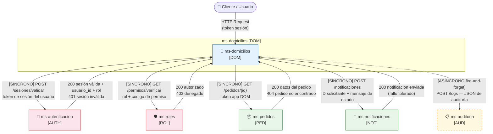
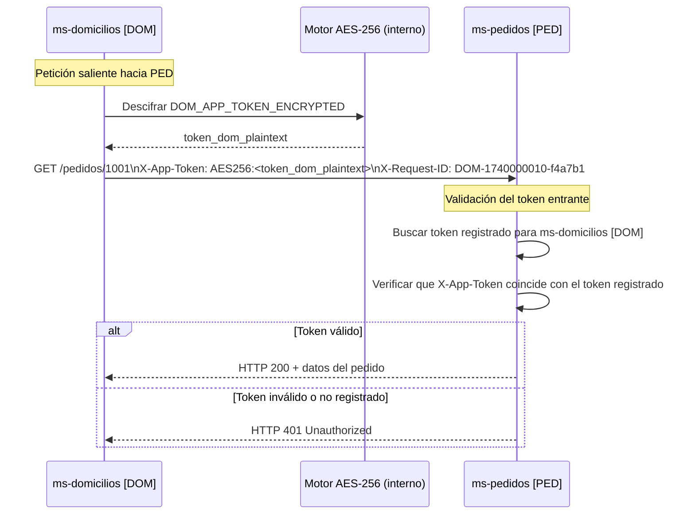
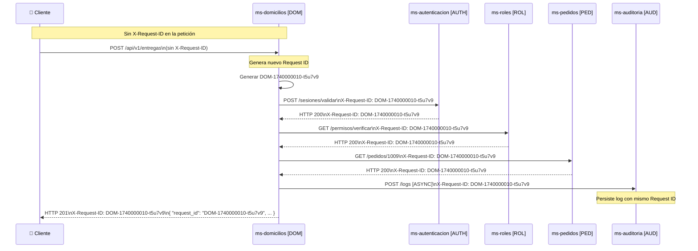
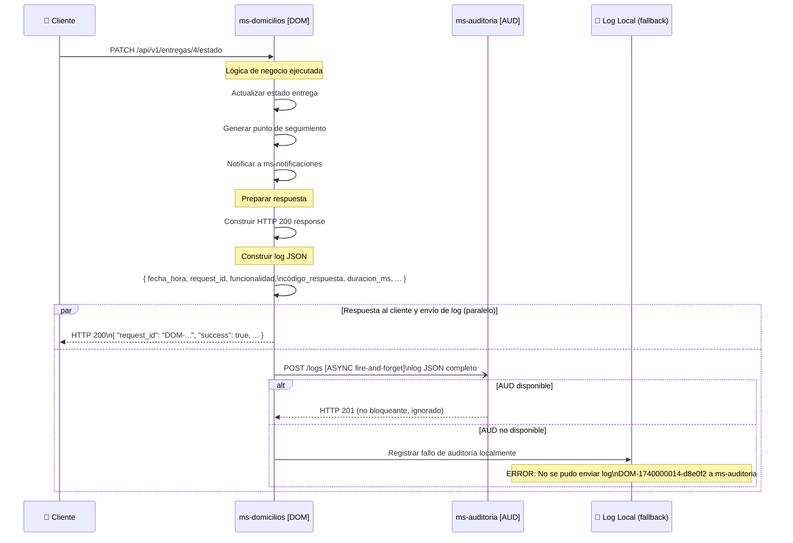
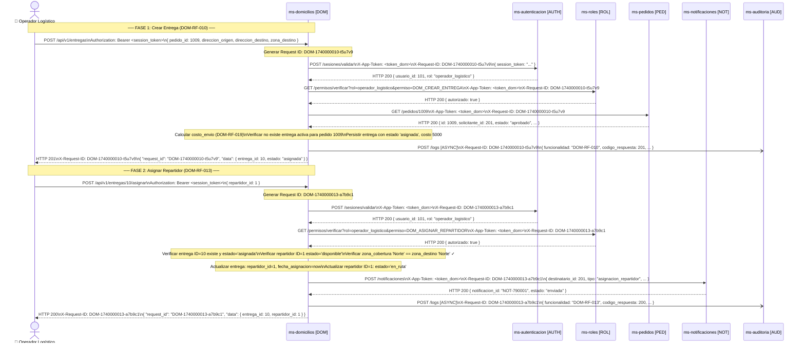
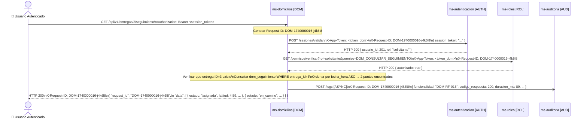
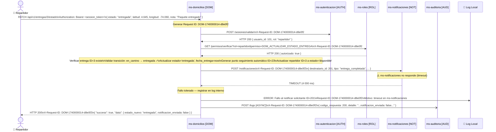
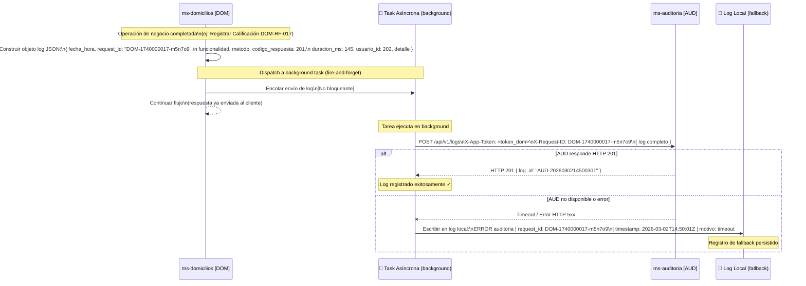

# Diseño de Integración — ms-domicilios [DOM]

| Campo | Detalle |
|---|---|
| **Microservicio** | ms-domicilios |
| **Código** | DOM |
| **Módulo** | Módulo 4 — Logística y Proveedores |
| **Tecnología** | FastAPI + Python + PostgreSQL |
| **Versión del documento** | 1.0 |
| **Fecha** | Marzo 2026 |

---

## Tabla de Contenido

1. [Información General](#1-información-general)
2. [Mapa de Integraciones](#2-mapa-de-integraciones)
3. [Contratos de Comunicación Saliente](#3-contratos-de-comunicación-saliente)
4. [Contratos de Comunicación Entrante](#4-contratos-de-comunicación-entrante)
5. [Configuración de Tokens de Aplicación](#5-configuración-de-tokens-de-aplicación)
6. [Flujo de Request ID](#6-flujo-de-request-id)
7. [Flujo de Auditoría](#7-flujo-de-auditoría)
8. [Diagramas de Secuencia](#8-diagramas-de-secuencia)

---

## 1. Información General

| Campo | Detalle |
|---|---|
| **Nombre** | ms-domicilios |
| **Código** | DOM |
| **Módulo** | Módulo 4 — Logística y Proveedores |
| **Servicios con los que se integra** | 5 (ms-autenticacion, ms-roles, ms-pedidos, ms-notificaciones, ms-auditoria) |

ms-domicilios gestiona el ciclo completo de entregas a domicilio: desde la creación de la entrega a partir de un pedido, la asignación de repartidores, el seguimiento geográfico en tiempo real, hasta la calificación final del servicio. Para operar, el servicio depende de forma obligatoria de ms-autenticacion y ms-roles (validación de sesión y permisos en cada petición) y de ms-pedidos (consulta de datos del pedido al crear una entrega). Adicionalmente, dispara notificaciones hacia ms-notificaciones en cada cambio de estado de una entrega, y envía logs de forma asíncrona a ms-auditoria tras cada operación.

---

## 2. Mapa de Integraciones



**Descripción narrativa:**

ms-domicilios se integra con **5 microservicios externos**, todos mediante comunicación REST (HTTP/JSON).

**Comunicaciones síncronas (4 servicios):**
- **ms-autenticacion [AUTH]:** Dependencia crítica. Cada petición entrante debe pasar por validación de sesión antes de ejecutar cualquier lógica de negocio. Sin este servicio, DOM rechaza todas las peticiones con HTTP 503.
- **ms-roles [ROL]:** Dependencia crítica. Tras validar la sesión, DOM verifica el permiso de la funcionalidad solicitada. Sin este servicio, DOM rechaza todas las peticiones con HTTP 503.
- **ms-pedidos [PED]:** Dependencia crítica para la creación de entregas (DOM-RF-010). DOM consulta los datos del pedido de origen antes de crear la entrega; si el servicio no responde, la creación falla con HTTP 503.
- **ms-notificaciones [NOT]:** Dependencia opcional (tolerante a fallos). DOM intenta notificar al solicitante en cada cambio de estado de entrega (DOM-RF-013, DOM-RF-014). Si el servicio no responde, DOM registra el fallo en el log y continúa respondiendo exitosamente.

**Comunicación asíncrona (1 servicio):**
- **ms-auditoria [AUD]:** Dependencia no crítica. DOM envía un log JSON tras cada operación ejecutada, de forma fire-and-forget. El fallo en el envío no interrumpe ni retrasa la respuesta al usuario.

**Consumidores entrantes:** Según el mapa de dependencias del sistema, ningún otro microservicio declara dependencia directa de ms-domicilios. Los endpoints del servicio son consumidos directamente por usuarios finales a través del cliente.

---

## 3. Contratos de Comunicación Saliente

Esta sección documenta cada llamada que ms-domicilios realiza hacia servicios externos.

---

### 3.1 ms-autenticacion [AUTH]

#### Operación: Validar Sesión Activa

| Campo | Detalle |
|---|---|
| **Servicio destino** | ms-autenticacion [AUTH] |
| **Operación** | Validar sesión activa del usuario |
| **Método HTTP** | `POST` |
| **Endpoint sugerido** | `/api/v1/sesiones/validar` |
| **Headers requeridos** | `X-App-Token: {token_dom_cifrado_aes256}` · `X-Request-ID: {DOM-timestamp-shortid}` · `Content-Type: application/json` |
| **Timeout sugerido** | 3 000 ms |
| **Requisito relacionado** | DOM-RF-001 |

**Request:**
```json
{
  "session_token": "eyJhbGciOiJIUzI1NiIsInR5cCI6IkpXVCJ9..."
}
```

**Response exitoso (HTTP 200):**
```json
{
  "request_id": "AUTH-1740000001-b2c9d4",
  "success": true,
  "data": {
    "usuario_id": 101,
    "rol": "operador_logistico",
    "nombre": "Carlos Mendoza",
    "sesion_activa": true,
    "expira_en": "2026-03-02T18:00:00Z"
  },
  "message": "Sesión válida.",
  "timestamp": "2026-03-02T14:32:01Z"
}
```

**Response de error (HTTP 401 — sesión inválida):**
```json
{
  "request_id": "AUTH-1740000001-b2c9d4",
  "success": false,
  "data": null,
  "message": "La sesión no existe o ha expirado.",
  "timestamp": "2026-03-02T14:32:01Z"
}
```

---

### 3.2 ms-roles [ROL]

#### Operación: Verificar Permiso por Funcionalidad

| Campo | Detalle |
|---|---|
| **Servicio destino** | ms-roles [ROL] |
| **Operación** | Verificar permiso de un rol para una funcionalidad |
| **Método HTTP** | `GET` |
| **Endpoint sugerido** | `/api/v1/permisos/verificar` |
| **Headers requeridos** | `X-App-Token: {token_dom_cifrado_aes256}` · `X-Request-ID: {DOM-timestamp-shortid}` |
| **Timeout sugerido** | 3 000 ms |
| **Requisito relacionado** | DOM-RF-002 |

**Request (query params):**
```
GET /api/v1/permisos/verificar?rol=operador_logistico&permiso=DOM_CREAR_ENTREGA
```

**Response exitoso (HTTP 200 — permiso autorizado):**
```json
{
  "request_id": "DOM-1740000002-c3d1e5",
  "success": true,
  "data": {
    "rol": "operador_logistico",
    "permiso": "DOM_CREAR_ENTREGA",
    "autorizado": true
  },
  "message": "El rol tiene el permiso solicitado.",
  "timestamp": "2026-03-02T14:32:02Z"
}
```

**Response de error (HTTP 403 — permiso denegado):**
```json
{
  "request_id": "DOM-1740000002-c3d1e5",
  "success": false,
  "data": {
    "rol": "solicitante",
    "permiso": "DOM_CREAR_ENTREGA",
    "autorizado": false
  },
  "message": "El rol no tiene autorización para ejecutar esta funcionalidad.",
  "timestamp": "2026-03-02T14:32:02Z"
}
```

---

### 3.3 ms-pedidos [PED]

#### Operación: Obtener Pedido por ID

| Campo | Detalle |
|---|---|
| **Servicio destino** | ms-pedidos [PED] |
| **Operación** | Obtener datos completos del pedido de origen |
| **Método HTTP** | `GET` |
| **Endpoint sugerido** | `/api/v1/pedidos/{pedido_id}` |
| **Headers requeridos** | `X-App-Token: {token_dom_cifrado_aes256}` · `X-Request-ID: {DOM-timestamp-shortid}` |
| **Timeout sugerido** | 5 000 ms |
| **Requisito relacionado** | DOM-RF-010 |

**Request:**
```
GET /api/v1/pedidos/1001
Headers:
  X-App-Token: <token_dom_aes256>
  X-Request-ID: DOM-1740000010-f4a7b1
```

**Response exitoso (HTTP 200):**
```json
{
  "request_id": "DOM-1740000010-f4a7b1",
  "success": true,
  "data": {
    "id": 1001,
    "solicitante_id": 201,
    "solicitante_nombre": "María García",
    "proveedor_id": 55,
    "estado": "aprobado",
    "items": [
      {
        "producto_id": 12,
        "descripcion": "Resma de papel A4",
        "cantidad": 5,
        "precio_unitario": 12000
      }
    ],
    "fecha_creacion": "2026-02-09T10:00:00Z"
  },
  "message": "Pedido encontrado.",
  "timestamp": "2026-03-02T14:32:10Z"
}
```

**Response de error (HTTP 404 — pedido no encontrado):**
```json
{
  "request_id": "DOM-1740000010-f4a7b1",
  "success": false,
  "data": null,
  "message": "No se encontró el pedido con ID 1001.",
  "timestamp": "2026-03-02T14:32:10Z"
}
```

---

### 3.4 ms-notificaciones [NOT]

#### Operación: Enviar Notificación de Cambio de Estado de Entrega

| Campo | Detalle |
|---|---|
| **Servicio destino** | ms-notificaciones [NOT] |
| **Operación** | Enviar notificación al solicitante sobre cambio de estado |
| **Método HTTP** | `POST` |
| **Endpoint sugerido** | `/api/v1/notificaciones` |
| **Headers requeridos** | `X-App-Token: {token_dom_cifrado_aes256}` · `X-Request-ID: {DOM-timestamp-shortid}` · `Content-Type: application/json` |
| **Timeout sugerido** | 4 000 ms |
| **Requisito relacionado** | DOM-RF-013, DOM-RF-014 |

**Request:**
```json
{
  "destinatario_id": 201,
  "tipo": "cambio_estado_entrega",
  "titulo": "Tu entrega está en camino",
  "mensaje": "El repartidor Carlos Mendoza ha recogido tu paquete (Pedido #1001) y está en camino. Puedes hacer seguimiento en la aplicación.",
  "datos_referencia": {
    "entrega_id": 3,
    "pedido_id": 1001,
    "estado_nuevo": "en_camino",
    "repartidor_nombre": "Carlos Mendoza",
    "repartidor_telefono": "3001234567"
  }
}
```

**Response exitoso (HTTP 200):**
```json
{
  "request_id": "DOM-1740000014-g5h8k2",
  "success": true,
  "data": {
    "notificacion_id": "NOT-789456",
    "estado": "enviada"
  },
  "message": "Notificación enviada exitosamente.",
  "timestamp": "2026-03-02T14:33:00Z"
}
```

**Response de error (HTTP 500 — fallo del servicio de notificaciones):**
```json
{
  "request_id": "DOM-1740000014-g5h8k2",
  "success": false,
  "data": null,
  "message": "Error interno al procesar la notificación.",
  "timestamp": "2026-03-02T14:33:00Z"
}
```

> **Nota de comportamiento:** Si ms-notificaciones no responde o retorna error, ms-domicilios **no propaga el fallo**. Registra el intento fallido en el log de auditoría y continúa con la respuesta exitosa al usuario (DOM-RF-013 E2, DOM-RF-014 E2).

---

### 3.5 ms-auditoria [AUD]

#### Operación: Registrar Log de Operación

| Campo | Detalle |
|---|---|
| **Servicio destino** | ms-auditoria [AUD] |
| **Operación** | Registrar log de auditoría de operación ejecutada |
| **Método HTTP** | `POST` |
| **Endpoint sugerido** | `/api/v1/logs` |
| **Headers requeridos** | `X-App-Token: {token_dom_cifrado_aes256}` · `X-Request-ID: {DOM-timestamp-shortid}` · `Content-Type: application/json` |
| **Timeout sugerido** | 2 000 ms (no bloqueante — fire-and-forget) |
| **Requisito relacionado** | DOM-RF-004 |

**Request:**
```json
{
  "fecha_hora": "2026-03-02T14:33:05.123Z",
  "request_id": "DOM-1740000014-g5h8k2",
  "microservicio": "ms-domicilios",
  "funcionalidad": "DOM-RF-014 — Actualizar Estado de Entrega",
  "metodo_http": "PATCH",
  "endpoint": "/api/v1/entregas/3/estado",
  "codigo_respuesta": 200,
  "duracion_ms": 287,
  "usuario_id": 101,
  "detalle": "Estado de entrega ID=3 actualizado de 'asignada' a 'en_camino'. Punto de seguimiento generado automáticamente. Notificación enviada al solicitante ID=201."
}
```

**Response exitoso (HTTP 201):**
```json
{
  "request_id": "AUD-1740000014-z9x1w3",
  "success": true,
  "data": {
    "log_id": "AUD-2026030214330501"
  },
  "message": "Log registrado.",
  "timestamp": "2026-03-02T14:33:05Z"
}
```

**Response de error (HTTP 500):**
```json
{
  "request_id": "AUD-1740000014-z9x1w3",
  "success": false,
  "data": null,
  "message": "Error al persistir el log.",
  "timestamp": "2026-03-02T14:33:05Z"
}
```

> **Nota de comportamiento:** Este envío es siempre asíncrono (fire-and-forget). Si falla, ms-domicilios registra el error en su log interno local y continúa operando normalmente (DOM-RF-004 E1).

---

## 4. Contratos de Comunicación Entrante

Según el mapa de dependencias del sistema, **ningún otro microservicio declara dependencia directa hacia ms-domicilios**. Los endpoints expuestos son consumidos por clientes de usuario final (frontend, aplicación móvil o API Gateway), no por otros microservicios del sistema.

A continuación se documentan los endpoints expuestos agrupados por entidad, con la estructura de contrato correspondiente.

---

### 4.1 Entidad: Repartidores

#### Operación: Crear Repartidor

| Campo | Detalle |
|---|---|
| **Servicio origen** | Cliente / Usuario autenticado (Administrador logístico) |
| **Operación** | Registrar un nuevo repartidor en el sistema |
| **Método HTTP** | `POST` |
| **Endpoint expuesto** | `/api/v1/repartidores` |
| **Headers requeridos** | `Authorization: Bearer {session_token}` · `Content-Type: application/json` |
| **Requisito relacionado** | DOM-RF-006 |

**Request:**
```json
{
  "usuario_id": 109,
  "nombre": "Pedro Salazar Torres",
  "telefono": "3178885566",
  "tipo_vehiculo": "moto",
  "placa_vehiculo": "MOT-555",
  "zona_cobertura": "Norte"
}
```

**Response exitoso (HTTP 201):**
```json
{
  "request_id": "DOM-1740000006-h1i3j5",
  "success": true,
  "data": {
    "id": 9,
    "usuario_id": 109,
    "nombre": "Pedro Salazar Torres",
    "telefono": "3178885566",
    "tipo_vehiculo": "moto",
    "placa_vehiculo": "MOT-555",
    "estado": "disponible",
    "zona_cobertura": "Norte",
    "calificacion_promedio": 0.00,
    "created_at": "2026-03-02T14:40:00Z",
    "updated_at": "2026-03-02T14:40:00Z"
  },
  "message": "Repartidor creado exitosamente.",
  "timestamp": "2026-03-02T14:40:00Z"
}
```

**Response de error (HTTP 409 — placa duplicada):**
```json
{
  "request_id": "DOM-1740000006-h1i3j5",
  "success": false,
  "data": null,
  "message": "Ya existe un repartidor registrado con la placa 'MOT-555'.",
  "timestamp": "2026-03-02T14:40:00Z"
}
```

---

#### Operación: Consultar Repartidor por ID

| Campo | Detalle |
|---|---|
| **Servicio origen** | Cliente / Usuario autenticado |
| **Operación** | Obtener información de un repartidor específico |
| **Método HTTP** | `GET` |
| **Endpoint expuesto** | `/api/v1/repartidores/{repartidor_id}` |
| **Headers requeridos** | `Authorization: Bearer {session_token}` |
| **Requisito relacionado** | DOM-RF-007 |

**Request:**
```
GET /api/v1/repartidores/1
```

**Response exitoso (HTTP 200):**
```json
{
  "request_id": "DOM-1740000007-k2l4m6",
  "success": true,
  "data": {
    "id": 1,
    "usuario_id": 101,
    "nombre": "Carlos Mendoza Ríos",
    "telefono": "3001234567",
    "tipo_vehiculo": "moto",
    "placa_vehiculo": "ABC-123",
    "estado": "disponible",
    "zona_cobertura": "Norte",
    "calificacion_promedio": 4.80,
    "created_at": "2026-01-15T08:00:00Z",
    "updated_at": "2026-03-02T10:00:00Z"
  },
  "message": "Repartidor encontrado.",
  "timestamp": "2026-03-02T14:41:00Z"
}
```

**Response de error (HTTP 404):**
```json
{
  "request_id": "DOM-1740000007-k2l4m6",
  "success": false,
  "data": null,
  "message": "No se encontró el repartidor con ID 99.",
  "timestamp": "2026-03-02T14:41:00Z"
}
```

---

#### Operación: Actualizar Repartidor

| Campo | Detalle |
|---|---|
| **Servicio origen** | Cliente / Usuario autenticado (Administrador logístico) |
| **Operación** | Modificar datos editables de un repartidor |
| **Método HTTP** | `PUT` |
| **Endpoint expuesto** | `/api/v1/repartidores/{repartidor_id}` |
| **Headers requeridos** | `Authorization: Bearer {session_token}` · `Content-Type: application/json` |
| **Requisito relacionado** | DOM-RF-008 |

**Request:**
```json
{
  "telefono": "3001119988",
  "tipo_vehiculo": "carro",
  "placa_vehiculo": "CAR-001",
  "zona_cobertura": "Centro"
}
```

**Response exitoso (HTTP 200):**
```json
{
  "request_id": "DOM-1740000008-n3o5p7",
  "success": true,
  "data": {
    "id": 1,
    "nombre": "Carlos Mendoza Ríos",
    "telefono": "3001119988",
    "tipo_vehiculo": "carro",
    "placa_vehiculo": "CAR-001",
    "zona_cobertura": "Centro",
    "updated_at": "2026-03-02T14:42:00Z"
  },
  "message": "Repartidor actualizado exitosamente.",
  "timestamp": "2026-03-02T14:42:00Z"
}
```

**Response de error (HTTP 404):**
```json
{
  "request_id": "DOM-1740000008-n3o5p7",
  "success": false,
  "data": null,
  "message": "No se encontró el repartidor con ID 99.",
  "timestamp": "2026-03-02T14:42:00Z"
}
```

---

#### Operación: Listar Repartidores Disponibles por Zona

| Campo | Detalle |
|---|---|
| **Servicio origen** | Cliente / Usuario autenticado |
| **Operación** | Listar repartidores disponibles filtrados por zona de cobertura |
| **Método HTTP** | `GET` |
| **Endpoint expuesto** | `/api/v1/repartidores?zona_cobertura={zona}&estado=disponible` |
| **Headers requeridos** | `Authorization: Bearer {session_token}` |
| **Requisito relacionado** | DOM-RF-009 |

**Request:**
```
GET /api/v1/repartidores?zona_cobertura=Norte&estado=disponible
```

**Response exitoso (HTTP 200):**
```json
{
  "request_id": "DOM-1740000009-q4r6s8",
  "success": true,
  "data": [
    {
      "id": 1,
      "nombre": "Carlos Mendoza Ríos",
      "telefono": "3001234567",
      "tipo_vehiculo": "moto",
      "placa_vehiculo": "ABC-123",
      "zona_cobertura": "Norte",
      "calificacion_promedio": 4.80
    },
    {
      "id": 6,
      "nombre": "Sara Jiménez Vargas",
      "telefono": "3112223344",
      "tipo_vehiculo": "bicicleta",
      "placa_vehiculo": "BIC-002",
      "zona_cobertura": "Norte",
      "calificacion_promedio": 0.00
    }
  ],
  "message": "Se encontraron 2 repartidores disponibles en la zona 'Norte'.",
  "timestamp": "2026-03-02T14:43:00Z"
}
```

**Response (HTTP 200 — lista vacía):**
```json
{
  "request_id": "DOM-1740000009-q4r6s8",
  "success": true,
  "data": [],
  "message": "No hay repartidores disponibles en la zona 'Occidente'.",
  "timestamp": "2026-03-02T14:43:00Z"
}
```

---

### 4.2 Entidad: Entregas

#### Operación: Crear Entrega

| Campo | Detalle |
|---|---|
| **Servicio origen** | Cliente / Usuario autenticado (Operador logístico) |
| **Operación** | Crear una nueva entrega a partir de un pedido existente |
| **Método HTTP** | `POST` |
| **Endpoint expuesto** | `/api/v1/entregas` |
| **Headers requeridos** | `Authorization: Bearer {session_token}` · `Content-Type: application/json` |
| **Requisito relacionado** | DOM-RF-010 |

**Request:**
```json
{
  "pedido_id": 1009,
  "direccion_origen": "Cra 10 #20-30, Bodega Central",
  "direccion_destino": "Cll 45 #12-15, Edificio B Apto 302",
  "zona_destino": "Norte",
  "observaciones": "Entregar en portería, preguntar por María García"
}
```

**Response exitoso (HTTP 201):**
```json
{
  "request_id": "DOM-1740000010-t5u7v9",
  "success": true,
  "data": {
    "id": 10,
    "pedido_id": 1009,
    "repartidor_id": null,
    "direccion_origen": "Cra 10 #20-30, Bodega Central",
    "direccion_destino": "Cll 45 #12-15, Edificio B Apto 302",
    "zona_destino": "Norte",
    "estado": "asignada",
    "fecha_asignacion": null,
    "fecha_recogida": null,
    "fecha_entrega": null,
    "costo_envio": 5000.00,
    "observaciones": "Entregar en portería, preguntar por María García",
    "created_at": "2026-03-02T14:44:00Z",
    "updated_at": "2026-03-02T14:44:00Z"
  },
  "message": "Entrega creada exitosamente.",
  "timestamp": "2026-03-02T14:44:00Z"
}
```

**Response de error (HTTP 404 — pedido no encontrado):**
```json
{
  "request_id": "DOM-1740000010-t5u7v9",
  "success": false,
  "data": null,
  "message": "No se encontró el pedido con ID 1009 en ms-pedidos.",
  "timestamp": "2026-03-02T14:44:00Z"
}
```

---

#### Operación: Consultar Entrega por ID

| Campo | Detalle |
|---|---|
| **Servicio origen** | Cliente / Usuario autenticado |
| **Operación** | Obtener información completa de una entrega |
| **Método HTTP** | `GET` |
| **Endpoint expuesto** | `/api/v1/entregas/{entrega_id}` |
| **Headers requeridos** | `Authorization: Bearer {session_token}` |
| **Requisito relacionado** | DOM-RF-011 |

**Request:**
```
GET /api/v1/entregas/3
```

**Response exitoso (HTTP 200):**
```json
{
  "request_id": "DOM-1740000011-w6x8y0",
  "success": true,
  "data": {
    "id": 3,
    "pedido_id": 1003,
    "repartidor_id": 3,
    "repartidor_nombre": "Andrés Torres Salcedo",
    "direccion_origen": "Cra 22 #30-45, Depósito Sur",
    "direccion_destino": "Cll 72 #3-18, Casa 2",
    "zona_destino": "Sur",
    "estado": "en_camino",
    "fecha_asignacion": "2026-02-14T10:00:00Z",
    "fecha_recogida": "2026-02-14T10:30:00Z",
    "fecha_entrega": null,
    "costo_envio": 6000.00,
    "observaciones": "Cliente no estará hasta las 2pm",
    "created_at": "2026-02-14T09:50:00Z",
    "updated_at": "2026-02-14T10:30:00Z"
  },
  "message": "Entrega encontrada.",
  "timestamp": "2026-03-02T14:45:00Z"
}
```

**Response de error (HTTP 404):**
```json
{
  "request_id": "DOM-1740000011-w6x8y0",
  "success": false,
  "data": null,
  "message": "No se encontró la entrega con ID 99.",
  "timestamp": "2026-03-02T14:45:00Z"
}
```

---

#### Operación: Asignar Repartidor a Entrega

| Campo | Detalle |
|---|---|
| **Servicio origen** | Cliente / Usuario autenticado (Operador logístico) |
| **Operación** | Asignar un repartidor disponible a una entrega |
| **Método HTTP** | `POST` |
| **Endpoint expuesto** | `/api/v1/entregas/{entrega_id}/asignar` |
| **Headers requeridos** | `Authorization: Bearer {session_token}` · `Content-Type: application/json` |
| **Requisito relacionado** | DOM-RF-013 |

**Request:**
```json
{
  "repartidor_id": 1
}
```

**Response exitoso (HTTP 200):**
```json
{
  "request_id": "DOM-1740000013-a7b9c1",
  "success": true,
  "data": {
    "entrega_id": 7,
    "repartidor_id": 1,
    "repartidor_nombre": "Carlos Mendoza Ríos",
    "estado": "asignada",
    "fecha_asignacion": "2026-03-02T14:46:00Z"
  },
  "message": "Repartidor asignado exitosamente.",
  "timestamp": "2026-03-02T14:46:00Z"
}
```

**Response de error (HTTP 409 — repartidor no disponible):**
```json
{
  "request_id": "DOM-1740000013-a7b9c1",
  "success": false,
  "data": null,
  "message": "El repartidor con ID 3 no está disponible (estado actual: en_ruta).",
  "timestamp": "2026-03-02T14:46:00Z"
}
```

---

#### Operación: Actualizar Estado de Entrega

| Campo | Detalle |
|---|---|
| **Servicio origen** | Cliente / Usuario autenticado (Operador / Repartidor) |
| **Operación** | Cambiar el estado de una entrega según las transiciones permitidas |
| **Método HTTP** | `PATCH` |
| **Endpoint expuesto** | `/api/v1/entregas/{entrega_id}/estado` |
| **Headers requeridos** | `Authorization: Bearer {session_token}` · `Content-Type: application/json` |
| **Requisito relacionado** | DOM-RF-014 |

**Request:**
```json
{
  "estado": "en_camino",
  "latitud": 4.6120000,
  "longitud": -74.0800000,
  "nota": "Paquete recogido, iniciando trayecto"
}
```

**Response exitoso (HTTP 200):**
```json
{
  "request_id": "DOM-1740000014-d8e0f2",
  "success": true,
  "data": {
    "entrega_id": 4,
    "estado_anterior": "asignada",
    "estado_nuevo": "en_camino",
    "fecha_recogida": "2026-03-02T14:47:00Z",
    "punto_seguimiento_id": 21,
    "notificacion_enviada": true
  },
  "message": "Estado de entrega actualizado a 'en_camino'. Punto de seguimiento generado.",
  "timestamp": "2026-03-02T14:47:00Z"
}
```

**Response de error (HTTP 422 — transición inválida):**
```json
{
  "request_id": "DOM-1740000014-d8e0f2",
  "success": false,
  "data": null,
  "message": "Transición de estado inválida: no se puede pasar de 'entregada' a 'en_camino'.",
  "timestamp": "2026-03-02T14:47:00Z"
}
```

---

### 4.3 Entidad: Seguimiento

#### Operación: Registrar Punto de Seguimiento Manual

| Campo | Detalle |
|---|---|
| **Servicio origen** | Cliente / Usuario autenticado (Repartidor / Operador) |
| **Operación** | Registrar manualmente un punto de rastreo geográfico |
| **Método HTTP** | `POST` |
| **Endpoint expuesto** | `/api/v1/entregas/{entrega_id}/seguimiento` |
| **Headers requeridos** | `Authorization: Bearer {session_token}` · `Content-Type: application/json` |
| **Requisito relacionado** | DOM-RF-015 |

**Request:**
```json
{
  "latitud": 4.6300000,
  "longitud": -74.0700000,
  "nota": "En tránsito por Calle 72, sin novedades"
}
```

**Response exitoso (HTTP 201):**
```json
{
  "request_id": "DOM-1740000015-g1h3i5",
  "success": true,
  "data": {
    "id": 22,
    "entrega_id": 3,
    "estado": "en_camino",
    "latitud": 4.6300000,
    "longitud": -74.0700000,
    "fecha_hora": "2026-03-02T14:48:00Z",
    "nota": "En tránsito por Calle 72, sin novedades"
  },
  "message": "Punto de seguimiento registrado exitosamente.",
  "timestamp": "2026-03-02T14:48:00Z"
}
```

**Response de error (HTTP 422 — entrega no en curso):**
```json
{
  "request_id": "DOM-1740000015-g1h3i5",
  "success": false,
  "data": null,
  "message": "Solo se pueden registrar puntos de seguimiento para entregas en estado 'en_camino'.",
  "timestamp": "2026-03-02T14:48:00Z"
}
```

---

#### Operación: Consultar Historial de Seguimiento

| Campo | Detalle |
|---|---|
| **Servicio origen** | Cliente / Usuario autenticado |
| **Operación** | Obtener el historial completo de puntos de seguimiento de una entrega |
| **Método HTTP** | `GET` |
| **Endpoint expuesto** | `/api/v1/entregas/{entrega_id}/seguimiento` |
| **Headers requeridos** | `Authorization: Bearer {session_token}` |
| **Requisito relacionado** | DOM-RF-016 |

**Request:**
```
GET /api/v1/entregas/3/seguimiento
```

**Response exitoso (HTTP 200):**
```json
{
  "request_id": "DOM-1740000016-j4k6l8",
  "success": true,
  "data": [
    {
      "id": 8,
      "estado": "asignada",
      "latitud": 4.5900000,
      "longitud": -74.0900000,
      "fecha_hora": "2026-02-14T10:00:00Z",
      "nota": "Entrega asignada"
    },
    {
      "id": 9,
      "estado": "en_camino",
      "latitud": 4.5870000,
      "longitud": -74.0850000,
      "fecha_hora": "2026-02-14T10:30:00Z",
      "nota": "Repartidor en camino"
    }
  ],
  "message": "Historial de seguimiento recuperado. 2 puntos encontrados.",
  "timestamp": "2026-03-02T14:49:00Z"
}
```

**Response de error (HTTP 404):**
```json
{
  "request_id": "DOM-1740000016-j4k6l8",
  "success": false,
  "data": null,
  "message": "No se encontró la entrega con ID 99.",
  "timestamp": "2026-03-02T14:49:00Z"
}
```

---

### 4.4 Entidad: Calificaciones

#### Operación: Registrar Calificación de Entrega

| Campo | Detalle |
|---|---|
| **Servicio origen** | Cliente / Usuario autenticado (Solicitante del pedido) |
| **Operación** | Registrar la calificación del servicio de una entrega completada |
| **Método HTTP** | `POST` |
| **Endpoint expuesto** | `/api/v1/entregas/{entrega_id}/calificaciones` |
| **Headers requeridos** | `Authorization: Bearer {session_token}` · `Content-Type: application/json` |
| **Requisito relacionado** | DOM-RF-017 |

**Request:**
```json
{
  "puntuacion": 5,
  "comentario": "Excelente servicio, muy puntual y el repartidor fue muy amable"
}
```

**Response exitoso (HTTP 201):**
```json
{
  "request_id": "DOM-1740000017-m5n7o9",
  "success": true,
  "data": {
    "id": 3,
    "entrega_id": 1,
    "calificador_id": 202,
    "puntuacion": 5,
    "comentario": "Excelente servicio, muy puntual y el repartidor fue muy amable",
    "fecha": "2026-03-02T14:50:00Z",
    "repartidor_calificacion_promedio_actualizada": 4.85
  },
  "message": "Calificación registrada exitosamente. Promedio del repartidor actualizado.",
  "timestamp": "2026-03-02T14:50:00Z"
}
```

**Response de error (HTTP 422 — entrega no entregada):**
```json
{
  "request_id": "DOM-1740000017-m5n7o9",
  "success": false,
  "data": null,
  "message": "Solo se pueden calificar entregas en estado 'entregada'. Estado actual: 'en_camino'.",
  "timestamp": "2026-03-02T14:50:00Z"
}
```

---

## 5. Configuración de Tokens de Aplicación

### 5.1 Token propio de ms-domicilios

| Campo | Detalle |
|---|---|
| **Nombre** | `DOM_APP_TOKEN` |
| **Descripción** | Token de aplicación único que identifica a ms-domicilios ante todos los demás microservicios del sistema. Se incluye cifrado en cada petición saliente. |
| **Formato de almacenamiento** | Cadena cifrada con AES-256 almacenada en variable de entorno `DOM_APP_TOKEN_ENCRYPTED` o en el vault de secretos del sistema. El token en texto plano **nunca** se persiste en texto claro en disco ni en código fuente. |
| **Gestión** | Token fijo. Solo puede actualizarse manualmente por un administrador del sistema. No expira automáticamente. |

### 5.2 Tokens de otros servicios que ms-domicilios necesita conocer

| Servicio | Variable de entorno | Propósito | Uso en Header |
|---|---|---|---|
| ms-autenticacion [AUTH] | `AUTH_APP_TOKEN_ENCRYPTED` | Validar que las peticiones hacia AUTH provienen de DOM | `X-App-Token: <token_auth_descifrado>` |
| ms-roles [ROL] | `ROL_APP_TOKEN_ENCRYPTED` | Validar que las peticiones hacia ROL provienen de DOM | `X-App-Token: <token_rol_descifrado>` |
| ms-pedidos [PED] | `PED_APP_TOKEN_ENCRYPTED` | Validar que las peticiones hacia PED provienen de DOM | `X-App-Token: <token_ped_descifrado>` |
| ms-notificaciones [NOT] | `NOT_APP_TOKEN_ENCRYPTED` | Validar que las peticiones hacia NOT provienen de DOM | `X-App-Token: <token_not_descifrado>` |
| ms-auditoria [AUD] | `AUD_APP_TOKEN_ENCRYPTED` | Validar que los logs enviados a AUD provienen de DOM | `X-App-Token: <token_aud_descifrado>` |

> **Nota:** Los tokens almacenados por ms-domicilios son los tokens **de los servicios destino**, no el token propio. Esto permite a los servicios destino verificar quién les está llamando. Cada servicio destino valida que el `X-App-Token` recibido corresponde al token registrado para ms-domicilios.

### 5.3 Formato de transmisión del token

El token se transmite en la cabecera `X-App-Token` de cada petición saliente entre servicios:

```
X-App-Token: AES256:U2FsdGVkX19A7fK...3mNpQrStUvWxYz==
```

El prefijo `AES256:` indica el algoritmo de cifrado. El valor posterior es el token cifrado en Base64.

### 5.4 Flujo de validación de token



**Descripción narrativa:**

Cuando ms-domicilios prepara una petición saliente, su motor AES-256 descifra el token del servicio destino almacenado en variable de entorno. El token descifrado se incluye en la cabecera `X-App-Token` de la petición HTTP. Al recibirla, el servicio destino (por ejemplo, ms-pedidos) busca en su configuración el token registrado para ms-domicilios y lo compara con el valor recibido. Si coinciden, el servicio procesa la petición; si no, la rechaza con HTTP 401.

En sentido inverso, cuando otro servicio llama a ms-domicilios (actualmente solo usuarios finales en este sistema), DOM no aplica validación de token de aplicación sobre la petición entrante de usuarios —solo valida el `session_token` del usuario mediante AUTH. Si en el futuro un microservicio consumiese a DOM, DOM debería verificar el `X-App-Token` recibido contra su lista de tokens de servicios conocidos.

---

## 6. Flujo de Request ID

### 6.1 Formato del Request ID

```
DOM-{timestamp_unix}-{id_corto_aleatorio}
```

| Componente | Descripción | Ejemplo |
|---|---|---|
| Prefijo | Código del microservicio que genera el ID | `DOM` |
| Timestamp Unix | Segundos desde epoch UTC al momento de recepción de la petición | `1740000000` |
| ID corto aleatorio | 6 caracteres alfanuméricos en minúsculas | `a3f8b2` |

**Ejemplo completo:** `DOM-1740000000-a3f8b2`

### 6.2 Reglas de generación y reutilización

| Regla | Descripción |
|---|---|
| **Generación** | Si la petición entrante NO incluye la cabecera `X-Request-ID`, ms-domicilios genera un nuevo Request ID con el formato indicado. |
| **Reutilización** | Si la petición entrante YA incluye `X-Request-ID` (porque proviene de otro servicio en una cadena de llamadas), ms-domicilios **reutiliza** ese identificador sin modificarlo. |
| **Propagación** | El Request ID se propaga en todas las llamadas salientes hacia AUTH, ROL, PED, NOT y AUD mediante la cabecera `X-Request-ID`. |
| **Inclusión en respuesta** | El Request ID se incluye **siempre** tanto en la cabecera `X-Request-ID` de la respuesta HTTP como en el campo `request_id` del body JSON (DOM-RF-005). |
| **Contexto de petición** | El Request ID se almacena en el contexto de la petición (middleware o variable de contexto de FastAPI) para que esté disponible en todos los puntos del flujo, incluyendo la construcción del log de auditoría. |

### 6.3 Diagrama de propagación del Request ID



**Descripción narrativa:**

El Request ID se genera en el primer microservicio que recibe la petición del usuario. En este ejemplo, el cliente envía la petición a DOM sin cabecera `X-Request-ID`, por lo que DOM genera `DOM-1740000010-t5u7v9`. Este identificador se almacena en el contexto de la petición y se propaga **sin modificación** en todas las llamadas salientes hacia AUTH, ROL y PED mediante la cabecera `X-Request-ID`. Cada servicio que lo recibe lo incluye a su vez en su propia respuesta, permitiendo rastrear toda la cadena de llamadas en los sistemas de monitoreo y logs. Al finalizar el procesamiento, DOM incluye el Request ID tanto en la cabecera de respuesta HTTP como en el campo `request_id` del body JSON. El mismo ID queda registrado en el log de auditoría enviado a AUD de forma asíncrona, cerrando el ciclo de trazabilidad completa.

---

## 7. Flujo de Auditoría

### 7.1 Estructura del log JSON

```json
{
  "fecha_hora": "2026-03-02T14:47:05.342Z",
  "request_id": "DOM-1740000014-d8e0f2",
  "microservicio": "ms-domicilios",
  "codigo_microservicio": "DOM",
  "funcionalidad": "DOM-RF-014 — Actualizar Estado de Entrega",
  "metodo_http": "PATCH",
  "endpoint": "/api/v1/entregas/4/estado",
  "codigo_respuesta": 200,
  "duracion_ms": 312,
  "usuario_id": 101,
  "usuario_rol": "operador_logistico",
  "detalle": "Estado de entrega ID=4 cambiado de 'asignada' a 'en_camino'. Punto de seguimiento ID=21 generado automáticamente. Notificación enviada al solicitante ID=201 vía ms-notificaciones. Repartidor ID=1 actualizado a estado 'en_ruta'."
}
```

### 7.2 Momento de generación del log

El log se construye **después** de que la operación principal ha concluido (exitosa o con error de negocio) y **antes** de enviar la respuesta al usuario. La secuencia es:

1. Ejecutar la lógica de negocio completa.
2. Preparar la respuesta HTTP para el cliente.
3. Construir el objeto de log JSON.
4. **Disparar el envío asíncrono** del log hacia ms-auditoria (sin esperar respuesta).
5. Retornar la respuesta al cliente.

El envío asíncrono del paso 4 ocurre de forma no bloqueante —la respuesta al usuario (paso 5) no espera a que el log sea confirmado por ms-auditoria.

### 7.3 Comportamiento ante fallos del servicio de auditoría

| Escenario | Comportamiento de ms-domicilios |
|---|---|
| ms-auditoria no responde (timeout) | Continúa operando normalmente. Registra el fallo del envío en el log interno local del servicio. |
| ms-auditoria devuelve error HTTP | Continúa operando normalmente. Registra el error recibido en el log interno local. |
| Error al construir el objeto JSON de log | Registra el error internamente. No afecta la operación ni la respuesta al usuario. |

> El log interno local es el mecanismo de fallback: es el sistema de logging nativo de la aplicación FastAPI (archivo de log o stdout/stderr), independiente de ms-auditoria.

### 7.4 Diagrama del flujo asíncrono de auditoría



**Descripción narrativa:**

Una vez que ms-domicilios ha completado la lógica de negocio y preparado la respuesta HTTP, construye el objeto de log JSON en memoria con todos los campos requeridos. En ese momento, dispara simultáneamente dos acciones paralelas: retorna la respuesta al cliente y envía el log a ms-auditoria de forma asíncrona. La respuesta al cliente **no espera** la confirmación de ms-auditoria. Si ms-auditoria está disponible, recibe el log y lo persiste; su respuesta es ignorada por DOM. Si ms-auditoria no está disponible (timeout o error), DOM captura la excepción de forma silenciosa, registra el incidente en su log local interno (stdout/archivo de log de FastAPI) con el Request ID del log fallido, y el servicio continúa operando con absoluta normalidad.

---

## 8. Diagramas de Secuencia

---

### 8.1 Flujo más complejo: Crear Entrega y Asignar Repartidor (DOM-RF-010 + DOM-RF-013)

Este flujo representa el caso de mayor complejidad porque involucra la mayor cantidad de servicios externos: AUTH, ROL, PED y NOT, además del envío asíncrono a AUD.



**Descripción narrativa:**

Este flujo tiene dos fases. En la **Fase 1** (Crear Entrega), el operador logístico envía una petición POST con el ID del pedido y las direcciones. DOM genera el Request ID `DOM-1740000010-t5u7v9`, valida la sesión en AUTH, verifica el permiso `DOM_CREAR_ENTREGA` en ROL, y consulta los datos del pedido a PED. Con la respuesta de PED, calcula el costo de envío, verifica que no exista una entrega activa para ese pedido, y persiste la nueva entrega en estado `asignada`. Envía el log a AUD de forma asíncrona y retorna HTTP 201 al operador.

En la **Fase 2** (Asignar Repartidor), el operador envía una segunda petición indicando el repartidor deseado. DOM genera un nuevo Request ID, repite las validaciones de sesión y permisos, y luego verifica que la entrega esté en estado `asignada`, que el repartidor esté disponible y que su zona de cobertura coincida con la zona de destino. Al cumplirse todas las validaciones, actualiza la entrega y el estado del repartidor, notifica al solicitante a través de NOT, envía el log a AUD y retorna HTTP 200.

---

### 8.2 Flujo de consulta típico: Consultar Historial de Seguimiento (DOM-RF-016)



**Descripción narrativa:**

El usuario solicita el historial de seguimiento de la entrega ID=3. DOM genera el Request ID `DOM-1740000016-j4k6l8`, valida la sesión en AUTH y verifica el permiso `DOM_CONSULTAR_SEGUIMIENTO` en ROL. Ambas validaciones son exitosas. DOM consulta su base de datos local en la tabla `dom_seguimiento` filtrando por `entrega_id=3`, ordena los resultados cronológicamente y encuentra 2 puntos de rastreo. Envía el log de forma asíncrona a AUD y retorna HTTP 200 con la lista de puntos al usuario. En este flujo no se realizan llamadas a ms-pedidos ni ms-notificaciones porque es una consulta de datos propios del dominio.

---

### 8.3 Flujo de actualización de estado con notificación fallida (DOM-RF-014 — Manejo de error tolerante)



**Descripción narrativa:**

El repartidor reporta la entrega como completada. Tras las validaciones de sesión (AUTH) y permisos (ROL), DOM verifica que la transición `en_camino → entregada` es válida, actualiza el estado, registra la `fecha_entrega`, genera automáticamente un punto de seguimiento y libera al repartidor (estado `disponible`). Al intentar notificar al solicitante vía ms-notificaciones, el servicio no responde dentro del timeout configurado (4 000 ms). DOM trata este fallo como no crítico: registra el error en su log local indicando el Request ID y el motivo, e incluye el campo `notificacion_enviada: false` en el log de auditoría. Finalmente retorna HTTP 200 al repartidor con la información de la entrega actualizada, indicando que la notificación no pudo enviarse. El servicio sigue operando con normalidad.

---

### 8.4 Flujo de auditoría asíncrona independiente



**Descripción narrativa:**

Una vez que ms-domicilios ha completado la operación y preparado la respuesta para el cliente, construye el objeto de log JSON en memoria y lo encola en una tarea de background asíncrona (en FastAPI esto se implementa típicamente con `BackgroundTasks` o con Celery, según lo que defina el equipo —ver DOM-RF-004 comentario). Esta tarea se ejecuta de forma independiente al ciclo de vida de la petición HTTP, de modo que la respuesta al cliente ya ha sido enviada cuando la tarea comienza a ejecutarse. La tarea envía el log a ms-auditoria mediante POST a `/api/v1/logs`. Si AUD responde exitosamente, el flujo termina. Si AUD no está disponible o devuelve error, la tarea captura la excepción y escribe una línea de error en el log local de la aplicación (stdout de FastAPI o archivo de log configurado), incluyendo el `request_id` del log fallido para permitir reintento o auditoría manual posterior.

---

*Documento generado por análisis del Documento de Requisitos Funcionales y del Modelo de Datos de ms-domicilios [DOM] — ERP Universitario v1.0, Febrero 2026.*
