# Especificación de API REST — ms-domicilios [DOM]

| Campo | Detalle |
|---|---|
| **Microservicio** | ms-domicilios |
| **Código** | DOM |
| **Módulo** | Módulo 4 — Logística y Proveedores |
| **Versión del documento** | 1.0 |
| **Fecha** | Marzo 2026 |
| **Tecnología** | FastAPI + Python + PostgreSQL |

---

## Tabla de Contenido

1. [Información General](#1-información-general)
2. [Diagrama de Casos de Uso](#2-diagrama-de-casos-de-uso)
3. [Catálogo de Endpoints](#3-catálogo-de-endpoints)
4. [Especificación de Endpoints](#4-especificación-de-endpoints)
   - [4.1 Repartidores](#41-repartidores)
   - [4.2 Entregas](#42-entregas)
   - [4.3 Seguimiento](#43-seguimiento)
   - [4.4 Calificaciones](#44-calificaciones)
5. [Diagramas de Secuencia Internos](#5-diagramas-de-secuencia-internos)

---

## 1. Información General

| Campo | Detalle |
|---|---|
| **Nombre** | ms-domicilios |
| **Código** | DOM |
| **Módulo** | Módulo 4 — Logística y Proveedores |
| **Base URL sugerida** | `https://api.erp-universitario.co/api/v1` |
| **Total de endpoints** | 13 |

ms-domicilios es el microservicio responsable de gestionar el ciclo completo de entregas a domicilio en el ERP universitario, desde el registro de repartidores y la creación de entregas a partir de pedidos, hasta el seguimiento geográfico en tiempo real y la calificación final del servicio. Expone una API REST versionada bajo `/api/v1/` que garantiza trazabilidad total mediante Request IDs únicos, estructura de respuesta uniforme y auditoría asíncrona de cada operación. Todos los endpoints requieren autenticación con token de sesión y validación de permisos por rol, delegadas a ms-autenticacion [AUTH] y ms-roles [ROL] respectivamente.

---

## 2. Diagrama de Casos de Uso

```mermaid
graph TD
    %% ── Actores ──
    ADMIN(["👤 Administrador\nLogístico"])
    OPERADOR(["👤 Operador\nLogístico"])
    REPARTIDOR(["👤 Repartidor"])
    SOLICITANTE(["👤 Solicitante\n(Usuario)"])
    MS_PED(["⚙️ ms-pedidos\n[PED]"])

    %% ── Entidad: Repartidores ──
    subgraph REP ["📦 Repartidores"]
        UC01["Crear Repartidor\n(DOM-RF-006)"]
        UC02["Consultar Repartidor por ID\n(DOM-RF-007)"]
        UC03["Actualizar Repartidor\n(DOM-RF-008)"]
        UC04["Listar Repartidores Disponibles\n(DOM-RF-009)"]
        UC09["Cambiar Estado de Repartidor\n(DOM-RF-021)"]
        UC10["Consultar Calificaciones\nde un Repartidor\n(DOM-RF-020)"]
    end

    %% ── Entidad: Entregas ──
    subgraph ENT ["🚚 Entregas"]
        UC05["Crear Entrega\n(DOM-RF-010)"]
        UC06["Consultar Entrega por ID\n(DOM-RF-011)"]
        UC07["Actualizar Datos de Entrega\n(DOM-RF-012)"]
        UC08["Asignar Repartidor a Entrega\n(DOM-RF-013)"]
        UC11["Actualizar Estado de Entrega\n(DOM-RF-014)"]
        UC12["Listar Entregas con Filtros\n(DOM-RF-018)"]
    end

    %% ── Entidad: Seguimiento ──
    subgraph SEG ["📍 Seguimiento"]
        UC13["Registrar Punto de Seguimiento\n(DOM-RF-015)"]
        UC14["Consultar Historial de Seguimiento\n(DOM-RF-016)"]
    end

    %% ── Entidad: Calificaciones ──
    subgraph CAL ["⭐ Calificaciones"]
        UC15["Registrar Calificación\nde Entrega\n(DOM-RF-017)"]
    end

    %% ── Relaciones ──
    ADMIN --> UC01
    ADMIN --> UC02
    ADMIN --> UC03
    ADMIN --> UC04
    ADMIN --> UC09
    ADMIN --> UC10

    OPERADOR --> UC04
    OPERADOR --> UC05
    OPERADOR --> UC06
    OPERADOR --> UC07
    OPERADOR --> UC08
    OPERADOR --> UC11
    OPERADOR --> UC12

    REPARTIDOR --> UC11
    REPARTIDOR --> UC13
    REPARTIDOR --> UC14

    SOLICITANTE --> UC06
    SOLICITANTE --> UC14
    SOLICITANTE --> UC15

    MS_PED -.->|"origina pedido\npara crear entrega"| UC05
```

### Descripción Narrativa de Casos de Uso

#### Repartidores

| UC | Actor | Objetivo | Resultado esperado |
|---|---|---|---|
| **Crear Repartidor** (DOM-RF-006) | Administrador logístico | Registrar un nuevo repartidor con su vehículo y zona de cobertura | El repartidor queda persistido en estado `disponible` y listo para ser asignado |
| **Consultar Repartidor por ID** (DOM-RF-007) | Administrador / Operador | Obtener los datos completos de un repartidor específico | Retorna la ficha completa del repartidor, incluyendo su estado y calificación promedio |
| **Actualizar Repartidor** (DOM-RF-008) | Administrador logístico | Modificar teléfono, vehículo, placa o zona de cobertura de un repartidor existente | Los datos del repartidor quedan actualizados con `fecha_actualizacion` renovada |
| **Listar Repartidores Disponibles** (DOM-RF-009) | Administrador / Operador | Consultar qué repartidores están disponibles en una zona de cobertura determinada | Lista filtrada de repartidores en estado `disponible` para la zona indicada |
| **Cambiar Estado de Repartidor** (DOM-RF-021) | Administrador logístico | Activar o desactivar manualmente a un repartidor (p. ej., baja temporal) | El estado del repartidor queda actualizado; se impide poner `inactivo` si tiene entregas activas |
| **Consultar Calificaciones de un Repartidor** (DOM-RF-020) | Administrador logístico | Ver el historial completo de calificaciones de un repartidor y su promedio | Lista cronológica de calificaciones recibidas más el promedio actual |

#### Entregas

| UC | Actor | Objetivo | Resultado esperado |
|---|---|---|---|
| **Crear Entrega** (DOM-RF-010) | Operador logístico | Registrar una nueva entrega a partir de un pedido, con origen y destino | La entrega queda persistida en estado `asignada` con costo de envío calculado |
| **Consultar Entrega por ID** (DOM-RF-011) | Operador / Solicitante | Obtener el estado y detalle de una entrega específica | Retorna la ficha completa de la entrega con todos sus datos actuales |
| **Actualizar Datos de Entrega** (DOM-RF-012) | Operador logístico | Modificar observaciones u otros campos editables de una entrega | Los campos editables quedan actualizados sin afectar el estado |
| **Asignar Repartidor a Entrega** (DOM-RF-013) | Operador logístico | Vincular un repartidor disponible a una entrega pendiente de asignación | La entrega queda con repartidor asignado; el repartidor cambia a estado `en_ruta` |
| **Actualizar Estado de Entrega** (DOM-RF-014) | Operador / Repartidor | Avanzar el ciclo de vida de la entrega (`asignada → en_camino → entregada` / `fallida` / `devuelta`) | Estado actualizado, punto de seguimiento automático generado, solicitante notificado |
| **Listar Entregas con Filtros** (DOM-RF-018) | Operador logístico | Ver el panel de control de entregas filtrando por estado, repartidor, fechas o pedido | Lista paginada de entregas que cumplen los criterios indicados |

#### Seguimiento

| UC | Actor | Objetivo | Resultado esperado |
|---|---|---|---|
| **Registrar Punto de Seguimiento Manual** (DOM-RF-015) | Repartidor / Operador | Añadir un punto de rastreo geográfico manual a una entrega en curso | Nuevo punto de seguimiento persistido y disponible en el historial |
| **Consultar Historial de Seguimiento** (DOM-RF-016) | Usuario autenticado | Ver la trayectoria completa de una entrega | Lista cronológica ascendente de todos los puntos de rastreo registrados |

#### Calificaciones

| UC | Actor | Objetivo | Resultado esperado |
|---|---|---|---|
| **Registrar Calificación de Entrega** (DOM-RF-017) | Solicitante del pedido | Evaluar el servicio de entrega recibido con puntuación 1–5 | Calificación persistida; promedio del repartidor actualizado automáticamente |

---

## 3. Catálogo de Endpoints

### Repartidores

| Método | Endpoint | Descripción | Requisito |
|---|---|---|---|
| `POST` | `/api/v1/repartidores` | Crear un nuevo repartidor | DOM-RF-006 |
| `GET` | `/api/v1/repartidores` | Listar repartidores disponibles por zona de cobertura | DOM-RF-009 |
| `GET` | `/api/v1/repartidores/{repartidor_id}` | Consultar repartidor por ID | DOM-RF-007 |
| `PUT` | `/api/v1/repartidores/{repartidor_id}` | Actualizar datos de un repartidor | DOM-RF-008 |
| `PATCH` | `/api/v1/repartidores/{repartidor_id}/estado` | Cambiar estado de un repartidor | DOM-RF-021 |
| `GET` | `/api/v1/repartidores/{repartidor_id}/calificaciones` | Consultar calificaciones de un repartidor | DOM-RF-020 |

### Entregas

| Método | Endpoint | Descripción | Requisito |
|---|---|---|---|
| `POST` | `/api/v1/entregas` | Crear una nueva entrega | DOM-RF-010 |
| `GET` | `/api/v1/entregas` | Listar entregas con filtros y paginación | DOM-RF-018 |
| `GET` | `/api/v1/entregas/{entrega_id}` | Consultar entrega por ID | DOM-RF-011 |
| `PUT` | `/api/v1/entregas/{entrega_id}` | Actualizar datos editables de una entrega | DOM-RF-012 |
| `POST` | `/api/v1/entregas/{entrega_id}/asignar` | Asignar repartidor a una entrega | DOM-RF-013 |
| `PATCH` | `/api/v1/entregas/{entrega_id}/estado` | Actualizar estado de una entrega | DOM-RF-014 |

### Seguimiento

| Método | Endpoint | Descripción | Requisito |
|---|---|---|---|
| `POST` | `/api/v1/entregas/{entrega_id}/seguimiento` | Registrar punto de seguimiento manual | DOM-RF-015 |
| `GET` | `/api/v1/entregas/{entrega_id}/seguimiento` | Consultar historial de seguimiento de una entrega | DOM-RF-016 |

### Calificaciones

| Método | Endpoint | Descripción | Requisito |
|---|---|---|---|
| `POST` | `/api/v1/entregas/{entrega_id}/calificaciones` | Registrar calificación de una entrega completada | DOM-RF-017 |

> **Total: 15 endpoints** (13 en requisitos funcionales + 2 rutas de seguimiento anidadas bajo `/entregas/{id}/`)

---

## 4. Especificación de Endpoints

### Cabeceras comunes requeridas (todos los endpoints)

| Header | Descripción |
|---|---|
| `Authorization: Bearer {session_token}` | Token JWT de sesión del usuario autenticado |
| `Content-Type: application/json` | Requerido solo en métodos POST, PUT, PATCH |
| `X-Request-ID` | Opcional. Si se envía, ms-domicilios lo reutiliza; si no, lo genera automáticamente con formato `DOM-{timestamp}-{shortid}` |

### Estructura de respuesta estándar (DOM-RF-005)

```json
{
  "request_id": "DOM-{timestamp}-{shortid}",
  "success": true,
  "data": { },
  "message": "Descripción del resultado.",
  "timestamp": "2026-03-02T14:32:00Z"
}
```

---

### 4.1 Repartidores

---

#### `POST /api/v1/repartidores` — Crear Repartidor

| Campo | Detalle |
|---|---|
| **Método** | POST |
| **Endpoint** | `/api/v1/repartidores` |
| **Descripción** | Registra un nuevo repartidor en el sistema, vinculándolo a un usuario existente en ms-autenticacion y definiendo su vehículo, zona de cobertura y estado inicial `disponible`. |
| **Requisito** | DOM-RF-006 |
| **Autenticación** | `Authorization: Bearer {session_token}` |
| **Path params** | — |
| **Query params** | — |
| **Códigos HTTP** | `201 Created` — Repartidor creado exitosamente · `400 Bad Request` — Payload incompleto o inválido · `401 Unauthorized` — Sesión inválida o expirada · `403 Forbidden` — Rol sin permiso · `409 Conflict` — Ya existe un repartidor con la misma placa · `500 Internal Server Error` — Error de base de datos · `503 Service Unavailable` — ms-autenticacion o ms-roles no disponibles |

**Request body:**

```json
{
  "usuario_id": 109,
  "nombre": "Pedro Salazar Torres",
  "telefono": "3178885566",
  "tipo_vehiculo": "moto",
  "placa_vehiculo": "MOT-555",
  "zona_cobertura": "Norte"
}
```

**Response exitoso (HTTP 201):**

```json
{
  "request_id": "DOM-1740000006-h1i3j5",
  "success": true,
  "data": {
    "id": 9,
    "usuario_id": 109,
    "nombre": "Pedro Salazar Torres",
    "telefono": "3178885566",
    "tipo_vehiculo": "moto",
    "placa_vehiculo": "MOT-555",
    "estado": "disponible",
    "zona_cobertura": "Norte",
    "calificacion_promedio": 0.00,
    "created_at": "2026-03-02T14:40:00Z",
    "updated_at": "2026-03-02T14:40:00Z"
  },
  "message": "Repartidor creado exitosamente.",
  "timestamp": "2026-03-02T14:40:00Z"
}
```

**Response error (HTTP 409 — placa duplicada):**

```json
{
  "request_id": "DOM-1740000006-h1i3j5",
  "success": false,
  "data": null,
  "message": "Ya existe un repartidor registrado con la placa 'MOT-555'.",
  "timestamp": "2026-03-02T14:40:00Z"
}
```

**Response error (HTTP 400 — payload inválido):**

```json
{
  "request_id": "DOM-1740000006-h1i3j5",
  "success": false,
  "data": {
    "campos_fallidos": ["nombre", "placa_vehiculo"]
  },
  "message": "El payload contiene campos obligatorios faltantes o con tipos inválidos.",
  "timestamp": "2026-03-02T14:40:00Z"
}
```

---

#### `GET /api/v1/repartidores` — Listar Repartidores Disponibles por Zona

| Campo | Detalle |
|---|---|
| **Método** | GET |
| **Endpoint** | `/api/v1/repartidores` |
| **Descripción** | Retorna la lista de repartidores cuyo estado es `disponible` y cuya zona de cobertura coincide con el filtro proporcionado. Al menos debe especificarse el parámetro `zona_cobertura`. |
| **Requisito** | DOM-RF-009 |
| **Autenticación** | `Authorization: Bearer {session_token}` |
| **Path params** | — |
| **Query params** | `zona_cobertura` (string, obligatorio) — Zona geográfica de cobertura a consultar · `estado` (string, opcional, default `disponible`) — Filtro de estado del repartidor |
| **Códigos HTTP** | `200 OK` — Lista retornada (puede estar vacía) · `400 Bad Request` — Parámetro `zona_cobertura` no proporcionado · `401 Unauthorized` · `403 Forbidden` · `500 Internal Server Error` · `503 Service Unavailable` |

**Response exitoso (HTTP 200):**

```json
{
  "request_id": "DOM-1740000009-q4r6s8",
  "success": true,
  "data": [
    {
      "id": 1,
      "nombre": "Carlos Mendoza Ríos",
      "telefono": "3001234567",
      "tipo_vehiculo": "moto",
      "placa_vehiculo": "ABC-123",
      "zona_cobertura": "Norte",
      "calificacion_promedio": 4.80
    },
    {
      "id": 6,
      "nombre": "Sara Jiménez Vargas",
      "telefono": "3112223344",
      "tipo_vehiculo": "bicicleta",
      "placa_vehiculo": "BIC-002",
      "zona_cobertura": "Norte",
      "calificacion_promedio": 0.00
    }
  ],
  "message": "Se encontraron 2 repartidores disponibles en la zona 'Norte'.",
  "timestamp": "2026-03-02T14:43:00Z"
}
```

**Response exitoso — lista vacía (HTTP 200):**

```json
{
  "request_id": "DOM-1740000009-q4r6s8",
  "success": true,
  "data": [],
  "message": "No se encontraron repartidores disponibles en la zona 'Occidente'.",
  "timestamp": "2026-03-02T14:43:05Z"
}
```

---

#### `GET /api/v1/repartidores/{repartidor_id}` — Consultar Repartidor por ID

| Campo | Detalle |
|---|---|
| **Método** | GET |
| **Endpoint** | `/api/v1/repartidores/{repartidor_id}` |
| **Descripción** | Retorna la información completa de un repartidor específico a partir de su identificador único, incluyendo su estado operativo actual y calificación promedio. |
| **Requisito** | DOM-RF-007 |
| **Autenticación** | `Authorization: Bearer {session_token}` |
| **Path params** | `repartidor_id` (integer, obligatorio) — Identificador único del repartidor |
| **Query params** | — |
| **Códigos HTTP** | `200 OK` — Repartidor encontrado · `401 Unauthorized` · `403 Forbidden` · `404 Not Found` — Repartidor no existe · `500 Internal Server Error` · `503 Service Unavailable` |

**Response exitoso (HTTP 200):**

```json
{
  "request_id": "DOM-1740000007-k2l4m6",
  "success": true,
  "data": {
    "id": 1,
    "usuario_id": 101,
    "nombre": "Carlos Mendoza Ríos",
    "telefono": "3001234567",
    "tipo_vehiculo": "moto",
    "placa_vehiculo": "ABC-123",
    "estado": "disponible",
    "zona_cobertura": "Norte",
    "calificacion_promedio": 4.80,
    "created_at": "2026-01-15T08:00:00Z",
    "updated_at": "2026-03-02T10:00:00Z"
  },
  "message": "Repartidor encontrado.",
  "timestamp": "2026-03-02T14:41:00Z"
}
```

**Response error (HTTP 404):**

```json
{
  "request_id": "DOM-1740000007-k2l4m6",
  "success": false,
  "data": null,
  "message": "No se encontró el repartidor con ID 99.",
  "timestamp": "2026-03-02T14:41:00Z"
}
```

---

#### `PUT /api/v1/repartidores/{repartidor_id}` — Actualizar Repartidor

| Campo | Detalle |
|---|---|
| **Método** | PUT |
| **Endpoint** | `/api/v1/repartidores/{repartidor_id}` |
| **Descripción** | Permite modificar los datos editables de un repartidor existente: teléfono, tipo de vehículo, placa y zona de cobertura. El estado del repartidor se gestiona por separado mediante `PATCH /estado`. |
| **Requisito** | DOM-RF-008 |
| **Autenticación** | `Authorization: Bearer {session_token}` |
| **Path params** | `repartidor_id` (integer, obligatorio) — Identificador único del repartidor |
| **Query params** | — |
| **Códigos HTTP** | `200 OK` — Actualización exitosa · `400 Bad Request` — Payload inválido · `401 Unauthorized` · `403 Forbidden` · `404 Not Found` — Repartidor no existe · `409 Conflict` — Nueva placa ya registrada · `500 Internal Server Error` · `503 Service Unavailable` |

**Request body:**

```json
{
  "telefono": "3001119988",
  "tipo_vehiculo": "carro",
  "placa_vehiculo": "CAR-001",
  "zona_cobertura": "Centro"
}
```

**Response exitoso (HTTP 200):**

```json
{
  "request_id": "DOM-1740000008-n3o5p7",
  "success": true,
  "data": {
    "id": 1,
    "usuario_id": 101,
    "nombre": "Carlos Mendoza Ríos",
    "telefono": "3001119988",
    "tipo_vehiculo": "carro",
    "placa_vehiculo": "CAR-001",
    "zona_cobertura": "Centro",
    "estado": "disponible",
    "calificacion_promedio": 4.80,
    "updated_at": "2026-03-02T14:42:00Z"
  },
  "message": "Repartidor actualizado exitosamente.",
  "timestamp": "2026-03-02T14:42:00Z"
}
```

**Response error (HTTP 409 — placa duplicada):**

```json
{
  "request_id": "DOM-1740000008-n3o5p7",
  "success": false,
  "data": null,
  "message": "La placa 'CAR-001' ya está registrada en otro repartidor.",
  "timestamp": "2026-03-02T14:42:00Z"
}
```

---

#### `PATCH /api/v1/repartidores/{repartidor_id}/estado` — Cambiar Estado de Repartidor

| Campo | Detalle |
|---|---|
| **Método** | PATCH |
| **Endpoint** | `/api/v1/repartidores/{repartidor_id}/estado` |
| **Descripción** | Permite a un administrador cambiar manualmente el estado de un repartidor entre `disponible`, `en_ruta` e `inactivo`. No se puede poner `inactivo` a un repartidor con entregas activas en estado `en_camino`. |
| **Requisito** | DOM-RF-021 |
| **Autenticación** | `Authorization: Bearer {session_token}` |
| **Path params** | `repartidor_id` (integer, obligatorio) — Identificador único del repartidor |
| **Query params** | — |
| **Códigos HTTP** | `200 OK` — Estado actualizado · `400 Bad Request` — Valor de estado inválido · `401 Unauthorized` · `403 Forbidden` · `404 Not Found` — Repartidor no existe · `422 Unprocessable Entity` — Restricción de negocio (ej: entregas activas) · `500 Internal Server Error` · `503 Service Unavailable` |

**Request body:**

```json
{
  "estado": "inactivo"
}
```

**Response exitoso (HTTP 200):**

```json
{
  "request_id": "DOM-1740000021-r7s9t1",
  "success": true,
  "data": {
    "id": 5,
    "nombre": "Diego Restrepo Luna",
    "estado": "inactivo",
    "updated_at": "2026-03-02T15:00:00Z"
  },
  "message": "Estado del repartidor actualizado a 'inactivo'.",
  "timestamp": "2026-03-02T15:00:00Z"
}
```

**Response error (HTTP 422 — entregas activas):**

```json
{
  "request_id": "DOM-1740000021-r7s9t1",
  "success": false,
  "data": null,
  "message": "No se puede poner al repartidor en estado 'inactivo' porque tiene entregas activas en estado 'en_camino'.",
  "timestamp": "2026-03-02T15:00:00Z"
}
```

---

#### `GET /api/v1/repartidores/{repartidor_id}/calificaciones` — Consultar Calificaciones de un Repartidor

| Campo | Detalle |
|---|---|
| **Método** | GET |
| **Endpoint** | `/api/v1/repartidores/{repartidor_id}/calificaciones` |
| **Descripción** | Retorna el listado completo de calificaciones recibidas por un repartidor específico, ordenadas cronológicamente de forma descendente, junto con su promedio actual. |
| **Requisito** | DOM-RF-020 |
| **Autenticación** | `Authorization: Bearer {session_token}` |
| **Path params** | `repartidor_id` (integer, obligatorio) — Identificador único del repartidor |
| **Query params** | [Por definir] — Paginación opcional si se requiere para repartidores con muchas calificaciones |
| **Códigos HTTP** | `200 OK` — Lista retornada (puede estar vacía) · `401 Unauthorized` · `403 Forbidden` · `404 Not Found` — Repartidor no existe · `500 Internal Server Error` · `503 Service Unavailable` |

**Response exitoso (HTTP 200):**

```json
{
  "request_id": "DOM-1740000020-u3v5w7",
  "success": true,
  "data": {
    "repartidor_id": 2,
    "nombre": "Laura Gómez Pérez",
    "calificacion_promedio": 4.50,
    "total_calificaciones": 1,
    "calificaciones": [
      {
        "id": 1,
        "entrega_id": 2,
        "calificador_id": 201,
        "puntuacion": 5,
        "comentario": "Excelente servicio, muy puntual y amable",
        "fecha": "2026-02-11T12:00:00Z"
      }
    ]
  },
  "message": "Calificaciones del repartidor retornadas exitosamente.",
  "timestamp": "2026-03-02T15:10:00Z"
}
```

**Response error (HTTP 404):**

```json
{
  "request_id": "DOM-1740000020-u3v5w7",
  "success": false,
  "data": null,
  "message": "No se encontró el repartidor con ID 99.",
  "timestamp": "2026-03-02T15:10:00Z"
}
```

---

### 4.2 Entregas

---

#### `POST /api/v1/entregas` — Crear Entrega

| Campo | Detalle |
|---|---|
| **Método** | POST |
| **Endpoint** | `/api/v1/entregas` |
| **Descripción** | Crea una nueva entrega a partir de un pedido existente en ms-pedidos. Calcula automáticamente el costo de envío y persiste la entrega en estado inicial `asignada`, pendiente de asignación de repartidor. |
| **Requisito** | DOM-RF-010 |
| **Autenticación** | `Authorization: Bearer {session_token}` |
| **Path params** | — |
| **Query params** | — |
| **Códigos HTTP** | `201 Created` — Entrega creada exitosamente · `400 Bad Request` — Payload inválido · `401 Unauthorized` · `403 Forbidden` · `404 Not Found` — Pedido no encontrado en ms-pedidos · `409 Conflict` — Ya existe una entrega activa para el pedido · `422 Unprocessable Entity` — Estado del pedido incompatible · `500 Internal Server Error` · `503 Service Unavailable` — ms-pedidos no disponible |

**Request body:**

```json
{
  "pedido_id": 1009,
  "direccion_origen": "Av. Principal #5-10, Almacén Central",
  "direccion_destino": "Cra 15 #32-40, Edificio Torres del Norte, Apto 501",
  "zona_destino": "Norte",
  "observaciones": "Llamar antes de entregar"
}
```

**Response exitoso (HTTP 201):**

```json
{
  "request_id": "DOM-1740000010-f4a7b1",
  "success": true,
  "data": {
    "id": 9,
    "pedido_id": 1009,
    "repartidor_id": null,
    "direccion_origen": "Av. Principal #5-10, Almacén Central",
    "direccion_destino": "Cra 15 #32-40, Edificio Torres del Norte, Apto 501",
    "zona_destino": "Norte",
    "estado": "asignada",
    "fecha_asignacion": null,
    "fecha_recogida": null,
    "fecha_entrega": null,
    "costo_envio": 5000.00,
    "observaciones": "Llamar antes de entregar",
    "created_at": "2026-03-02T15:20:00Z",
    "updated_at": "2026-03-02T15:20:00Z"
  },
  "message": "Entrega creada exitosamente.",
  "timestamp": "2026-03-02T15:20:00Z"
}
```

**Response error (HTTP 409 — entrega duplicada):**

```json
{
  "request_id": "DOM-1740000010-f4a7b1",
  "success": false,
  "data": null,
  "message": "Ya existe una entrega activa para el pedido con ID 1009.",
  "timestamp": "2026-03-02T15:20:00Z"
}
```

**Response error (HTTP 503 — ms-pedidos no disponible):**

```json
{
  "request_id": "DOM-1740000010-f4a7b1",
  "success": false,
  "data": null,
  "message": "No fue posible verificar el pedido. El servicio ms-pedidos no está disponible en este momento.",
  "timestamp": "2026-03-02T15:20:00Z"
}
```

---

#### `GET /api/v1/entregas` — Listar Entregas con Filtros

| Campo | Detalle |
|---|---|
| **Método** | GET |
| **Endpoint** | `/api/v1/entregas` |
| **Descripción** | Retorna una lista paginada de entregas, permitiendo filtrar opcionalmente por estado, repartidor, rango de fechas y pedido de origen. |
| **Requisito** | DOM-RF-018 |
| **Autenticación** | `Authorization: Bearer {session_token}` |
| **Path params** | — |
| **Query params** | `estado` (string, opcional) — Filtro por estado (`asignada`, `en_camino`, `entregada`, `fallida`, `devuelta`) · `repartidor_id` (integer, opcional) — Filtro por repartidor asignado · `pedido_id` (integer, opcional) — Filtro por pedido de origen · `fecha_desde` (ISO 8601, opcional) — Inicio del rango de fecha de creación · `fecha_hasta` (ISO 8601, opcional) — Fin del rango de fecha de creación · `page` (integer, opcional, default 1) — Número de página · `page_size` (integer, opcional, default [Por definir]) — Registros por página |
| **Códigos HTTP** | `200 OK` — Lista retornada (puede estar vacía) · `400 Bad Request` — Parámetros de paginación inválidos · `401 Unauthorized` · `403 Forbidden` · `500 Internal Server Error` · `503 Service Unavailable` |

**Response exitoso (HTTP 200):**

```json
{
  "request_id": "DOM-1740000018-x2y4z6",
  "success": true,
  "data": {
    "total": 3,
    "page": 1,
    "page_size": 10,
    "items": [
      {
        "id": 3,
        "pedido_id": 1003,
        "repartidor_id": 3,
        "zona_destino": "Sur",
        "estado": "en_camino",
        "costo_envio": 6000.00,
        "fecha_asignacion": "2026-02-14T10:00:00Z",
        "created_at": "2026-02-14T09:55:00Z"
      },
      {
        "id": 4,
        "pedido_id": 1004,
        "repartidor_id": 4,
        "zona_destino": "Oriente",
        "estado": "asignada",
        "costo_envio": 4200.00,
        "fecha_asignacion": "2026-02-14T11:00:00Z",
        "created_at": "2026-02-14T10:55:00Z"
      },
      {
        "id": 8,
        "pedido_id": 1008,
        "repartidor_id": 7,
        "zona_destino": "Centro",
        "estado": "en_camino",
        "costo_envio": 2500.00,
        "fecha_asignacion": "2026-02-14T13:00:00Z",
        "created_at": "2026-02-14T12:50:00Z"
      }
    ]
  },
  "message": "Se retornaron 3 entregas.",
  "timestamp": "2026-03-02T15:25:00Z"
}
```

---

#### `GET /api/v1/entregas/{entrega_id}` — Consultar Entrega por ID

| Campo | Detalle |
|---|---|
| **Método** | GET |
| **Endpoint** | `/api/v1/entregas/{entrega_id}` |
| **Descripción** | Retorna la información completa de una entrega específica a partir de su identificador único, incluyendo todos los campos del ciclo de vida. |
| **Requisito** | DOM-RF-011 |
| **Autenticación** | `Authorization: Bearer {session_token}` |
| **Path params** | `entrega_id` (integer, obligatorio) — Identificador único de la entrega |
| **Query params** | — |
| **Códigos HTTP** | `200 OK` — Entrega encontrada · `401 Unauthorized` · `403 Forbidden` · `404 Not Found` — Entrega no existe · `500 Internal Server Error` · `503 Service Unavailable` |

**Response exitoso (HTTP 200):**

```json
{
  "request_id": "DOM-1740000011-g6h8i0",
  "success": true,
  "data": {
    "id": 3,
    "pedido_id": 1003,
    "repartidor_id": 3,
    "direccion_origen": "Cra 22 #30-45, Depósito Sur",
    "direccion_destino": "Cll 72 #3-18, Casa 2",
    "zona_destino": "Sur",
    "estado": "en_camino",
    "fecha_asignacion": "2026-02-14T10:00:00Z",
    "fecha_recogida": "2026-02-14T10:30:00Z",
    "fecha_entrega": null,
    "costo_envio": 6000.00,
    "observaciones": "Cliente no estará hasta las 2pm",
    "created_at": "2026-02-14T09:55:00Z",
    "updated_at": "2026-02-14T10:30:00Z"
  },
  "message": "Entrega encontrada.",
  "timestamp": "2026-03-02T15:30:00Z"
}
```

**Response error (HTTP 404):**

```json
{
  "request_id": "DOM-1740000011-g6h8i0",
  "success": false,
  "data": null,
  "message": "No se encontró la entrega con ID 99.",
  "timestamp": "2026-03-02T15:30:00Z"
}
```

---

#### `PUT /api/v1/entregas/{entrega_id}` — Actualizar Datos de Entrega

| Campo | Detalle |
|---|---|
| **Método** | PUT |
| **Endpoint** | `/api/v1/entregas/{entrega_id}` |
| **Descripción** | Permite modificar los campos editables de una entrega existente, como observaciones o fechas de recogida/entrega manuales. No aplica para cambio de estado (usar `PATCH /estado`) ni para asignación de repartidor (usar `POST /asignar`). |
| **Requisito** | DOM-RF-012 |
| **Autenticación** | `Authorization: Bearer {session_token}` |
| **Path params** | `entrega_id` (integer, obligatorio) — Identificador único de la entrega |
| **Query params** | — |
| **Códigos HTTP** | `200 OK` — Actualización exitosa · `400 Bad Request` — Payload inválido · `401 Unauthorized` · `403 Forbidden` · `404 Not Found` — Entrega no existe · `422 Unprocessable Entity` — Se intenta modificar un campo no editable en el estado actual · `500 Internal Server Error` · `503 Service Unavailable` |

**Request body:**

```json
{
  "observaciones": "Cliente confirmó disponibilidad a partir de las 3pm. Tocar timbre 2 veces."
}
```

**Response exitoso (HTTP 200):**

```json
{
  "request_id": "DOM-1740000012-j2k4l6",
  "success": true,
  "data": {
    "id": 3,
    "pedido_id": 1003,
    "estado": "en_camino",
    "observaciones": "Cliente confirmó disponibilidad a partir de las 3pm. Tocar timbre 2 veces.",
    "updated_at": "2026-03-02T15:35:00Z"
  },
  "message": "Datos de entrega actualizados exitosamente.",
  "timestamp": "2026-03-02T15:35:00Z"
}
```

**Response error (HTTP 422 — campo no editable):**

```json
{
  "request_id": "DOM-1740000012-j2k4l6",
  "success": false,
  "data": null,
  "message": "El campo 'pedido_id' no es editable en el estado actual de la entrega ('en_camino').",
  "timestamp": "2026-03-02T15:35:00Z"
}
```

---

#### `POST /api/v1/entregas/{entrega_id}/asignar` — Asignar Repartidor a Entrega

| Campo | Detalle |
|---|---|
| **Método** | POST |
| **Endpoint** | `/api/v1/entregas/{entrega_id}/asignar` |
| **Descripción** | Asigna un repartidor disponible a una entrega en estado `asignada`, validando que la zona de cobertura del repartidor coincida con la zona de destino. Al asignar, el repartidor pasa a estado `en_ruta` y se notifica al solicitante. |
| **Requisito** | DOM-RF-013 |
| **Autenticación** | `Authorization: Bearer {session_token}` |
| **Path params** | `entrega_id` (integer, obligatorio) — Identificador único de la entrega |
| **Query params** | — |
| **Códigos HTTP** | `200 OK` — Asignación exitosa · `400 Bad Request` — Payload inválido · `401 Unauthorized` · `403 Forbidden` · `404 Not Found` — Entrega o repartidor no existe · `409 Conflict` — Repartidor no disponible · `422 Unprocessable Entity` — Estado de entrega no permite asignación, o zona incompatible · `500 Internal Server Error` · `503 Service Unavailable` |

**Request body:**

```json
{
  "repartidor_id": 1
}
```

**Response exitoso (HTTP 200):**

```json
{
  "request_id": "DOM-1740000013-a7b9c1",
  "success": true,
  "data": {
    "id": 7,
    "pedido_id": 1007,
    "repartidor_id": 1,
    "zona_destino": "Norte",
    "estado": "asignada",
    "fecha_asignacion": "2026-03-02T15:40:00Z",
    "notificacion_enviada": true,
    "updated_at": "2026-03-02T15:40:00Z"
  },
  "message": "Repartidor asignado exitosamente a la entrega.",
  "timestamp": "2026-03-02T15:40:00Z"
}
```

**Response error (HTTP 422 — zona incompatible):**

```json
{
  "request_id": "DOM-1740000013-a7b9c1",
  "success": false,
  "data": null,
  "message": "La zona de cobertura del repartidor ('Centro') no corresponde con la zona de destino de la entrega ('Norte').",
  "timestamp": "2026-03-02T15:40:00Z"
}
```

**Response error (HTTP 409 — repartidor no disponible):**

```json
{
  "request_id": "DOM-1740000013-a7b9c1",
  "success": false,
  "data": null,
  "message": "El repartidor con ID 3 no está disponible. Estado actual: 'en_ruta'.",
  "timestamp": "2026-03-02T15:40:00Z"
}
```

---

#### `PATCH /api/v1/entregas/{entrega_id}/estado` — Actualizar Estado de Entrega

| Campo | Detalle |
|---|---|
| **Método** | PATCH |
| **Endpoint** | `/api/v1/entregas/{entrega_id}/estado` |
| **Descripción** | Cambia el estado de una entrega siguiendo las transiciones válidas (`asignada → en_camino → entregada` / `fallida` / `devuelta`). Genera automáticamente un punto de seguimiento, notifica al solicitante y libera al repartidor cuando la entrega finaliza. |
| **Requisito** | DOM-RF-014 |
| **Autenticación** | `Authorization: Bearer {session_token}` |
| **Path params** | `entrega_id` (integer, obligatorio) — Identificador único de la entrega |
| **Query params** | — |
| **Códigos HTTP** | `200 OK` — Estado actualizado · `400 Bad Request` — Payload inválido · `401 Unauthorized` · `403 Forbidden` · `404 Not Found` — Entrega no existe · `422 Unprocessable Entity` — Transición de estado no permitida · `500 Internal Server Error` · `503 Service Unavailable` |

**Request body:**

```json
{
  "estado": "entregada",
  "latitud": 4.6450000,
  "longitud": -74.0600000,
  "nota": "Paquete entregado al receptor en buenas condiciones"
}
```

**Response exitoso (HTTP 200):**

```json
{
  "request_id": "DOM-1740000014-d8e0f2",
  "success": true,
  "data": {
    "id": 3,
    "pedido_id": 1003,
    "repartidor_id": 3,
    "estado": "entregada",
    "estado_anterior": "en_camino",
    "fecha_entrega": "2026-03-02T15:45:00Z",
    "seguimiento_generado_id": 23,
    "notificacion_enviada": true,
    "updated_at": "2026-03-02T15:45:00Z"
  },
  "message": "Estado de entrega actualizado a 'entregada'. Repartidor liberado.",
  "timestamp": "2026-03-02T15:45:00Z"
}
```

**Response error (HTTP 422 — transición inválida):**

```json
{
  "request_id": "DOM-1740000014-d8e0f2",
  "success": false,
  "data": null,
  "message": "La transición de estado 'asignada' a 'entregada' no está permitida. La secuencia válida es: asignada → en_camino → entregada.",
  "timestamp": "2026-03-02T15:45:00Z"
}
```

---

### 4.3 Seguimiento

---

#### `POST /api/v1/entregas/{entrega_id}/seguimiento` — Registrar Punto de Seguimiento Manual

| Campo | Detalle |
|---|---|
| **Método** | POST |
| **Endpoint** | `/api/v1/entregas/{entrega_id}/seguimiento` |
| **Descripción** | Registra manualmente un punto de rastreo geográfico para una entrega que debe estar en estado `en_camino`. Requiere coordenadas válidas de latitud y longitud; la nota es opcional. |
| **Requisito** | DOM-RF-015 |
| **Autenticación** | `Authorization: Bearer {session_token}` |
| **Path params** | `entrega_id` (integer, obligatorio) — Identificador único de la entrega |
| **Query params** | — |
| **Códigos HTTP** | `201 Created` — Punto de seguimiento registrado · `400 Bad Request` — Coordenadas inválidas o payload incompleto · `401 Unauthorized` · `403 Forbidden` · `404 Not Found` — Entrega no existe · `422 Unprocessable Entity` — La entrega no está en estado `en_camino` · `500 Internal Server Error` · `503 Service Unavailable` |

**Request body:**

```json
{
  "latitud": 4.6300000,
  "longitud": -74.0700000,
  "nota": "En tránsito por Cra 7, sin novedades"
}
```

**Response exitoso (HTTP 201):**

```json
{
  "request_id": "DOM-1740000015-e9f1g3",
  "success": true,
  "data": {
    "id": 24,
    "entrega_id": 3,
    "estado": "en_camino",
    "latitud": 4.6300000,
    "longitud": -74.0700000,
    "fecha_hora": "2026-03-02T15:50:00Z",
    "nota": "En tránsito por Cra 7, sin novedades",
    "created_at": "2026-03-02T15:50:00Z"
  },
  "message": "Punto de seguimiento registrado exitosamente.",
  "timestamp": "2026-03-02T15:50:00Z"
}
```

**Response error (HTTP 422 — estado incorrecto):**

```json
{
  "request_id": "DOM-1740000015-e9f1g3",
  "success": false,
  "data": null,
  "message": "Solo se pueden registrar puntos de seguimiento manuales en entregas en estado 'en_camino'. Estado actual: 'asignada'.",
  "timestamp": "2026-03-02T15:50:00Z"
}
```

---

#### `GET /api/v1/entregas/{entrega_id}/seguimiento` — Consultar Historial de Seguimiento

| Campo | Detalle |
|---|---|
| **Método** | GET |
| **Endpoint** | `/api/v1/entregas/{entrega_id}/seguimiento` |
| **Descripción** | Retorna el listado completo y ordenado cronológicamente (ascendente) de todos los puntos de seguimiento registrados para una entrega específica, tanto automáticos como manuales. |
| **Requisito** | DOM-RF-016 |
| **Autenticación** | `Authorization: Bearer {session_token}` |
| **Path params** | `entrega_id` (integer, obligatorio) — Identificador único de la entrega |
| **Query params** | — |
| **Códigos HTTP** | `200 OK` — Historial retornado (puede estar vacío) · `401 Unauthorized` · `403 Forbidden` · `404 Not Found` — Entrega no existe · `500 Internal Server Error` · `503 Service Unavailable` |

**Response exitoso (HTTP 200):**

```json
{
  "request_id": "DOM-1740000016-j4k6l8",
  "success": true,
  "data": [
    {
      "id": 8,
      "entrega_id": 3,
      "estado": "asignada",
      "latitud": 4.5900000,
      "longitud": -74.0900000,
      "fecha_hora": "2026-02-14T10:00:00Z",
      "nota": "Entrega asignada"
    },
    {
      "id": 9,
      "entrega_id": 3,
      "estado": "en_camino",
      "latitud": 4.5870000,
      "longitud": -74.0850000,
      "fecha_hora": "2026-02-14T10:30:00Z",
      "nota": "Repartidor en camino"
    }
  ],
  "message": "Se retornaron 2 puntos de seguimiento para la entrega ID 3.",
  "timestamp": "2026-03-02T15:55:00Z"
}
```

**Response exitoso — sin puntos (HTTP 200):**

```json
{
  "request_id": "DOM-1740000016-j4k6l8",
  "success": true,
  "data": [],
  "message": "La entrega con ID 9 aún no tiene puntos de seguimiento registrados.",
  "timestamp": "2026-03-02T15:55:00Z"
}
```

---

### 4.4 Calificaciones

---

#### `POST /api/v1/entregas/{entrega_id}/calificaciones` — Registrar Calificación de Entrega

| Campo | Detalle |
|---|---|
| **Método** | POST |
| **Endpoint** | `/api/v1/entregas/{entrega_id}/calificaciones` |
| **Descripción** | Permite al solicitante registrar una calificación (puntuación 1–5 y comentario opcional) para una entrega que esté en estado `entregada`. Actualiza automáticamente el promedio de calificaciones del repartidor. Solo se permite una calificación por entrega y por usuario. |
| **Requisito** | DOM-RF-017 |
| **Autenticación** | `Authorization: Bearer {session_token}` |
| **Path params** | `entrega_id` (integer, obligatorio) — Identificador único de la entrega |
| **Query params** | — |
| **Códigos HTTP** | `201 Created` — Calificación registrada · `400 Bad Request` — Puntuación fuera del rango [1, 5] · `401 Unauthorized` · `403 Forbidden` · `404 Not Found` — Entrega no existe · `409 Conflict` — El usuario ya calificó esta entrega · `422 Unprocessable Entity` — La entrega no está en estado `entregada` · `500 Internal Server Error` · `503 Service Unavailable` |

**Request body:**

```json
{
  "puntuacion": 5,
  "comentario": "Excelente servicio, muy puntual y amable"
}
```

**Response exitoso (HTTP 201):**

```json
{
  "request_id": "DOM-1740000017-m5n7o9",
  "success": true,
  "data": {
    "id": 3,
    "entrega_id": 1,
    "calificador_id": 202,
    "puntuacion": 5,
    "comentario": "Excelente servicio, muy puntual y amable",
    "fecha": "2026-03-02T16:00:00Z",
    "repartidor_promedio_actualizado": 4.85,
    "created_at": "2026-03-02T16:00:00Z"
  },
  "message": "Calificación registrada exitosamente. Promedio del repartidor actualizado a 4.85.",
  "timestamp": "2026-03-02T16:00:00Z"
}
```

**Response error (HTTP 409 — calificación duplicada):**

```json
{
  "request_id": "DOM-1740000017-m5n7o9",
  "success": false,
  "data": null,
  "message": "Ya has calificado la entrega con ID 1 anteriormente.",
  "timestamp": "2026-03-02T16:00:00Z"
}
```

**Response error (HTTP 422 — entrega no completada):**

```json
{
  "request_id": "DOM-1740000017-m5n7o9",
  "success": false,
  "data": null,
  "message": "Solo se pueden calificar entregas en estado 'entregada'. Estado actual: 'en_camino'.",
  "timestamp": "2026-03-02T16:00:00Z"
}
```

---

## 5. Diagramas de Secuencia Internos

> **Nota:** Todos los endpoints comparten las fases iniciales de validación de sesión (DOM-RF-001), permisos (DOM-RF-002) y generación de Request ID (DOM-RF-003), y finalizan con el envío asíncrono del log de auditoría (DOM-RF-004). Los diagramas siguientes documentan el flujo completo, incluyendo estas fases transversales.

---

### 5.1 `POST /api/v1/repartidores` — Crear Repartidor

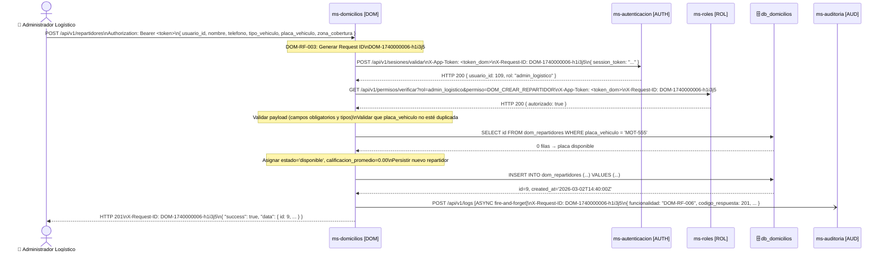

**Descripción:** El administrador logístico envía el payload con los datos del nuevo repartidor. DOM genera el Request ID, valida la sesión en AUTH y el permiso `DOM_CREAR_REPARTIDOR` en ROL. Verifica que la placa no esté duplicada en la base de datos local. Si todo es válido, persiste el repartidor con estado `disponible` y calificación promedio `0.00`, envía el log a AUD de forma asíncrona, y retorna HTTP 201 con el registro creado.

---

### 5.2 `GET /api/v1/repartidores/{id}` — Consultar Repartidor por ID

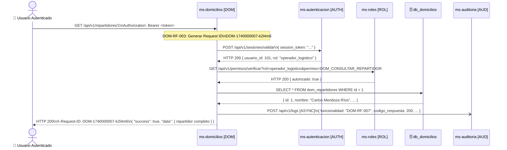

**Descripción:** Flujo de consulta simple. DOM genera el Request ID, valida sesión y permisos, y ejecuta un SELECT por ID en `dom_repartidores`. Si no existe el registro retorna HTTP 404. Si existe, envía el log a AUD de forma asíncrona y retorna HTTP 200 con los datos completos del repartidor.

---

### 5.3 `PUT /api/v1/repartidores/{id}` — Actualizar Repartidor

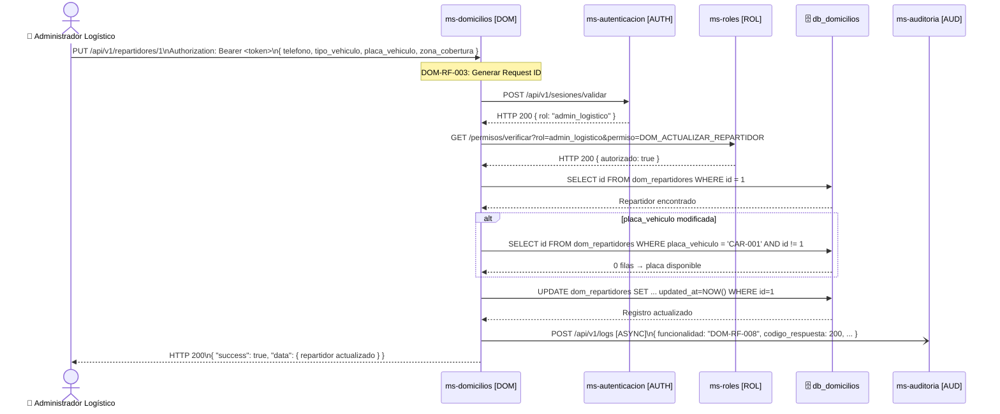

**Descripción:** DOM genera Request ID, valida sesión y permisos. Verifica que el repartidor existe. Si se incluye una nueva placa, verifica que no esté en uso por otro repartidor. Aplica el UPDATE y retorna los datos actualizados con `updated_at` renovado. El log se envía a AUD de forma asíncrona.

---

### 5.4 `GET /api/v1/repartidores` — Listar Repartidores Disponibles por Zona

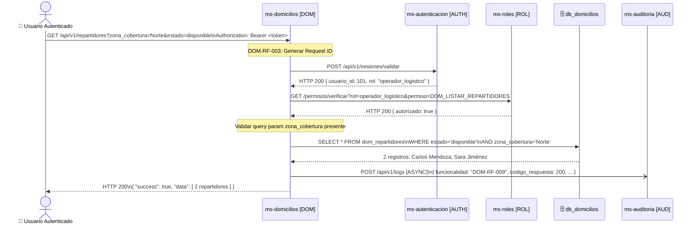

**Descripción:** DOM valida sesión, permisos y la presencia del parámetro `zona_cobertura`. Ejecuta la consulta en `dom_repartidores` usando el índice compuesto `idx_repartidores_estado_zona`. Puede retornar lista vacía si no hay repartidores disponibles en esa zona. Log asíncrono a AUD al finalizar.

---

### 5.5 `PATCH /api/v1/repartidores/{id}/estado` — Cambiar Estado de Repartidor

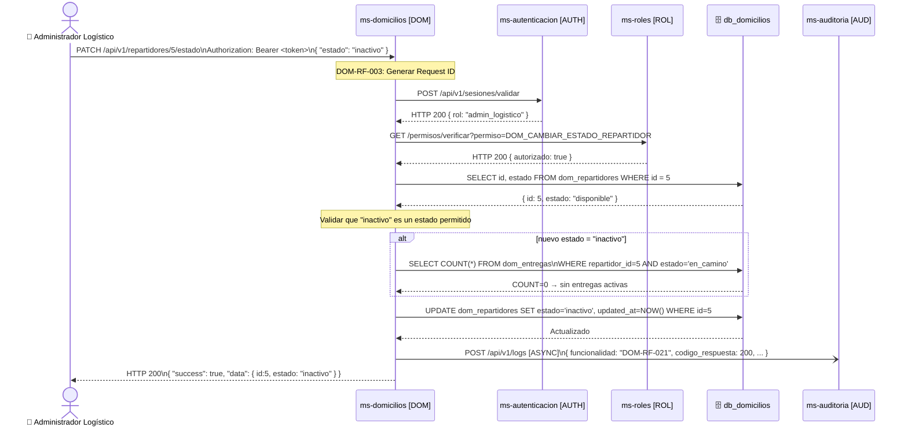

**Descripción:** DOM valida sesión y permisos, verifica que el repartidor existe y que el nuevo estado es un valor válido. Si el nuevo estado es `inactivo`, verifica que el repartidor no tenga entregas activas (`en_camino`). Si pasa todas las validaciones, aplica el UPDATE y retorna HTTP 200. Si tiene entregas activas retorna HTTP 422.

---

### 5.6 `GET /api/v1/repartidores/{id}/calificaciones` — Consultar Calificaciones de un Repartidor

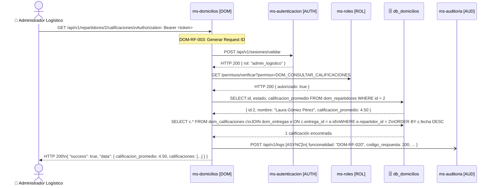

**Descripción:** DOM valida sesión y permisos. Verifica que el repartidor existe y recupera su `calificacion_promedio` actual. Consulta todas las calificaciones cuya entrega esté vinculada a ese repartidor, ordenadas de forma descendente por fecha. Construye la respuesta con el promedio y la lista de calificaciones, y envía el log a AUD de forma asíncrona.

---

### 5.7 `POST /api/v1/entregas` — Crear Entrega

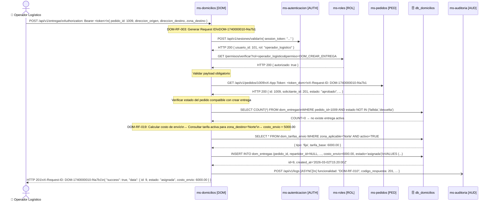

**Descripción:** El operador envía el pedido y las direcciones. DOM genera el Request ID, valida sesión y permisos. Consulta ms-pedidos para obtener los datos del pedido y verificar su estado (si PED no responde, retorna HTTP 503). Verifica que no exista otra entrega activa para el mismo pedido. Calcula el costo de envío consultando las tarifas configuradas en `dom_tarifas_envio`. Persiste la entrega en estado `asignada` con `repartidor_id = NULL`. Envía el log a AUD de forma asíncrona y retorna HTTP 201.

---

### 5.8 `GET /api/v1/entregas` — Listar Entregas con Filtros

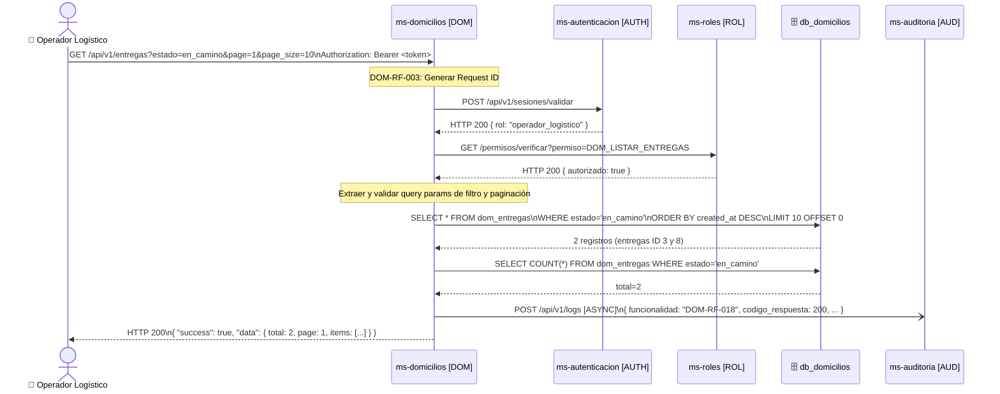

**Descripción:** DOM valida sesión y permisos, extrae los query params de filtro (estado, repartidor_id, fechas, pedido_id) y paginación. Construye la consulta dinámica aplicando los filtros proporcionados. Ejecuta dos consultas: una para obtener los registros paginados y otra para el conteo total. Retorna la lista con metadatos de paginación.

---

### 5.9 `GET /api/v1/entregas/{id}` — Consultar Entrega por ID

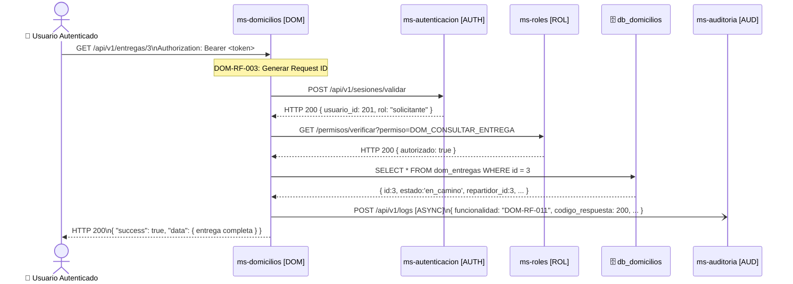

**Descripción:** Flujo de consulta simple. DOM genera el Request ID, valida sesión y permisos, ejecuta SELECT por ID en `dom_entregas`. Si el registro no existe retorna HTTP 404. Si existe, retorna HTTP 200 con todos los campos de la entrega. Log asíncrono a AUD.

---

### 5.10 `PUT /api/v1/entregas/{id}` — Actualizar Datos de Entrega

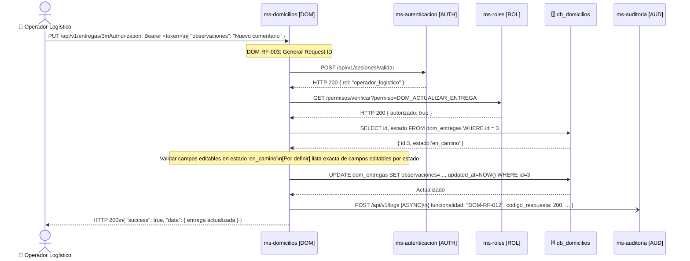

**Descripción:** DOM valida sesión y permisos, verifica que la entrega existe, y valida que los campos enviados en el payload son editables en el estado actual de la entrega. Aplica el UPDATE con `updated_at = NOW()` y retorna los datos actualizados.

---

### 5.11 `POST /api/v1/entregas/{id}/asignar` — Asignar Repartidor a Entrega

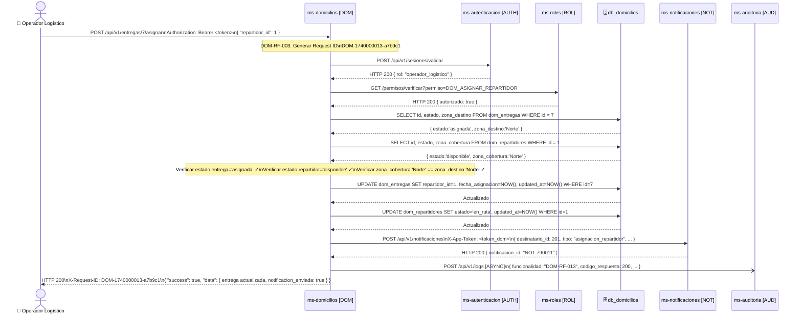

**Descripción:** DOM valida sesión y permisos. Recupera tanto la entrega como el repartidor de la base de datos. Valida tres condiciones: (1) la entrega está en estado `asignada`, (2) el repartidor está `disponible`, y (3) la `zona_cobertura` del repartidor coincide con la `zona_destino` de la entrega. Si todo es válido, actualiza la entrega con `repartidor_id` y `fecha_asignacion`, y cambia el estado del repartidor a `en_ruta`. Notifica al solicitante vía ms-notificaciones (fallo tolerado). Log asíncrono a AUD.

---

### 5.12 `PATCH /api/v1/entregas/{id}/estado` — Actualizar Estado de Entrega

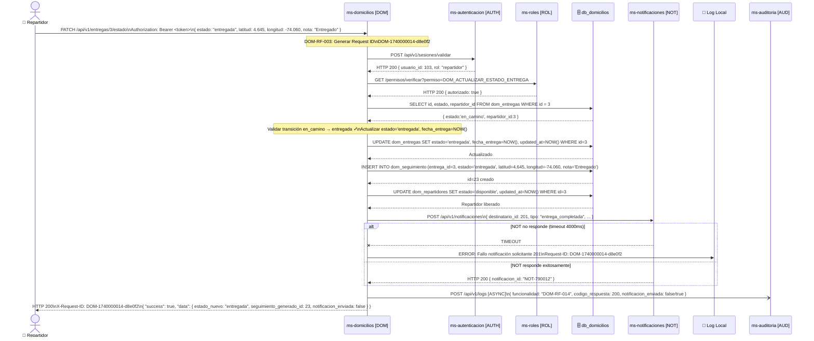

**Descripción:** DOM valida sesión y permisos. Recupera la entrega y valida la transición de estado. Aplica el UPDATE en `dom_entregas`, inserta automáticamente un nuevo punto en `dom_seguimiento` con las coordenadas y nota del payload, y libera al repartidor si el nuevo estado es terminal (`entregada`, `fallida`, `devuelta`). Intenta notificar al solicitante; si ms-notificaciones no responde, el fallo se registra en log local pero no interrumpe la respuesta. Log asíncrono a AUD.

---

### 5.13 `POST /api/v1/entregas/{id}/seguimiento` — Registrar Punto de Seguimiento Manual

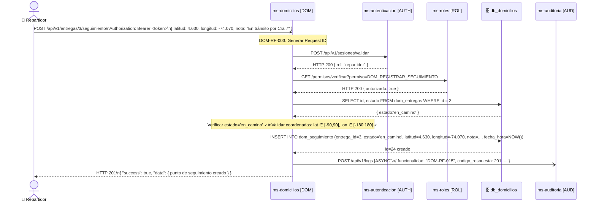

**Descripción:** DOM valida sesión y permisos. Verifica que la entrega existe y está en estado `en_camino` (único estado que permite puntos de seguimiento manuales). Valida que las coordenadas estén en rangos geográficos válidos. Inserta el nuevo punto en `dom_seguimiento` con la fecha/hora actual y retorna HTTP 201.

---

### 5.14 `GET /api/v1/entregas/{id}/seguimiento` — Consultar Historial de Seguimiento

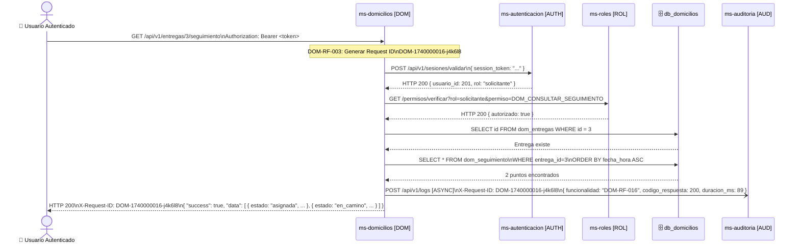

**Descripción:** DOM genera el Request ID, valida sesión y permisos. Verifica que la entrega existe. Consulta todos los puntos en `dom_seguimiento` para la entrega indicada, ordenados cronológicamente de forma ascendente usando el índice `idx_seguimiento_fecha_hora`. Puede retornar lista vacía si no hay puntos registrados aún. No se realizan llamadas a servicios externos. Log asíncrono a AUD.

---

### 5.15 `POST /api/v1/entregas/{id}/calificaciones` — Registrar Calificación de Entrega

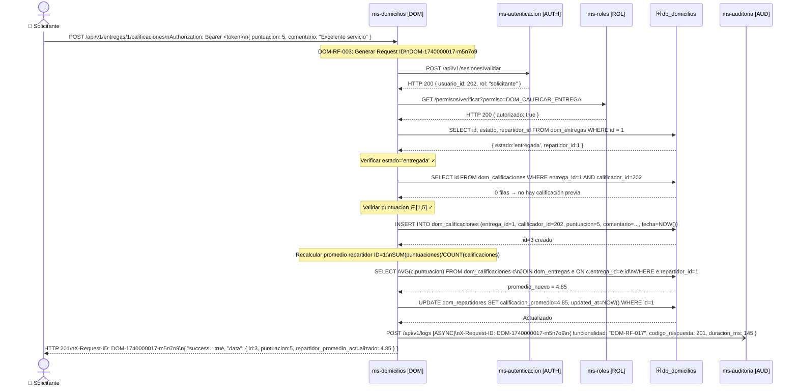

**Descripción:** DOM genera el Request ID, valida sesión y permisos. Verifica que la entrega existe y está en estado `entregada`. Comprueba que el usuario actual no haya calificado previamente esta entrega (evitar duplicados usando la constraint UNIQUE de `dom_calificaciones.entrega_id`). Valida que la puntuación esté en el rango [1, 5]. Persiste la calificación. Recalcula el promedio del repartidor con un AVG sobre todas sus calificaciones y actualiza `calificacion_promedio` en `dom_repartidores`. Envía el log a AUD de forma asíncrona y retorna HTTP 201.

---

*Documento generado a partir de los documentos de requisitos funcionales, modelo de datos y diseño de integración de ms-domicilios [DOM] — ERP Universitario v1.0, Marzo 2026.*
