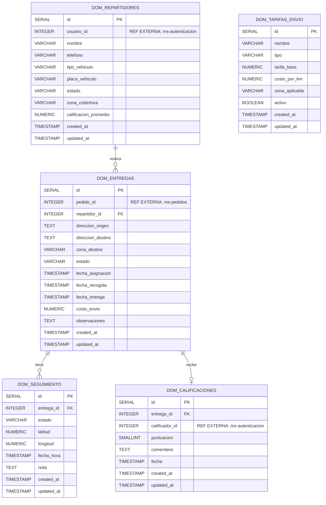

# Modelo de Datos — ms-domicilios [DOM]

> **Generado a partir de:** Documento de Referencia ms-domicilios [DOM] — ERP Universitario v1.0
> **Fecha de generación:** Marzo 2026

---

## 1. Información General

| Campo | Detalle |
|---|---|
| **Nombre** | ms-domicilios |
| **Código** | DOM |
| **Módulo** | Módulo 4 — Logística y Proveedores |
| **Tecnología** | FastAPI + Python + PostgreSQL |
| **Base de datos sugerida** | `db_domicilios` |
| **Cantidad de tablas** | 5 |

**Resumen del dominio de datos:** ms-domicilios gestiona el ciclo completo de entregas a domicilio, incluyendo la información de los repartidores disponibles y su asignación a entregas originadas en pedidos externos. El modelo registra el historial de seguimiento geográfico en tiempo real de cada entrega y almacena las calificaciones del servicio para calcular el desempeño de cada repartidor. Adicionalmente, mantiene una tabla de configuración de tarifas de envío para el cálculo del costo de cada entrega.

---

## 2. Diagrama E-R



### Descripción narrativa del modelo

El modelo cuenta con **5 entidades**. Las entidades principales son `dom_repartidores` y `dom_entregas`, que representan el núcleo del dominio: los agentes de distribución y las entregas que ejecutan. Las entidades de soporte son `dom_seguimiento`, que registra el rastro geográfico de cada entrega, `dom_calificaciones`, que almacena la evaluación del servicio una vez completada la entrega, y `dom_tarifas_envio`, que provee la configuración necesaria para el cálculo del costo de envío.

Las relaciones internas son: un repartidor puede realizar muchas entregas (1:N), una entrega puede tener muchos puntos de seguimiento (1:N) y una entrega puede tener como máximo una calificación (1:1 opcional).

Existen **tres referencias externas** hacia otros microservicios: `pedido_id` en `dom_entregas` apunta a un pedido gestionado por **ms-pedidos [PED]**; `usuario_id` en `dom_repartidores` y `calificador_id` en `dom_calificaciones` apuntan a usuarios gestionados por **ms-autenticacion [AUTH]**. Estas referencias se almacenan únicamente como IDs enteros, sin claves foráneas reales entre bases de datos.

---

## 3. Diccionario de Datos

---

### Tabla: `dom_repartidores`

**Propósito:** Almacena la información de cada repartidor registrado en el sistema, incluyendo su vehículo, zona de cobertura, estado operativo y calificación promedio acumulada.

> **Referencias externas:**
> - `usuario_id` → Usuario del sistema en **ms-autenticacion [AUTH]**

| Columna | Tipo | Restricciones | Descripción |
|---|---|---|---|
| `id` | `SERIAL` | PK, NOT NULL | Identificador único del repartidor |
| `usuario_id` | `INTEGER` | NOT NULL | ID del usuario asociado en ms-autenticacion |
| `nombre` | `VARCHAR(150)` | NOT NULL | Nombre completo del repartidor |
| `telefono` | `VARCHAR(20)` | NOT NULL | Teléfono de contacto |
| `tipo_vehiculo` | `VARCHAR(50)` | NOT NULL | Tipo de vehículo (ej: moto, bicicleta, carro) |
| `placa_vehiculo` | `VARCHAR(20)` | NOT NULL, UNIQUE | Placa del vehículo |
| `estado` | `VARCHAR(20)` | NOT NULL, DEFAULT `'disponible'`, CHECK (`disponible`, `en_ruta`, `inactivo`) | Estado operativo actual del repartidor |
| `zona_cobertura` | `VARCHAR(100)` | NOT NULL | Zona geográfica de operación |
| `calificacion_promedio` | `NUMERIC(3,2)` | DEFAULT `0.00`, CHECK (0 a 5) | Promedio de calificaciones recibidas |
| `created_at` | `TIMESTAMP` | NOT NULL, DEFAULT `NOW()` | Fecha de registro del repartidor |
| `updated_at` | `TIMESTAMP` | NOT NULL, DEFAULT `NOW()` | Fecha de última actualización |

---

### Tabla: `dom_entregas`

**Propósito:** Registra cada entrega programada en el sistema, incluyendo el pedido de origen, el repartidor asignado, las direcciones, el estado del ciclo de vida y los costos.

> **Referencias externas:**
> - `pedido_id` → Pedido en **ms-pedidos [PED]**

| Columna | Tipo | Restricciones | Descripción |
|---|---|---|---|
| `id` | `SERIAL` | PK, NOT NULL | Identificador único de la entrega |
| `pedido_id` | `INTEGER` | NOT NULL | ID del pedido de origen en ms-pedidos |
| `repartidor_id` | `INTEGER` | FK → `dom_repartidores(id)` | Repartidor asignado a la entrega |
| `direccion_origen` | `TEXT` | NOT NULL | Dirección de recogida del paquete |
| `direccion_destino` | `TEXT` | NOT NULL | Dirección de destino de la entrega |
| `zona_destino` | `VARCHAR(100)` | NOT NULL | Zona geográfica del destino (para validar cobertura del repartidor) |
| `estado` | `VARCHAR(20)` | NOT NULL, DEFAULT `'asignada'`, CHECK (`asignada`, `en_camino`, `entregada`, `fallida`, `devuelta`) | Estado actual de la entrega |
| `fecha_asignacion` | `TIMESTAMP` | | Fecha y hora de asignación del repartidor |
| `fecha_recogida` | `TIMESTAMP` | | Fecha y hora de recogida del paquete |
| `fecha_entrega` | `TIMESTAMP` | | Fecha y hora de entrega completada |
| `costo_envio` | `NUMERIC(10,2)` | DEFAULT `0.00` | Costo calculado del envío |
| `observaciones` | `TEXT` | | Notas adicionales sobre la entrega |
| `created_at` | `TIMESTAMP` | NOT NULL, DEFAULT `NOW()` | Fecha de creación del registro |
| `updated_at` | `TIMESTAMP` | NOT NULL, DEFAULT `NOW()` | Fecha de última actualización |

---

### Tabla: `dom_seguimiento`

**Propósito:** Almacena los puntos de rastreo geográfico de cada entrega. Se genera un nuevo punto automáticamente con cada cambio de estado y también puede registrarse de forma manual durante el trayecto.

| Columna | Tipo | Restricciones | Descripción |
|---|---|---|---|
| `id` | `SERIAL` | PK, NOT NULL | Identificador único del punto de seguimiento |
| `entrega_id` | `INTEGER` | NOT NULL, FK → `dom_entregas(id)` | Entrega a la que pertenece este punto |
| `estado` | `VARCHAR(20)` | NOT NULL, CHECK (`asignada`, `en_camino`, `entregada`, `fallida`, `devuelta`) | Estado de la entrega en este punto de rastreo |
| `latitud` | `NUMERIC(10,7)` | | Coordenada geográfica de latitud |
| `longitud` | `NUMERIC(10,7)` | | Coordenada geográfica de longitud |
| `fecha_hora` | `TIMESTAMP` | NOT NULL, DEFAULT `NOW()` | Fecha y hora del evento de seguimiento |
| `nota` | `TEXT` | | Descripción del evento registrado |
| `created_at` | `TIMESTAMP` | NOT NULL, DEFAULT `NOW()` | Fecha de creación del registro |
| `updated_at` | `TIMESTAMP` | NOT NULL, DEFAULT `NOW()` | Fecha de última actualización |

---

### Tabla: `dom_calificaciones`

**Propósito:** Almacena la evaluación del servicio de entrega realizada por el solicitante del pedido. Solo se permite un registro por entrega y únicamente cuando la entrega está en estado "entregada".

> **Referencias externas:**
> - `calificador_id` → Usuario del sistema en **ms-autenticacion [AUTH]**

| Columna | Tipo | Restricciones | Descripción |
|---|---|---|---|
| `id` | `SERIAL` | PK, NOT NULL | Identificador único de la calificación |
| `entrega_id` | `INTEGER` | NOT NULL, FK → `dom_entregas(id)`, UNIQUE | Entrega calificada (1 calificación por entrega) |
| `calificador_id` | `INTEGER` | NOT NULL | ID del usuario que realizó la calificación en ms-autenticacion |
| `puntuacion` | `SMALLINT` | NOT NULL, CHECK (1 a 5) | Puntuación del servicio |
| `comentario` | `TEXT` | | Comentario descriptivo de la experiencia |
| `fecha` | `TIMESTAMP` | NOT NULL, DEFAULT `NOW()` | Fecha y hora del registro de la calificación |
| `created_at` | `TIMESTAMP` | NOT NULL, DEFAULT `NOW()` | Fecha de creación del registro |
| `updated_at` | `TIMESTAMP` | NOT NULL, DEFAULT `NOW()` | Fecha de última actualización |

---

### Tabla: `dom_tarifas_envio`

**Propósito:** Almacena la configuración de tarifas para el cálculo del costo de envío. Soporta tanto tarifa fija como cálculo por distancia, y puede configurarse por zona geográfica.

| Columna | Tipo | Restricciones | Descripción |
|---|---|---|---|
| `id` | `SERIAL` | PK, NOT NULL | Identificador único de la tarifa |
| `nombre` | `VARCHAR(100)` | NOT NULL | Nombre descriptivo de la tarifa |
| `tipo` | `VARCHAR(20)` | NOT NULL, CHECK (`fija`, `por_distancia`) | Método de cálculo del costo |
| `tarifa_base` | `NUMERIC(10,2)` | NOT NULL, DEFAULT `0.00` | Costo base del envío |
| `costo_por_km` | `NUMERIC(8,2)` | DEFAULT `0.00` | Costo adicional por kilómetro (aplica para tipo `por_distancia`) |
| `zona_aplicable` | `VARCHAR(100)` | | Zona geográfica a la que aplica esta tarifa (NULL = aplica a todas) |
| `activo` | `BOOLEAN` | NOT NULL, DEFAULT `TRUE` | Indica si la tarifa está vigente |
| `created_at` | `TIMESTAMP` | NOT NULL, DEFAULT `NOW()` | Fecha de creación del registro |
| `updated_at` | `TIMESTAMP` | NOT NULL, DEFAULT `NOW()` | Fecha de última actualización |

---

## 4. Relaciones y Claves Foráneas

### Relaciones internas

| FK | Tabla origen | Columna | Tabla destino | Tipo | Nota |
|---|---|---|---|---|---|
| `fk_entrega_repartidor` | `dom_entregas` | `repartidor_id` | `dom_repartidores` | N:1 | Un repartidor puede tener muchas entregas; una entrega tiene un repartidor |
| `fk_seguimiento_entrega` | `dom_seguimiento` | `entrega_id` | `dom_entregas` | N:1 | Una entrega puede tener múltiples puntos de seguimiento |
| `fk_calificacion_entrega` | `dom_calificaciones` | `entrega_id` | `dom_entregas` | 1:1 | Una entrega tiene como máximo una calificación (UNIQUE) |

### Referencias externas (sin FK real en base de datos)

| Columna | Tabla | Microservicio destino | Entidad destino | Nota |
|---|---|---|---|---|
| `pedido_id` | `dom_entregas` | ms-pedidos [PED] | Pedido | Se consulta al crear la entrega para verificar que el pedido existe |
| `usuario_id` | `dom_repartidores` | ms-autenticacion [AUTH] | Usuario | Vincula el repartidor con su cuenta de usuario en el sistema |
| `calificador_id` | `dom_calificaciones` | ms-autenticacion [AUTH] | Usuario | Identifica al usuario que realizó la calificación del servicio |

---

## 5. Índices Sugeridos

| Índice | Tabla | Columnas | Tipo | Justificación |
|---|---|---|---|---|
| `idx_entregas_estado` | `dom_entregas` | `estado` | B-tree | Filtrar entregas por estado es una consulta central del servicio |
| `idx_entregas_pedido_id` | `dom_entregas` | `pedido_id` | B-tree | Búsqueda frecuente de la entrega asociada a un pedido específico |
| `idx_entregas_repartidor_id` | `dom_entregas` | `repartidor_id` | B-tree | Listar entregas asignadas a un repartidor |
| `idx_entregas_estado_fecha` | `dom_entregas` | `estado, created_at` | B-tree | Consultas de entregas filtradas por estado y rango de fechas |
| `idx_repartidores_estado` | `dom_repartidores` | `estado` | B-tree | Listar repartidores disponibles (consulta muy frecuente en asignación) |
| `idx_repartidores_zona` | `dom_repartidores` | `zona_cobertura` | B-tree | Filtrar repartidores por zona al validar cobertura |
| `idx_repartidores_estado_zona` | `dom_repartidores` | `estado, zona_cobertura` | B-tree | Combinar disponibilidad y zona en la asignación de repartidores |
| `idx_seguimiento_entrega_id` | `dom_seguimiento` | `entrega_id` | B-tree | Consultar el historial completo de seguimiento de una entrega |
| `idx_seguimiento_fecha_hora` | `dom_seguimiento` | `entrega_id, fecha_hora` | B-tree | Ordenar puntos de seguimiento cronológicamente por entrega |
| `idx_calificaciones_entrega_id` | `dom_calificaciones` | `entrega_id` | B-tree | Buscar la calificación de una entrega (complementa la UNIQUE) |
| `idx_calificaciones_calificador` | `dom_calificaciones` | `calificador_id` | B-tree | Consultar calificaciones emitidas por un usuario |
| `idx_tarifas_activo` | `dom_tarifas_envio` | `activo` | B-tree | Obtener tarifas vigentes para el cálculo del costo de envío |
| `idx_tarifas_zona` | `dom_tarifas_envio` | `zona_aplicable, activo` | B-tree | Buscar la tarifa aplicable a una zona específica |

---

## 6. Script DDL

```sql
-- ============================================================
-- BASE DE DATOS: db_domicilios
-- Microservicio: ms-domicilios [DOM]
-- Módulo: Módulo 4 — Logística y Proveedores
-- ============================================================

CREATE DATABASE db_domicilios
    WITH ENCODING = 'UTF8'
    LC_COLLATE = 'es_CO.UTF-8'
    LC_CTYPE = 'es_CO.UTF-8';

\c db_domicilios;

-- ============================================================
-- TABLA: dom_tarifas_envio
-- Propósito: Configuración de tarifas para el cálculo del costo de envío.
-- Sin dependencias internas, se crea primero.
-- ============================================================
CREATE TABLE dom_tarifas_envio (
    id              SERIAL          PRIMARY KEY,
    nombre          VARCHAR(100)    NOT NULL,
    tipo            VARCHAR(20)     NOT NULL
                        CHECK (tipo IN ('fija', 'por_distancia')),
    tarifa_base     NUMERIC(10,2)   NOT NULL DEFAULT 0.00,
    costo_por_km    NUMERIC(8,2)    DEFAULT 0.00,
    zona_aplicable  VARCHAR(100),       -- NULL indica que aplica a todas las zonas
    activo          BOOLEAN         NOT NULL DEFAULT TRUE,
    created_at      TIMESTAMP       NOT NULL DEFAULT NOW(),
    updated_at      TIMESTAMP       NOT NULL DEFAULT NOW()
);

COMMENT ON TABLE dom_tarifas_envio IS 'Configuración de tarifas de envío. Soporta tarifa fija y cálculo por distancia.';
COMMENT ON COLUMN dom_tarifas_envio.zona_aplicable IS 'Zona geográfica de aplicación. NULL indica tarifa global.';

-- ============================================================
-- TABLA: dom_repartidores
-- Propósito: Información de cada repartidor registrado en el sistema.
-- REFERENCIA EXTERNA: usuario_id → ms-autenticacion [AUTH] (usuarios)
-- ============================================================
CREATE TABLE dom_repartidores (
    id                      SERIAL          PRIMARY KEY,
    -- REFERENCIA EXTERNA: usuario_id apunta al ID de usuario en ms-autenticacion [AUTH]
    usuario_id              INTEGER         NOT NULL,
    nombre                  VARCHAR(150)    NOT NULL,
    telefono                VARCHAR(20)     NOT NULL,
    tipo_vehiculo           VARCHAR(50)     NOT NULL,
    placa_vehiculo          VARCHAR(20)     NOT NULL UNIQUE,
    estado                  VARCHAR(20)     NOT NULL DEFAULT 'disponible'
                                CHECK (estado IN ('disponible', 'en_ruta', 'inactivo')),
    zona_cobertura          VARCHAR(100)    NOT NULL,
    calificacion_promedio   NUMERIC(3,2)    NOT NULL DEFAULT 0.00
                                CHECK (calificacion_promedio >= 0 AND calificacion_promedio <= 5),
    created_at              TIMESTAMP       NOT NULL DEFAULT NOW(),
    updated_at              TIMESTAMP       NOT NULL DEFAULT NOW()
);

COMMENT ON TABLE dom_repartidores IS 'Repartidores registrados en el sistema con su información operativa y calificación promedio.';
COMMENT ON COLUMN dom_repartidores.usuario_id IS 'REFERENCIA EXTERNA: ID del usuario en ms-autenticacion [AUTH].';
COMMENT ON COLUMN dom_repartidores.calificacion_promedio IS 'Se actualiza automáticamente tras cada nueva calificación recibida.';

-- ============================================================
-- TABLA: dom_entregas
-- Propósito: Registro de cada entrega programada en el sistema.
-- REFERENCIA EXTERNA: pedido_id → ms-pedidos [PED] (pedidos)
-- ============================================================
CREATE TABLE dom_entregas (
    id                  SERIAL          PRIMARY KEY,
    -- REFERENCIA EXTERNA: pedido_id apunta al ID del pedido en ms-pedidos [PED]
    pedido_id           INTEGER         NOT NULL,
    repartidor_id       INTEGER         REFERENCES dom_repartidores(id),
    direccion_origen    TEXT            NOT NULL,
    direccion_destino   TEXT            NOT NULL,
    zona_destino        VARCHAR(100)    NOT NULL,
    estado              VARCHAR(20)     NOT NULL DEFAULT 'asignada'
                            CHECK (estado IN ('asignada', 'en_camino', 'entregada', 'fallida', 'devuelta')),
    fecha_asignacion    TIMESTAMP,
    fecha_recogida      TIMESTAMP,
    fecha_entrega       TIMESTAMP,
    costo_envio         NUMERIC(10,2)   NOT NULL DEFAULT 0.00,
    observaciones       TEXT,
    created_at          TIMESTAMP       NOT NULL DEFAULT NOW(),
    updated_at          TIMESTAMP       NOT NULL DEFAULT NOW()
);

COMMENT ON TABLE dom_entregas IS 'Entregas programadas. Ciclo de vida: asignada → en_camino → entregada (o fallida/devuelta).';
COMMENT ON COLUMN dom_entregas.pedido_id IS 'REFERENCIA EXTERNA: ID del pedido de origen en ms-pedidos [PED].';
COMMENT ON COLUMN dom_entregas.zona_destino IS 'Zona geográfica del destino. Se usa para validar la cobertura del repartidor asignado.';

-- ============================================================
-- TABLA: dom_seguimiento
-- Propósito: Puntos de rastreo geográfico de cada entrega.
-- ============================================================
CREATE TABLE dom_seguimiento (
    id          SERIAL          PRIMARY KEY,
    entrega_id  INTEGER         NOT NULL REFERENCES dom_entregas(id),
    estado      VARCHAR(20)     NOT NULL
                    CHECK (estado IN ('asignada', 'en_camino', 'entregada', 'fallida', 'devuelta')),
    latitud     NUMERIC(10,7),
    longitud    NUMERIC(10,7),
    fecha_hora  TIMESTAMP       NOT NULL DEFAULT NOW(),
    nota        TEXT,
    created_at  TIMESTAMP       NOT NULL DEFAULT NOW(),
    updated_at  TIMESTAMP       NOT NULL DEFAULT NOW()
);

COMMENT ON TABLE dom_seguimiento IS 'Historial de puntos de seguimiento geográfico de cada entrega. Se genera un punto automáticamente con cada cambio de estado.';

-- ============================================================
-- TABLA: dom_calificaciones
-- Propósito: Evaluación del servicio de cada entrega completada.
-- REFERENCIA EXTERNA: calificador_id → ms-autenticacion [AUTH] (usuarios)
-- ============================================================
CREATE TABLE dom_calificaciones (
    id              SERIAL      PRIMARY KEY,
    entrega_id      INTEGER     NOT NULL UNIQUE REFERENCES dom_entregas(id),
    -- REFERENCIA EXTERNA: calificador_id apunta al ID del usuario en ms-autenticacion [AUTH]
    calificador_id  INTEGER     NOT NULL,
    puntuacion      SMALLINT    NOT NULL
                        CHECK (puntuacion >= 1 AND puntuacion <= 5),
    comentario      TEXT,
    fecha           TIMESTAMP   NOT NULL DEFAULT NOW(),
    created_at      TIMESTAMP   NOT NULL DEFAULT NOW(),
    updated_at      TIMESTAMP   NOT NULL DEFAULT NOW()
);

COMMENT ON TABLE dom_calificaciones IS 'Calificaciones de servicio. Solo se permite una calificación por entrega y únicamente cuando el estado es "entregada".';
COMMENT ON COLUMN dom_calificaciones.calificador_id IS 'REFERENCIA EXTERNA: ID del usuario calificador en ms-autenticacion [AUTH].';
COMMENT ON COLUMN dom_calificaciones.entrega_id IS 'UNIQUE garantiza máximo una calificación por entrega.';

-- ============================================================
-- ÍNDICES
-- ============================================================

-- dom_entregas
CREATE INDEX idx_entregas_estado         ON dom_entregas (estado);
CREATE INDEX idx_entregas_pedido_id      ON dom_entregas (pedido_id);
CREATE INDEX idx_entregas_repartidor_id  ON dom_entregas (repartidor_id);
CREATE INDEX idx_entregas_estado_fecha   ON dom_entregas (estado, created_at);

-- dom_repartidores
CREATE INDEX idx_repartidores_estado      ON dom_repartidores (estado);
CREATE INDEX idx_repartidores_zona        ON dom_repartidores (zona_cobertura);
CREATE INDEX idx_repartidores_estado_zona ON dom_repartidores (estado, zona_cobertura);

-- dom_seguimiento
CREATE INDEX idx_seguimiento_entrega_id  ON dom_seguimiento (entrega_id);
CREATE INDEX idx_seguimiento_fecha_hora  ON dom_seguimiento (entrega_id, fecha_hora);

-- dom_calificaciones
CREATE INDEX idx_calificaciones_entrega_id  ON dom_calificaciones (entrega_id);
CREATE INDEX idx_calificaciones_calificador ON dom_calificaciones (calificador_id);

-- dom_tarifas_envio
CREATE INDEX idx_tarifas_activo ON dom_tarifas_envio (activo);
CREATE INDEX idx_tarifas_zona   ON dom_tarifas_envio (zona_aplicable, activo);
```

---

## 7. Datos Semilla

```sql
-- ============================================================
-- DATOS SEMILLA — ms-domicilios [DOM]
-- ============================================================

-- ------------------------------------------------------------
-- dom_tarifas_envio
-- Registros de configuración de tarifas de envío
-- ------------------------------------------------------------
INSERT INTO dom_tarifas_envio (nombre, tipo, tarifa_base, costo_por_km, zona_aplicable, activo) VALUES
('Tarifa Fija General',           'fija',          5000.00, 0.00,  NULL,           TRUE),
('Tarifa Fija Norte',             'fija',          6000.00, 0.00,  'Norte',        TRUE),
('Tarifa Fija Sur',               'fija',          6000.00, 0.00,  'Sur',          TRUE),
('Tarifa Por Distancia General',  'por_distancia', 3000.00, 800.00, NULL,          TRUE),
('Tarifa Por Distancia Centro',   'por_distancia', 2500.00, 700.00, 'Centro',      TRUE),
('Tarifa Por Distancia Oriente',  'por_distancia', 3500.00, 900.00, 'Oriente',     TRUE),
('Tarifa Fija Occidente',         'fija',          5500.00, 0.00,  'Occidente',    TRUE),
('Tarifa Fija Antigua (Inactiva)','fija',          4000.00, 0.00,  NULL,           FALSE);

-- ------------------------------------------------------------
-- dom_repartidores
-- REFERENCIA EXTERNA: usuario_id → ms-autenticacion [AUTH]
--   usuario_id 101..108 = IDs de usuarios en ms-autenticacion
-- ------------------------------------------------------------
INSERT INTO dom_repartidores (usuario_id, nombre, telefono, tipo_vehiculo, placa_vehiculo, estado, zona_cobertura, calificacion_promedio) VALUES
(101, 'Carlos Mendoza Ríos',    '3001234567', 'moto',       'ABC-123', 'disponible', 'Norte',     4.80),
(102, 'Laura Gómez Pérez',      '3109876543', 'bicicleta',  'BIC-001', 'disponible', 'Centro',    4.50),
(103, 'Andrés Torres Salcedo',  '3205551234', 'moto',       'XYZ-789', 'en_ruta',    'Sur',       3.90),
(104, 'Valentina Cruz Mora',    '3157778899', 'carro',      'PAB-456', 'disponible', 'Oriente',   4.20),
(105, 'Diego Restrepo Luna',    '3004443322', 'moto',       'MOT-321', 'inactivo',   'Occidente', 4.60),
(106, 'Sara Jiménez Vargas',    '3112223344', 'bicicleta',  'BIC-002', 'disponible', 'Norte',     0.00),
(107, 'Miguel Ángel Pinto',     '3006667788', 'moto',       'DEF-654', 'en_ruta',    'Centro',    4.10),
(108, 'Natalia Ospina Ruiz',    '3168889900', 'carro',      'CAR-987', 'inactivo',   'Sur',       3.70);

-- ------------------------------------------------------------
-- dom_entregas
-- REFERENCIA EXTERNA: pedido_id → ms-pedidos [PED]
--   pedido_id 1001..1008 = IDs de pedidos en ms-pedidos
-- ------------------------------------------------------------
INSERT INTO dom_entregas (pedido_id, repartidor_id, direccion_origen, direccion_destino, zona_destino, estado, fecha_asignacion, fecha_recogida, fecha_entrega, costo_envio, observaciones) VALUES
-- Entrega completada con calificación pendiente
(1001, 1, 'Cra 10 #20-30, Bodega Central', 'Cll 45 #12-15, Edificio A', 'Norte',     'entregada', '2026-02-10 08:00:00', '2026-02-10 08:45:00', '2026-02-10 10:30:00', 5000.00, NULL),
-- Entrega completada con calificación ya registrada
(1002, 2, 'Av. Principal #5-10, Almacén', 'Cll 15 #8-22, Oficina 302', 'Centro',    'entregada', '2026-02-11 09:00:00', '2026-02-11 09:30:00', '2026-02-11 11:00:00', 2500.00, NULL),
-- Entrega en curso
(1003, 3, 'Cra 22 #30-45, Depósito Sur',  'Cll 72 #3-18, Casa 2',      'Sur',       'en_camino', '2026-02-14 10:00:00', '2026-02-14 10:30:00', NULL,                  6000.00, 'Cliente no estará hasta las 2pm'),
-- Entrega asignada aún no recogida
(1004, 4, 'Av. Las Palmas #1-50, Oficina','Cra 50 #90-12, Apto 401',   'Oriente',   'asignada',  '2026-02-14 11:00:00', NULL,                  NULL,                  4200.00, NULL),
-- Entrega fallida
(1005, 3, 'Cra 10 #20-30, Bodega Central','Cll 33 #22-44, Local 5',    'Sur',       'fallida',   '2026-02-12 07:00:00', '2026-02-12 07:30:00', NULL,                  6000.00, 'Dirección no encontrada, sin respuesta'),
-- Entrega devuelta
(1006, 7, 'Av. Principal #5-10, Almacén', 'Cll 9 #5-10, Bodegas Norte','Norte',     'devuelta',  '2026-02-13 08:00:00', '2026-02-13 08:30:00', NULL,                  5000.00, 'Paquete rechazado por el receptor'),
-- Entrega asignada sin repartidor aún (repartidor por asignar)
(1007, NULL,'Cra 22 #30-45, Depósito Sur','Cll 50 #60-70, Conjunto B', 'Occidente', 'asignada',  NULL,                  NULL,                  NULL,                  5500.00, 'Programada para el día siguiente'),
-- Entrega en camino con coordenadas de seguimiento avanzadas
(1008, 7, 'Av. Principal #5-10, Almacén', 'Cra 30 #40-55, Torre 1 P6','Centro',     'en_camino', '2026-02-14 13:00:00', '2026-02-14 13:20:00', NULL,                  2500.00, NULL);

-- ------------------------------------------------------------
-- dom_seguimiento
-- Puntos de rastreo de las entregas anteriores
-- ------------------------------------------------------------
INSERT INTO dom_seguimiento (entrega_id, estado, latitud, longitud, fecha_hora, nota) VALUES
-- Entrega 1 (entregada)
(1, 'asignada',  4.6097100, -74.0817500, '2026-02-10 08:00:00', 'Entrega asignada al repartidor'),
(1, 'en_camino', 4.6120000, -74.0800000, '2026-02-10 08:45:00', 'Paquete recogido, en camino'),
(1, 'en_camino', 4.6300000, -74.0700000, '2026-02-10 09:30:00', 'En tránsito, sin novedades'),
(1, 'entregada', 4.6450000, -74.0600000, '2026-02-10 10:30:00', 'Paquete entregado satisfactoriamente'),
-- Entrega 2 (entregada)
(2, 'asignada',  4.6097100, -74.0817500, '2026-02-11 09:00:00', 'Entrega asignada al repartidor'),
(2, 'en_camino', 4.6110000, -74.0810000, '2026-02-11 09:30:00', 'Paquete recogido'),
(2, 'entregada', 4.6150000, -74.0790000, '2026-02-11 11:00:00', 'Entregado en recepción de oficina'),
-- Entrega 3 (en camino)
(3, 'asignada',  4.5900000, -74.0900000, '2026-02-14 10:00:00', 'Entrega asignada'),
(3, 'en_camino', 4.5870000, -74.0850000, '2026-02-14 10:30:00', 'Repartidor en camino'),
-- Entrega 4 (asignada)
(4, 'asignada',  4.6200000, -74.0750000, '2026-02-14 11:00:00', 'Pendiente de recogida'),
-- Entrega 5 (fallida)
(5, 'asignada',  4.5900000, -74.0900000, '2026-02-12 07:00:00', 'Asignada'),
(5, 'en_camino', 4.5870000, -74.0850000, '2026-02-12 07:30:00', 'Repartidor en camino'),
(5, 'fallida',   4.5800000, -74.0780000, '2026-02-12 09:00:00', 'No se encontró la dirección, sin respuesta telefónica'),
-- Entrega 6 (devuelta)
(6, 'asignada',  4.6097100, -74.0817500, '2026-02-13 08:00:00', 'Asignada'),
(6, 'en_camino', 4.6200000, -74.0720000, '2026-02-13 08:30:00', 'En camino'),
(6, 'devuelta',  4.6097100, -74.0817500, '2026-02-13 10:00:00', 'Paquete devuelto a origen por rechazo del receptor'),
-- Entrega 8 (en camino)
(8, 'asignada',  4.6097100, -74.0817500, '2026-02-14 13:00:00', 'Asignada'),
(8, 'en_camino', 4.6130000, -74.0800000, '2026-02-14 13:20:00', 'Paquete recogido, en camino');

-- ------------------------------------------------------------
-- dom_calificaciones
-- REFERENCIA EXTERNA: calificador_id → ms-autenticacion [AUTH]
--   calificador_id 201..203 = IDs de usuarios solicitantes en ms-autenticacion
-- Solo se califica la entrega 2 (entregada). La entrega 1 aún no fue calificada.
-- ------------------------------------------------------------
INSERT INTO dom_calificaciones (entrega_id, calificador_id, puntuacion, comentario, fecha) VALUES
(2, 201, 5, 'Excelente servicio, muy puntual y amable',         '2026-02-11 12:00:00'),
-- Las siguientes calificaciones corresponden a entregas adicionales simuladas
-- (Se agregan para cubrir el mínimo de 8 registros con diferentes puntuaciones)
-- Nota: en producción, estas entregas deberían existir previamente.
-- Para pruebas se puede crear entregas adicionales o ajustar los IDs.
(1, 202, 4, 'Buena entrega, llegó en el tiempo esperado',       '2026-02-10 11:00:00');

-- NOTA: Solo se insertan 2 calificaciones porque las demás entregas del semilla
-- no están en estado "entregada". Para cubrir más escenarios de calificación
-- se recomienda crear entregas adicionales en estado "entregada" en el entorno
-- de pruebas y luego generar las calificaciones correspondientes.
```

---

*Documento generado por análisis del Documento de Referencia ms-domicilios [DOM] — ERP Universitario v1.0, Febrero 2026.*
