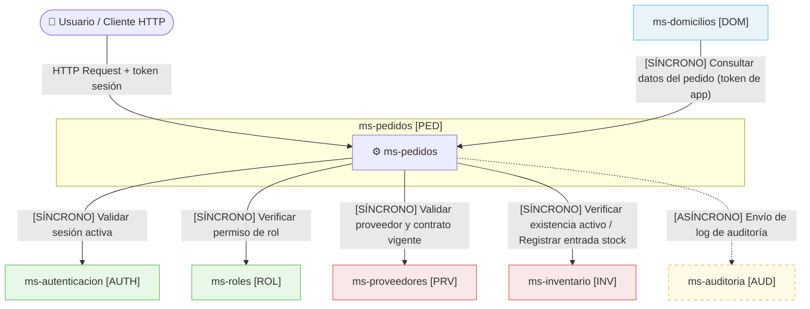
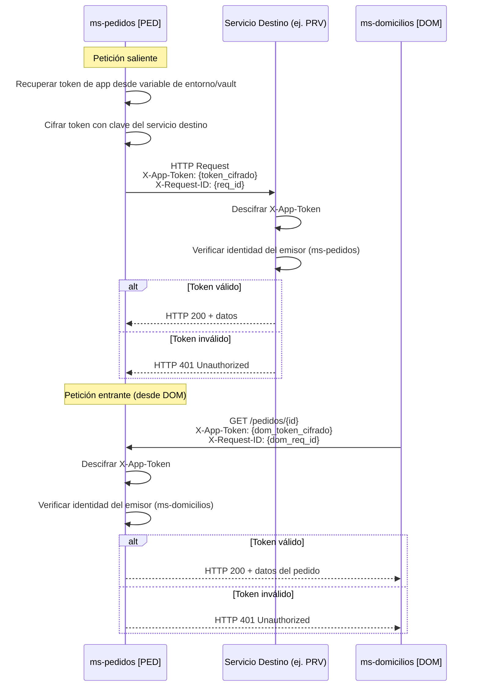
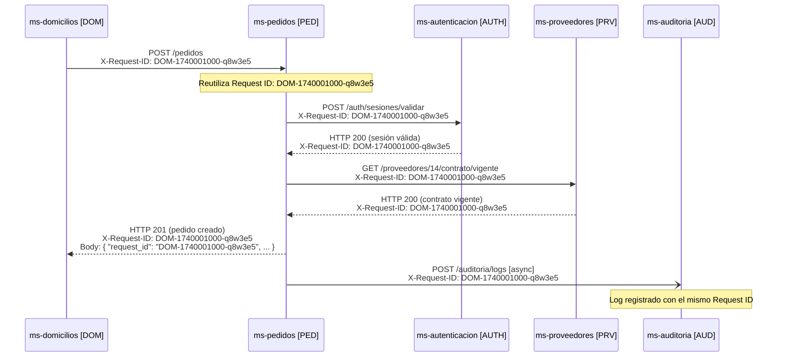
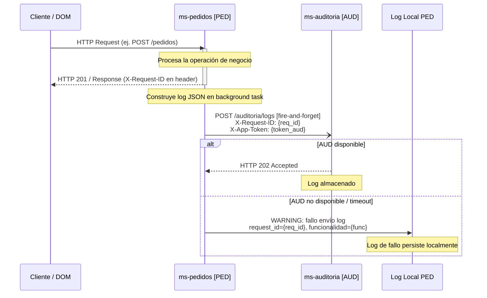
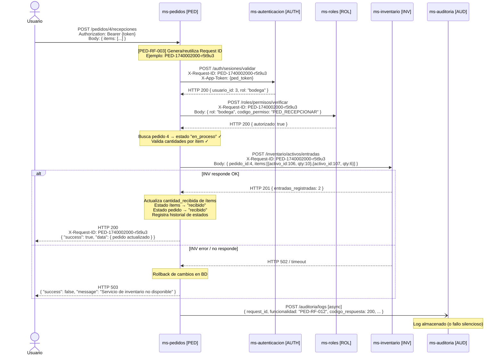
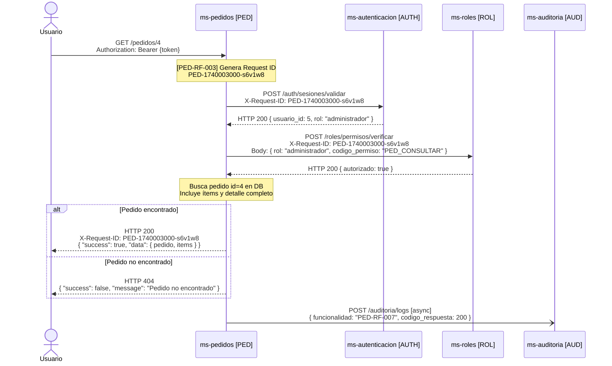
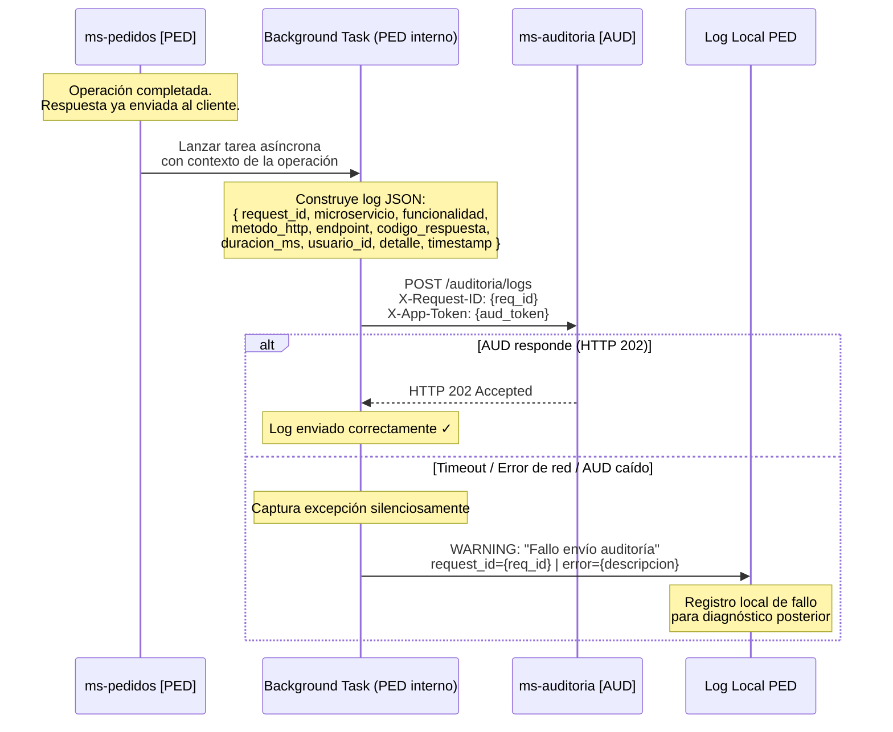

# Diseño de Integración — ms-pedidos [PED]

**Proyecto:** ERP Universitario — Universidad del Valle, Sede Caicedonia  
**Asignatura:** Desarrollo de Software III (750027C)  
**Documento:** Diseño de Integración Inter-Servicio  
**Módulo:** Módulo 4 — Logística y Proveedores  
**Fecha:** Marzo 2026  

---

## Tabla de Contenido

1. [Información General](#1-información-general)
2. [Mapa de Integraciones](#2-mapa-de-integraciones)
3. [Contratos de Comunicación Saliente](#3-contratos-de-comunicación-saliente)
4. [Contratos de Comunicación Entrante](#4-contratos-de-comunicación-entrante)
5. [Configuración de Tokens de Aplicación](#5-configuración-de-tokens-de-aplicación)
6. [Flujo de Request ID](#6-flujo-de-request-id)
7. [Flujo de Auditoría](#7-flujo-de-auditoría)
8. [Diagramas de Secuencia](#8-diagramas-de-secuencia)

---

## 1. Información General

| Campo | Detalle |
|---|---|
| **Nombre** | ms-pedidos |
| **Código** | PED |
| **Módulo** | Módulo 4 — Logística y Proveedores |
| **Stack** | FastAPI + Python + PostgreSQL |
| **Servicios con los que se integra** | 5 microservicios externos |

`ms-pedidos` gestiona el ciclo de vida completo de las órdenes de compra internas de la institución, desde la creación en borrador hasta la recepción de bienes. Para operar, el microservicio depende de manera síncrona de cinco servicios externos: `ms-autenticacion [AUTH]` para validar sesiones, `ms-roles [ROL]` para verificar permisos, `ms-proveedores [PRV]` para confirmar la vigencia de contratos, `ms-inventario [INV]` para verificar existencia de activos y registrar entradas de stock, y `ms-auditoria [AUD]` de forma asíncrona para el registro de logs. Adicionalmente, expone sus datos hacia `ms-domicilios [DOM]`, que los consume para gestionar entregas.

---

## 2. Mapa de Integraciones



**Descripción narrativa del mapa de integraciones:**

`ms-pedidos` se integra con **5 microservicios externos** en total:

- **Comunicaciones síncronas (4 servicios):** Toda operación invoca primero a `ms-autenticacion [AUTH]` para validar la sesión y luego a `ms-roles [ROL]` para verificar permisos. Estas dos dependencias son bloqueantes en el 100% de las operaciones. `ms-proveedores [PRV]` se consulta de forma síncrona al crear, actualizar o avanzar el estado de un pedido para garantizar que el proveedor tiene contrato vigente. `ms-inventario [INV]` se consulta de forma síncrona al agregar ítems (verificar existencia) y al registrar recepciones (registrar entrada de stock).

- **Comunicación asíncrona (1 servicio):** `ms-auditoria [AUD]` recibe logs de todas las operaciones de forma *fire-and-forget*, sin bloquear la respuesta al usuario.

- **Comunicación entrante (1 servicio):** `ms-domicilios [DOM]` consume datos del pedido de forma síncrona, autenticándose con token de aplicación.

- **Dependencias críticas** (sin las cuales ms-pedidos no puede operar): `ms-autenticacion [AUTH]`, `ms-roles [ROL]`, `ms-inventario [INV]` (para recepción de pedidos y gestión de ítems), `ms-proveedores [PRV]` (para creación y avance de estado).

- **Dependencias opcionales / no bloqueantes:** `ms-auditoria [AUD]` (su caída no interrumpe operaciones); `ms-domicilios [DOM]` (es consumidor externo, no afecta la operación interna de PED).

---

## 3. Contratos de Comunicación Saliente

### 3.1 Hacia ms-autenticacion [AUTH]

#### Operación: Validar Sesión Activa

| Campo | Detalle |
|---|---|
| **Servicio destino** | ms-autenticacion [AUTH] |
| **Operación** | Validar sesión activa del usuario |
| **Método HTTP** | POST |
| **Endpoint sugerido** | `/auth/sesiones/validar` |
| **Headers requeridos** | `Authorization: Bearer {token_sesion_usuario}`, `X-Request-ID: {request_id}`, `X-App-Token: {token_app_ped_cifrado}`, `Content-Type: application/json` |
| **Timeout sugerido** | 3 segundos |
| **Requisito relacionado** | PED-RF-001 |

**Request:**
```json
{
  "token": "eyJhbGciOiJIUzI1NiIsInR5cCI6IkpXVCJ9..."
}
```

**Response exitoso (HTTP 200):**
```json
{
  "request_id": "AUTH-1740000000-x9k2m1",
  "success": true,
  "data": {
    "usuario_id": 42,
    "nombre": "Carlos Pérez",
    "rol": "compras",
    "sesion_valida": true,
    "expira_en": "2026-03-15T18:00:00Z"
  },
  "message": "Sesión válida",
  "timestamp": "2026-03-02T10:00:00Z"
}
```

**Response error — sesión inválida (HTTP 401):**
```json
{
  "request_id": "AUTH-1740000000-x9k2m1",
  "success": false,
  "data": null,
  "message": "Sesión no válida o expirada",
  "timestamp": "2026-03-02T10:00:00Z"
}
```

---

### 3.2 Hacia ms-roles [ROL]

#### Operación: Verificar Permiso por Rol

| Campo | Detalle |
|---|---|
| **Servicio destino** | ms-roles [ROL] |
| **Operación** | Verificar si el rol tiene un permiso específico |
| **Método HTTP** | POST |
| **Endpoint sugerido** | `/roles/permisos/verificar` |
| **Headers requeridos** | `X-Request-ID: {request_id}`, `X-App-Token: {token_app_ped_cifrado}`, `Content-Type: application/json` |
| **Timeout sugerido** | 3 segundos |
| **Requisito relacionado** | PED-RF-002 |

**Request:**
```json
{
  "rol": "compras",
  "codigo_permiso": "PED_CREAR_PEDIDO"
}
```

**Response exitoso (HTTP 200):**
```json
{
  "request_id": "ROL-1740000001-b7d3e9",
  "success": true,
  "data": {
    "rol": "compras",
    "codigo_permiso": "PED_CREAR_PEDIDO",
    "autorizado": true
  },
  "message": "Permiso verificado",
  "timestamp": "2026-03-02T10:00:01Z"
}
```

**Response error — permiso denegado (HTTP 200 con autorizado: false):**
```json
{
  "request_id": "ROL-1740000001-b7d3e9",
  "success": true,
  "data": {
    "rol": "compras",
    "codigo_permiso": "PED_APROBAR_PEDIDO",
    "autorizado": false
  },
  "message": "El rol no tiene el permiso requerido",
  "timestamp": "2026-03-02T10:00:01Z"
}
```

---

### 3.3 Hacia ms-proveedores [PRV]

#### Operación: Validar Proveedor con Contrato Vigente

| Campo | Detalle |
|---|---|
| **Servicio destino** | ms-proveedores [PRV] |
| **Operación** | Verificar existencia del proveedor y vigencia de su contrato |
| **Método HTTP** | GET |
| **Endpoint sugerido** | `/proveedores/{proveedor_id}/contrato/vigente` |
| **Headers requeridos** | `X-Request-ID: {request_id}`, `X-App-Token: {token_app_ped_cifrado}` |
| **Timeout sugerido** | 5 segundos |
| **Requisito relacionado** | PED-RF-022, PED-RF-006, PED-RF-009, PED-RF-010 |

**Request:** *(Sin cuerpo — parámetro en URL)*

**Response exitoso (HTTP 200):**
```json
{
  "request_id": "PRV-1740000002-c4f1a8",
  "success": true,
  "data": {
    "proveedor_id": 14,
    "nombre": "Papelería El Estudiante S.A.S.",
    "contrato_vigente": true,
    "contrato_numero": "CONT-2026-014",
    "contrato_vence": "2026-12-31"
  },
  "message": "Proveedor con contrato vigente",
  "timestamp": "2026-03-02T10:00:02Z"
}
```

**Response error — proveedor sin contrato vigente (HTTP 422):**
```json
{
  "request_id": "PRV-1740000002-c4f1a8",
  "success": false,
  "data": {
    "proveedor_id": 14,
    "contrato_vigente": false
  },
  "message": "El proveedor no tiene contrato vigente",
  "timestamp": "2026-03-02T10:00:02Z"
}
```

---

### 3.4 Hacia ms-inventario [INV] — Operación A

#### Operación: Verificar Existencia de Activo

| Campo | Detalle |
|---|---|
| **Servicio destino** | ms-inventario [INV] |
| **Operación** | Verificar que un activo existe en el inventario |
| **Método HTTP** | GET |
| **Endpoint sugerido** | `/inventario/activos/{activo_id}` |
| **Headers requeridos** | `X-Request-ID: {request_id}`, `X-App-Token: {token_app_ped_cifrado}` |
| **Timeout sugerido** | 5 segundos |
| **Requisito relacionado** | PED-RF-021, PED-RF-013 |

**Request:** *(Sin cuerpo — parámetro en URL)*

**Response exitoso (HTTP 200):**
```json
{
  "request_id": "INV-1740000003-d2b9c7",
  "success": true,
  "data": {
    "activo_id": 100,
    "nombre": "Computador portátil Core i7 16GB RAM",
    "codigo": "ACT-TEC-0100",
    "existe": true
  },
  "message": "Activo encontrado",
  "timestamp": "2026-03-02T10:00:03Z"
}
```

**Response error — activo no encontrado (HTTP 404):**
```json
{
  "request_id": "INV-1740000003-d2b9c7",
  "success": false,
  "data": null,
  "message": "El activo solicitado no existe en el inventario",
  "timestamp": "2026-03-02T10:00:03Z"
}
```

---

### 3.5 Hacia ms-inventario [INV] — Operación B

#### Operación: Registrar Entrada de Stock

| Campo | Detalle |
|---|---|
| **Servicio destino** | ms-inventario [INV] |
| **Operación** | Registrar entrada de stock por recepción de pedido |
| **Método HTTP** | POST |
| **Endpoint sugerido** | `/inventario/activos/entradas` |
| **Headers requeridos** | `X-Request-ID: {request_id}`, `X-App-Token: {token_app_ped_cifrado}`, `Content-Type: application/json` |
| **Timeout sugerido** | 8 segundos |
| **Requisito relacionado** | PED-RF-021, PED-RF-012 |

**Request:**
```json
{
  "pedido_id": 4,
  "numero_pedido": "PED-2026-004",
  "items": [
    {
      "activo_id": 106,
      "cantidad_recibida": 10
    },
    {
      "activo_id": 107,
      "cantidad_recibida": 6
    }
  ]
}
```

**Response exitoso (HTTP 201):**
```json
{
  "request_id": "INV-1740000004-e3a2f6",
  "success": true,
  "data": {
    "entradas_registradas": 2,
    "items": [
      { "activo_id": 106, "cantidad_ingresada": 10, "movimiento_id": 5501 },
      { "activo_id": 107, "cantidad_ingresada": 6,  "movimiento_id": 5502 }
    ]
  },
  "message": "Entrada de stock registrada exitosamente",
  "timestamp": "2026-03-02T10:00:04Z"
}
```

**Response error — fallo al registrar (HTTP 502):**
```json
{
  "request_id": "INV-1740000004-e3a2f6",
  "success": false,
  "data": null,
  "message": "No fue posible registrar la entrada de stock para el activo 106",
  "timestamp": "2026-03-02T10:00:04Z"
}
```

---

### 3.6 Hacia ms-auditoria [AUD] — Asíncrono

#### Operación: Enviar Log de Auditoría

| Campo | Detalle |
|---|---|
| **Servicio destino** | ms-auditoria [AUD] |
| **Operación** | Ingesta de log de auditoría (fire-and-forget) |
| **Método HTTP** | POST |
| **Endpoint sugerido** | `/auditoria/logs` |
| **Headers requeridos** | `X-Request-ID: {request_id}`, `X-App-Token: {token_app_ped_cifrado}`, `Content-Type: application/json` |
| **Timeout sugerido** | 2 segundos (no bloqueante — se ignora timeout) |
| **Requisito relacionado** | PED-RF-004 |

**Request:**
```json
{
  "request_id": "PED-1740000000-a3f8b2",
  "microservicio": "ms-pedidos",
  "funcionalidad": "PED-RF-006",
  "metodo_http": "POST",
  "endpoint": "/pedidos",
  "codigo_respuesta": 201,
  "duracion_ms": 312,
  "usuario_id": 42,
  "detalle": "Pedido PED-2026-009 creado exitosamente en estado borrador para proveedor_id=14"
}
```

**Response exitoso (HTTP 202):**
```json
{
  "request_id": "AUD-1740000005-f0c4b3",
  "success": true,
  "data": { "log_id": "AUD-2026-00043211" },
  "message": "Log recibido",
  "timestamp": "2026-03-02T10:00:05Z"
}
```

**Response error — servicio no disponible (HTTP 503 / timeout):**
> *ms-pedidos no espera respuesta. Si se produce error o timeout, el fallo se registra en el log local del microservicio y la operación principal no se ve afectada.*

---

## 4. Contratos de Comunicación Entrante

### 4.1 Desde ms-domicilios [DOM]

#### Operación: Consultar Datos del Pedido para Gestión de Entrega

| Campo | Detalle |
|---|---|
| **Servicio origen** | ms-domicilios [DOM] |
| **Operación** | Obtener datos del pedido para gestionar una entrega |
| **Método HTTP** | GET |
| **Endpoint expuesto** | `/pedidos/{pedido_id}` o `/pedidos?numero={numero_pedido}` |
| **Headers requeridos** | `X-Request-ID: {request_id_de_dom}`, `X-App-Token: {token_app_dom_cifrado}`, `Content-Type: application/json` |
| **Requisito relacionado** | PED-RF-020, PED-RF-007, PED-RF-017 |

**Request:** *(Sin cuerpo — parámetros en URL. Ejemplo: `GET /pedidos/4`)*

**Response exitoso (HTTP 200):**
```json
{
  "request_id": "PED-1740000010-g1h5k7",
  "success": true,
  "data": {
    "pedido_id": 4,
    "numero_pedido": "PED-2026-004",
    "estado": "en_proceso",
    "fecha_solicitud": "2026-01-20T08:00:00Z",
    "fecha_aprobacion": "2026-01-22T09:00:00Z",
    "solicitante_id": 3,
    "proveedor_id": 12,
    "monto_total": 870000.00,
    "observaciones": "Insumos de limpieza urgentes",
    "items": [
      {
        "item_id": 7,
        "activo_id": 106,
        "descripcion": "Desinfectante multiusos 5L",
        "cantidad_solicitada": 10,
        "cantidad_recibida": 0,
        "valor_unitario": 45000.00,
        "subtotal": 450000.00,
        "estado": "pendiente"
      },
      {
        "item_id": 8,
        "activo_id": 107,
        "descripcion": "Escobas industriales",
        "cantidad_solicitada": 6,
        "cantidad_recibida": 0,
        "valor_unitario": 70000.00,
        "subtotal": 420000.00,
        "estado": "pendiente"
      }
    ]
  },
  "message": "Pedido encontrado",
  "timestamp": "2026-03-02T10:00:10Z"
}
```

**Response error — token inválido (HTTP 401):**
```json
{
  "request_id": "PED-1740000010-g1h5k7",
  "success": false,
  "data": null,
  "message": "Token de aplicación inválido o no autorizado",
  "timestamp": "2026-03-02T10:00:10Z"
}
```

**Response error — pedido no encontrado (HTTP 404):**
```json
{
  "request_id": "PED-1740000010-g1h5k7",
  "success": false,
  "data": null,
  "message": "Pedido no encontrado",
  "timestamp": "2026-03-02T10:00:10Z"
}
```

---

## 5. Configuración de Tokens de Aplicación

### 5.1 Token propio del microservicio

| Campo | Detalle |
|---|---|
| **Nombre** | `PED_APP_TOKEN` |
| **Descripción** | Token de identidad de `ms-pedidos` usado para autenticarse ante otros microservicios del sistema ERP |
| **Formato de almacenamiento** | Variable de entorno cifrada en el servidor / secreto gestionado por bóveda de secretos (ej. HashiCorp Vault, AWS Secrets Manager) — [Por definir según infraestructura] |

### 5.2 Tokens de otros servicios que ms-pedidos necesita

| Servicio | Nombre del secreto | Propósito | Uso en header |
|---|---|---|---|
| ms-autenticacion [AUTH] | `AUTH_APP_TOKEN` | Identificar a PED ante AUTH al validar sesiones | `X-App-Token: {AUTH_APP_TOKEN_cifrado}` |
| ms-roles [ROL] | `ROL_APP_TOKEN` | Identificar a PED ante ROL al verificar permisos | `X-App-Token: {ROL_APP_TOKEN_cifrado}` |
| ms-proveedores [PRV] | `PRV_APP_TOKEN` | Identificar a PED ante PRV al consultar contratos | `X-App-Token: {PRV_APP_TOKEN_cifrado}` |
| ms-inventario [INV] | `INV_APP_TOKEN` | Identificar a PED ante INV al verificar activos y registrar entradas | `X-App-Token: {INV_APP_TOKEN_cifrado}` |
| ms-auditoria [AUD] | `AUD_APP_TOKEN` | Identificar a PED ante AUD al enviar logs | `X-App-Token: {AUD_APP_TOKEN_cifrado}` |

> El token que ms-domicilios [DOM] usa para llamar a PED es el `DOM_APP_TOKEN`, que PED debe conocer y validar en las peticiones entrantes de DOM.

### 5.3 Formato de transmisión del token en las peticiones

Todos los tokens de aplicación se transmiten en el header HTTP `X-App-Token`. El valor es el token cifrado en Base64 usando el algoritmo acordado entre servicios. La estructura es:

```
X-App-Token: {token_cifrado_base64}
```

El cifrado se realiza con la clave pública del servicio destino (cifrado asimétrico) o con un secreto compartido HMAC, según decisión de arquitectura — [Por definir].

### 5.4 Flujo de validación de token entre servicios



**Descripción narrativa:** En una petición **saliente**, `ms-pedidos` recupera el token del servicio destino desde su almacén de secretos, lo cifra con la clave acordada y lo incluye en el header `X-App-Token`. El servicio receptor descifra el token, verifica que el emisor es `ms-pedidos` y, si es válido, procesa la solicitud; en caso contrario devuelve HTTP 401. En una petición **entrante** de `ms-domicilios`, el flujo es inverso: `ms-pedidos` actúa como receptor, descifra el `X-App-Token` que DOM envía y verifica que corresponde a la identidad autorizada de DOM antes de retornar los datos del pedido.

---

## 6. Flujo de Request ID

### 6.1 Formato del Request ID generado por ms-pedidos

```
PED-{timestamp_unix}-{id_corto_aleatorio}
```

**Ejemplo:** `PED-1740000000-a3f8b2`

- `PED`: Prefijo fijo del microservicio.
- `{timestamp_unix}`: Timestamp Unix en segundos al momento de recibir la petición.
- `{id_corto_aleatorio}`: 6 caracteres alfanuméricos aleatorios para unicidad dentro del mismo segundo.

### 6.2 Reglas de generación y reutilización

| Regla | Descripción |
|---|---|
| **Generar nuevo** | Si la petición entrante NO trae header `X-Request-ID`, ms-pedidos genera uno nuevo con el prefijo `PED`. |
| **Reutilizar** | Si la petición entrante YA trae un `X-Request-ID` (ej. `DOM-1740000005-z9x2y1`), ms-pedidos lo reutiliza íntegramente sin modificarlo. |
| **Formato irreconocible** | Si el Request ID recibido no sigue un formato reconocible, ms-pedidos genera uno nuevo con prefijo `PED`. |
| **Propagación saliente** | Toda llamada saliente a otros servicios incluye el Request ID activo en el header `X-Request-ID`. |
| **Inclusión en respuesta** | El Request ID se incluye en el header de respuesta `X-Request-ID` y en el campo `request_id` del cuerpo JSON. |

### 6.3 Diagrama de propagación del Request ID



**Descripción narrativa:** El Request ID se genera (o reutiliza) como **primer paso** de cada operación, antes de cualquier otra lógica. Cuando `ms-domicilios` llama a `ms-pedidos` incluyendo su propio Request ID (`DOM-1740001000-q8w3e5`), `ms-pedidos` lo reutiliza y lo propaga sin modificación hacia todos los servicios que invoca en esa misma cadena (`ms-autenticacion`, `ms-proveedores`, `ms-auditoria`). Si la petición llega directamente desde un cliente HTTP sin Request ID previo, `ms-pedidos` genera uno nuevo con prefijo `PED`. El Request ID se incluye tanto en la cabecera `X-Request-ID` de la respuesta como en el campo `request_id` del cuerpo JSON, permitiendo a cualquier sistema trazabilidad end-to-end de la operación completa a través de todos los servicios participantes.

---

## 7. Flujo de Auditoría

### 7.1 Estructura del log JSON

```json
{
  "request_id": "PED-1740000000-a3f8b2",
  "microservicio": "ms-pedidos",
  "funcionalidad": "PED-RF-012",
  "metodo_http": "POST",
  "endpoint": "/pedidos/4/recepciones",
  "codigo_respuesta": 200,
  "duracion_ms": 487,
  "usuario_id": 3,
  "detalle": "Recepción parcial registrada para pedido PED-2026-004. Ítems recibidos: activo_id=106 (qty=10), activo_id=107 (qty=6). Estado pedido actualizado a 'recibido'.",
  "timestamp": "2026-03-02T10:00:04.487Z"
}
```

| Campo | Tipo | Descripción |
|---|---|---|
| `request_id` | string | Request ID de la operación (propagado o generado por PED) |
| `microservicio` | string | Siempre `"ms-pedidos"` |
| `funcionalidad` | string | Código del requisito funcional ejecutado (ej. `"PED-RF-006"`) |
| `metodo_http` | string | Método HTTP de la petición entrante (GET, POST, PUT, DELETE) |
| `endpoint` | string | Endpoint invocado por el cliente o servicio consumidor |
| `codigo_respuesta` | integer | Código HTTP de la respuesta emitida por ms-pedidos |
| `duracion_ms` | integer | Duración total de la operación en milisegundos |
| `usuario_id` | integer | ID del usuario autenticado que ejecutó la operación |
| `detalle` | string | Descripción narrativa del resultado de la operación |
| `timestamp` | string | Fecha y hora ISO 8601 con precisión de milisegundos |

### 7.2 Momento de generación

El log se construye **después** de que la respuesta ha sido emitida al cliente (o en paralelo mediante una tarea asíncrona en background), garantizando que el campo `codigo_respuesta` y `duracion_ms` reflejen el resultado real de la operación. El log se genera tanto para operaciones exitosas como para fallos controlados.

### 7.3 Comportamiento ante fallos del servicio de auditoría

Si el envío a `ms-auditoria [AUD]` falla por cualquier causa (timeout, error de red, servicio caído):

1. `ms-pedidos` captura el error de forma silenciosa.
2. El fallo se registra en el **log local** del microservicio (archivo de log o sistema de logging de la aplicación) con nivel `WARNING`.
3. La operación principal **no se ve afectada** ni se reintenta la operación de negocio.
4. [Por definir] si se implementa un mecanismo de reintento (retry queue) o cola persistente para garantizar entrega eventual del log.

### 7.4 Diagrama del flujo asíncrono de auditoría



**Descripción narrativa:** Una vez que `ms-pedidos` completa la operación de negocio y **emite la respuesta al cliente**, lanza de forma asíncrona (background task) la construcción y envío del log a `ms-auditoria`. Este proceso no bloquea ni retrasa la respuesta. El log incluye todos los campos de contexto acumulados durante la ejecución: Request ID, usuario, funcionalidad, código de respuesta y duración. Si `ms-auditoria` no responde o devuelve error, `ms-pedidos` captura la excepción silenciosamente, escribe un registro de advertencia en su log local y continúa operando con normalidad. La respuesta al usuario ya fue enviada en ese momento y no puede verse afectada.

---

## 8. Diagramas de Secuencia

### 8.1 Flujo más complejo: Registrar Recepción de Pedido (PED-RF-012)

> Este flujo es el más complejo porque involucra validación de sesión (AUTH), verificación de permisos (ROL), operación de escritura en INV con posible rollback, y auditoría asíncrona.



**Descripción narrativa:** El usuario envía la recepción de ítems de un pedido. `ms-pedidos` primero genera el Request ID y lo propaga en toda la cadena. Valida la sesión ante AUTH y los permisos ante ROL. Si ambas validaciones son exitosas, verifica que el pedido existe y está en estado válido (`en_proceso` o `recibido_parcial`), y que las cantidades no superan las pendientes. Luego invoca a INV para registrar la entrada de stock; si INV responde correctamente, actualiza el estado de los ítems y del pedido, registra en el historial y responde HTTP 200. Si INV falla, realiza rollback y responde HTTP 503. En cualquier caso, envía el log de auditoría de forma asíncrona al finalizar.

---

### 8.2 Flujo de consulta típica: Consultar Pedido por ID (PED-RF-007)



**Descripción narrativa:** Es el flujo de lectura más frecuente del sistema. El usuario envía `GET /pedidos/{id}` con su token de sesión. `ms-pedidos` genera el Request ID, valida la sesión con AUTH y verifica el permiso de consulta con ROL. Ambas validaciones son síncronas y bloqueantes. Si el usuario está autorizado, ms-pedidos consulta la base de datos local, construye la respuesta con el pedido y sus ítems, y retorna HTTP 200. Si el pedido no existe, responde HTTP 404. No interviene ningún microservicio adicional en este flujo. Al finalizar, el log se envía asincrónamente a AUD.

---

### 8.3 Flujo de auditoría asíncrona



**Descripción narrativa:** Tras emitir la respuesta al cliente, `ms-pedidos` delega el envío del log a una tarea en background (BackgroundTask en FastAPI, tarea Celery, o similar — mecanismo [Por definir]). Esta tarea construye el objeto JSON del log con toda la información del contexto de la operación y realiza un `POST` a `/auditoria/logs` con un timeout corto. Si `ms-auditoria` acepta el log (HTTP 202), el proceso termina exitosamente. Si la llamada falla por cualquier razón (timeout, error 5xx, red caída), la tarea captura la excepción, escribe un registro de nivel WARNING en el log local de `ms-pedidos` con el Request ID y el motivo del fallo, y finaliza sin propagación del error. En ningún caso este fallo afecta el funcionamiento del microservicio ni la experiencia del usuario.

---

*Documento generado para: ms-pedidos [PED] — ERP Universitario, Universidad del Valle Sede Caicedonia — Marzo 2026.*
