# Especificación de API REST — ms-pedidos [PED]

**Proyecto:** ERP Universitario — Universidad del Valle, Sede Caicedonia  
**Asignatura:** Desarrollo de Software III (750027C)  
**Documento:** Especificación Completa de API REST  
**Módulo:** Módulo 4 — Logística y Proveedores  
**Stack:** FastAPI + Python + PostgreSQL  
**Fecha:** Marzo 2026  

---

## Tabla de Contenido

1. [Información General](#1-información-general)
2. [Diagrama de Casos de Uso](#2-diagrama-de-casos-de-uso)
3. [Catálogo de Endpoints](#3-catálogo-de-endpoints)
4. [Especificación de Endpoints](#4-especificación-de-endpoints)
5. [Diagramas de Secuencia Internos](#5-diagramas-de-secuencia-internos)

---

## 1. Información General

| Campo | Detalle |
|---|---|
| **Nombre** | ms-pedidos |
| **Código** | PED |
| **Módulo** | Módulo 4 — Logística y Proveedores |
| **Base URL sugerida** | `http://ms-pedidos/api/v1` |
| **Base de datos** | `db_pedidos` (PostgreSQL) |
| **Total de endpoints** | 13 |

`ms-pedidos` expone una API REST para gestionar el ciclo de vida completo de las órdenes de compra internas de la institución, desde la creación en borrador hasta la recepción total o parcial de bienes. La API cubre operaciones sobre tres recursos principales: **pedidos**, **ítems de pedido** e **historial de estados**. Todos los endpoints requieren autenticación mediante token de sesión y verificación de permisos por rol, y todas las respuestas siguen una estructura estándar uniforme con los campos `request_id`, `success`, `data`, `message` y `timestamp`.

---

## 2. Diagrama de Casos de Uso

```mermaid
graph TD
    subgraph Actores
        UA["👤 Usuario Autenticado\n(compras / bodega / administrador)"]
        DOM["🔧 ms-domicilios [DOM]"]
    end

    subgraph PED["ms-pedidos — Casos de Uso"]

        subgraph G_PED["Gestión de Pedidos"]
            UC01["Crear Pedido\nPED-RF-006"]
            UC02["Consultar Pedido por ID\nPED-RF-007"]
            UC03["Consultar Pedido por Número\nPED-RF-017"]
            UC04["Listar Pedidos\nPED-RF-008"]
            UC05["Actualizar Pedido en Borrador\nPED-RF-009"]
            UC06["Avanzar Estado del Pedido\nPED-RF-010"]
            UC07["Cancelar Pedido\nPED-RF-011"]
            UC08["Registrar Recepción de Pedido\nPED-RF-012"]
        end

        subgraph G_ITEM["Gestión de Ítems"]
            UC09["Agregar Ítem a Pedido\nPED-RF-013"]
            UC10["Listar Ítems de un Pedido\nPED-RF-018"]
            UC11["Actualizar Ítem de Pedido\nPED-RF-014"]
            UC12["Remover Ítem de Pedido\nPED-RF-015"]
        end

        subgraph G_HIST["Historial de Estados"]
            UC13["Consultar Historial de Estados\nPED-RF-016"]
        end
    end

    UA --> UC01
    UA --> UC02
    UA --> UC03
    UA --> UC04
    UA --> UC05
    UA --> UC06
    UA --> UC07
    UA --> UC08
    UA --> UC09
    UA --> UC10
    UA --> UC11
    UA --> UC12
    UA --> UC13

    DOM --> UC02
    DOM --> UC03
```

### Descripción Narrativa de Casos de Uso

**UC01 — Crear Pedido (PED-RF-006)**
*Actor:* Usuario con rol de compras o administrador. *Objetivo:* Registrar una nueva orden de compra en estado borrador, asociándola a un proveedor con contrato vigente. *Flujo principal:* El usuario envía los datos del pedido (proveedor, observaciones); el sistema valida la sesión, verifica permisos, confirma con ms-proveedores que el contrato está vigente, genera el número de pedido y persiste el registro con estado `borrador`. *Resultado:* Pedido creado y disponible para agregar ítems.

**UC02 — Consultar Pedido por ID (PED-RF-007)**
*Actor:* Usuario autenticado o ms-domicilios [DOM]. *Objetivo:* Obtener el detalle completo de un pedido específico usando su ID interno. *Flujo principal:* El solicitante envía el ID; el sistema valida credenciales y retorna todos los atributos del pedido junto con sus ítems. *Resultado:* Detalle completo del pedido o HTTP 404 si no existe.

**UC03 — Consultar Pedido por Número de Pedido (PED-RF-017)**
*Actor:* Usuario autenticado o ms-domicilios [DOM]. *Objetivo:* Localizar un pedido usando su número de negocio visible (ej. `PED-2026-001`) en lugar del ID interno. *Flujo principal:* El solicitante envía el número como query parameter; el sistema busca por ese campo único y retorna el detalle. *Resultado:* Detalle completo del pedido o HTTP 404.

**UC04 — Listar Pedidos (PED-RF-008)**
*Actor:* Usuario autenticado. *Objetivo:* Obtener un listado paginado y filtrado de pedidos. *Flujo principal:* El usuario envía filtros opcionales (estado, proveedor, solicitante, rango de fechas); el sistema aplica los filtros y retorna la página solicitada. *Resultado:* Lista paginada de pedidos que cumplen los criterios.

**UC05 — Actualizar Pedido en Borrador (PED-RF-009)**
*Actor:* Usuario con permiso de actualización. *Objetivo:* Modificar el proveedor u observaciones de un pedido que aún está en estado `borrador`. *Flujo principal:* El usuario envía los campos a actualizar; el sistema verifica que el pedido está en borrador, valida el nuevo proveedor si fue cambiado y persiste los cambios. *Resultado:* Pedido actualizado con `fecha_actualizacion` renovada.

**UC06 — Avanzar Estado del Pedido (PED-RF-010)**
*Actor:* Usuario con permiso de cambio de estado. *Objetivo:* Mover el pedido al siguiente estado del flujo secuencial (`borrador → enviado → aprobado → en_proceso → recibido`). *Flujo principal:* El usuario envía un comentario obligatorio; el sistema determina el estado siguiente, valida el contrato del proveedor cuando aplica, actualiza el estado y registra la transición en el historial. *Resultado:* Pedido en el nuevo estado con entrada en el historial.

**UC07 — Cancelar Pedido (PED-RF-011)**
*Actor:* Usuario con permiso de cancelación. *Objetivo:* Cancelar un pedido en cualquier estado previo a `recibido`, registrando el motivo. *Flujo principal:* El usuario envía el motivo de cancelación obligatorio; el sistema verifica que el pedido no está en estado terminal y registra la transición a `cancelado` en el historial. *Resultado:* Pedido en estado `cancelado` con motivo registrado.

**UC08 — Registrar Recepción de Pedido (PED-RF-012)**
*Actor:* Usuario con permiso de recepción (rol bodega). *Objetivo:* Registrar la entrada de uno o más ítems del pedido, actualizando cantidades, estados e inventario. *Flujo principal:* El usuario envía las cantidades recibidas por ítem; el sistema valida que no superan las pendientes, notifica la entrada de stock a ms-inventario, actualiza el estado de cada ítem y determina si el pedido queda `recibido` o `recibido_parcial`. *Resultado:* Cantidades actualizadas, estado del pedido ajustado, stock registrado en INV.

**UC09 — Agregar Ítem a Pedido (PED-RF-013)**
*Actor:* Usuario con permiso de gestión de ítems. *Objetivo:* Añadir una línea de detalle (activo + cantidad + valor) a un pedido en borrador. *Flujo principal:* El usuario envía los datos del ítem; el sistema verifica que el pedido está en borrador, valida la existencia del activo en ms-inventario, crea el ítem y recalcula el monto total. *Resultado:* Ítem registrado con estado `pendiente` y monto total actualizado.

**UC10 — Listar Ítems de un Pedido (PED-RF-018)**
*Actor:* Usuario autenticado. *Objetivo:* Obtener todos los ítems de un pedido específico. *Flujo principal:* El usuario envía el ID del pedido; el sistema verifica su existencia y retorna la lista de ítems con sus cantidades, subtotales y estados. *Resultado:* Lista de ítems del pedido.

**UC11 — Actualizar Ítem de Pedido (PED-RF-014)**
*Actor:* Usuario con permiso de gestión de ítems. *Objetivo:* Modificar descripción, cantidad solicitada o valor unitario de un ítem en un pedido borrador. *Flujo principal:* El usuario envía los campos a cambiar; el sistema verifica el estado del pedido, aplica los cambios, recalcula el subtotal del ítem y actualiza el monto total del pedido. *Resultado:* Ítem y monto total actualizados.

**UC12 — Remover Ítem de Pedido (PED-RF-015)**
*Actor:* Usuario con permiso de gestión de ítems. *Objetivo:* Eliminar una línea de ítem de un pedido en borrador. *Flujo principal:* El usuario envía el ID del pedido y del ítem; el sistema verifica el estado borrador, elimina el ítem y recalcula el monto total. *Resultado:* Ítem eliminado y monto total recalculado.

**UC13 — Consultar Historial de Estados (PED-RF-016)**
*Actor:* Usuario autenticado. *Objetivo:* Obtener el registro cronológico completo de todas las transiciones de estado de un pedido. *Flujo principal:* El usuario envía el ID del pedido; el sistema verifica su existencia y retorna todas las entradas del historial ordenadas por fecha ascendente. *Resultado:* Lista completa de cambios de estado con actor, fecha y comentario.

---

## 3. Catálogo de Endpoints

### Recurso: Pedidos

| Método | Endpoint | Descripción | Requisito |
|---|---|---|---|
| `POST` | `/api/v1/pedidos` | Crear un nuevo pedido en estado borrador | PED-RF-006 |
| `GET` | `/api/v1/pedidos` | Listar pedidos con filtros y paginación | PED-RF-008 |
| `GET` | `/api/v1/pedidos/{pedido_id}` | Consultar el detalle completo de un pedido por ID | PED-RF-007 / PED-RF-020 |
| `PUT` | `/api/v1/pedidos/{pedido_id}` | Actualizar datos generales de un pedido en borrador | PED-RF-009 |
| `POST` | `/api/v1/pedidos/{pedido_id}/avanzar-estado` | Avanzar el estado del pedido al siguiente del flujo | PED-RF-010 |
| `POST` | `/api/v1/pedidos/{pedido_id}/cancelar` | Cancelar un pedido registrando el motivo | PED-RF-011 |
| `POST` | `/api/v1/pedidos/{pedido_id}/recepciones` | Registrar recepción total o parcial de ítems | PED-RF-012 |

### Recurso: Ítems de Pedido

| Método | Endpoint | Descripción | Requisito |
|---|---|---|---|
| `POST` | `/api/v1/pedidos/{pedido_id}/items` | Agregar un ítem a un pedido en borrador | PED-RF-013 |
| `GET` | `/api/v1/pedidos/{pedido_id}/items` | Listar todos los ítems de un pedido | PED-RF-018 |
| `PUT` | `/api/v1/pedidos/{pedido_id}/items/{item_id}` | Actualizar datos de un ítem en pedido borrador | PED-RF-014 |
| `DELETE` | `/api/v1/pedidos/{pedido_id}/items/{item_id}` | Remover un ítem de un pedido en borrador | PED-RF-015 |

### Recurso: Historial de Estados

| Método | Endpoint | Descripción | Requisito |
|---|---|---|---|
| `GET` | `/api/v1/pedidos/{pedido_id}/historial` | Consultar historial de cambios de estado de un pedido | PED-RF-016 |

### Recurso: Búsqueda por Número de Pedido

| Método | Endpoint | Descripción | Requisito |
|---|---|---|---|
| `GET` | `/api/v1/pedidos?numero_pedido={numero}` | Buscar un pedido por su número de negocio | PED-RF-017 |

> **Nota:** La búsqueda por número de pedido se implementa como query parameter en el endpoint de listado `GET /api/v1/pedidos`. Cuando se envía el parámetro `numero_pedido`, el sistema retorna el pedido exacto que coincida con ese valor único.

---

## 4. Especificación de Endpoints

> **Cabeceras comunes requeridas en TODOS los endpoints:**
>
> | Header | Descripción |
> |---|---|
> | `Authorization: Bearer {token_sesion}` | Token de sesión del usuario autenticado (requerido en peticiones de usuario) |
> | `X-App-Token: {token_app_cifrado}` | Token de aplicación cifrado (requerido en peticiones servicio-a-servicio desde ms-domicilios) |
> | `X-Request-ID: {request_id}` | Opcional entrante. Si no se envía, ms-pedidos genera uno nuevo con prefijo `PED-`. |
> | `Content-Type: application/json` | Requerido en métodos POST y PUT |
>
> **Cabeceras comunes en TODAS las respuestas:**
>
> | Header | Descripción |
> |---|---|
> | `X-Request-ID: {request_id}` | Request ID de la operación (generado o reutilizado) |

---

### 4.1 `POST /api/v1/pedidos` — Crear Pedido

| Campo | Detalle |
|---|---|
| **Método** | `POST` |
| **Endpoint** | `/api/v1/pedidos` |
| **Descripción** | Crea un nuevo pedido en estado `borrador`, validando que el proveedor asignado existe y tiene contrato vigente en ms-proveedores. El monto total se inicializa en 0. |
| **Requisito** | PED-RF-006 |
| **Autenticación** | `Authorization: Bearer {token_sesion}`, `X-Request-ID` (opcional), `Content-Type: application/json` |
| **Path params** | — |
| **Query params** | — |
| **Códigos HTTP** | `201 Created` — Pedido creado exitosamente |
| | `401 Unauthorized` — Sesión inválida o expirada |
| | `403 Forbidden` — Permisos insuficientes |
| | `422 Unprocessable Entity` — Proveedor no existe o sin contrato vigente |
| | `500 Internal Server Error` — Error de base de datos |
| | `503 Service Unavailable` — ms-proveedores o ms-autenticacion no disponible |

**Request body:**
```json
{
  "proveedor_id": 10,
  "observaciones": "Pedido en elaboración para equipos de cómputo — laboratorio sistemas"
}
```

**Response exitoso (HTTP 201):**
```json
{
  "request_id": "PED-1740000100-a3f8b2",
  "success": true,
  "data": {
    "id": 9,
    "numero_pedido": "PED-2026-009",
    "solicitante_id": 1,
    "proveedor_id": 10,
    "estado": "borrador",
    "fecha_solicitud": "2026-03-02T10:00:00Z",
    "fecha_aprobacion": null,
    "fecha_recepcion": null,
    "monto_total": 0.00,
    "observaciones": "Pedido en elaboración para equipos de cómputo — laboratorio sistemas",
    "created_at": "2026-03-02T10:00:00Z",
    "updated_at": "2026-03-02T10:00:00Z"
  },
  "message": "Pedido PED-2026-009 creado exitosamente en estado borrador",
  "timestamp": "2026-03-02T10:00:00Z"
}
```

**Response error — proveedor sin contrato vigente (HTTP 422):**
```json
{
  "request_id": "PED-1740000100-a3f8b2",
  "success": false,
  "data": null,
  "message": "El proveedor asignado no tiene contrato vigente",
  "timestamp": "2026-03-02T10:00:00Z"
}
```

---

### 4.2 `GET /api/v1/pedidos` — Listar Pedidos

| Campo | Detalle |
|---|---|
| **Método** | `GET` |
| **Endpoint** | `/api/v1/pedidos` |
| **Descripción** | Retorna un listado paginado de pedidos, con soporte para filtros opcionales por estado, proveedor, solicitante, número de pedido y rango de fechas. |
| **Requisito** | PED-RF-008, PED-RF-017 |
| **Autenticación** | `Authorization: Bearer {token_sesion}`, `X-Request-ID` (opcional) |
| **Path params** | — |
| **Query params** | `estado` — Filtro por estado del pedido (`borrador`, `enviado`, `aprobado`, `en_proceso`, `recibido_parcial`, `recibido`, `cancelado`) |
| | `proveedor_id` — Filtro por ID del proveedor |
| | `solicitante_id` — Filtro por ID del usuario solicitante |
| | `fecha_desde` — Fecha de solicitud mínima (ISO 8601, ej. `2026-01-01`) |
| | `fecha_hasta` — Fecha de solicitud máxima (ISO 8601, ej. `2026-03-31`) |
| | `numero_pedido` — Buscar por número exacto de pedido (ej. `PED-2026-001`) |
| | `page` — Número de página (default: `1`) |
| | `page_size` — Tamaño de página (default: `20`, máximo: `100`) |
| **Códigos HTTP** | `200 OK` — Lista retornada (puede ser vacía si no hay coincidencias) |
| | `401 Unauthorized` — Sesión inválida |
| | `403 Forbidden` — Permisos insuficientes |
| | `500 Internal Server Error` — Error de base de datos |
| | `503 Service Unavailable` — ms-autenticacion no disponible |

**Response exitoso (HTTP 200):**
```json
{
  "request_id": "PED-1740000200-b4g9c3",
  "success": true,
  "data": {
    "items": [
      {
        "id": 1,
        "numero_pedido": "PED-2026-001",
        "solicitante_id": 1,
        "proveedor_id": 10,
        "estado": "borrador",
        "fecha_solicitud": "2026-02-01T08:00:00Z",
        "fecha_aprobacion": null,
        "fecha_recepcion": null,
        "monto_total": 0.00,
        "observaciones": "Pedido en elaboración para equipos de cómputo",
        "created_at": "2026-02-01T08:00:00Z",
        "updated_at": "2026-02-01T08:00:00Z"
      },
      {
        "id": 2,
        "numero_pedido": "PED-2026-002",
        "solicitante_id": 2,
        "proveedor_id": 11,
        "estado": "enviado",
        "fecha_solicitud": "2026-02-03T09:30:00Z",
        "fecha_aprobacion": null,
        "fecha_recepcion": null,
        "monto_total": 1500000.00,
        "observaciones": "Material de oficina para semestre 2026-1",
        "created_at": "2026-02-03T09:30:00Z",
        "updated_at": "2026-02-05T10:00:00Z"
      }
    ],
    "pagination": {
      "page": 1,
      "page_size": 20,
      "total_items": 8,
      "total_pages": 1
    }
  },
  "message": "Listado de pedidos obtenido exitosamente",
  "timestamp": "2026-03-02T10:05:00Z"
}
```

**Response error — sesión inválida (HTTP 401):**
```json
{
  "request_id": "PED-1740000200-b4g9c3",
  "success": false,
  "data": null,
  "message": "Sesión no válida o expirada",
  "timestamp": "2026-03-02T10:05:00Z"
}
```

---

### 4.3 `GET /api/v1/pedidos/{pedido_id}` — Consultar Pedido por ID

| Campo | Detalle |
|---|---|
| **Método** | `GET` |
| **Endpoint** | `/api/v1/pedidos/{pedido_id}` |
| **Descripción** | Retorna el detalle completo de un pedido específico junto con todos sus ítems asociados. También es consumido por ms-domicilios [DOM] usando token de aplicación. |
| **Requisito** | PED-RF-007, PED-RF-020 |
| **Autenticación** | `Authorization: Bearer {token_sesion}` (usuarios) o `X-App-Token: {dom_token_cifrado}` (ms-domicilios), `X-Request-ID` (opcional) |
| **Path params** | `pedido_id` — ID interno del pedido (`BIGINT`, requerido) |
| **Query params** | — |
| **Códigos HTTP** | `200 OK` — Pedido encontrado y retornado |
| | `401 Unauthorized` — Sesión inválida o token de aplicación inválido |
| | `403 Forbidden` — Permisos insuficientes |
| | `404 Not Found` — Pedido no encontrado |
| | `500 Internal Server Error` — Error de base de datos |
| | `503 Service Unavailable` — ms-autenticacion no disponible |

**Response exitoso (HTTP 200):**
```json
{
  "request_id": "PED-1740000300-c5h1d4",
  "success": true,
  "data": {
    "id": 4,
    "numero_pedido": "PED-2026-004",
    "solicitante_id": 3,
    "proveedor_id": 10,
    "estado": "en_proceso",
    "fecha_solicitud": "2026-01-20T08:00:00Z",
    "fecha_aprobacion": "2026-01-22T09:00:00Z",
    "fecha_recepcion": null,
    "monto_total": 870000.00,
    "observaciones": "Suministros de limpieza para mantenimiento",
    "created_at": "2026-01-20T08:00:00Z",
    "updated_at": "2026-01-25T11:00:00Z",
    "items": [
      {
        "id": 7,
        "activo_id": 106,
        "descripcion": "Desinfectante multiusos 5L",
        "cantidad_solicitada": 10.00,
        "cantidad_recibida": 0.00,
        "valor_unitario": 45000.00,
        "subtotal": 450000.00,
        "estado": "pendiente",
        "created_at": "2026-01-20T08:10:00Z",
        "updated_at": "2026-01-20T08:10:00Z"
      },
      {
        "id": 8,
        "activo_id": 107,
        "descripcion": "Escobas industriales",
        "cantidad_solicitada": 6.00,
        "cantidad_recibida": 0.00,
        "valor_unitario": 70000.00,
        "subtotal": 420000.00,
        "estado": "pendiente",
        "created_at": "2026-01-20T08:15:00Z",
        "updated_at": "2026-01-20T08:15:00Z"
      }
    ]
  },
  "message": "Pedido encontrado",
  "timestamp": "2026-03-02T10:10:00Z"
}
```

**Response error — pedido no encontrado (HTTP 404):**
```json
{
  "request_id": "PED-1740000300-c5h1d4",
  "success": false,
  "data": null,
  "message": "Pedido no encontrado",
  "timestamp": "2026-03-02T10:10:00Z"
}
```

---

### 4.4 `PUT /api/v1/pedidos/{pedido_id}` — Actualizar Pedido en Borrador

| Campo | Detalle |
|---|---|
| **Método** | `PUT` |
| **Endpoint** | `/api/v1/pedidos/{pedido_id}` |
| **Descripción** | Modifica los datos generales (proveedor y/u observaciones) de un pedido que se encuentra en estado `borrador`. No permite cambiar el estado, número de pedido ni solicitante. |
| **Requisito** | PED-RF-009 |
| **Autenticación** | `Authorization: Bearer {token_sesion}`, `X-Request-ID` (opcional), `Content-Type: application/json` |
| **Path params** | `pedido_id` — ID interno del pedido (`BIGINT`, requerido) |
| **Query params** | — |
| **Códigos HTTP** | `200 OK` — Pedido actualizado exitosamente |
| | `401 Unauthorized` — Sesión inválida |
| | `403 Forbidden` — Permisos insuficientes |
| | `404 Not Found` — Pedido no encontrado |
| | `422 Unprocessable Entity` — Pedido no está en borrador, o nuevo proveedor sin contrato vigente |
| | `500 Internal Server Error` — Error de base de datos |
| | `503 Service Unavailable` — ms-proveedores o ms-autenticacion no disponible |

**Request body:**
```json
{
  "proveedor_id": 12,
  "observaciones": "Cambio de proveedor a Muebles y Diseño SAS por mejor cotización"
}
```

**Response exitoso (HTTP 200):**
```json
{
  "request_id": "PED-1740000400-d6i2e5",
  "success": true,
  "data": {
    "id": 1,
    "numero_pedido": "PED-2026-001",
    "solicitante_id": 1,
    "proveedor_id": 12,
    "estado": "borrador",
    "fecha_solicitud": "2026-02-01T08:00:00Z",
    "fecha_aprobacion": null,
    "fecha_recepcion": null,
    "monto_total": 7425000.00,
    "observaciones": "Cambio de proveedor a Muebles y Diseño SAS por mejor cotización",
    "created_at": "2026-02-01T08:00:00Z",
    "updated_at": "2026-03-02T10:15:00Z"
  },
  "message": "Pedido PED-2026-001 actualizado exitosamente",
  "timestamp": "2026-03-02T10:15:00Z"
}
```

**Response error — pedido no está en borrador (HTTP 422):**
```json
{
  "request_id": "PED-1740000400-d6i2e5",
  "success": false,
  "data": null,
  "message": "Solo se pueden modificar pedidos en estado borrador",
  "timestamp": "2026-03-02T10:15:00Z"
}
```

---

### 4.5 `POST /api/v1/pedidos/{pedido_id}/avanzar-estado` — Avanzar Estado del Pedido

| Campo | Detalle |
|---|---|
| **Método** | `POST` |
| **Endpoint** | `/api/v1/pedidos/{pedido_id}/avanzar-estado` |
| **Descripción** | Avanza el estado del pedido al siguiente en el flujo secuencial (`borrador → enviado → aprobado → en_proceso → recibido`), registrando el cambio en el historial de estados. |
| **Requisito** | PED-RF-010 |
| **Autenticación** | `Authorization: Bearer {token_sesion}`, `X-Request-ID` (opcional), `Content-Type: application/json` |
| **Path params** | `pedido_id` — ID interno del pedido (`BIGINT`, requerido) |
| **Query params** | — |
| **Códigos HTTP** | `200 OK` — Estado avanzado exitosamente |
| | `401 Unauthorized` — Sesión inválida |
| | `403 Forbidden` — Permisos insuficientes |
| | `404 Not Found` — Pedido no encontrado |
| | `422 Unprocessable Entity` — Pedido en estado terminal (`recibido`/`cancelado`), o proveedor sin contrato vigente |
| | `500 Internal Server Error` — Error de base de datos |
| | `503 Service Unavailable` — ms-proveedores o ms-autenticacion no disponible |

**Request body:**
```json
{
  "comentario": "Pedido enviado al proveedor para cotización y confirmación de entrega"
}
```

**Response exitoso (HTTP 200):**
```json
{
  "request_id": "PED-1740000500-e7j3f6",
  "success": true,
  "data": {
    "id": 1,
    "numero_pedido": "PED-2026-001",
    "estado_anterior": "borrador",
    "estado_nuevo": "enviado",
    "fecha_solicitud": "2026-02-01T08:00:00Z",
    "fecha_aprobacion": null,
    "monto_total": 7425000.00,
    "updated_at": "2026-03-02T10:20:00Z"
  },
  "message": "Estado del pedido PED-2026-001 avanzado de 'borrador' a 'enviado'",
  "timestamp": "2026-03-02T10:20:00Z"
}
```

**Response error — pedido ya en estado terminal (HTTP 422):**
```json
{
  "request_id": "PED-1740000500-e7j3f6",
  "success": false,
  "data": null,
  "message": "No se puede avanzar el estado de un pedido recibido o cancelado",
  "timestamp": "2026-03-02T10:20:00Z"
}
```

---

### 4.6 `POST /api/v1/pedidos/{pedido_id}/cancelar` — Cancelar Pedido

| Campo | Detalle |
|---|---|
| **Método** | `POST` |
| **Endpoint** | `/api/v1/pedidos/{pedido_id}/cancelar` |
| **Descripción** | Cancela un pedido en cualquier estado previo a `recibido`, registrando el motivo obligatorio en el historial de estados. |
| **Requisito** | PED-RF-011 |
| **Autenticación** | `Authorization: Bearer {token_sesion}`, `X-Request-ID` (opcional), `Content-Type: application/json` |
| **Path params** | `pedido_id` — ID interno del pedido (`BIGINT`, requerido) |
| **Query params** | — |
| **Códigos HTTP** | `200 OK` — Pedido cancelado exitosamente |
| | `401 Unauthorized` — Sesión inválida |
| | `403 Forbidden` — Permisos insuficientes |
| | `404 Not Found` — Pedido no encontrado |
| | `422 Unprocessable Entity` — Pedido ya está en estado `recibido` o `cancelado` |
| | `500 Internal Server Error` — Error de base de datos |
| | `503 Service Unavailable` — ms-autenticacion no disponible |

**Request body:**
```json
{
  "motivo": "Cancelado: se verificó que el proveedor no tiene contrato vigente para el período requerido"
}
```

**Response exitoso (HTTP 200):**
```json
{
  "request_id": "PED-1740000600-f8k4g7",
  "success": true,
  "data": {
    "id": 1,
    "numero_pedido": "PED-2026-001",
    "estado_anterior": "borrador",
    "estado_nuevo": "cancelado",
    "updated_at": "2026-03-02T10:25:00Z"
  },
  "message": "Pedido PED-2026-001 cancelado exitosamente",
  "timestamp": "2026-03-02T10:25:00Z"
}
```

**Response error — pedido ya cancelado (HTTP 422):**
```json
{
  "request_id": "PED-1740000600-f8k4g7",
  "success": false,
  "data": null,
  "message": "El pedido ya se encuentra cancelado",
  "timestamp": "2026-03-02T10:25:00Z"
}
```

---

### 4.7 `POST /api/v1/pedidos/{pedido_id}/recepciones` — Registrar Recepción de Pedido

| Campo | Detalle |
|---|---|
| **Método** | `POST` |
| **Endpoint** | `/api/v1/pedidos/{pedido_id}/recepciones` |
| **Descripción** | Registra la recepción total o parcial de los ítems de un pedido en estado `en_proceso` o `recibido_parcial`, notifica la entrada de stock a ms-inventario y actualiza el estado global del pedido. |
| **Requisito** | PED-RF-012 |
| **Autenticación** | `Authorization: Bearer {token_sesion}`, `X-Request-ID` (opcional), `Content-Type: application/json` |
| **Path params** | `pedido_id` — ID interno del pedido (`BIGINT`, requerido) |
| **Query params** | — |
| **Códigos HTTP** | `200 OK` — Recepción registrada exitosamente |
| | `401 Unauthorized` — Sesión inválida |
| | `403 Forbidden` — Permisos insuficientes |
| | `404 Not Found` — Pedido no encontrado |
| | `422 Unprocessable Entity` — Pedido no está en `en_proceso` ni `recibido_parcial`, o cantidad recibida supera la pendiente |
| | `500 Internal Server Error` — Error de base de datos |
| | `502 Bad Gateway` — ms-inventario retornó error al registrar la entrada |
| | `503 Service Unavailable` — ms-inventario o ms-autenticacion no disponible |

**Request body:**
```json
{
  "comentario": "Se recibieron todos los ítems en bodega sin novedad",
  "items": [
    {
      "item_id": 7,
      "cantidad_recibida": 10
    },
    {
      "item_id": 8,
      "cantidad_recibida": 6
    }
  ]
}
```

**Response exitoso (HTTP 200):**
```json
{
  "request_id": "PED-1740000700-g9l5h8",
  "success": true,
  "data": {
    "id": 4,
    "numero_pedido": "PED-2026-004",
    "estado": "recibido",
    "fecha_recepcion": "2026-03-02T10:30:00Z",
    "updated_at": "2026-03-02T10:30:00Z",
    "items": [
      {
        "id": 7,
        "activo_id": 106,
        "descripcion": "Desinfectante multiusos 5L",
        "cantidad_solicitada": 10.00,
        "cantidad_recibida": 10.00,
        "estado": "recibido"
      },
      {
        "id": 8,
        "activo_id": 107,
        "descripcion": "Escobas industriales",
        "cantidad_solicitada": 6.00,
        "cantidad_recibida": 6.00,
        "estado": "recibido"
      }
    ]
  },
  "message": "Recepción registrada exitosamente. Estado del pedido actualizado a 'recibido'",
  "timestamp": "2026-03-02T10:30:00Z"
}
```

**Response error — cantidad recibida supera la pendiente (HTTP 422):**
```json
{
  "request_id": "PED-1740000700-g9l5h8",
  "success": false,
  "data": null,
  "message": "La cantidad recibida supera la cantidad pendiente del ítem 7",
  "timestamp": "2026-03-02T10:30:00Z"
}
```

---

### 4.8 `POST /api/v1/pedidos/{pedido_id}/items` — Agregar Ítem a Pedido

| Campo | Detalle |
|---|---|
| **Método** | `POST` |
| **Endpoint** | `/api/v1/pedidos/{pedido_id}/items` |
| **Descripción** | Agrega una nueva línea de ítem a un pedido en estado `borrador`, validando que el activo existe en ms-inventario y recalculando el monto total del pedido. |
| **Requisito** | PED-RF-013 |
| **Autenticación** | `Authorization: Bearer {token_sesion}`, `X-Request-ID` (opcional), `Content-Type: application/json` |
| **Path params** | `pedido_id` — ID interno del pedido (`BIGINT`, requerido) |
| **Query params** | — |
| **Códigos HTTP** | `201 Created` — Ítem agregado exitosamente |
| | `401 Unauthorized` — Sesión inválida |
| | `403 Forbidden` — Permisos insuficientes |
| | `404 Not Found` — Pedido no encontrado |
| | `422 Unprocessable Entity` — Pedido no está en borrador, o activo no existe en inventario |
| | `500 Internal Server Error` — Error de base de datos |
| | `503 Service Unavailable` — ms-inventario o ms-autenticacion no disponible |

**Request body:**
```json
{
  "activo_id": 100,
  "descripcion": "Computador portátil Core i7 16GB RAM",
  "cantidad_solicitada": 2,
  "valor_unitario": 3500000.00
}
```

**Response exitoso (HTTP 201):**
```json
{
  "request_id": "PED-1740000800-h1m6i9",
  "success": true,
  "data": {
    "id": 17,
    "pedido_id": 1,
    "activo_id": 100,
    "descripcion": "Computador portátil Core i7 16GB RAM",
    "cantidad_solicitada": 2.00,
    "cantidad_recibida": 0.00,
    "valor_unitario": 3500000.00,
    "subtotal": 7000000.00,
    "estado": "pendiente",
    "created_at": "2026-03-02T10:35:00Z",
    "updated_at": "2026-03-02T10:35:00Z",
    "pedido_monto_total": 7000000.00
  },
  "message": "Ítem agregado al pedido PED-2026-001. Monto total actualizado a $7.000.000",
  "timestamp": "2026-03-02T10:35:00Z"
}
```

**Response error — activo no existe en inventario (HTTP 422):**
```json
{
  "request_id": "PED-1740000800-h1m6i9",
  "success": false,
  "data": null,
  "message": "El activo solicitado no existe en el inventario",
  "timestamp": "2026-03-02T10:35:00Z"
}
```

---

### 4.9 `GET /api/v1/pedidos/{pedido_id}/items` — Listar Ítems de un Pedido

| Campo | Detalle |
|---|---|
| **Método** | `GET` |
| **Endpoint** | `/api/v1/pedidos/{pedido_id}/items` |
| **Descripción** | Retorna la lista completa de ítems asociados a un pedido específico, incluyendo cantidades solicitadas, recibidas, subtotales y estados de cada línea. |
| **Requisito** | PED-RF-018 |
| **Autenticación** | `Authorization: Bearer {token_sesion}`, `X-Request-ID` (opcional) |
| **Path params** | `pedido_id` — ID interno del pedido (`BIGINT`, requerido) |
| **Query params** | `estado` — Filtro opcional por estado del ítem (`pendiente`, `recibido_parcial`, `recibido`) |
| **Códigos HTTP** | `200 OK` — Lista de ítems retornada (puede ser vacía) |
| | `401 Unauthorized` — Sesión inválida |
| | `403 Forbidden` — Permisos insuficientes |
| | `404 Not Found` — Pedido no encontrado |
| | `500 Internal Server Error` — Error de base de datos |
| | `503 Service Unavailable` — ms-autenticacion no disponible |

**Response exitoso (HTTP 200):**
```json
{
  "request_id": "PED-1740000900-i2n7j0",
  "success": true,
  "data": {
    "pedido_id": 1,
    "numero_pedido": "PED-2026-001",
    "items": [
      {
        "id": 1,
        "activo_id": 100,
        "descripcion": "Computador portátil Core i7 16GB RAM",
        "cantidad_solicitada": 2.00,
        "cantidad_recibida": 0.00,
        "valor_unitario": 3500000.00,
        "subtotal": 7000000.00,
        "estado": "pendiente",
        "created_at": "2026-02-01T08:10:00Z",
        "updated_at": "2026-02-01T08:10:00Z"
      },
      {
        "id": 2,
        "activo_id": 101,
        "descripcion": "Mouse inalámbrico ergonómico",
        "cantidad_solicitada": 5.00,
        "cantidad_recibida": 0.00,
        "valor_unitario": 85000.00,
        "subtotal": 425000.00,
        "estado": "pendiente",
        "created_at": "2026-02-01T08:15:00Z",
        "updated_at": "2026-02-01T08:15:00Z"
      }
    ],
    "total_items": 2
  },
  "message": "Ítems del pedido PED-2026-001 obtenidos exitosamente",
  "timestamp": "2026-03-02T10:40:00Z"
}
```

**Response error — pedido no encontrado (HTTP 404):**
```json
{
  "request_id": "PED-1740000900-i2n7j0",
  "success": false,
  "data": null,
  "message": "Pedido no encontrado",
  "timestamp": "2026-03-02T10:40:00Z"
}
```

---

### 4.10 `PUT /api/v1/pedidos/{pedido_id}/items/{item_id}` — Actualizar Ítem de Pedido

| Campo | Detalle |
|---|---|
| **Método** | `PUT` |
| **Endpoint** | `/api/v1/pedidos/{pedido_id}/items/{item_id}` |
| **Descripción** | Modifica la descripción, cantidad solicitada y/o valor unitario de un ítem existente dentro de un pedido en estado `borrador`. Recalcula automáticamente el subtotal del ítem y el monto total del pedido. |
| **Requisito** | PED-RF-014 |
| **Autenticación** | `Authorization: Bearer {token_sesion}`, `X-Request-ID` (opcional), `Content-Type: application/json` |
| **Path params** | `pedido_id` — ID interno del pedido (`BIGINT`, requerido) |
| | `item_id` — ID interno del ítem (`BIGINT`, requerido) |
| **Query params** | — |
| **Códigos HTTP** | `200 OK` — Ítem actualizado exitosamente |
| | `401 Unauthorized` — Sesión inválida |
| | `403 Forbidden` — Permisos insuficientes |
| | `404 Not Found` — Pedido o ítem no encontrado |
| | `422 Unprocessable Entity` — Pedido no está en borrador |
| | `500 Internal Server Error` — Error de base de datos |
| | `503 Service Unavailable` — ms-autenticacion no disponible |

**Request body:**
```json
{
  "descripcion": "Computador portátil Core i7 16GB RAM 512GB SSD",
  "cantidad_solicitada": 3,
  "valor_unitario": 3650000.00
}
```

**Response exitoso (HTTP 200):**
```json
{
  "request_id": "PED-1740001000-j3o8k1",
  "success": true,
  "data": {
    "id": 1,
    "pedido_id": 1,
    "activo_id": 100,
    "descripcion": "Computador portátil Core i7 16GB RAM 512GB SSD",
    "cantidad_solicitada": 3.00,
    "cantidad_recibida": 0.00,
    "valor_unitario": 3650000.00,
    "subtotal": 10950000.00,
    "estado": "pendiente",
    "updated_at": "2026-03-02T10:45:00Z",
    "pedido_monto_total": 11375000.00
  },
  "message": "Ítem actualizado exitosamente. Monto total del pedido recalculado",
  "timestamp": "2026-03-02T10:45:00Z"
}
```

**Response error — ítem no encontrado (HTTP 404):**
```json
{
  "request_id": "PED-1740001000-j3o8k1",
  "success": false,
  "data": null,
  "message": "Ítem no encontrado en el pedido especificado",
  "timestamp": "2026-03-02T10:45:00Z"
}
```

---

### 4.11 `DELETE /api/v1/pedidos/{pedido_id}/items/{item_id}` — Remover Ítem de Pedido

| Campo | Detalle |
|---|---|
| **Método** | `DELETE` |
| **Endpoint** | `/api/v1/pedidos/{pedido_id}/items/{item_id}` |
| **Descripción** | Elimina un ítem de un pedido en estado `borrador` y recalcula el monto total del pedido. |
| **Requisito** | PED-RF-015 |
| **Autenticación** | `Authorization: Bearer {token_sesion}`, `X-Request-ID` (opcional) |
| **Path params** | `pedido_id` — ID interno del pedido (`BIGINT`, requerido) |
| | `item_id` — ID interno del ítem (`BIGINT`, requerido) |
| **Query params** | — |
| **Códigos HTTP** | `200 OK` — Ítem eliminado exitosamente |
| | `401 Unauthorized` — Sesión inválida |
| | `403 Forbidden` — Permisos insuficientes |
| | `404 Not Found` — Pedido o ítem no encontrado |
| | `422 Unprocessable Entity` — Pedido no está en borrador |
| | `500 Internal Server Error` — Error de base de datos |
| | `503 Service Unavailable` — ms-autenticacion no disponible |

**Response exitoso (HTTP 200):**
```json
{
  "request_id": "PED-1740001100-k4p9l2",
  "success": true,
  "data": {
    "item_id_eliminado": 2,
    "pedido_id": 1,
    "numero_pedido": "PED-2026-001",
    "pedido_monto_total": 10950000.00
  },
  "message": "Ítem eliminado del pedido PED-2026-001. Monto total recalculado",
  "timestamp": "2026-03-02T10:50:00Z"
}
```

**Response error — pedido no está en borrador (HTTP 422):**
```json
{
  "request_id": "PED-1740001100-k4p9l2",
  "success": false,
  "data": null,
  "message": "Solo se pueden remover ítems de pedidos en estado borrador",
  "timestamp": "2026-03-02T10:50:00Z"
}
```

---

### 4.12 `GET /api/v1/pedidos/{pedido_id}/historial` — Consultar Historial de Estados

| Campo | Detalle |
|---|---|
| **Método** | `GET` |
| **Endpoint** | `/api/v1/pedidos/{pedido_id}/historial` |
| **Descripción** | Retorna el registro completo y cronológico de todas las transiciones de estado ocurridas en un pedido, ordenadas por `fecha_cambio` ascendente. |
| **Requisito** | PED-RF-016 |
| **Autenticación** | `Authorization: Bearer {token_sesion}`, `X-Request-ID` (opcional) |
| **Path params** | `pedido_id` — ID interno del pedido (`BIGINT`, requerido) |
| **Query params** | — |
| **Códigos HTTP** | `200 OK` — Historial retornado (puede ser vacío) |
| | `401 Unauthorized` — Sesión inválida |
| | `403 Forbidden` — Permisos insuficientes |
| | `404 Not Found` — Pedido no encontrado |
| | `500 Internal Server Error` — Error de base de datos |
| | `503 Service Unavailable` — ms-autenticacion no disponible |

**Response exitoso (HTTP 200):**
```json
{
  "request_id": "PED-1740001200-l5q0m3",
  "success": true,
  "data": {
    "pedido_id": 6,
    "numero_pedido": "PED-2026-006",
    "historial": [
      {
        "id": 1,
        "estado_anterior": null,
        "estado_nuevo": "borrador",
        "usuario_id": 2,
        "fecha_cambio": "2026-01-05T08:00:00Z",
        "comentario": "Pedido creado"
      },
      {
        "id": 2,
        "estado_anterior": "borrador",
        "estado_nuevo": "enviado",
        "usuario_id": 2,
        "fecha_cambio": "2026-01-06T09:00:00Z",
        "comentario": "Enviado al proveedor"
      },
      {
        "id": 3,
        "estado_anterior": "enviado",
        "estado_nuevo": "aprobado",
        "usuario_id": 5,
        "fecha_cambio": "2026-01-07T11:00:00Z",
        "comentario": "Aprobado"
      },
      {
        "id": 4,
        "estado_anterior": "aprobado",
        "estado_nuevo": "en_proceso",
        "usuario_id": 5,
        "fecha_cambio": "2026-01-09T08:00:00Z",
        "comentario": "En proceso con proveedor"
      },
      {
        "id": 5,
        "estado_anterior": "en_proceso",
        "estado_nuevo": "recibido",
        "usuario_id": 2,
        "fecha_cambio": "2026-01-15T10:30:00Z",
        "comentario": "Todos los ítems recibidos en bodega sin novedad"
      }
    ],
    "total_cambios": 5
  },
  "message": "Historial de estados del pedido PED-2026-006 obtenido exitosamente",
  "timestamp": "2026-03-02T10:55:00Z"
}
```

**Response error — pedido no encontrado (HTTP 404):**
```json
{
  "request_id": "PED-1740001200-l5q0m3",
  "success": false,
  "data": null,
  "message": "Pedido no encontrado",
  "timestamp": "2026-03-02T10:55:00Z"
}
```

---

## 5. Diagramas de Secuencia Internos

> **Nota transversal:** Los pasos de validación de sesión (PED-RF-001), verificación de permisos (PED-RF-002) y auditoría asíncrona (PED-RF-004) están presentes en **todos** los endpoints. Para los diagramas de los endpoints más simples se muestra el flujo completo resumido; para los endpoints complejos se detalla cada interacción.

---

### 5.1 `POST /api/v1/pedidos` — Crear Pedido

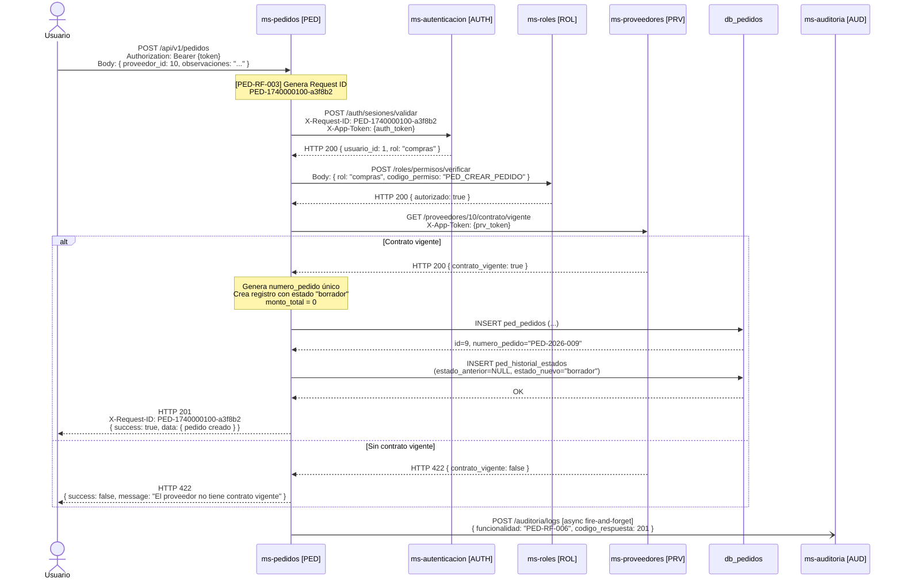

**Descripción narrativa:** El usuario envía los datos del nuevo pedido. El sistema genera el Request ID y lo propaga. Valida la sesión (AUTH) y los permisos (ROL) de forma síncrona y bloqueante. Luego consulta a PRV para verificar el contrato del proveedor; si está vigente, genera el número de pedido, persiste el registro con estado `borrador` y registra la entrada inicial en el historial de estados. Retorna HTTP 201 con el pedido creado. Finalmente, envía el log de auditoría de forma asíncrona (fire-and-forget) sin bloquear la respuesta.

---

### 5.2 `GET /api/v1/pedidos` — Listar Pedidos

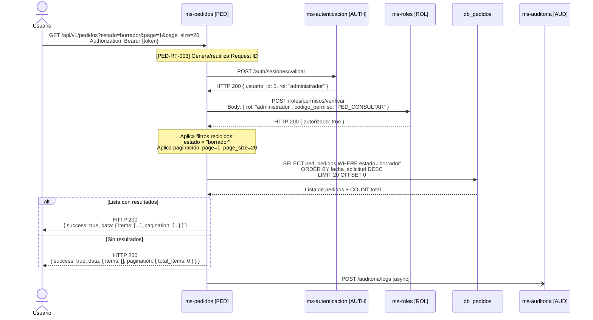

**Descripción narrativa:** El usuario envía la petición de listado con los filtros opcionales deseados. Tras validar sesión y permisos, el sistema construye la consulta SQL aplicando los filtros recibidos (estado, proveedor, solicitante, rango de fechas, número de pedido) y la paginación. Retorna HTTP 200 siempre, con la lista de pedidos o lista vacía según los resultados. No se invocan microservicios adicionales más allá de AUTH y ROL.

---

### 5.3 `GET /api/v1/pedidos/{pedido_id}` — Consultar Pedido por ID

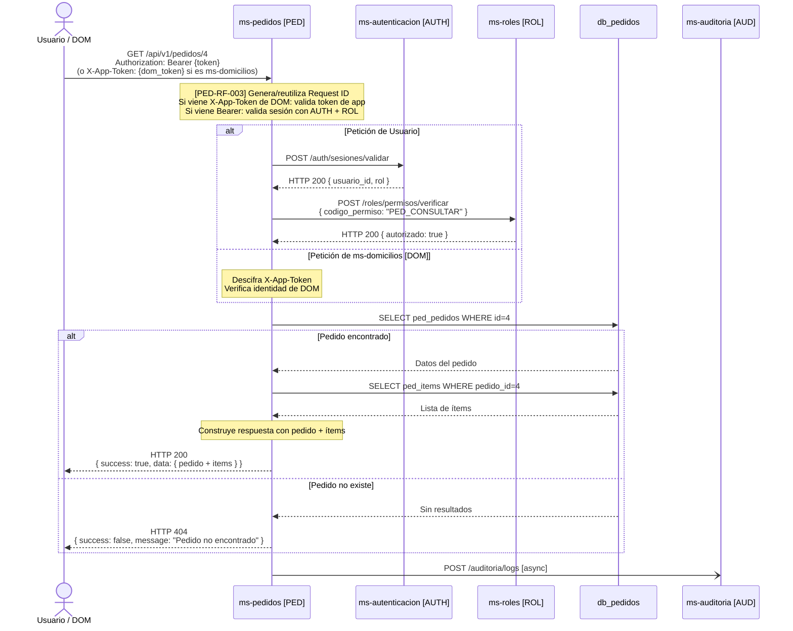

**Descripción narrativa:** Este endpoint acepta tanto peticiones de usuarios (autenticadas con Bearer token, validadas ante AUTH y ROL) como peticiones del servicio ms-domicilios (autenticadas con token de aplicación que PED valida internamente). En ambos casos, el sistema busca el pedido en la base de datos local y, si existe, recupera también todos sus ítems para construir la respuesta completa. No requiere llamadas a microservicios externos más allá de la autenticación.

---

### 5.4 `PUT /api/v1/pedidos/{pedido_id}` — Actualizar Pedido en Borrador

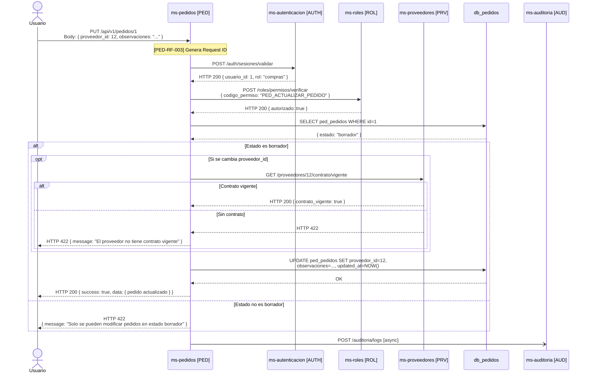

**Descripción narrativa:** Tras la validación de sesión y permisos, el sistema verifica que el pedido existe y está en estado `borrador`. Si el usuario está cambiando el proveedor, se consulta a PRV para confirmar que tiene contrato vigente. Si todo es válido, se aplican los cambios y se actualiza `fecha_actualizacion`. Si el pedido no está en `borrador`, se rechaza con HTTP 422.

---

### 5.5 `POST /api/v1/pedidos/{pedido_id}/avanzar-estado` — Avanzar Estado

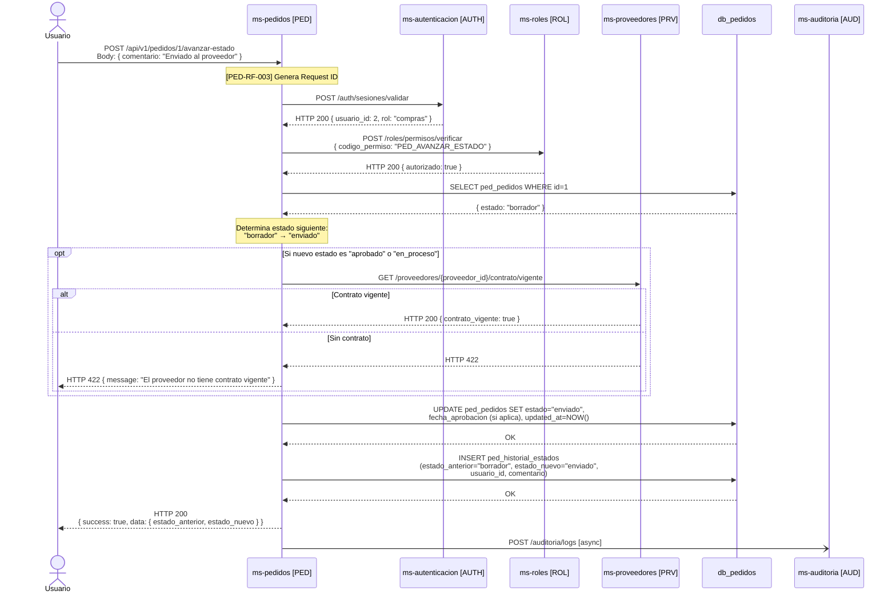

**Descripción narrativa:** El sistema valida sesión y permisos, obtiene el estado actual del pedido y determina el siguiente en el flujo secuencial. Cuando el nuevo estado es `aprobado` o `en_proceso`, se verifica previamente con PRV la vigencia del contrato del proveedor. Una vez confirmado, actualiza el estado del pedido (y registra `fecha_aprobacion` si el nuevo estado es `aprobado`) y persiste la transición en el historial con el comentario obligatorio.

---

### 5.6 `POST /api/v1/pedidos/{pedido_id}/cancelar` — Cancelar Pedido

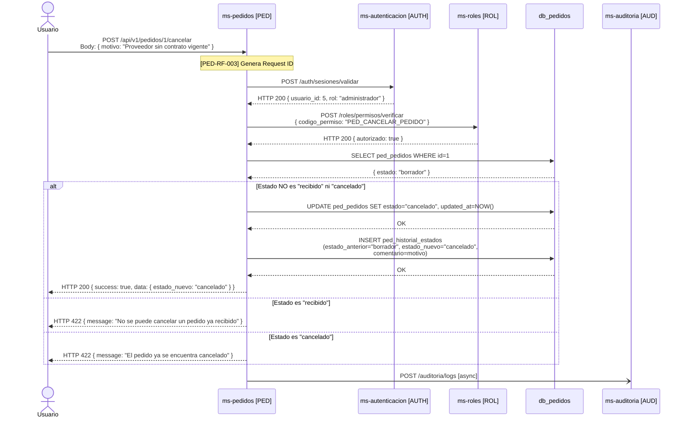

**Descripción narrativa:** El flujo de cancelación es relativamente simple: no requiere consultas a ms-proveedores ni ms-inventario. Tras autenticar y autorizar, el sistema verifica que el pedido no esté en un estado terminal (`recibido` o `cancelado`). Si está en cualquier otro estado, lo mueve a `cancelado` y persiste el motivo obligatorio en el historial. Es el único cambio de estado que puede ocurrir desde cualquier estado no terminal.

---

### 5.7 `POST /api/v1/pedidos/{pedido_id}/recepciones` — Registrar Recepción

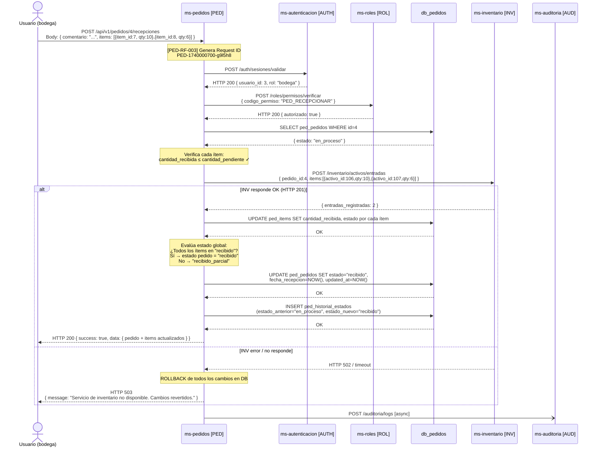

**Descripción narrativa:** Este es el flujo más complejo del microservicio. Tras autenticar y autorizar, el sistema verifica que el pedido está en `en_proceso` o `recibido_parcial` y que las cantidades a recepcionar no superan las pendientes. Invoca a INV de forma síncrona para registrar la entrada de stock; si INV responde correctamente, actualiza las cantidades de cada ítem, determina el nuevo estado del pedido (`recibido` si todos están completos, `recibido_parcial` en caso contrario), registra la transición en el historial y responde HTTP 200. Si INV falla, realiza rollback de todos los cambios en base de datos y responde HTTP 503.

---

### 5.8 `POST /api/v1/pedidos/{pedido_id}/items` — Agregar Ítem

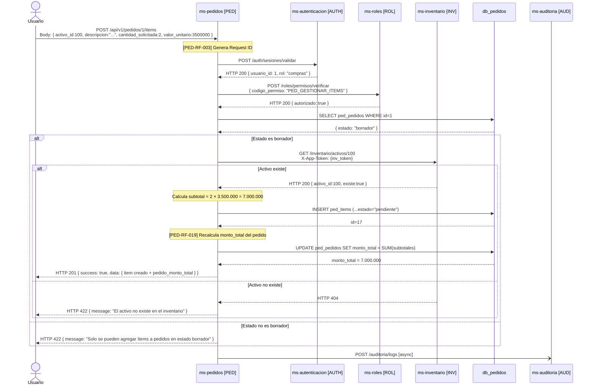

**Descripción narrativa:** Tras las validaciones de sesión, permisos y estado del pedido (debe ser `borrador`), el sistema consulta a INV para confirmar que el activo referenciado existe. Si existe, crea el ítem con estado `pendiente`, calcula su subtotal y dispara el recálculo del monto total del pedido (que suma todos los subtotales de ítems activos). Retorna HTTP 201 con el ítem creado y el nuevo monto total.

---

### 5.9 `GET /api/v1/pedidos/{pedido_id}/items` — Listar Ítems

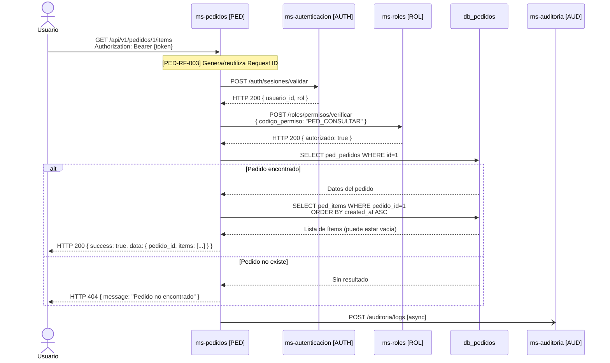

**Descripción narrativa:** Flujo de lectura sencillo. Tras autenticar y autorizar, el sistema verifica que el pedido existe y consulta la tabla `ped_items` filtrando por `pedido_id`. Retorna la lista completa de ítems con todos sus atributos. Si el pedido no tiene ítems registrados, retorna lista vacía con HTTP 200. No se invocan microservicios externos adicionales.

---

### 5.10 `PUT /api/v1/pedidos/{pedido_id}/items/{item_id}` — Actualizar Ítem

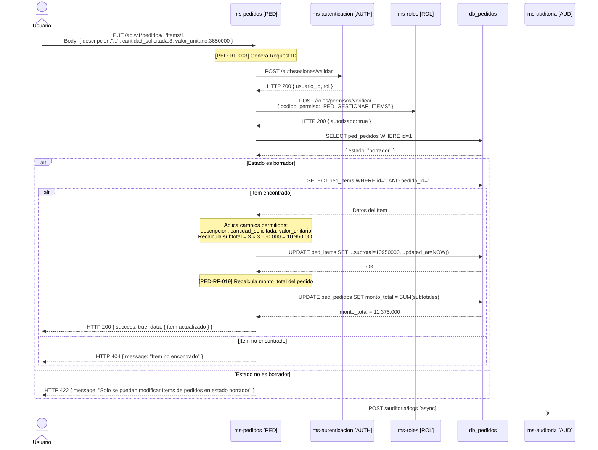

**Descripción narrativa:** Valida sesión, permisos y que el pedido está en `borrador`. Localiza el ítem por su ID dentro del pedido. Aplica los cambios a los campos permitidos (`descripcion`, `cantidad_solicitada`, `valor_unitario`), recalcula el subtotal del ítem y dispara el recálculo del monto total del pedido. No se permite cambiar el `activo_id` de un ítem ya creado; para ese caso se debe remover y agregar uno nuevo.

---

### 5.11 `DELETE /api/v1/pedidos/{pedido_id}/items/{item_id}` — Remover Ítem

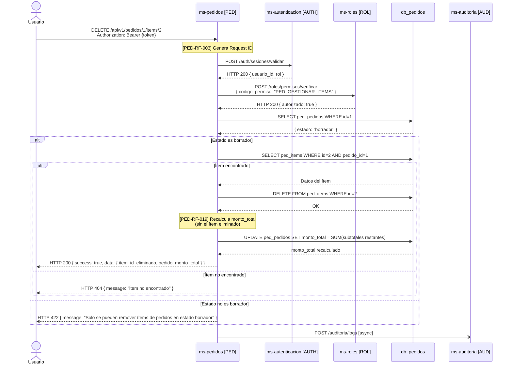

**Descripción narrativa:** Tras autenticar y autorizar, verifica que el pedido está en `borrador` y que el ítem a eliminar pertenece a ese pedido. Ejecuta la eliminación del ítem (física o lógica según decisión del equipo — [Por definir]) y recalcula el monto total del pedido sumando los subtotales restantes. Retorna el ID del ítem eliminado y el nuevo monto total.

---

### 5.12 `GET /api/v1/pedidos/{pedido_id}/historial` — Consultar Historial de Estados

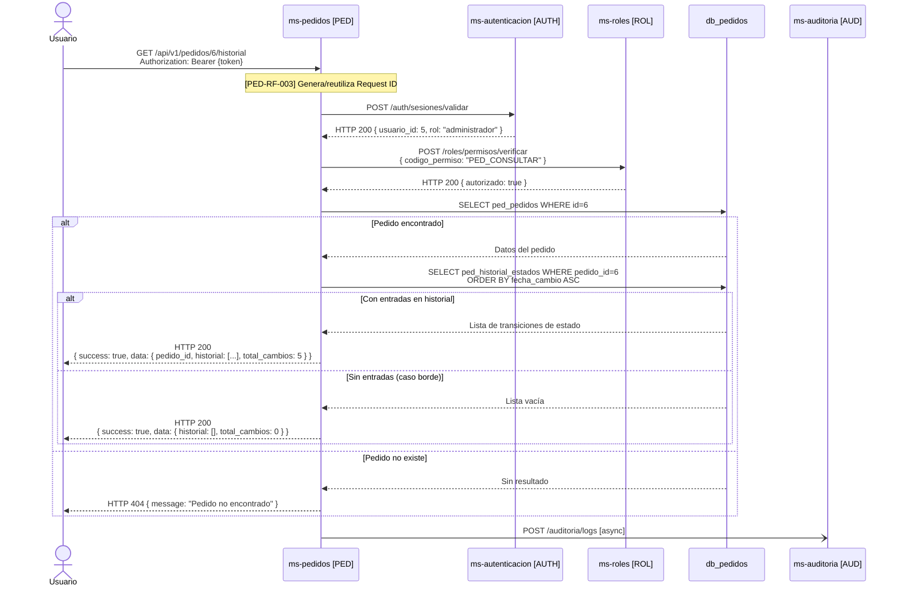

**Descripción narrativa:** El flujo más simple de lectura de recursos secundarios. Tras autenticar y autorizar, verifica que el pedido existe y consulta la tabla `ped_historial_estados` ordenada cronológicamente de forma ascendente. Cada entrada incluye el estado anterior, el nuevo estado, el usuario que realizó el cambio, la fecha exacta y el comentario. Retorna lista vacía si el pedido no tiene entradas (caso borde, pues todo pedido tiene al menos la entrada de creación). No se invocan microservicios externos adicionales.

---

*Documento generado para: ms-pedidos [PED] — ERP Universitario, Universidad del Valle Sede Caicedonia — Marzo 2026.*  
*Basado en: ms-pedidos_PED_requisitos-funcionales.md, ms-pedidos_PED_modelo-datos.md, ms-pedidos_PED_diseno-integracion.md*
