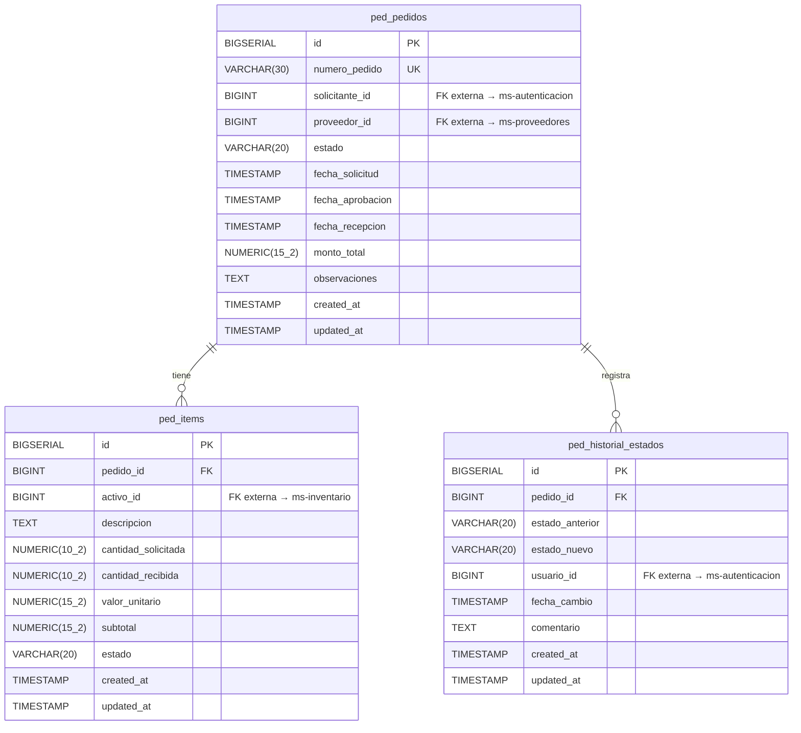

# Modelo de Datos — ms-pedidos [PED]

**Proyecto:** ERP Universitario — Universidad del Valle, Sede Caicedonia  
**Asignatura:** Desarrollo de Software III (750027C)  
**Documento:** Diseño del Modelo de Datos  
**Fecha:** Marzo 2026  

---

## 1. Información General

| Campo | Detalle |
|---|---|
| **Nombre** | ms-pedidos |
| **Código** | PED |
| **Módulo** | Módulo 4 — Logística y Proveedores |
| **Stack** | FastAPI + Python + PostgreSQL |
| **Base de datos sugerida** | `db_pedidos` |
| **Cantidad de tablas** | 3 |

**Resumen del dominio de datos:**  
`ms-pedidos` gestiona el ciclo de vida completo de los pedidos internos y órdenes de compra de la institución, desde su creación en borrador hasta la recepción total o parcial de los bienes. El modelo almacena las órdenes de compra (`ped_pedidos`), sus líneas de detalle por activo (`ped_items`), y el historial completo de transiciones de estado (`ped_historial_estados`). Las referencias a proveedores, activos del inventario y usuarios se mantienen únicamente como IDs externos, sin claves foráneas cruzadas entre bases de datos.

---

## 2. Diagrama E-R



### Descripción narrativa

El modelo de `ms-pedidos` está compuesto por **3 entidades**:

- **`ped_pedidos`** es la entidad principal. Representa cada orden de compra o pedido interno y concentra el estado general del flujo logístico, las fechas clave y el monto total calculado.
- **`ped_items`** es una entidad de detalle dependiente de `ped_pedidos`. Cada registro representa una línea del pedido (un activo solicitado), con sus cantidades solicitada y recibida, precio unitario y subtotal.
- **`ped_historial_estados`** es una entidad de soporte para auditoría interna. Registra cada transición de estado del pedido, identificando quién la realizó, cuándo y con qué comentario.

Las relaciones internas son: `ped_pedidos` 1:N `ped_items` y `ped_pedidos` 1:N `ped_historial_estados`.

**Referencias externas (sin FK real en base de datos):**

| Campo | Tabla | Microservicio destino | Entidad referenciada |
|---|---|---|---|
| `solicitante_id` | `ped_pedidos` | ms-autenticacion [AUTH] | Usuario solicitante |
| `proveedor_id` | `ped_pedidos` | ms-proveedores [PRV] | Proveedor asignado |
| `activo_id` | `ped_items` | ms-inventario [INV] | Activo del inventario |
| `usuario_id` | `ped_historial_estados` | ms-autenticacion [AUTH] | Usuario que cambió el estado |

---

## 3. Diccionario de Datos

---

### 3.1 Tabla: `ped_pedidos`

**Propósito:** Almacena cada orden de compra o pedido interno, incluyendo su estado en el flujo logístico, las fechas clave del ciclo de vida y el monto total calculado.

> **Referencias externas:**
> - `solicitante_id` → ID del usuario en `ms-autenticacion [AUTH]`
> - `proveedor_id` → ID del proveedor en `ms-proveedores [PRV]`

| Columna | Tipo | Restricciones | Descripción |
|---|---|---|---|
| `id` | `BIGSERIAL` | PK, NOT NULL | Identificador interno autoincremental |
| `numero_pedido` | `VARCHAR(30)` | NOT NULL, UNIQUE | Número único de pedido legible por el negocio (ej: PED-2026-001) |
| `solicitante_id` | `BIGINT` | NOT NULL | ID externo del usuario que generó el pedido (ms-autenticacion) |
| `proveedor_id` | `BIGINT` | NOT NULL | ID externo del proveedor asignado (ms-proveedores) |
| `estado` | `VARCHAR(20)` | NOT NULL, DEFAULT 'borrador', CHECK | Estado actual del pedido: `borrador`, `enviado`, `aprobado`, `en_proceso`, `recibido_parcial`, `recibido`, `cancelado` |
| `fecha_solicitud` | `TIMESTAMP` | NOT NULL, DEFAULT NOW() | Fecha y hora en que se creó el pedido |
| `fecha_aprobacion` | `TIMESTAMP` | NULL | Fecha y hora en que el pedido fue aprobado |
| `fecha_recepcion` | `TIMESTAMP` | NULL | Fecha y hora en que los bienes fueron recibidos (total o parcialmente) |
| `monto_total` | `NUMERIC(15,2)` | NOT NULL, DEFAULT 0.00 | Monto total calculado como sumatoria de subtotales de los ítems |
| `observaciones` | `TEXT` | NULL | Notas adicionales sobre el pedido |
| `created_at` | `TIMESTAMP` | NOT NULL, DEFAULT NOW() | Fecha y hora de creación del registro |
| `updated_at` | `TIMESTAMP` | NOT NULL, DEFAULT NOW() | Fecha y hora de la última modificación del registro |

---

### 3.2 Tabla: `ped_items`

**Propósito:** Almacena cada línea de detalle de un pedido, representando un activo solicitado con sus cantidades, precio unitario y subtotal.

> **Referencias externas:**
> - `activo_id` → ID del activo en `ms-inventario [INV]`

| Columna | Tipo | Restricciones | Descripción |
|---|---|---|---|
| `id` | `BIGSERIAL` | PK, NOT NULL | Identificador interno autoincremental |
| `pedido_id` | `BIGINT` | FK → `ped_pedidos.id`, NOT NULL | Referencia al pedido al que pertenece el ítem |
| `activo_id` | `BIGINT` | NOT NULL | ID externo del activo solicitado (ms-inventario) |
| `descripcion` | `TEXT` | NOT NULL | Descripción del ítem o activo solicitado |
| `cantidad_solicitada` | `NUMERIC(10,2)` | NOT NULL, CHECK (> 0) | Unidades solicitadas al proveedor |
| `cantidad_recibida` | `NUMERIC(10,2)` | NOT NULL, DEFAULT 0, CHECK (>= 0) | Unidades efectivamente recibidas hasta el momento |
| `valor_unitario` | `NUMERIC(15,2)` | NOT NULL, CHECK (> 0) | Precio por unidad del activo |
| `subtotal` | `NUMERIC(15,2)` | NOT NULL, DEFAULT 0.00 | Calculado como `cantidad_solicitada × valor_unitario` |
| `estado` | `VARCHAR(20)` | NOT NULL, DEFAULT 'pendiente', CHECK | Estado del ítem: `pendiente`, `recibido_parcial`, `recibido` |
| `created_at` | `TIMESTAMP` | NOT NULL, DEFAULT NOW() | Fecha y hora de creación del registro |
| `updated_at` | `TIMESTAMP` | NOT NULL, DEFAULT NOW() | Fecha y hora de la última modificación del registro |

---

### 3.3 Tabla: `ped_historial_estados`

**Propósito:** Registra cada cambio de estado ocurrido en un pedido, garantizando trazabilidad completa del flujo logístico.

> **Referencias externas:**
> - `usuario_id` → ID del usuario en `ms-autenticacion [AUTH]`

| Columna | Tipo | Restricciones | Descripción |
|---|---|---|---|
| `id` | `BIGSERIAL` | PK, NOT NULL | Identificador interno autoincremental |
| `pedido_id` | `BIGINT` | FK → `ped_pedidos.id`, NOT NULL | Referencia al pedido cuyo estado cambió |
| `estado_anterior` | `VARCHAR(20)` | NULL, CHECK | Estado previo al cambio (NULL si es la creación inicial) |
| `estado_nuevo` | `VARCHAR(20)` | NOT NULL, CHECK | Estado resultante del cambio |
| `usuario_id` | `BIGINT` | NOT NULL | ID externo del usuario que realizó el cambio (ms-autenticacion) |
| `fecha_cambio` | `TIMESTAMP` | NOT NULL, DEFAULT NOW() | Fecha y hora exacta del cambio de estado |
| `comentario` | `TEXT` | NULL | Observación o motivo del cambio de estado |
| `created_at` | `TIMESTAMP` | NOT NULL, DEFAULT NOW() | Fecha y hora de creación del registro |
| `updated_at` | `TIMESTAMP` | NOT NULL, DEFAULT NOW() | Fecha y hora de la última modificación del registro |

---

## 4. Relaciones y Claves Foráneas

### Relaciones internas (FK dentro de `db_pedidos`)

| FK | Tabla origen | Columna | Tabla destino | Tipo | Nota |
|---|---|---|---|---|---|
| `fk_items_pedido` | `ped_items` | `pedido_id` | `ped_pedidos` | 1:N | Un pedido tiene uno o varios ítems |
| `fk_historial_pedido` | `ped_historial_estados` | `pedido_id` | `ped_pedidos` | 1:N | Un pedido registra múltiples cambios de estado |

### Referencias externas (sin FK real — solo IDs)

| Campo | Tabla | Microservicio | Entidad | Nota |
|---|---|---|---|---|
| `solicitante_id` | `ped_pedidos` | ms-autenticacion [AUTH] | Usuario | Se valida en tiempo de ejecución vía API |
| `proveedor_id` | `ped_pedidos` | ms-proveedores [PRV] | Proveedor | Se valida vigencia del contrato antes de enviar/aprobar |
| `activo_id` | `ped_items` | ms-inventario [INV] | Activo | Se verifica existencia al crear el ítem y se registra entrada de stock al recepcionar |
| `usuario_id` | `ped_historial_estados` | ms-autenticacion [AUTH] | Usuario | Identifica quién realizó cada cambio de estado |

---

## 5. Índices Sugeridos

| Índice | Tabla | Columnas | Tipo | Justificación |
|---|---|---|---|---|
| `idx_pedidos_numero` | `ped_pedidos` | `numero_pedido` | B-tree (UNIQUE) | Búsqueda y validación de unicidad del número de pedido |
| `idx_pedidos_estado` | `ped_pedidos` | `estado` | B-tree | Filtro frecuente por estado en listados y dashboards |
| `idx_pedidos_solicitante` | `ped_pedidos` | `solicitante_id` | B-tree | Consultas de pedidos por usuario solicitante |
| `idx_pedidos_proveedor` | `ped_pedidos` | `proveedor_id` | B-tree | Filtro de pedidos por proveedor |
| `idx_pedidos_fecha_solicitud` | `ped_pedidos` | `fecha_solicitud` | B-tree | Filtros por rango de fechas en consultas y reportes |
| `idx_pedidos_estado_fecha` | `ped_pedidos` | `estado, fecha_solicitud` | B-tree (compuesto) | Consultas combinadas de estado + fecha en gestión operativa |
| `idx_items_pedido` | `ped_items` | `pedido_id` | B-tree | Recuperación eficiente de todos los ítems de un pedido |
| `idx_items_activo` | `ped_items` | `activo_id` | B-tree | Búsqueda de pedidos que contienen un activo específico |
| `idx_items_estado` | `ped_items` | `estado` | B-tree | Filtro de ítems pendientes de recepción |
| `idx_historial_pedido` | `ped_historial_estados` | `pedido_id` | B-tree | Recuperación del historial completo de un pedido |
| `idx_historial_fecha` | `ped_historial_estados` | `fecha_cambio` | B-tree | Ordenamiento y filtro temporal del historial |
| `idx_historial_usuario` | `ped_historial_estados` | `usuario_id` | B-tree | Auditoría de cambios realizados por un usuario específico |

---

## 6. Script DDL

```sql
-- ============================================================
-- BASE DE DATOS: db_pedidos
-- Microservicio: ms-pedidos [PED]
-- Módulo: Módulo 4 — Logística y Proveedores
-- ERP Universitario — Universidad del Valle, Sede Caicedonia
-- ============================================================

CREATE DATABASE db_pedidos
    WITH ENCODING = 'UTF8'
    LC_COLLATE = 'es_CO.UTF-8'
    LC_CTYPE = 'es_CO.UTF-8'
    TEMPLATE = template0;

\c db_pedidos;

-- ============================================================
-- TABLA: ped_pedidos
-- Entidad principal. Cada orden de compra o pedido interno.
-- 
-- REFERENCIAS EXTERNAS (sin FK — solo IDs):
--   solicitante_id → ms-autenticacion [AUTH] → tabla usuarios
--   proveedor_id   → ms-proveedores [PRV]    → tabla proveedores
-- ============================================================

CREATE TABLE ped_pedidos (
    id               BIGSERIAL       NOT NULL,
    numero_pedido    VARCHAR(30)     NOT NULL,
    -- Referencia externa: ms-autenticacion [AUTH] → usuario solicitante
    solicitante_id   BIGINT          NOT NULL,
    -- Referencia externa: ms-proveedores [PRV] → proveedor asignado
    proveedor_id     BIGINT          NOT NULL,
    estado           VARCHAR(20)     NOT NULL DEFAULT 'borrador',
    fecha_solicitud  TIMESTAMP       NOT NULL DEFAULT NOW(),
    fecha_aprobacion TIMESTAMP       NULL,
    fecha_recepcion  TIMESTAMP       NULL,
    monto_total      NUMERIC(15,2)   NOT NULL DEFAULT 0.00,
    observaciones    TEXT            NULL,
    created_at       TIMESTAMP       NOT NULL DEFAULT NOW(),
    updated_at       TIMESTAMP       NOT NULL DEFAULT NOW(),

    CONSTRAINT pk_ped_pedidos
        PRIMARY KEY (id),

    CONSTRAINT uq_ped_pedidos_numero
        UNIQUE (numero_pedido),

    CONSTRAINT ck_ped_pedidos_estado
        CHECK (estado IN (
            'borrador', 'enviado', 'aprobado',
            'en_proceso', 'recibido_parcial', 'recibido', 'cancelado'
        )),

    CONSTRAINT ck_ped_pedidos_monto
        CHECK (monto_total >= 0)
);

COMMENT ON TABLE  ped_pedidos                  IS 'Órdenes de compra y pedidos internos de la institución';
COMMENT ON COLUMN ped_pedidos.solicitante_id   IS 'ID externo del usuario solicitante — ms-autenticacion [AUTH]';
COMMENT ON COLUMN ped_pedidos.proveedor_id     IS 'ID externo del proveedor asignado — ms-proveedores [PRV]';
COMMENT ON COLUMN ped_pedidos.estado           IS 'Estado del pedido: borrador | enviado | aprobado | en_proceso | recibido_parcial | recibido | cancelado';


-- ============================================================
-- TABLA: ped_items
-- Líneas de detalle de cada pedido.
--
-- REFERENCIAS EXTERNAS (sin FK — solo IDs):
--   activo_id → ms-inventario [INV] → tabla activos
-- ============================================================

CREATE TABLE ped_items (
    id                   BIGSERIAL       NOT NULL,
    pedido_id            BIGINT          NOT NULL,
    -- Referencia externa: ms-inventario [INV] → activo solicitado
    activo_id            BIGINT          NOT NULL,
    descripcion          TEXT            NOT NULL,
    cantidad_solicitada  NUMERIC(10,2)   NOT NULL,
    cantidad_recibida    NUMERIC(10,2)   NOT NULL DEFAULT 0,
    valor_unitario       NUMERIC(15,2)   NOT NULL,
    subtotal             NUMERIC(15,2)   NOT NULL DEFAULT 0.00,
    estado               VARCHAR(20)     NOT NULL DEFAULT 'pendiente',
    created_at           TIMESTAMP       NOT NULL DEFAULT NOW(),
    updated_at           TIMESTAMP       NOT NULL DEFAULT NOW(),

    CONSTRAINT pk_ped_items
        PRIMARY KEY (id),

    CONSTRAINT fk_items_pedido
        FOREIGN KEY (pedido_id)
        REFERENCES ped_pedidos (id)
        ON DELETE RESTRICT,

    CONSTRAINT ck_ped_items_estado
        CHECK (estado IN ('pendiente', 'recibido_parcial', 'recibido')),

    CONSTRAINT ck_ped_items_cantidad_solicitada
        CHECK (cantidad_solicitada > 0),

    CONSTRAINT ck_ped_items_cantidad_recibida
        CHECK (cantidad_recibida >= 0),

    CONSTRAINT ck_ped_items_recibida_le_solicitada
        CHECK (cantidad_recibida <= cantidad_solicitada),

    CONSTRAINT ck_ped_items_valor_unitario
        CHECK (valor_unitario > 0),

    CONSTRAINT ck_ped_items_subtotal
        CHECK (subtotal >= 0)
);

COMMENT ON TABLE  ped_items              IS 'Líneas de detalle de cada pedido con activos, cantidades y precios';
COMMENT ON COLUMN ped_items.activo_id    IS 'ID externo del activo solicitado — ms-inventario [INV]';
COMMENT ON COLUMN ped_items.estado       IS 'Estado del ítem: pendiente | recibido_parcial | recibido';


-- ============================================================
-- TABLA: ped_historial_estados
-- Registro de cada cambio de estado de un pedido.
--
-- REFERENCIAS EXTERNAS (sin FK — solo IDs):
--   usuario_id → ms-autenticacion [AUTH] → tabla usuarios
-- ============================================================

CREATE TABLE ped_historial_estados (
    id               BIGSERIAL       NOT NULL,
    pedido_id        BIGINT          NOT NULL,
    estado_anterior  VARCHAR(20)     NULL,
    estado_nuevo     VARCHAR(20)     NOT NULL,
    -- Referencia externa: ms-autenticacion [AUTH] → usuario que realizó el cambio
    usuario_id       BIGINT          NOT NULL,
    fecha_cambio     TIMESTAMP       NOT NULL DEFAULT NOW(),
    comentario       TEXT            NULL,
    created_at       TIMESTAMP       NOT NULL DEFAULT NOW(),
    updated_at       TIMESTAMP       NOT NULL DEFAULT NOW(),

    CONSTRAINT pk_ped_historial_estados
        PRIMARY KEY (id),

    CONSTRAINT fk_historial_pedido
        FOREIGN KEY (pedido_id)
        REFERENCES ped_pedidos (id)
        ON DELETE RESTRICT,

    CONSTRAINT ck_ped_historial_estado_anterior
        CHECK (estado_anterior IS NULL OR estado_anterior IN (
            'borrador', 'enviado', 'aprobado',
            'en_proceso', 'recibido_parcial', 'recibido', 'cancelado'
        )),

    CONSTRAINT ck_ped_historial_estado_nuevo
        CHECK (estado_nuevo IN (
            'borrador', 'enviado', 'aprobado',
            'en_proceso', 'recibido_parcial', 'recibido', 'cancelado'
        ))
);

COMMENT ON TABLE  ped_historial_estados               IS 'Historial de cambios de estado de cada pedido para trazabilidad';
COMMENT ON COLUMN ped_historial_estados.usuario_id    IS 'ID externo del usuario que realizó el cambio — ms-autenticacion [AUTH]';
COMMENT ON COLUMN ped_historial_estados.estado_anterior IS 'NULL cuando es el registro inicial de creación del pedido';


-- ============================================================
-- ÍNDICES
-- ============================================================

-- ped_pedidos
CREATE INDEX idx_pedidos_estado
    ON ped_pedidos (estado);

CREATE INDEX idx_pedidos_solicitante
    ON ped_pedidos (solicitante_id);

CREATE INDEX idx_pedidos_proveedor
    ON ped_pedidos (proveedor_id);

CREATE INDEX idx_pedidos_fecha_solicitud
    ON ped_pedidos (fecha_solicitud);

CREATE INDEX idx_pedidos_estado_fecha
    ON ped_pedidos (estado, fecha_solicitud);

-- ped_items
CREATE INDEX idx_items_pedido
    ON ped_items (pedido_id);

CREATE INDEX idx_items_activo
    ON ped_items (activo_id);

CREATE INDEX idx_items_estado
    ON ped_items (estado);

-- ped_historial_estados
CREATE INDEX idx_historial_pedido
    ON ped_historial_estados (pedido_id);

CREATE INDEX idx_historial_fecha
    ON ped_historial_estados (fecha_cambio);

CREATE INDEX idx_historial_usuario
    ON ped_historial_estados (usuario_id);
```

---

## 7. Datos Semilla

> **Nota sobre IDs externos ficticios:**
> - `solicitante_id` y `usuario_id` (valores 1–5): representan usuarios en `ms-autenticacion [AUTH]`
> - `proveedor_id` (valores 10–14): representan proveedores en `ms-proveedores [PRV]`
> - `activo_id` (valores 100–108): representan activos del inventario en `ms-inventario [INV]`

```sql
-- ============================================================
-- DATOS SEMILLA — ms-pedidos [PED]
-- ============================================================

-- ------------------------------------------------------------
-- Pedidos: 8 registros cubriendo todos los estados posibles
-- ------------------------------------------------------------

INSERT INTO ped_pedidos
    (numero_pedido, solicitante_id, proveedor_id, estado,
     fecha_solicitud, fecha_aprobacion, fecha_recepcion,
     monto_total, observaciones, created_at, updated_at)
VALUES
-- Estado: borrador (pedido recién creado, sin enviar)
('PED-2026-001', 1, 10, 'borrador',
 '2026-02-01 08:00:00', NULL, NULL,
 0.00, 'Pedido en elaboración para equipos de cómputo',
 '2026-02-01 08:00:00', '2026-02-01 08:00:00'),

-- Estado: enviado (ya enviado al proveedor, pendiente de aprobación)
('PED-2026-002', 2, 11, 'enviado',
 '2026-02-03 09:30:00', NULL, NULL,
 1500000.00, 'Material de oficina para semestre 2026-1',
 '2026-02-03 09:30:00', '2026-02-05 10:00:00'),

-- Estado: aprobado (aprobado, listo para procesar)
('PED-2026-003', 1, 12, 'aprobado',
 '2026-02-05 10:00:00', '2026-02-07 14:00:00', NULL,
 3200000.00, 'Mobiliario para sala de reuniones',
 '2026-02-05 10:00:00', '2026-02-07 14:00:00'),

-- Estado: en_proceso (en tránsito o en preparación por el proveedor)
('PED-2026-004', 3, 10, 'en_proceso',
 '2026-01-20 08:00:00', '2026-01-22 09:00:00', NULL,
 870000.00, 'Suministros de limpieza para mantenimiento',
 '2026-01-20 08:00:00', '2026-01-25 11:00:00'),

-- Estado: recibido_parcial (se recibieron algunos ítems)
('PED-2026-005', 4, 13, 'recibido_parcial',
 '2026-01-10 08:00:00', '2026-01-12 10:00:00', '2026-01-20 09:00:00',
 5600000.00, 'Equipos audiovisuales — recepción parcial pendiente',
 '2026-01-10 08:00:00', '2026-01-20 09:30:00'),

-- Estado: recibido (pedido completamente recibido)
('PED-2026-006', 2, 11, 'recibido',
 '2026-01-05 08:00:00', '2026-01-07 11:00:00', '2026-01-15 10:00:00',
 980000.00, 'Papelería general — recibido en su totalidad',
 '2026-01-05 08:00:00', '2026-01-15 10:30:00'),

-- Estado: cancelado (cancelado antes de completarse)
('PED-2026-007', 5, 14, 'cancelado',
 '2026-01-25 08:00:00', NULL, NULL,
 0.00, 'Pedido cancelado: proveedor sin contrato vigente',
 '2026-01-25 08:00:00', '2026-01-26 09:00:00'),

-- Estado: borrador (segundo pedido en borrador con ítems ya cargados)
('PED-2026-008', 3, 12, 'borrador',
 '2026-02-10 08:00:00', NULL, NULL,
 2400000.00, 'Equipos de red para laboratorio de sistemas',
 '2026-02-10 08:00:00', '2026-02-10 10:00:00');


-- ------------------------------------------------------------
-- Ítems de pedido: registros para los 8 pedidos
-- Activo IDs ficticios → ms-inventario [INV]
-- ------------------------------------------------------------

INSERT INTO ped_items
    (pedido_id, activo_id, descripcion, cantidad_solicitada,
     cantidad_recibida, valor_unitario, subtotal, estado,
     created_at, updated_at)
VALUES
-- PED-2026-001 (borrador) — ítems en estado inicial
(1, 100, 'Computador portátil Core i7 16GB RAM',   2, 0, 3500000.00,  7000000.00, 'pendiente',
 '2026-02-01 08:10:00', '2026-02-01 08:10:00'),
(1, 101, 'Mouse inalámbrico ergonómico',            5, 0,   85000.00,   425000.00, 'pendiente',
 '2026-02-01 08:15:00', '2026-02-01 08:15:00'),

-- PED-2026-002 (enviado)
(2, 102, 'Resmas de papel bond carta',             20, 0,   12000.00,   240000.00, 'pendiente',
 '2026-02-03 09:35:00', '2026-02-03 09:35:00'),
(2, 103, 'Bolígrafos azules caja x50',              4, 0,   35000.00,   140000.00, 'pendiente',
 '2026-02-03 09:40:00', '2026-02-03 09:40:00'),

-- PED-2026-003 (aprobado)
(3, 104, 'Silla ergonómica de oficina',             8, 0,  350000.00,  2800000.00, 'pendiente',
 '2026-02-05 10:10:00', '2026-02-05 10:10:00'),
(3, 105, 'Mesa de reuniones rectangular 8 puestos', 1, 0,  400000.00,   400000.00, 'pendiente',
 '2026-02-05 10:15:00', '2026-02-05 10:15:00'),

-- PED-2026-004 (en_proceso)
(4, 106, 'Desinfectante multiusos 5L',             10, 0,   45000.00,   450000.00, 'pendiente',
 '2026-01-20 08:10:00', '2026-01-20 08:10:00'),
(4, 107, 'Escobas industriales',                    6, 0,   70000.00,   420000.00, 'pendiente',
 '2026-01-20 08:15:00', '2026-01-20 08:15:00'),

-- PED-2026-005 (recibido_parcial) — un ítem recibido y otro pendiente
(5, 100, 'Proyector Full HD HDMI',                  2, 2, 1800000.00,  3600000.00, 'recibido',
 '2026-01-10 08:10:00', '2026-01-20 09:05:00'),
(5, 108, 'Pantalla de proyección enrollable 100"',  2, 0, 1000000.00,  2000000.00, 'pendiente',
 '2026-01-10 08:15:00', '2026-01-10 08:15:00'),

-- PED-2026-006 (recibido) — todos los ítems recibidos completos
(6, 102, 'Carpetas AZ palanca tamaño carta',       30, 30,  8500.00,   255000.00, 'recibido',
 '2026-01-05 08:10:00', '2026-01-15 10:05:00'),
(6, 103, 'Marcadores borrables caja x12',           5,  5,  25000.00,  125000.00, 'recibido',
 '2026-01-05 08:15:00', '2026-01-15 10:10:00'),

-- PED-2026-007 (cancelado) — sin ítems confirmados (cancelado en borrador)
(7, 101, 'Teclado mecánico USB',                    3, 0,  120000.00,  360000.00, 'pendiente',
 '2026-01-25 08:10:00', '2026-01-26 09:00:00'),

-- PED-2026-008 (borrador con monto calculado)
(8, 100, 'Switch 24 puertos Gigabit',               2, 0,  800000.00, 1600000.00, 'pendiente',
 '2026-02-10 08:10:00', '2026-02-10 08:10:00'),
(8, 108, 'Cable UTP Cat6 rollo 305m',               2, 0,  400000.00,  800000.00, 'pendiente',
 '2026-02-10 08:15:00', '2026-02-10 08:15:00');


-- ------------------------------------------------------------
-- Historial de estados: trazabilidad de cada pedido
-- usuario_id ficticios → ms-autenticacion [AUTH]
-- ------------------------------------------------------------

INSERT INTO ped_historial_estados
    (pedido_id, estado_anterior, estado_nuevo, usuario_id,
     fecha_cambio, comentario, created_at, updated_at)
VALUES
-- PED-2026-001: solo creación (borrador)
(1, NULL, 'borrador', 1,
 '2026-02-01 08:00:00', 'Pedido creado en borrador',
 '2026-02-01 08:00:00', '2026-02-01 08:00:00'),

-- PED-2026-002: borrador → enviado
(2, NULL,       'borrador', 2,
 '2026-02-03 09:30:00', 'Pedido creado en borrador',
 '2026-02-03 09:30:00', '2026-02-03 09:30:00'),
(2, 'borrador', 'enviado',  2,
 '2026-02-05 10:00:00', 'Pedido enviado al proveedor para cotización',
 '2026-02-05 10:00:00', '2026-02-05 10:00:00'),

-- PED-2026-003: borrador → enviado → aprobado
(3, NULL,       'borrador', 1,
 '2026-02-05 10:00:00', 'Pedido creado en borrador',
 '2026-02-05 10:00:00', '2026-02-05 10:00:00'),
(3, 'borrador', 'enviado',  1,
 '2026-02-06 09:00:00', 'Enviado para revisión y aprobación',
 '2026-02-06 09:00:00', '2026-02-06 09:00:00'),
(3, 'enviado',  'aprobado', 5,
 '2026-02-07 14:00:00', 'Aprobado por dirección administrativa',
 '2026-02-07 14:00:00', '2026-02-07 14:00:00'),

-- PED-2026-004: borrador → enviado → aprobado → en_proceso
(4, NULL,        'borrador',   3,
 '2026-01-20 08:00:00', 'Pedido creado en borrador',
 '2026-01-20 08:00:00', '2026-01-20 08:00:00'),
(4, 'borrador',  'enviado',    3,
 '2026-01-21 09:00:00', 'Enviado al proveedor',
 '2026-01-21 09:00:00', '2026-01-21 09:00:00'),
(4, 'enviado',   'aprobado',   5,
 '2026-01-22 09:00:00', 'Aprobado — contrato vigente verificado',
 '2026-01-22 09:00:00', '2026-01-22 09:00:00'),
(4, 'aprobado',  'en_proceso', 5,
 '2026-01-25 11:00:00', 'Orden de compra emitida al proveedor',
 '2026-01-25 11:00:00', '2026-01-25 11:00:00'),

-- PED-2026-005: flujo hasta recibido_parcial
(5, NULL,            'borrador',          4,
 '2026-01-10 08:00:00', 'Pedido creado',
 '2026-01-10 08:00:00', '2026-01-10 08:00:00'),
(5, 'borrador',      'enviado',           4,
 '2026-01-11 09:00:00', 'Enviado al proveedor de audiovisuales',
 '2026-01-11 09:00:00', '2026-01-11 09:00:00'),
(5, 'enviado',       'aprobado',          5,
 '2026-01-12 10:00:00', 'Aprobado por dirección',
 '2026-01-12 10:00:00', '2026-01-12 10:00:00'),
(5, 'aprobado',      'en_proceso',        5,
 '2026-01-14 08:00:00', 'Orden emitida',
 '2026-01-14 08:00:00', '2026-01-14 08:00:00'),
(5, 'en_proceso',    'recibido_parcial',  4,
 '2026-01-20 09:30:00', 'Se recibieron los proyectores; pantallas pendientes de entrega',
 '2026-01-20 09:30:00', '2026-01-20 09:30:00'),

-- PED-2026-006: flujo completo hasta recibido
(6, NULL,            'borrador',  2,
 '2026-01-05 08:00:00', 'Pedido creado',
 '2026-01-05 08:00:00', '2026-01-05 08:00:00'),
(6, 'borrador',      'enviado',   2,
 '2026-01-06 09:00:00', 'Enviado al proveedor',
 '2026-01-06 09:00:00', '2026-01-06 09:00:00'),
(6, 'enviado',       'aprobado',  5,
 '2026-01-07 11:00:00', 'Aprobado',
 '2026-01-07 11:00:00', '2026-01-07 11:00:00'),
(6, 'aprobado',      'en_proceso',5,
 '2026-01-09 08:00:00', 'En proceso con proveedor',
 '2026-01-09 08:00:00', '2026-01-09 08:00:00'),
(6, 'en_proceso',    'recibido',  2,
 '2026-01-15 10:30:00', 'Todos los ítems recibidos en bodega sin novedad',
 '2026-01-15 10:30:00', '2026-01-15 10:30:00'),

-- PED-2026-007: borrador → cancelado
(7, NULL,       'borrador',   5,
 '2026-01-25 08:00:00', 'Pedido creado en borrador',
 '2026-01-25 08:00:00', '2026-01-25 08:00:00'),
(7, 'borrador', 'cancelado',  5,
 '2026-01-26 09:00:00', 'Cancelado: se verificó que el proveedor no tiene contrato vigente',
 '2026-01-26 09:00:00', '2026-01-26 09:00:00'),

-- PED-2026-008: solo creación
(8, NULL, 'borrador', 3,
 '2026-02-10 08:00:00', 'Pedido creado en borrador para laboratorio',
 '2026-02-10 08:00:00', '2026-02-10 08:00:00');
```

---

*Documento generado a partir de: ms-pedidos_PED_extraccion.md — ERP Universitario, Febrero 2026.*
