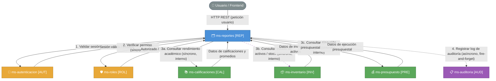
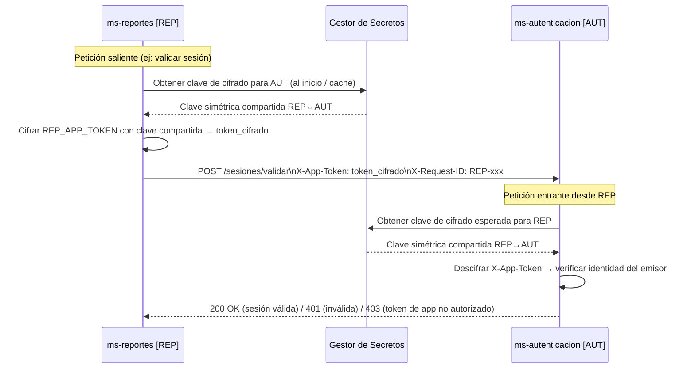
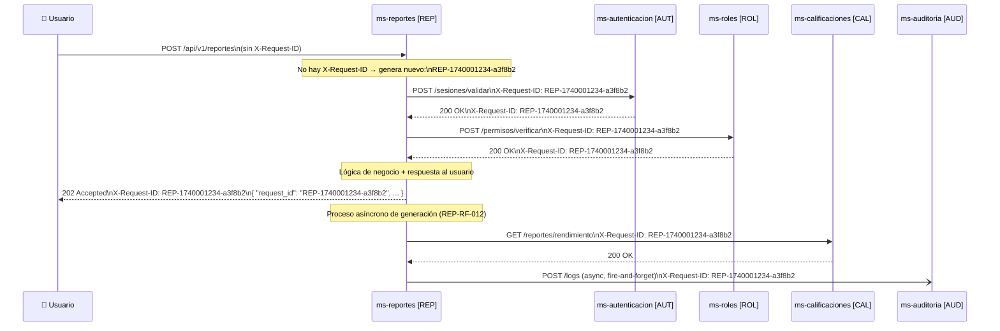
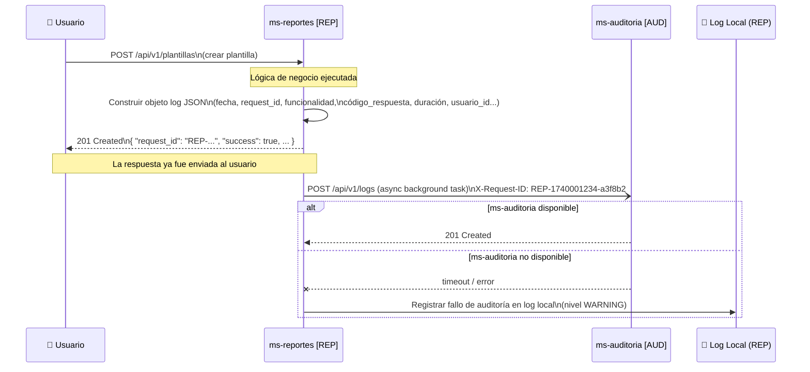
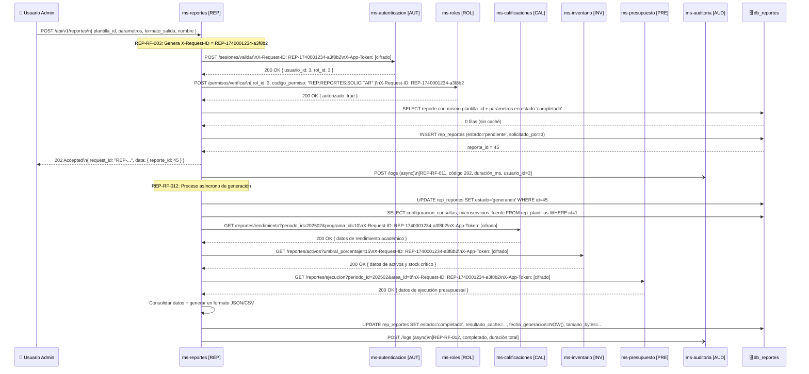
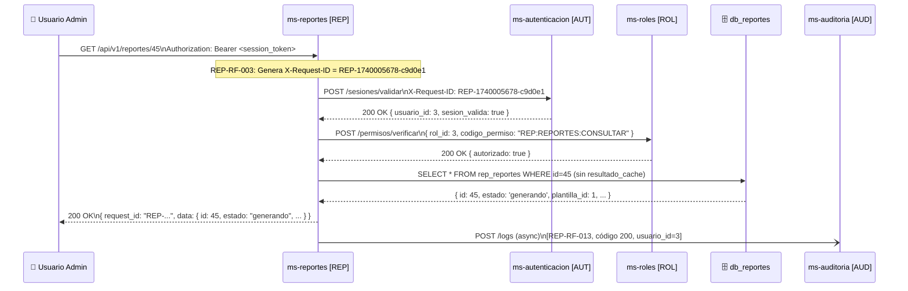
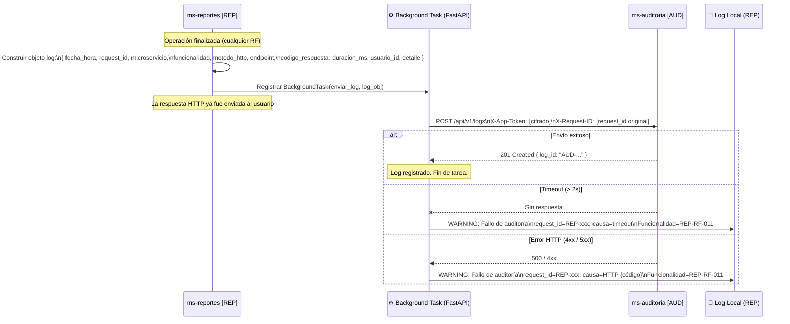

# Diseño de Integración — ms-reportes [REP]

> **Microservicio:** ms-reportes  
> **Código:** REP  
> **Módulo:** Módulo 6 — Transversales  
> **Stack:** FastAPI + Python + PostgreSQL  
> **Versión del documento:** 1.0  
> **Fecha:** Marzo 2026  

---

## Tabla de Contenido

1. [Información General](#1-información-general)
2. [Mapa de Integraciones](#2-mapa-de-integraciones)
3. [Contratos de Comunicación Saliente](#3-contratos-de-comunicación-saliente)
4. [Contratos de Comunicación Entrante](#4-contratos-de-comunicación-entrante)
5. [Configuración de Tokens de Aplicación](#5-configuración-de-tokens-de-aplicación)
6. [Flujo de Request ID](#6-flujo-de-request-id)
7. [Flujo de Auditoría](#7-flujo-de-auditoría)
8. [Diagramas de Secuencia](#8-diagramas-de-secuencia)

---

## 1. Información General

| Campo | Detalle |
|---|---|
| **Nombre** | ms-reportes |
| **Código** | REP |
| **Módulo** | Módulo 6 — Transversales |
| **Servicios con los que se integra** | 6 microservicios |

**Resumen de integraciones:**

`ms-reportes` actúa como orquestador de datos: consume `ms-autenticacion` y `ms-roles` en cada petición para validar sesión y permisos, y consulta los microservicios fuente (`ms-calificaciones`, `ms-inventario`, `ms-presupuesto`) de forma asíncrona durante el proceso interno de generación de reportes consolidados. Adicionalmente, envía registros de auditoría a `ms-auditoria` de manera asíncrona (fire-and-forget) al finalizar cada operación. El microservicio no expone datos a otros microservicios del sistema; sus endpoints son consumidos directamente por usuarios del sistema a través del gateway o cliente frontend.

---

## 2. Mapa de Integraciones



**Descripción narrativa del mapa:**

`ms-reportes` se integra con **6 microservicios**, distribuidos en tres categorías funcionales:

**Integraciones síncronas (bloqueantes):** Las comunicaciones con `ms-autenticacion` y `ms-roles` son síncronas y obligatorias: cada petición de usuario debe pasar por ambas validaciones antes de ejecutar cualquier lógica de negocio. Las consultas a `ms-calificaciones`, `ms-inventario` y `ms-presupuesto` también son síncronas dentro del proceso interno de generación de reportes (`REP-RF-012`), aunque este proceso en sí es disparado de forma asíncrona desde el endpoint de solicitud.

**Integración asíncrona (fire-and-forget):** La comunicación con `ms-auditoria` es completamente asíncrona. El log se construye y se envía en segundo plano tras retornar la respuesta al usuario; un fallo en `ms-auditoria` no afecta la operación.

**Dependencias críticas:** `ms-autenticacion` y `ms-roles` son dependencias críticas: si alguno no responde, el microservicio rechaza la petición con HTTP 503. Los microservicios fuente (`ms-calificaciones`, `ms-inventario`, `ms-presupuesto`) son dependencias críticas en el contexto de la generación del reporte: si fallan, el reporte queda en estado `error`, aunque el sistema sigue operativo para otras operaciones.

**Dependencia opcional:** `ms-auditoria` es la única dependencia no crítica; su indisponibilidad no interrumpe ninguna operación del microservicio.

---

## 3. Contratos de Comunicación Saliente

### 3.1 ms-autenticacion [AUT] — Validación de Sesión

| Campo | Detalle |
|---|---|
| **Servicio destino** | ms-autenticacion [AUT] |
| **Operación** | Validar sesión activa del usuario |
| **Método HTTP** | POST |
| **Endpoint sugerido** | `/api/v1/sesiones/validar` |
| **Headers requeridos** | `Authorization: Bearer <session_token_usuario>`, `X-App-Token: <token_cifrado_REP>`, `X-Request-ID: <request_id>`, `Content-Type: application/json` |
| **Timeout sugerido** | 3 segundos |
| **Requisito relacionado** | REP-RF-001 |

**Request:**
```json
{
  "token": "eyJhbGciOiJIUzI1NiIsInR5cCI6IkpXVCJ9..."
}
```

**Response exitoso (HTTP 200):**
```json
{
  "request_id": "AUT-1740000010-b1c2d3",
  "success": true,
  "data": {
    "sesion_valida": true,
    "usuario_id": 3,
    "nombre": "dir.academico@universidad.edu",
    "rol_id": 3,
    "expira_en": "2026-03-08T22:00:00Z"
  },
  "message": "Sesión válida",
  "timestamp": "2026-03-08T18:45:00Z"
}
```

**Response de error (HTTP 401 — sesión inválida o expirada):**
```json
{
  "request_id": "AUT-1740000010-b1c2d3",
  "success": false,
  "data": null,
  "message": "La sesión ha expirado o no es válida",
  "timestamp": "2026-03-08T18:45:00Z"
}
```

---

### 3.2 ms-roles [ROL] — Verificación de Permisos

| Campo | Detalle |
|---|---|
| **Servicio destino** | ms-roles [ROL] |
| **Operación** | Verificar permiso de rol sobre funcionalidad |
| **Método HTTP** | POST |
| **Endpoint sugerido** | `/api/v1/permisos/verificar` |
| **Headers requeridos** | `X-App-Token: <token_cifrado_REP>`, `X-Request-ID: <request_id>`, `Content-Type: application/json` |
| **Timeout sugerido** | 3 segundos |
| **Requisito relacionado** | REP-RF-002 |

**Request:**
```json
{
  "rol_id": 3,
  "codigo_permiso": "REP:REPORTES:SOLICITAR"
}
```

**Response exitoso (HTTP 200):**
```json
{
  "request_id": "ROL-1740000011-e4f5a6",
  "success": true,
  "data": {
    "autorizado": true,
    "rol_id": 3,
    "codigo_permiso": "REP:REPORTES:SOLICITAR"
  },
  "message": "Permiso verificado",
  "timestamp": "2026-03-08T18:45:01Z"
}
```

**Response de error (HTTP 403 — sin permiso):**
```json
{
  "request_id": "ROL-1740000011-e4f5a6",
  "success": false,
  "data": {
    "autorizado": false,
    "rol_id": 3,
    "codigo_permiso": "REP:REPORTES:SOLICITAR"
  },
  "message": "El rol no tiene autorización para esta funcionalidad",
  "timestamp": "2026-03-08T18:45:01Z"
}
```

---

### 3.3 ms-calificaciones [CAL] — Consulta de Datos Académicos

| Campo | Detalle |
|---|---|
| **Servicio destino** | ms-calificaciones [CAL] |
| **Operación** | Consultar rendimiento académico y promedios por programa/periodo |
| **Método HTTP** | GET |
| **Endpoint sugerido** | `/api/v1/reportes/rendimiento` |
| **Headers requeridos** | `X-App-Token: <token_cifrado_REP>`, `X-Request-ID: <request_id>` |
| **Timeout sugerido** | [Por definir] — se recomienda 15 segundos para consultas de volumen |
| **Requisito relacionado** | REP-RF-012 |

**Request (query params):**
```json
{
  "periodo_id": 202502,
  "programa_id": 10
}
```

**Response exitoso (HTTP 200):**
```json
{
  "request_id": "CAL-1740000050-g7h8i9",
  "success": true,
  "data": {
    "periodo_id": 202502,
    "programa_id": 10,
    "nombre_programa": "Ingeniería de Sistemas",
    "total_estudiantes": 320,
    "promedio_general": 3.87,
    "distribucion_notas": {
      "aprobados": 290,
      "reprobados": 30
    },
    "promedios_por_asignatura": [
      { "asignatura_id": 101, "nombre": "Algoritmos", "promedio": 3.95 }
    ]
  },
  "message": "Datos de rendimiento obtenidos",
  "timestamp": "2026-03-08T18:45:10Z"
}
```

**Response de error (HTTP 500):**
```json
{
  "request_id": "CAL-1740000050-g7h8i9",
  "success": false,
  "data": null,
  "message": "Error interno al procesar la consulta de rendimiento académico",
  "timestamp": "2026-03-08T18:45:10Z"
}
```

---

### 3.4 ms-inventario [INV] — Consulta de Estado de Activos

| Campo | Detalle |
|---|---|
| **Servicio destino** | ms-inventario [INV] |
| **Operación** | Consultar estado de activos, depreciación y stock crítico |
| **Método HTTP** | GET |
| **Endpoint sugerido** | `/api/v1/reportes/activos` |
| **Headers requeridos** | `X-App-Token: <token_cifrado_REP>`, `X-Request-ID: <request_id>` |
| **Timeout sugerido** | [Por definir] — se recomienda 15 segundos |
| **Requisito relacionado** | REP-RF-012 |

**Request (query params):**
```json
{
  "area_id": 5,
  "incluir_depreciacion": true,
  "umbral_porcentaje": 15
}
```

**Response exitoso (HTTP 200):**
```json
{
  "request_id": "INV-1740000051-j1k2l3",
  "success": true,
  "data": {
    "total_activos": 142,
    "activos": [
      {
        "codigo": "ACT-001",
        "nombre": "Servidor Dell PowerEdge",
        "area": "Sistemas",
        "estado": "activo",
        "valor": 45000000,
        "depreciacion_acumulada": 9000000
      }
    ],
    "items_criticos": [
      {
        "codigo": "LAP-045",
        "nombre": "Laptop HP EliteBook",
        "stock_actual": 2,
        "stock_minimo": 15
      }
    ]
  },
  "message": "Datos de inventario obtenidos",
  "timestamp": "2026-03-08T18:45:11Z"
}
```

**Response de error (HTTP 503):**
```json
{
  "request_id": "INV-1740000051-j1k2l3",
  "success": false,
  "data": null,
  "message": "Servicio de inventario no disponible temporalmente",
  "timestamp": "2026-03-08T18:45:11Z"
}
```

---

### 3.5 ms-presupuesto [PRE] — Consulta de Ejecución Presupuestal

| Campo | Detalle |
|---|---|
| **Servicio destino** | ms-presupuesto [PRE] |
| **Operación** | Consultar ejecución presupuestal por área y periodo |
| **Método HTTP** | GET |
| **Endpoint sugerido** | `/api/v1/reportes/ejecucion` |
| **Headers requeridos** | `X-App-Token: <token_cifrado_REP>`, `X-Request-ID: <request_id>` |
| **Timeout sugerido** | [Por definir] — se recomienda 15 segundos |
| **Requisito relacionado** | REP-RF-012 |

**Request (query params):**
```json
{
  "periodo_id": 202502,
  "area_id": 8
}
```

**Response exitoso (HTTP 200):**
```json
{
  "request_id": "PRE-1740000052-m4n5o6",
  "success": true,
  "data": {
    "periodo_id": 202502,
    "area_id": 8,
    "nombre_area": "Bienestar Universitario",
    "presupuesto_asignado": 120000000,
    "presupuesto_ejecutado": 98500000,
    "porcentaje_ejecucion": 82.08,
    "desglose_por_rubro": [
      { "rubro": "Bienestar estudiantil", "asignado": 60000000, "ejecutado": 52000000 }
    ]
  },
  "message": "Datos de ejecución presupuestal obtenidos",
  "timestamp": "2026-03-08T18:45:12Z"
}
```

**Response de error (HTTP 404):**
```json
{
  "request_id": "PRE-1740000052-m4n5o6",
  "success": false,
  "data": null,
  "message": "No se encontraron datos para el periodo o área indicados",
  "timestamp": "2026-03-08T18:45:12Z"
}
```

---

### 3.6 ms-auditoria [AUD] — Registro de Log

| Campo | Detalle |
|---|---|
| **Servicio destino** | ms-auditoria [AUD] |
| **Operación** | Registrar log de auditoría de operación ejecutada |
| **Método HTTP** | POST |
| **Endpoint sugerido** | `/api/v1/logs` |
| **Headers requeridos** | `X-App-Token: <token_cifrado_REP>`, `X-Request-ID: <request_id>`, `Content-Type: application/json` |
| **Timeout sugerido** | 2 segundos (fire-and-forget; el timeout no bloquea la respuesta al usuario) |
| **Requisito relacionado** | REP-RF-004 |

**Request:**
```json
{
  "fecha_hora": "2026-03-08T18:45:15.320Z",
  "request_id": "REP-1740001234-a3f8b2",
  "microservicio": "ms-reportes",
  "funcionalidad": "REP-RF-011",
  "metodo_http": "POST",
  "endpoint": "/api/v1/reportes",
  "codigo_respuesta": 202,
  "duracion_ms": 87,
  "usuario_id": 3,
  "detalle": "Solicitud de generación de reporte: Rendimiento Académico por Programa (plantilla_id=1, reporte_id=45)"
}
```

**Response exitoso (HTTP 201):**
```json
{
  "request_id": "AUD-1740001234-p7q8r9",
  "success": true,
  "data": { "log_id": "AUD-2026030818451532" },
  "message": "Log registrado correctamente",
  "timestamp": "2026-03-08T18:45:15Z"
}
```

**Response de error (HTTP 500 — ignorado por fire-and-forget):**
```json
{
  "request_id": "AUD-1740001234-p7q8r9",
  "success": false,
  "data": null,
  "message": "Error al persistir el log de auditoría",
  "timestamp": "2026-03-08T18:45:15Z"
}
```

---

## 4. Contratos de Comunicación Entrante

`ms-reportes` no expone endpoints para consumo directo por parte de otros microservicios del sistema. Todos sus endpoints son invocados por usuarios del sistema (administradores) a través del cliente frontend o gateway. No existen contratos de comunicación entrante de tipo microservicio-a-microservicio.

> **Nota:** Si en el futuro algún microservicio necesita consultar datos de reportes generados (por ejemplo, para exportar o integrar resultados), se deberá definir un contrato específico en esa versión del diseño.

---

## 5. Configuración de Tokens de Aplicación

### Token propio del microservicio

| Campo | Detalle |
|---|---|
| **Nombre** | `REP_APP_TOKEN` |
| **Descripción** | Token de aplicación que identifica a `ms-reportes` ante los demás microservicios. Se incluye en todas las llamadas salientes para autenticar el origen de la petición a nivel de servicio (no de usuario). |
| **Formato de almacenamiento** | Variable de entorno cifrada en el gestor de secretos del entorno de despliegue (ej: HashiCorp Vault, AWS Secrets Manager). Nunca en texto plano en el repositorio ni en los logs. |

### Tokens de otros servicios que necesita consumir

| Servicio | Propósito | Uso en header |
|---|---|---|
| `ms-autenticacion` | Acreditar que la petición de validación de sesión proviene de un servicio autorizado | `X-App-Token: <AUT_APP_TOKEN_CIFRADO>` |
| `ms-roles` | Acreditar que la verificación de permisos es solicitada por un servicio autorizado | `X-App-Token: <ROL_APP_TOKEN_CIFRADO>` |
| `ms-calificaciones` | Autorizar las consultas de datos académicos durante la generación del reporte | `X-App-Token: <CAL_APP_TOKEN_CIFRADO>` |
| `ms-inventario` | Autorizar las consultas de activos e inventario durante la generación del reporte | `X-App-Token: <INV_APP_TOKEN_CIFRADO>` |
| `ms-presupuesto` | Autorizar las consultas de ejecución presupuestal durante la generación del reporte | `X-App-Token: <PRE_APP_TOKEN_CIFRADO>` |
| `ms-auditoria` | Acreditar el envío de logs de auditoría | `X-App-Token: <AUD_APP_TOKEN_CIFRADO>` |

### Formato de transmisión del token en las peticiones

El token de aplicación se transmite **siempre cifrado** en el header `X-App-Token`. El formato es:

```
X-App-Token: <token_cifrado_base64>
```

El cifrado se realiza con la clave simétrica compartida entre el microservicio emisor y el receptor, almacenada en el gestor de secretos. El receptor descifra el token y verifica que corresponda al microservicio autorizado para consumir su API.

### Flujo de validación de token



**Descripción narrativa:**

En una **petición saliente**, `ms-reportes` obtiene del gestor de secretos la clave de cifrado compartida con el servicio destino (esta clave se cachea en memoria al inicio del proceso para evitar consultas repetitivas). Con esa clave cifra el valor de su token de aplicación (`REP_APP_TOKEN`) y lo incluye en el header `X-App-Token` de la petición. El servicio receptor descifra el header utilizando la misma clave compartida y verifica que el token corresponda a un emisor autorizado; si no coincide, rechaza la petición con HTTP 403 antes de procesar cualquier lógica.

En una **petición entrante** hacia `ms-reportes` (proveniente de un usuario vía gateway), el token relevante es el de sesión del usuario en el header `Authorization`, no un token de aplicación entre servicios. `ms-reportes` no valida tokens de aplicación entrantes en su versión actual porque no expone endpoints a otros microservicios.

Ningún token —ni de aplicación ni de sesión— debe aparecer en texto plano en los logs de auditoría (regla RT-04).

---

## 6. Flujo de Request ID

### Formato del Request ID

```
REP-{timestamp_unix}-{id_corto_aleatorio}
```

Ejemplo: `REP-1740001234-a3f8b2`

Donde:
- `REP` es el prefijo fijo del microservicio.
- `{timestamp_unix}` es el epoch Unix en segundos al momento de recibir la petición.
- `{id_corto_aleatorio}` es una cadena hexadecimal aleatoria de 6 caracteres.

### Reglas de generación y reutilización

| Regla | Descripción |
|---|---|
| **Generación** | Se genera automáticamente al inicio de cada petición entrante, antes de cualquier lógica (incluso antes de REP-RF-001). |
| **Reutilización** | Si la petición ya incluye un header `X-Request-ID` (petición proveniente de otro servicio o del scheduler), ese valor se reutiliza tal cual, sin modificación. |
| **Propagación** | El `request_id` activo (generado o reutilizado) se propaga en el header `X-Request-ID` de todas las llamadas salientes a otros microservicios. |
| **Inclusión en respuesta** | El `request_id` se incluye tanto en el header `X-Request-ID` de la respuesta HTTP como en el campo `request_id` del cuerpo JSON (REP-RF-005). |
| **Contexto de petición** | Se almacena en el contexto de la petición (ej: `contextvars` de Python) para ser accesible durante todo el ciclo de vida sin necesidad de pasarlo explícitamente entre funciones. |

### Diagrama de propagación



**Descripción narrativa:**

El `request_id` se genera en el **primer instante** en que `ms-reportes` recibe la petición del usuario, antes de cualquier validación. Si la petición ya trae un `X-Request-ID` en el header (lo que ocurriría si el scheduler interno u otro servicio fuera el originador), ese valor se adopta directamente. A partir de ese momento, el identificador se almacena en el contexto local de la petición y se reutiliza sin ninguna modificación en **todas** las llamadas salientes: validación de sesión con `ms-autenticacion`, verificación de permisos con `ms-roles`, consultas a los microservicios fuente durante la generación, y el envío asíncrono del log a `ms-auditoria`. La respuesta final al usuario incluye el `request_id` tanto en el header HTTP `X-Request-ID` como en el campo `request_id` del cuerpo JSON, cerrando la cadena de trazabilidad distribuida de extremo a extremo.

---

## 7. Flujo de Auditoría

### Estructura del log JSON

```json
{
  "fecha_hora": "2026-03-08T18:45:15.320Z",
  "request_id": "REP-1740001234-a3f8b2",
  "microservicio": "ms-reportes",
  "funcionalidad": "REP-RF-011",
  "metodo_http": "POST",
  "endpoint": "/api/v1/reportes",
  "codigo_respuesta": 202,
  "duracion_ms": 87,
  "usuario_id": 3,
  "detalle": "Solicitud de generación de reporte: Rendimiento Académico por Programa (plantilla_id=1, reporte_id=45)"
}
```

> **Importante (RT-04):** Ningún campo del log debe contener tokens de sesión, tokens de aplicación, contraseñas ni datos sensibles en texto plano. El campo `detalle` debe ser descriptivo pero no incluir valores de parámetros sensibles.

### Momento de generación

El log se construye **después** de que la operación ha sido procesada y la respuesta ya ha sido preparada para ser enviada al usuario. El envío a `ms-auditoria` se dispara como tarea en segundo plano (`background task` en FastAPI) sin bloquear el envío de la respuesta HTTP. El usuario recibe su respuesta antes de que el log sea enviado.

### Comportamiento ante fallos del servicio de auditoría

| Escenario | Comportamiento |
|---|---|
| `ms-auditoria` no responde (timeout) | El microservicio registra el fallo en su log local de aplicación e ignora el error. La operación original no se ve afectada. |
| `ms-auditoria` retorna error HTTP | Mismo comportamiento: log local + continuar. |
| Fallo en la construcción del log (error interno) | Se registra el fallo en el log local. La respuesta al usuario no se modifica. |

### Diagrama del flujo asíncrono



**Descripción narrativa:**

Al finalizar el procesamiento de cualquier operación en `ms-reportes` (tanto exitosa como fallida), el microservicio construye el objeto JSON del log con los metadatos de la operación. Este log se construye **sincrónicamente** justo antes de retornar la respuesta, pero su **envío** a `ms-auditoria` se delega a una tarea en segundo plano (`BackgroundTask` de FastAPI), de modo que la respuesta HTTP ya viaja de regreso al usuario antes de que la petición al servicio de auditoría sea siquiera iniciada. Si `ms-auditoria` no está disponible o retorna un error, `ms-reportes` captura la excepción, escribe una línea de advertencia en su propio log de aplicación local (nivel `WARNING`, incluyendo el `request_id` para trazabilidad), y continúa operando con normalidad. Bajo ninguna circunstancia el fallo de auditoría bloquea o modifica la respuesta ya enviada al usuario.

---

## 8. Diagramas de Secuencia

### 8.1 Flujo más complejo — Solicitar y Generar Reporte Consolidado (REP-RF-011 + REP-RF-012)



**Descripción narrativa:**

Este flujo involucra 7 actores: el usuario administrador, `ms-reportes`, `ms-autenticacion`, `ms-roles`, hasta 3 microservicios fuente, `ms-auditoria` y la base de datos propia. Al recibir la solicitud, `ms-reportes` genera el `request_id` y ejecuta secuencialmente las validaciones de sesión (AUT) y permisos (ROL); si alguna falla, rechaza la petición inmediatamente. Luego verifica si existe un reporte en caché con la misma plantilla y parámetros; si no existe, crea el registro en estado `pendiente` y retorna HTTP 202 al usuario con el `reporte_id`. De forma asíncrona, el proceso de generación (REP-RF-012) cambia el estado a `generando`, consulta secuencialmente los microservicios fuente según la `configuracion_consultas` de la plantilla, consolida los datos, genera el resultado en el formato solicitado, y actualiza el registro a `completado`. Si cualquier microservicio fuente falla, el reporte queda en estado `error`. En ambos casos (éxito o error), se envía un log de auditoría asíncrono a `ms-auditoria`.

---

### 8.2 Flujo de consulta típico — Consultar Estado de Reporte (REP-RF-013)



**Descripción narrativa:**

Este flujo representa el patrón estándar de consulta del microservicio. El usuario solicita el estado de un reporte identificado por su ID. `ms-reportes` genera el `request_id`, valida sesión con `ms-autenticacion` y permisos con `ms-roles` de forma síncrona. Ambas validaciones son exitosas, por lo que se consulta la base de datos local para recuperar los metadatos del reporte (excluyendo el `resultado_cache` por su tamaño potencial). La respuesta se retorna con HTTP 200 y el `request_id` tanto en header como en cuerpo. Finalmente, el log de auditoría se envía de forma asíncrona sin afectar el tiempo de respuesta percibido por el usuario.

---

### 8.3 Flujo de auditoría asíncrona — Detalle del envío fire-and-forget



**Descripción narrativa:**

Una vez que `ms-reportes` termina de procesar cualquier operación y está a punto de retornar la respuesta al usuario, construye sincrónicamente el objeto JSON del log con todos los metadatos de la operación. Inmediatamente después registra una `BackgroundTask` de FastAPI que se ejecutará en segundo plano: la respuesta HTTP ya viaja hacia el usuario sin esperar el resultado del envío del log. La tarea en background intenta hacer un POST al endpoint de `ms-auditoria` con un timeout de 2 segundos. Si la llamada tiene éxito (HTTP 201), la tarea termina silenciosamente. Si se produce un timeout o un error HTTP, la tarea captura la excepción y escribe un mensaje de nivel `WARNING` en el log local de la aplicación, incluyendo el `request_id` y la funcionalidad afectada para permitir la reconciliación manual posterior. En ningún caso el resultado de este envío modifica la respuesta ya enviada al usuario ni interrumpe el funcionamiento del microservicio.

---

*Fin del documento de diseño de integración — ms-reportes [REP]*
