# Especificación de API REST — ms-reportes [REP]

> **Microservicio:** ms-reportes  
> **Código:** REP  
> **Módulo:** Módulo 6 — Transversales  
> **Stack:** FastAPI + Python + PostgreSQL  
> **Versión del documento:** 1.0  
> **Fecha:** Marzo 2026  

---

## Tabla de Contenido

1. [Información General](#1-información-general)
2. [Diagrama de Casos de Uso](#2-diagrama-de-casos-de-uso)
3. [Catálogo de Endpoints](#3-catálogo-de-endpoints)
4. [Especificación de Endpoints](#4-especificación-de-endpoints)
5. [Diagramas de Secuencia Internos](#5-diagramas-de-secuencia-internos)

---

## 1. Información General

| Campo | Detalle |
|---|---|
| **Nombre del microservicio** | ms-reportes |
| **Código** | REP |
| **Módulo** | Módulo 6 — Transversales |
| **Base URL sugerida** | `https://api.universidad.edu/api/v1` |
| **Base de datos** | `db_reportes` (PostgreSQL) |
| **Total de endpoints** | 16 |
| **Autenticación** | `Authorization: Bearer <session_token>` + `X-App-Token: <token_cifrado_REP>` |

**Resumen de la API:**

`ms-reportes` expone una API REST que permite a usuarios administradores gestionar el ciclo completo de reportes institucionales consolidados: administración de plantillas que definen las fuentes y configuración de consulta, solicitud y descarga de reportes generados a partir de esas plantillas, y configuración de programaciones para la generación automática periódica. Todos los endpoints requieren sesión activa validada contra `ms-autenticacion` y permisos verificados en `ms-roles`; los resultados de generación son orquestados de forma asíncrona consumiendo `ms-calificaciones`, `ms-inventario` y `ms-presupuesto` como fuentes de datos.

---

## 2. Diagrama de Casos de Uso

```mermaid
graph TD
    ADMIN(["👤 Usuario Administrador"])
    SCHED(["⚙️ Scheduler Interno"])

    subgraph PLANTILLAS["Plantillas de Reporte"]
        UC1["Crear plantilla"]
        UC2["Consultar plantilla"]
        UC3["Listar plantillas"]
        UC4["Actualizar plantilla"]
        UC5["Eliminar plantilla"]
    end

    subgraph REPORTES["Reportes"]
        UC6["Solicitar generación de reporte"]
        UC7["Consultar estado de reporte"]
        UC8["Descargar reporte generado"]
        UC9["Listar reportes generados"]
        UC10["Invalidar caché de reporte"]
    end

    subgraph PROGRAMACIONES["Programaciones"]
        UC11["Crear programación"]
        UC12["Listar programaciones"]
        UC13["Consultar detalle de programación"]
        UC14["Actualizar programación"]
        UC15["Desactivar programación"]
        UC16["Reactivar programación"]
        UC17["Ejecutar manualmente programación"]
    end

    subgraph INTERNO["Proceso Interno (no HTTP)"]
        UC18["Ejecutar automáticamente reportes programados"]
    end

    ADMIN --> UC1
    ADMIN --> UC2
    ADMIN --> UC3
    ADMIN --> UC4
    ADMIN --> UC5
    ADMIN --> UC6
    ADMIN --> UC7
    ADMIN --> UC8
    ADMIN --> UC9
    ADMIN --> UC10
    ADMIN --> UC11
    ADMIN --> UC12
    ADMIN --> UC13
    ADMIN --> UC14
    ADMIN --> UC15
    ADMIN --> UC16
    ADMIN --> UC17
    SCHED --> UC18
```

### Descripción Narrativa de Casos de Uso

**UC1 — Crear plantilla**
El administrador registra una nueva plantilla de reporte definiendo las fuentes de datos (microservicios), los parámetros que se deben proporcionar al generar el reporte y la configuración técnica de las consultas. El sistema valida que el nombre sea único y persiste la plantilla en estado `activa`. Resultado: plantilla disponible para generar reportes y configurar programaciones.

**UC2 — Consultar plantilla**
El administrador consulta el detalle completo de una plantilla a partir de su ID, incluyendo su configuración técnica completa. Resultado: objeto completo de la plantilla.

**UC3 — Listar plantillas**
El administrador obtiene el listado paginado de plantillas, con opción de filtrar por estado (`activa` / `inactiva`). Resultado: colección de plantillas con metadatos de paginación.

**UC4 — Actualizar plantilla**
El administrador modifica campos de una plantilla existente (descripción, configuración, parámetros, estado). Si se cambia el nombre, el sistema verifica unicidad. Resultado: plantilla actualizada.

**UC5 — Eliminar plantilla**
El administrador solicita eliminar una plantilla. El sistema verifica que no existan programaciones activas ni reportes en proceso antes de proceder. Resultado: plantilla eliminada (física o lógica según implementación).

**UC6 — Solicitar generación de reporte**
El administrador solicita la generación de un reporte indicando la plantilla, los parámetros y el formato de salida. Si existe un reporte completado en caché con los mismos parámetros, se retorna directamente (HTTP 200). Si no, se crea el registro y se dispara la generación asíncrona (HTTP 202). Resultado: ID del reporte creado o resultado cacheado.

**UC7 — Consultar estado de reporte**
El administrador consulta los metadatos y estado actual (`pendiente`, `generando`, `completado`, `error`) de un reporte por su ID, sin incluir el resultado en caché. Resultado: metadatos del reporte.

**UC8 — Descargar reporte generado**
El administrador descarga el contenido de un reporte completado. El sistema retorna el archivo con los `Content-Type` y `Content-Disposition` apropiados (CSV o JSON). Solo aplica a reportes en estado `completado`. Resultado: archivo descargable.

**UC9 — Listar reportes generados**
El administrador consulta el historial paginado de reportes, con filtros por estado, plantilla, usuario solicitante o rango de fechas. El campo `resultado_cache` se excluye del listado. Resultado: colección de reportes con metadatos de paginación.

**UC10 — Invalidar caché de reporte**
El administrador fuerza la invalidación del caché de un reporte completado, limpiando `resultado_cache` y cambiando su estado a `pendiente` para que la próxima solicitud genere un resultado actualizado. Resultado: confirmación de invalidación.

**UC11 — Crear programación**
El administrador configura la generación automática de un reporte definiendo plantilla, periodicidad, hora de ejecución y destinatarios. El sistema calcula `proxima_ejecucion` y persiste la programación. Resultado: programación activa registrada.

**UC12 — Listar programaciones**
El administrador obtiene el listado paginado de programaciones, con filtros por estado o plantilla. La respuesta incluye `proxima_ejecucion` y `ultima_ejecucion`. Resultado: colección de programaciones.

**UC13 — Consultar detalle de programación**
El administrador consulta el detalle completo de una programación específica, incluyendo datos resumidos de la plantilla asociada. Resultado: objeto completo de la programación.

**UC14 — Actualizar programación**
El administrador modifica la configuración de una programación (periodicidad, hora, día, destinatarios). Si se cambia la periodicidad o el horario, se recalcula `proxima_ejecucion`. Resultado: programación actualizada.

**UC15 — Desactivar programación**
El administrador pausa una programación activa, evitando su ejecución automática futura sin eliminarla. Resultado: programación en estado `pausada`.

**UC16 — Reactivar programación**
El administrador reactiva una programación pausada, recalculando `proxima_ejecucion` desde el momento actual. Resultado: programación en estado `activa` con nueva `proxima_ejecucion`.

**UC17 — Ejecutar manualmente programación**
El administrador fuerza la ejecución inmediata de un reporte programado, independientemente del calendario y del estado de la programación. No altera `proxima_ejecucion`. Resultado: ID del nuevo reporte creado, generación iniciada.

**UC18 — Ejecutar automáticamente reportes programados (Scheduler)**
El scheduler interno evalúa periódicamente las programaciones activas cuya `proxima_ejecucion` ya venció, crea reportes en estado `pendiente` y dispara la generación. Actualiza `ultima_ejecucion` y recalcula `proxima_ejecucion`. No es un endpoint HTTP; es un proceso interno del microservicio.

---

## 3. Catálogo de Endpoints

### Plantillas de Reporte

| Método | Endpoint | Descripción | Requisito |
|---|---|---|---|
| `POST` | `/api/v1/plantillas` | Crear nueva plantilla de reporte | REP-RF-006 |
| `GET` | `/api/v1/plantillas` | Listar plantillas con filtros y paginación | REP-RF-008 |
| `GET` | `/api/v1/plantillas/{id}` | Consultar detalle de una plantilla | REP-RF-007 |
| `PUT` | `/api/v1/plantillas/{id}` | Actualizar datos de una plantilla existente | REP-RF-009 |
| `DELETE` | `/api/v1/plantillas/{id}` | Eliminar una plantilla del sistema | REP-RF-010 |

### Reportes

| Método | Endpoint | Descripción | Requisito |
|---|---|---|---|
| `POST` | `/api/v1/reportes` | Solicitar la generación de un reporte | REP-RF-011 |
| `GET` | `/api/v1/reportes` | Listar reportes generados con filtros y paginación | REP-RF-021 |
| `GET` | `/api/v1/reportes/{id}` | Consultar el estado y metadatos de un reporte | REP-RF-013 |
| `GET` | `/api/v1/reportes/{id}/descargar` | Descargar el resultado de un reporte completado | REP-RF-014 |
| `POST` | `/api/v1/reportes/{id}/invalidar-cache` | Invalidar el caché de un reporte completado | REP-RF-022 |

### Programaciones

| Método | Endpoint | Descripción | Requisito |
|---|---|---|---|
| `POST` | `/api/v1/programaciones` | Crear nueva programación de reporte | REP-RF-015 |
| `GET` | `/api/v1/programaciones` | Listar programaciones con filtros y paginación | REP-RF-016 |
| `GET` | `/api/v1/programaciones/{id}` | Consultar detalle de una programación | REP-RF-024 |
| `PUT` | `/api/v1/programaciones/{id}` | Actualizar configuración de una programación | REP-RF-017 |
| `POST` | `/api/v1/programaciones/{id}/desactivar` | Pausar una programación activa | REP-RF-018 |
| `POST` | `/api/v1/programaciones/{id}/reactivar` | Reactivar una programación pausada | REP-RF-023 |
| `POST` | `/api/v1/programaciones/{id}/ejecutar` | Forzar ejecución manual de una programación | REP-RF-020 |

---

## 4. Especificación de Endpoints

---

### 4.1 `POST /api/v1/plantillas` — Crear Plantilla de Reporte

| Campo | Detalle |
|---|---|
| **Método** | `POST` |
| **Endpoint** | `/api/v1/plantillas` |
| **Descripción** | Registra una nueva plantilla de reporte en el sistema, definiendo los microservicios fuente, los parámetros requeridos y la configuración de consultas. |
| **Requisito** | REP-RF-006 |
| **Autenticación** | `Authorization: Bearer <session_token>`, `X-App-Token: <token_cifrado_REP>`, `X-Request-ID: <request_id>` (generado internamente si no se envía) |
| **Path params** | — |
| **Query params** | — |
| **Códigos HTTP** | `201 Created` — Plantilla creada exitosamente |
| | `400 Bad Request` — Campo obligatorio ausente o con formato inválido |
| | `401 Unauthorized` — Sesión inválida o expirada |
| | `403 Forbidden` — Sin permiso para esta funcionalidad |
| | `409 Conflict` — Ya existe una plantilla con el mismo nombre |
| | `500 Internal Server Error` — Error al persistir en base de datos |
| | `503 Service Unavailable` — ms-autenticacion o ms-roles no disponible |

**Request body:**

```json
{
  "nombre": "Rendimiento Académico por Programa",
  "descripcion": "Consolida promedios, tasas de aprobación y distribución de notas por programa académico y periodo.",
  "microservicios_fuente": ["ms-calificaciones"],
  "parametros_requeridos": [
    { "nombre": "periodo_id", "tipo": "integer", "obligatorio": true },
    { "nombre": "programa_id", "tipo": "integer", "obligatorio": true }
  ],
  "configuracion_consultas": {
    "ms-calificaciones": {
      "endpoint": "/api/v1/reportes/rendimiento",
      "metodo": "GET",
      "parametros_mapeados": ["periodo_id", "programa_id"]
    }
  },
  "estado": "activa"
}
```

**Response exitoso (201 Created):**

```json
{
  "request_id": "REP-1741440000-a3f8b2",
  "success": true,
  "data": {
    "id": 1,
    "nombre": "Rendimiento Académico por Programa",
    "descripcion": "Consolida promedios, tasas de aprobación y distribución de notas por programa académico y periodo.",
    "microservicios_fuente": ["ms-calificaciones"],
    "parametros_requeridos": [
      { "nombre": "periodo_id", "tipo": "integer", "obligatorio": true },
      { "nombre": "programa_id", "tipo": "integer", "obligatorio": true }
    ],
    "configuracion_consultas": {
      "ms-calificaciones": {
        "endpoint": "/api/v1/reportes/rendimiento",
        "metodo": "GET",
        "parametros_mapeados": ["periodo_id", "programa_id"]
      }
    },
    "estado": "activa",
    "created_at": "2026-03-08T18:00:00Z",
    "updated_at": "2026-03-08T18:00:00Z"
  },
  "message": "Plantilla creada exitosamente",
  "timestamp": "2026-03-08T18:00:00Z"
}
```

**Response error (409 Conflict):**

```json
{
  "request_id": "REP-1741440000-a3f8b2",
  "success": false,
  "data": null,
  "message": "Ya existe una plantilla con el nombre 'Rendimiento Académico por Programa'",
  "timestamp": "2026-03-08T18:00:01Z"
}
```

---

### 4.2 `GET /api/v1/plantillas` — Listar Plantillas de Reporte

| Campo | Detalle |
|---|---|
| **Método** | `GET` |
| **Endpoint** | `/api/v1/plantillas` |
| **Descripción** | Retorna el listado paginado de plantillas registradas en el sistema, con opción de filtrar por estado. |
| **Requisito** | REP-RF-008 |
| **Autenticación** | `Authorization: Bearer <session_token>`, `X-App-Token: <token_cifrado_REP>`, `X-Request-ID: <request_id>` |
| **Path params** | — |
| **Query params** | `estado` (opcional): `activa` \| `inactiva` — filtra por estado de la plantilla |
| | `page` (opcional, default: `1`): número de página |
| | `page_size` (opcional, default: `20`): registros por página |
| **Códigos HTTP** | `200 OK` — Listado retornado (puede ser vacío) |
| | `401 Unauthorized` — Sesión inválida |
| | `403 Forbidden` — Sin permiso |
| | `500 Internal Server Error` — Error de base de datos |
| | `503 Service Unavailable` — Dependencia crítica no disponible |

**Response exitoso (200 OK):**

```json
{
  "request_id": "REP-1741440010-b4c5d6",
  "success": true,
  "data": {
    "items": [
      {
        "id": 1,
        "nombre": "Rendimiento Académico por Programa",
        "descripcion": "Consolida promedios, tasas de aprobación y distribución de notas por programa académico y periodo.",
        "microservicios_fuente": ["ms-calificaciones"],
        "estado": "activa",
        "created_at": "2026-01-07T08:00:00Z",
        "updated_at": "2026-01-07T08:00:00Z"
      },
      {
        "id": 2,
        "nombre": "Estado de Activos Institucionales",
        "descripcion": "Reporta el estado, valuación y depreciación de activos físicos por área.",
        "microservicios_fuente": ["ms-inventario"],
        "estado": "activa",
        "created_at": "2026-01-07T08:05:00Z",
        "updated_at": "2026-01-07T08:05:00Z"
      }
    ],
    "pagination": {
      "page": 1,
      "page_size": 20,
      "total_items": 6,
      "total_pages": 1
    }
  },
  "message": "Plantillas obtenidas exitosamente",
  "timestamp": "2026-03-08T18:00:10Z"
}
```

**Response error (401 Unauthorized):**

```json
{
  "request_id": "REP-1741440010-b4c5d6",
  "success": false,
  "data": null,
  "message": "La sesión ha expirado o no es válida",
  "timestamp": "2026-03-08T18:00:11Z"
}
```

---

### 4.3 `GET /api/v1/plantillas/{id}` — Consultar Plantilla de Reporte

| Campo | Detalle |
|---|---|
| **Método** | `GET` |
| **Endpoint** | `/api/v1/plantillas/{id}` |
| **Descripción** | Retorna el detalle completo de una plantilla de reporte específica, incluyendo su configuración técnica de consultas. |
| **Requisito** | REP-RF-007 |
| **Autenticación** | `Authorization: Bearer <session_token>`, `X-App-Token: <token_cifrado_REP>`, `X-Request-ID: <request_id>` |
| **Path params** | `id` (requerido): identificador numérico de la plantilla |
| **Query params** | — |
| **Códigos HTTP** | `200 OK` — Plantilla encontrada y retornada |
| | `401 Unauthorized` — Sesión inválida |
| | `403 Forbidden` — Sin permiso |
| | `404 Not Found` — Plantilla no encontrada |
| | `500 Internal Server Error` — Error de base de datos |
| | `503 Service Unavailable` — Dependencia crítica no disponible |

**Response exitoso (200 OK):**

```json
{
  "request_id": "REP-1741440020-e7f8g9",
  "success": true,
  "data": {
    "id": 1,
    "nombre": "Rendimiento Académico por Programa",
    "descripcion": "Consolida promedios, tasas de aprobación y distribución de notas por programa académico y periodo.",
    "microservicios_fuente": ["ms-calificaciones"],
    "parametros_requeridos": [
      { "nombre": "periodo_id", "tipo": "integer", "obligatorio": true },
      { "nombre": "programa_id", "tipo": "integer", "obligatorio": true }
    ],
    "configuracion_consultas": {
      "ms-calificaciones": {
        "endpoint": "/api/v1/reportes/rendimiento",
        "metodo": "GET",
        "parametros_mapeados": ["periodo_id", "programa_id"]
      }
    },
    "estado": "activa",
    "created_at": "2026-01-07T08:00:00Z",
    "updated_at": "2026-01-07T08:00:00Z"
  },
  "message": "Plantilla obtenida exitosamente",
  "timestamp": "2026-03-08T18:00:20Z"
}
```

**Response error (404 Not Found):**

```json
{
  "request_id": "REP-1741440020-e7f8g9",
  "success": false,
  "data": null,
  "message": "No se encontró una plantilla con id=99",
  "timestamp": "2026-03-08T18:00:21Z"
}
```

---

### 4.4 `PUT /api/v1/plantillas/{id}` — Actualizar Plantilla de Reporte

| Campo | Detalle |
|---|---|
| **Método** | `PUT` |
| **Endpoint** | `/api/v1/plantillas/{id}` |
| **Descripción** | Modifica los campos de una plantilla existente. Si se cambia el nombre, verifica unicidad. Actualiza `updated_at` automáticamente. |
| **Requisito** | REP-RF-009 |
| **Autenticación** | `Authorization: Bearer <session_token>`, `X-App-Token: <token_cifrado_REP>`, `X-Request-ID: <request_id>` |
| **Path params** | `id` (requerido): identificador numérico de la plantilla |
| **Query params** | — |
| **Códigos HTTP** | `200 OK` — Plantilla actualizada exitosamente |
| | `400 Bad Request` — Campo con formato inválido |
| | `401 Unauthorized` — Sesión inválida |
| | `403 Forbidden` — Sin permiso |
| | `404 Not Found` — Plantilla no encontrada |
| | `409 Conflict` — El nuevo nombre ya está en uso |
| | `500 Internal Server Error` — Error de base de datos |
| | `503 Service Unavailable` — Dependencia crítica no disponible |

**Request body:**

```json
{
  "descripcion": "Consolida promedios, tasas de aprobación, distribución de notas y tendencia semestral por programa.",
  "estado": "activa"
}
```

**Response exitoso (200 OK):**

```json
{
  "request_id": "REP-1741440030-h1i2j3",
  "success": true,
  "data": {
    "id": 1,
    "nombre": "Rendimiento Académico por Programa",
    "descripcion": "Consolida promedios, tasas de aprobación, distribución de notas y tendencia semestral por programa.",
    "microservicios_fuente": ["ms-calificaciones"],
    "parametros_requeridos": [
      { "nombre": "periodo_id", "tipo": "integer", "obligatorio": true },
      { "nombre": "programa_id", "tipo": "integer", "obligatorio": true }
    ],
    "configuracion_consultas": {
      "ms-calificaciones": {
        "endpoint": "/api/v1/reportes/rendimiento",
        "metodo": "GET",
        "parametros_mapeados": ["periodo_id", "programa_id"]
      }
    },
    "estado": "activa",
    "created_at": "2026-01-07T08:00:00Z",
    "updated_at": "2026-03-08T18:00:30Z"
  },
  "message": "Plantilla actualizada exitosamente",
  "timestamp": "2026-03-08T18:00:30Z"
}
```

**Response error (409 Conflict):**

```json
{
  "request_id": "REP-1741440030-h1i2j3",
  "success": false,
  "data": null,
  "message": "Ya existe otra plantilla con el nombre 'Estado de Activos Institucionales'",
  "timestamp": "2026-03-08T18:00:31Z"
}
```

---

### 4.5 `DELETE /api/v1/plantillas/{id}` — Eliminar Plantilla de Reporte

| Campo | Detalle |
|---|---|
| **Método** | `DELETE` |
| **Endpoint** | `/api/v1/plantillas/{id}` |
| **Descripción** | Elimina una plantilla del sistema, previa verificación de que no existan programaciones activas ni reportes en proceso asociados. |
| **Requisito** | REP-RF-010 |
| **Autenticación** | `Authorization: Bearer <session_token>`, `X-App-Token: <token_cifrado_REP>`, `X-Request-ID: <request_id>` |
| **Path params** | `id` (requerido): identificador numérico de la plantilla |
| **Query params** | — |
| **Códigos HTTP** | `200 OK` — Plantilla eliminada exitosamente |
| | `401 Unauthorized` — Sesión inválida |
| | `403 Forbidden` — Sin permiso |
| | `404 Not Found` — Plantilla no encontrada |
| | `409 Conflict` — Existen programaciones activas o reportes en proceso asociados |
| | `500 Internal Server Error` — Error de base de datos |
| | `503 Service Unavailable` — Dependencia crítica no disponible |

**Response exitoso (200 OK):**

```json
{
  "request_id": "REP-1741440040-k4l5m6",
  "success": true,
  "data": {
    "id": 3,
    "nombre": "Ejecución Presupuestal por Área"
  },
  "message": "Plantilla eliminada exitosamente",
  "timestamp": "2026-03-08T18:00:40Z"
}
```

**Response error (409 Conflict):**

```json
{
  "request_id": "REP-1741440040-k4l5m6",
  "success": false,
  "data": {
    "programaciones_activas": 2,
    "reportes_en_proceso": 1
  },
  "message": "No se puede eliminar la plantilla porque tiene programaciones activas o reportes en proceso asociados",
  "timestamp": "2026-03-08T18:00:41Z"
}
```

---

### 4.6 `POST /api/v1/reportes` — Solicitar Generación de Reporte

| Campo | Detalle |
|---|---|
| **Método** | `POST` |
| **Endpoint** | `/api/v1/reportes` |
| **Descripción** | Solicita la generación de un reporte a partir de una plantilla activa. Si existe resultado en caché con los mismos parámetros, lo retorna directamente (HTTP 200). Si no, crea el registro y dispara la generación asíncrona (HTTP 202). |
| **Requisito** | REP-RF-011 |
| **Autenticación** | `Authorization: Bearer <session_token>`, `X-App-Token: <token_cifrado_REP>`, `X-Request-ID: <request_id>` |
| **Path params** | — |
| **Query params** | — |
| **Códigos HTTP** | `200 OK` — Reporte existente retornado desde caché |
| | `202 Accepted` — Reporte creado, generación iniciada en segundo plano |
| | `400 Bad Request` — Parámetros requeridos ausentes o formato inválido |
| | `401 Unauthorized` — Sesión inválida |
| | `403 Forbidden` — Sin permiso |
| | `404 Not Found` — Plantilla no encontrada |
| | `422 Unprocessable Entity` — Plantilla existe pero está inactiva |
| | `500 Internal Server Error` — Error al crear el registro |
| | `503 Service Unavailable` — Dependencia crítica no disponible |

**Request body:**

```json
{
  "plantilla_id": 1,
  "nombre": "Rendimiento Académico - Ing. Sistemas - 2025-2",
  "parametros": {
    "periodo_id": 202502,
    "programa_id": 10
  },
  "formato_salida": "JSON"
}
```

**Response exitoso sin caché (202 Accepted):**

```json
{
  "request_id": "REP-1741440100-a3f8b2",
  "success": true,
  "data": {
    "reporte_id": 45,
    "estado": "pendiente",
    "mensaje": "La generación del reporte ha sido iniciada. Consulte el estado con GET /api/v1/reportes/45"
  },
  "message": "Solicitud de generación de reporte aceptada",
  "timestamp": "2026-03-08T18:45:00Z"
}
```

**Response exitoso desde caché (200 OK):**

```json
{
  "request_id": "REP-1741440110-b5c6d7",
  "success": true,
  "data": {
    "reporte_id": 38,
    "estado": "completado",
    "nombre": "Rendimiento Académico - Ing. Sistemas - 2025-2",
    "plantilla_id": 1,
    "formato_salida": "JSON",
    "tamano_bytes": 1843,
    "fecha_generacion": "2026-03-07T10:22:05Z",
    "mensaje": "Reporte obtenido desde caché. Para descargar el resultado use GET /api/v1/reportes/38/descargar"
  },
  "message": "Reporte disponible en caché",
  "timestamp": "2026-03-08T18:45:10Z"
}
```

**Response error (400 Bad Request):**

```json
{
  "request_id": "REP-1741440120-c7d8e9",
  "success": false,
  "data": {
    "campos_faltantes": ["programa_id"],
    "campos_invalidos": []
  },
  "message": "Faltan parámetros requeridos por la plantilla: programa_id",
  "timestamp": "2026-03-08T18:45:20Z"
}
```

---

### 4.7 `GET /api/v1/reportes` — Listar Reportes Generados

| Campo | Detalle |
|---|---|
| **Método** | `GET` |
| **Endpoint** | `/api/v1/reportes` |
| **Descripción** | Retorna el historial paginado de reportes generados, con filtros opcionales por estado, plantilla, usuario solicitante o rango de fechas. El campo `resultado_cache` se excluye del listado. |
| **Requisito** | REP-RF-021 |
| **Autenticación** | `Authorization: Bearer <session_token>`, `X-App-Token: <token_cifrado_REP>`, `X-Request-ID: <request_id>` |
| **Path params** | — |
| **Query params** | `estado` (opcional): `pendiente` \| `generando` \| `completado` \| `error` |
| | `plantilla_id` (opcional): ID numérico de la plantilla |
| | `solicitado_por` (opcional): ID numérico del usuario solicitante |
| | `fecha_desde` (opcional): fecha ISO 8601, filtra por `fecha_solicitud >= fecha_desde` |
| | `fecha_hasta` (opcional): fecha ISO 8601, filtra por `fecha_solicitud <= fecha_hasta` |
| | `page` (opcional, default: `1`): número de página |
| | `page_size` (opcional, default: `20`): registros por página |
| **Códigos HTTP** | `200 OK` — Listado retornado (puede ser vacío) |
| | `401 Unauthorized` — Sesión inválida |
| | `403 Forbidden` — Sin permiso |
| | `500 Internal Server Error` — Error de base de datos |
| | `503 Service Unavailable` — Dependencia crítica no disponible |

**Response exitoso (200 OK):**

```json
{
  "request_id": "REP-1741440200-n1o2p3",
  "success": true,
  "data": {
    "items": [
      {
        "id": 45,
        "plantilla_id": 1,
        "nombre": "Rendimiento Académico - Ing. Sistemas - 2025-2",
        "parametros": { "periodo_id": 202502, "programa_id": 10 },
        "formato_salida": "JSON",
        "estado": "generando",
        "solicitado_por": 3,
        "fecha_solicitud": "2026-03-08T18:45:00Z",
        "fecha_generacion": null,
        "tamano_bytes": null,
        "created_at": "2026-03-08T18:45:00Z"
      },
      {
        "id": 42,
        "plantilla_id": 5,
        "nombre": "Stock Crítico de Inventario - 2026-03-03",
        "parametros": { "umbral_porcentaje": 15 },
        "formato_salida": "JSON",
        "estado": "completado",
        "solicitado_por": 1,
        "fecha_solicitud": "2026-03-03T07:00:05Z",
        "fecha_generacion": "2026-03-03T07:00:23Z",
        "tamano_bytes": 892,
        "created_at": "2026-03-03T07:00:05Z"
      }
    ],
    "pagination": {
      "page": 1,
      "page_size": 20,
      "total_items": 12,
      "total_pages": 1
    }
  },
  "message": "Reportes obtenidos exitosamente",
  "timestamp": "2026-03-08T18:50:00Z"
}
```

**Response error (500 Internal Server Error):**

```json
{
  "request_id": "REP-1741440200-n1o2p3",
  "success": false,
  "data": null,
  "message": "Error interno al consultar el historial de reportes",
  "timestamp": "2026-03-08T18:50:01Z"
}
```

---

### 4.8 `GET /api/v1/reportes/{id}` — Consultar Estado de Reporte

| Campo | Detalle |
|---|---|
| **Método** | `GET` |
| **Endpoint** | `/api/v1/reportes/{id}` |
| **Descripción** | Retorna el estado actual y los metadatos de un reporte específico. El campo `resultado_cache` se excluye; para obtener el contenido usar el endpoint de descarga. |
| **Requisito** | REP-RF-013 |
| **Autenticación** | `Authorization: Bearer <session_token>`, `X-App-Token: <token_cifrado_REP>`, `X-Request-ID: <request_id>` |
| **Path params** | `id` (requerido): identificador numérico del reporte |
| **Query params** | — |
| **Códigos HTTP** | `200 OK` — Reporte encontrado y retornado |
| | `401 Unauthorized` — Sesión inválida |
| | `403 Forbidden` — Sin permiso |
| | `404 Not Found` — Reporte no encontrado |
| | `500 Internal Server Error` — Error de base de datos |
| | `503 Service Unavailable` — Dependencia crítica no disponible |

**Response exitoso (200 OK):**

```json
{
  "request_id": "REP-1741440250-q4r5s6",
  "success": true,
  "data": {
    "id": 45,
    "plantilla_id": 1,
    "nombre": "Rendimiento Académico - Ing. Sistemas - 2025-2",
    "parametros": { "periodo_id": 202502, "programa_id": 10 },
    "formato_salida": "JSON",
    "estado": "generando",
    "solicitado_por": 3,
    "fecha_solicitud": "2026-03-08T18:45:00Z",
    "fecha_generacion": null,
    "tamano_bytes": null,
    "created_at": "2026-03-08T18:45:00Z"
  },
  "message": "Estado del reporte obtenido exitosamente",
  "timestamp": "2026-03-08T18:45:30Z"
}
```

**Response error (404 Not Found):**

```json
{
  "request_id": "REP-1741440250-q4r5s6",
  "success": false,
  "data": null,
  "message": "No se encontró un reporte con id=99",
  "timestamp": "2026-03-08T18:45:31Z"
}
```

---

### 4.9 `GET /api/v1/reportes/{id}/descargar` — Descargar Reporte Generado

| Campo | Detalle |
|---|---|
| **Método** | `GET` |
| **Endpoint** | `/api/v1/reportes/{id}/descargar` |
| **Descripción** | Retorna el contenido del reporte completado como archivo descargable. El `Content-Type` y nombre de archivo se determinan según el `formato_salida` del reporte. |
| **Requisito** | REP-RF-014 |
| **Autenticación** | `Authorization: Bearer <session_token>`, `X-App-Token: <token_cifrado_REP>`, `X-Request-ID: <request_id>` |
| **Path params** | `id` (requerido): identificador numérico del reporte |
| **Query params** | — |
| **Códigos HTTP** | `200 OK` — Archivo retornado correctamente |
| | `401 Unauthorized` — Sesión inválida |
| | `403 Forbidden` — Sin permiso |
| | `404 Not Found` — Reporte no encontrado |
| | `422 Unprocessable Entity` — El reporte no está en estado `completado` |
| | `500 Internal Server Error` — `resultado_cache` vacío o corrupto |
| | `503 Service Unavailable` — Dependencia crítica no disponible |

> **Nota:** La respuesta exitosa de este endpoint no sigue la estructura estándar JSON. Retorna el contenido binario/texto del archivo con los headers apropiados:  
> `Content-Type: text/csv` o `Content-Type: application/json`  
> `Content-Disposition: attachment; filename="Rendimiento-Academico-Ing-Sistemas-2025-2.csv"`  
> `X-Request-ID: REP-1741440300-t7u8v9`

**Response error (422 Unprocessable Entity):**

```json
{
  "request_id": "REP-1741440300-t7u8v9",
  "success": false,
  "data": {
    "estado_actual": "generando"
  },
  "message": "El reporte no está disponible para descarga. Estado actual: generando",
  "timestamp": "2026-03-08T18:46:00Z"
}
```

---

### 4.10 `POST /api/v1/reportes/{id}/invalidar-cache` — Invalidar Caché de Reporte

| Campo | Detalle |
|---|---|
| **Método** | `POST` |
| **Endpoint** | `/api/v1/reportes/{id}/invalidar-cache` |
| **Descripción** | Limpia el `resultado_cache` de un reporte completado y lo vuelve a estado `pendiente`, forzando que la próxima solicitud con los mismos parámetros genere un resultado actualizado. |
| **Requisito** | REP-RF-022 |
| **Autenticación** | `Authorization: Bearer <session_token>`, `X-App-Token: <token_cifrado_REP>`, `X-Request-ID: <request_id>` |
| **Path params** | `id` (requerido): identificador numérico del reporte |
| **Query params** | — |
| **Códigos HTTP** | `200 OK` — Caché invalidado exitosamente |
| | `401 Unauthorized` — Sesión inválida |
| | `403 Forbidden` — Sin permiso |
| | `404 Not Found` — Reporte no encontrado |
| | `422 Unprocessable Entity` — El reporte no está en estado `completado` |
| | `500 Internal Server Error` — Error de base de datos |
| | `503 Service Unavailable` — Dependencia crítica no disponible |

**Response exitoso (200 OK):**

```json
{
  "request_id": "REP-1741440350-w0x1y2",
  "success": true,
  "data": {
    "reporte_id": 42,
    "estado_anterior": "completado",
    "estado_actual": "pendiente"
  },
  "message": "Caché del reporte invalidado correctamente",
  "timestamp": "2026-03-08T18:47:00Z"
}
```

**Response error (422 Unprocessable Entity):**

```json
{
  "request_id": "REP-1741440350-w0x1y2",
  "success": false,
  "data": {
    "estado_actual": "error"
  },
  "message": "Solo se puede invalidar el caché de reportes en estado 'completado'. Estado actual: error",
  "timestamp": "2026-03-08T18:47:01Z"
}
```

---

### 4.11 `POST /api/v1/programaciones` — Crear Programación de Reporte

| Campo | Detalle |
|---|---|
| **Método** | `POST` |
| **Endpoint** | `/api/v1/programaciones` |
| **Descripción** | Configura la generación automática periódica de un reporte. Calcula `proxima_ejecucion` al momento de la creación. La programación queda en estado `activa` por defecto. |
| **Requisito** | REP-RF-015 |
| **Autenticación** | `Authorization: Bearer <session_token>`, `X-App-Token: <token_cifrado_REP>`, `X-Request-ID: <request_id>` |
| **Path params** | — |
| **Query params** | — |
| **Códigos HTTP** | `201 Created` — Programación creada exitosamente |
| | `400 Bad Request` — Campo obligatorio ausente o valor inválido |
| | `401 Unauthorized` — Sesión inválida |
| | `403 Forbidden` — Sin permiso |
| | `404 Not Found` — Plantilla no encontrada |
| | `422 Unprocessable Entity` — Plantilla existe pero está inactiva |
| | `500 Internal Server Error` — Error de base de datos |
| | `503 Service Unavailable` — Dependencia crítica no disponible |

**Request body:**

```json
{
  "plantilla_id": 1,
  "periodicidad": "semanal",
  "dia_ejecucion": "lunes",
  "hora_ejecucion": "08:00:00",
  "destinatarios": {
    "roles": [3],
    "usuarios": [2]
  },
  "estado": "activa"
}
```

**Response exitoso (201 Created):**

```json
{
  "request_id": "REP-1741440400-z3a4b5",
  "success": true,
  "data": {
    "id": 9,
    "plantilla_id": 1,
    "periodicidad": "semanal",
    "dia_ejecucion": "lunes",
    "hora_ejecucion": "08:00:00",
    "destinatarios": {
      "roles": [3],
      "usuarios": [2]
    },
    "estado": "activa",
    "ultima_ejecucion": null,
    "proxima_ejecucion": "2026-03-09T08:00:00Z",
    "created_at": "2026-03-08T18:48:00Z",
    "updated_at": "2026-03-08T18:48:00Z"
  },
  "message": "Programación creada exitosamente",
  "timestamp": "2026-03-08T18:48:00Z"
}
```

**Response error (400 Bad Request):**

```json
{
  "request_id": "REP-1741440400-z3a4b5",
  "success": false,
  "data": {
    "campo": "periodicidad",
    "valor_recibido": "quincenal",
    "valores_permitidos": ["diario", "semanal", "mensual"]
  },
  "message": "El campo 'periodicidad' contiene un valor inválido: quincenal",
  "timestamp": "2026-03-08T18:48:01Z"
}
```

---

### 4.12 `GET /api/v1/programaciones` — Listar Programaciones de Reporte

| Campo | Detalle |
|---|---|
| **Método** | `GET` |
| **Endpoint** | `/api/v1/programaciones` |
| **Descripción** | Retorna el listado paginado de programaciones registradas, con filtros opcionales por estado o plantilla. La respuesta incluye `proxima_ejecucion` y `ultima_ejecucion`. |
| **Requisito** | REP-RF-016 |
| **Autenticación** | `Authorization: Bearer <session_token>`, `X-App-Token: <token_cifrado_REP>`, `X-Request-ID: <request_id>` |
| **Path params** | — |
| **Query params** | `estado` (opcional): `activa` \| `pausada` |
| | `plantilla_id` (opcional): ID numérico de la plantilla |
| | `page` (opcional, default: `1`): número de página |
| | `page_size` (opcional, default: `20`): registros por página |
| **Códigos HTTP** | `200 OK` — Listado retornado (puede ser vacío) |
| | `401 Unauthorized` — Sesión inválida |
| | `403 Forbidden` — Sin permiso |
| | `500 Internal Server Error` — Error de base de datos |
| | `503 Service Unavailable` — Dependencia crítica no disponible |

**Response exitoso (200 OK):**

```json
{
  "request_id": "REP-1741440450-c6d7e8",
  "success": true,
  "data": {
    "items": [
      {
        "id": 1,
        "plantilla_id": 5,
        "periodicidad": "diario",
        "dia_ejecucion": null,
        "hora_ejecucion": "07:00:00",
        "destinatarios": { "roles": [1], "usuarios": [] },
        "estado": "activa",
        "ultima_ejecucion": "2026-03-07T07:00:00Z",
        "proxima_ejecucion": "2026-03-09T07:00:00Z",
        "created_at": "2026-01-07T08:30:00Z",
        "updated_at": "2026-03-07T07:00:01Z"
      },
      {
        "id": 6,
        "plantilla_id": 6,
        "periodicidad": "mensual",
        "dia_ejecucion": "15",
        "hora_ejecucion": "08:30:00",
        "destinatarios": { "roles": [3], "usuarios": [3] },
        "estado": "pausada",
        "ultima_ejecucion": "2026-02-13T08:30:00Z",
        "proxima_ejecucion": null,
        "created_at": "2026-01-28T10:00:00Z",
        "updated_at": "2026-03-06T14:00:00Z"
      }
    ],
    "pagination": {
      "page": 1,
      "page_size": 20,
      "total_items": 8,
      "total_pages": 1
    }
  },
  "message": "Programaciones obtenidas exitosamente",
  "timestamp": "2026-03-08T18:49:00Z"
}
```

**Response error (403 Forbidden):**

```json
{
  "request_id": "REP-1741440450-c6d7e8",
  "success": false,
  "data": null,
  "message": "El rol no tiene autorización para esta funcionalidad",
  "timestamp": "2026-03-08T18:49:01Z"
}
```

---

### 4.13 `GET /api/v1/programaciones/{id}` — Consultar Detalle de Programación

| Campo | Detalle |
|---|---|
| **Método** | `GET` |
| **Endpoint** | `/api/v1/programaciones/{id}` |
| **Descripción** | Retorna el detalle completo de una programación, incluyendo un resumen de la plantilla asociada (nombre y estado) para facilitar la edición informada. |
| **Requisito** | REP-RF-024 |
| **Autenticación** | `Authorization: Bearer <session_token>`, `X-App-Token: <token_cifrado_REP>`, `X-Request-ID: <request_id>` |
| **Path params** | `id` (requerido): identificador numérico de la programación |
| **Query params** | — |
| **Códigos HTTP** | `200 OK` — Programación encontrada y retornada |
| | `401 Unauthorized` — Sesión inválida |
| | `403 Forbidden` — Sin permiso |
| | `404 Not Found` — Programación no encontrada |
| | `500 Internal Server Error` — Error de base de datos |
| | `503 Service Unavailable` — Dependencia crítica no disponible |

**Response exitoso (200 OK):**

```json
{
  "request_id": "REP-1741440500-f9g0h1",
  "success": true,
  "data": {
    "id": 2,
    "plantilla_id": 1,
    "plantilla": {
      "nombre": "Rendimiento Académico por Programa",
      "estado": "activa"
    },
    "periodicidad": "semanal",
    "dia_ejecucion": "lunes",
    "hora_ejecucion": "08:00:00",
    "destinatarios": {
      "roles": [3],
      "usuarios": [2]
    },
    "estado": "activa",
    "ultima_ejecucion": "2026-03-02T08:00:00Z",
    "proxima_ejecucion": "2026-03-09T08:00:00Z",
    "created_at": "2025-12-08T10:00:00Z",
    "updated_at": "2026-03-02T08:00:01Z"
  },
  "message": "Programación obtenida exitosamente",
  "timestamp": "2026-03-08T18:50:00Z"
}
```

**Response error (404 Not Found):**

```json
{
  "request_id": "REP-1741440500-f9g0h1",
  "success": false,
  "data": null,
  "message": "No se encontró una programación con id=99",
  "timestamp": "2026-03-08T18:50:01Z"
}
```

---

### 4.14 `PUT /api/v1/programaciones/{id}` — Actualizar Programación de Reporte

| Campo | Detalle |
|---|---|
| **Método** | `PUT` |
| **Endpoint** | `/api/v1/programaciones/{id}` |
| **Descripción** | Modifica la configuración de una programación existente. Si se cambian campos de horario o periodicidad, recalcula `proxima_ejecucion`. Actualiza `updated_at` automáticamente. |
| **Requisito** | REP-RF-017 |
| **Autenticación** | `Authorization: Bearer <session_token>`, `X-App-Token: <token_cifrado_REP>`, `X-Request-ID: <request_id>` |
| **Path params** | `id` (requerido): identificador numérico de la programación |
| **Query params** | — |
| **Códigos HTTP** | `200 OK` — Programación actualizada exitosamente |
| | `400 Bad Request` — Valor inválido en algún campo |
| | `401 Unauthorized` — Sesión inválida |
| | `403 Forbidden` — Sin permiso |
| | `404 Not Found` — Programación no encontrada |
| | `500 Internal Server Error` — Error de base de datos |
| | `503 Service Unavailable` — Dependencia crítica no disponible |

**Request body:**

```json
{
  "hora_ejecucion": "09:00:00",
  "destinatarios": {
    "roles": [3],
    "usuarios": [2, 5]
  }
}
```

**Response exitoso (200 OK):**

```json
{
  "request_id": "REP-1741440550-i2j3k4",
  "success": true,
  "data": {
    "id": 2,
    "plantilla_id": 1,
    "periodicidad": "semanal",
    "dia_ejecucion": "lunes",
    "hora_ejecucion": "09:00:00",
    "destinatarios": {
      "roles": [3],
      "usuarios": [2, 5]
    },
    "estado": "activa",
    "ultima_ejecucion": "2026-03-02T08:00:00Z",
    "proxima_ejecucion": "2026-03-09T09:00:00Z",
    "created_at": "2025-12-08T10:00:00Z",
    "updated_at": "2026-03-08T18:51:00Z"
  },
  "message": "Programación actualizada exitosamente",
  "timestamp": "2026-03-08T18:51:00Z"
}
```

**Response error (400 Bad Request):**

```json
{
  "request_id": "REP-1741440550-i2j3k4",
  "success": false,
  "data": {
    "campo": "periodicidad",
    "valor_recibido": "bimestral"
  },
  "message": "Valor inválido para el campo 'periodicidad': bimestral. Valores permitidos: diario, semanal, mensual",
  "timestamp": "2026-03-08T18:51:01Z"
}
```

---

### 4.15 `POST /api/v1/programaciones/{id}/desactivar` — Desactivar Programación

| Campo | Detalle |
|---|---|
| **Método** | `POST` |
| **Endpoint** | `/api/v1/programaciones/{id}/desactivar` |
| **Descripción** | Cambia el estado de una programación activa a `pausada`, suspendiendo su ejecución automática. Las programaciones pausadas pueden ejecutarse manualmente y reactivarse. |
| **Requisito** | REP-RF-018 |
| **Autenticación** | `Authorization: Bearer <session_token>`, `X-App-Token: <token_cifrado_REP>`, `X-Request-ID: <request_id>` |
| **Path params** | `id` (requerido): identificador numérico de la programación |
| **Query params** | — |
| **Códigos HTTP** | `200 OK` — Programación pausada exitosamente |
| | `401 Unauthorized` — Sesión inválida |
| | `403 Forbidden` — Sin permiso |
| | `404 Not Found` — Programación no encontrada |
| | `422 Unprocessable Entity` — La programación ya está en estado `pausada` |
| | `500 Internal Server Error` — Error de base de datos |
| | `503 Service Unavailable` — Dependencia crítica no disponible |

**Response exitoso (200 OK):**

```json
{
  "request_id": "REP-1741440600-l5m6n7",
  "success": true,
  "data": {
    "id": 2,
    "estado_anterior": "activa",
    "estado_actual": "pausada",
    "updated_at": "2026-03-08T18:52:00Z"
  },
  "message": "Programación pausada exitosamente",
  "timestamp": "2026-03-08T18:52:00Z"
}
```

**Response error (422 Unprocessable Entity):**

```json
{
  "request_id": "REP-1741440600-l5m6n7",
  "success": false,
  "data": {
    "estado_actual": "pausada"
  },
  "message": "La programación ya se encuentra en estado 'pausada'",
  "timestamp": "2026-03-08T18:52:01Z"
}
```

---

### 4.16 `POST /api/v1/programaciones/{id}/reactivar` — Reactivar Programación Pausada

| Campo | Detalle |
|---|---|
| **Método** | `POST` |
| **Endpoint** | `/api/v1/programaciones/{id}/reactivar` |
| **Descripción** | Cambia el estado de una programación pausada a `activa`, recalculando `proxima_ejecucion` desde el momento actual para reanudar el ciclo automático. |
| **Requisito** | REP-RF-023 |
| **Autenticación** | `Authorization: Bearer <session_token>`, `X-App-Token: <token_cifrado_REP>`, `X-Request-ID: <request_id>` |
| **Path params** | `id` (requerido): identificador numérico de la programación |
| **Query params** | — |
| **Códigos HTTP** | `200 OK` — Programación reactivada exitosamente |
| | `401 Unauthorized` — Sesión inválida |
| | `403 Forbidden` — Sin permiso |
| | `404 Not Found` — Programación no encontrada |
| | `422 Unprocessable Entity` — La programación ya está en estado `activa` |
| | `500 Internal Server Error` — Error de base de datos |
| | `503 Service Unavailable` — Dependencia crítica no disponible |

**Response exitoso (200 OK):**

```json
{
  "request_id": "REP-1741440650-o8p9q0",
  "success": true,
  "data": {
    "id": 6,
    "estado_anterior": "pausada",
    "estado_actual": "activa",
    "proxima_ejecucion": "2026-03-15T08:30:00Z",
    "updated_at": "2026-03-08T18:53:00Z"
  },
  "message": "Programación reactivada exitosamente. Próxima ejecución: 2026-03-15T08:30:00Z",
  "timestamp": "2026-03-08T18:53:00Z"
}
```

**Response error (422 Unprocessable Entity):**

```json
{
  "request_id": "REP-1741440650-o8p9q0",
  "success": false,
  "data": {
    "estado_actual": "activa"
  },
  "message": "La programación ya se encuentra en estado 'activa'",
  "timestamp": "2026-03-08T18:53:01Z"
}
```

---

### 4.17 `POST /api/v1/programaciones/{id}/ejecutar` — Ejecutar Manualmente Programación

| Campo | Detalle |
|---|---|
| **Método** | `POST` |
| **Endpoint** | `/api/v1/programaciones/{id}/ejecutar` |
| **Descripción** | Fuerza la ejecución inmediata de un reporte programado sin importar su `proxima_ejecucion` ni su estado (activa o pausada). No altera el calendario automático (`proxima_ejecucion` no se modifica). |
| **Requisito** | REP-RF-020 |
| **Autenticación** | `Authorization: Bearer <session_token>`, `X-App-Token: <token_cifrado_REP>`, `X-Request-ID: <request_id>` |
| **Path params** | `id` (requerido): identificador numérico de la programación |
| **Query params** | — |
| **Códigos HTTP** | `202 Accepted` — Reporte creado, generación iniciada |
| | `401 Unauthorized` — Sesión inválida |
| | `403 Forbidden` — Sin permiso |
| | `404 Not Found` — Programación no encontrada |
| | `500 Internal Server Error` — Error al crear el registro de reporte |
| | `503 Service Unavailable` — Dependencia crítica no disponible |

**Response exitoso (202 Accepted):**

```json
{
  "request_id": "REP-1741440700-r1s2t3",
  "success": true,
  "data": {
    "reporte_id": 46,
    "programacion_id": 6,
    "estado": "pendiente",
    "proxima_ejecucion_automatica": null,
    "mensaje": "La generación del reporte ha sido iniciada. Consulte el estado con GET /api/v1/reportes/46"
  },
  "message": "Ejecución manual iniciada correctamente",
  "timestamp": "2026-03-08T18:54:00Z"
}
```

**Response error (404 Not Found):**

```json
{
  "request_id": "REP-1741440700-r1s2t3",
  "success": false,
  "data": null,
  "message": "No se encontró una programación con id=99",
  "timestamp": "2026-03-08T18:54:01Z"
}
```

---

## 5. Diagramas de Secuencia Internos

---

### 5.1 `POST /api/v1/plantillas` — Crear Plantilla

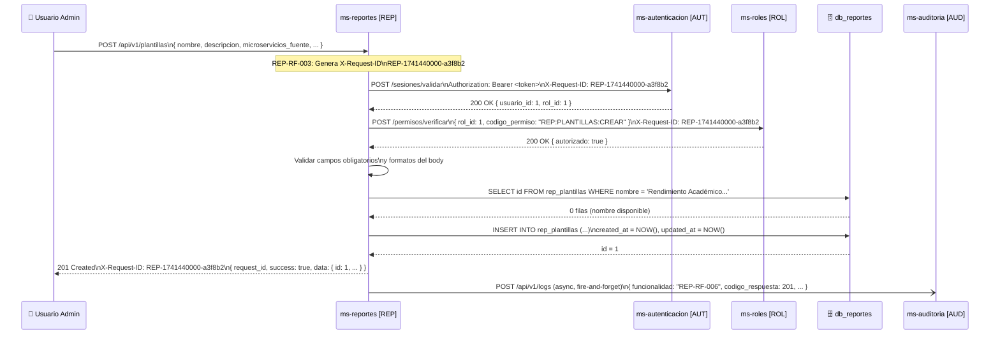

**Descripción:** Al recibir la petición, `ms-reportes` genera el `request_id` y ejecuta en secuencia la validación de sesión con `ms-autenticacion` y la verificación de permisos con `ms-roles`. Si ambas son exitosas, valida los campos del body, consulta la base de datos para verificar unicidad del nombre, persiste la nueva plantilla y retorna HTTP 201. El log de auditoría se envía asíncronamente sin bloquear la respuesta.

---

### 5.2 `GET /api/v1/plantillas` — Listar Plantillas

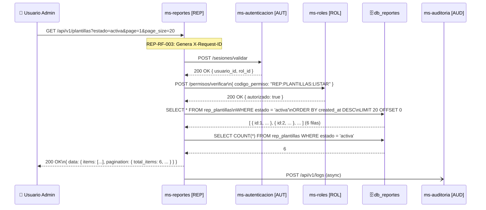

**Descripción:** Flujo estándar de consulta con paginación. Tras las validaciones, se realizan dos consultas a la base de datos: una para obtener la página de resultados con el filtro aplicado, y otra para el conteo total que permite construir los metadatos de paginación. La respuesta es siempre HTTP 200, incluso si la lista está vacía.

---

### 5.3 `GET /api/v1/plantillas/{id}` — Consultar Plantilla

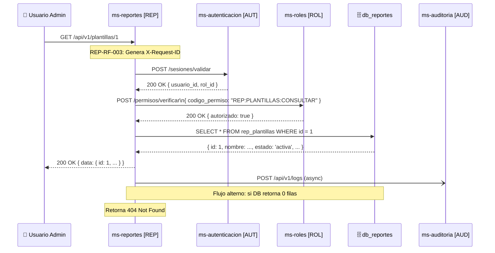

**Descripción:** Flujo de consulta por ID. Tras validaciones, se busca la plantilla por su PK. Si no se encuentra, se retorna HTTP 404 inmediatamente. Si existe, se retorna el objeto completo incluyendo `configuracion_consultas` y `parametros_requeridos`.

---

### 5.4 `PUT /api/v1/plantillas/{id}` — Actualizar Plantilla

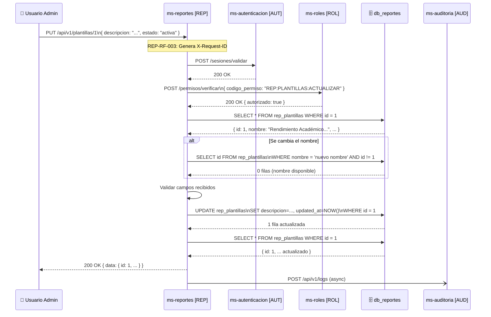

**Descripción:** Tras las validaciones, se verifica que la plantilla exista. Si se envía un nuevo nombre, se comprueba unicidad excluyendo la misma plantilla. Se actualiza solo los campos recibidos en el body y se retorna el objeto completo actualizado.

---

### 5.5 `DELETE /api/v1/plantillas/{id}` — Eliminar Plantilla

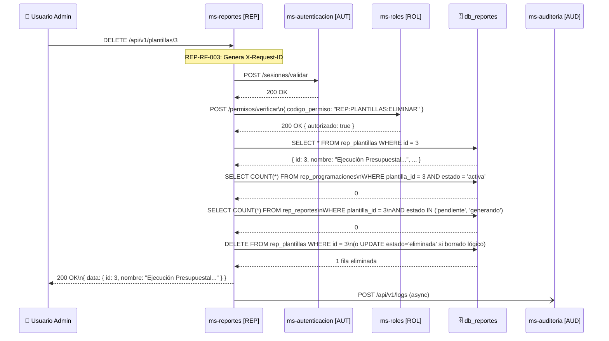

**Descripción:** Antes de eliminar, el sistema verifica que no existan programaciones activas ni reportes en proceso asociados. Si alguna de estas comprobaciones falla, se retorna HTTP 409 con el detalle de los registros bloqueantes. Solo si ambas verificaciones pasan, se procede con la eliminación.

---

### 5.6 `POST /api/v1/reportes` — Solicitar Generación de Reporte

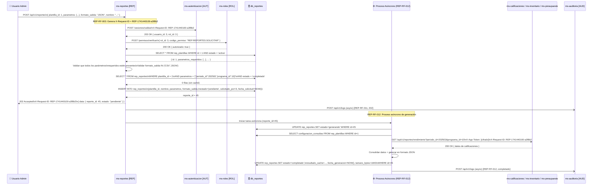

**Descripción:** Este es el flujo más complejo del microservicio. Tras las validaciones, se verifica la plantilla y los parámetros, se comprueba la existencia de caché y, si no hay resultado previo, se crea el registro en estado `pendiente` y se retorna HTTP 202 inmediatamente. El proceso asíncrono de generación (REP-RF-012) consulta los microservicios fuente con el mismo `request_id` para trazabilidad distribuida, consolida los datos y almacena el resultado. Si cualquier fuente falla, el reporte queda en estado `error`.

---

### 5.7 `GET /api/v1/reportes` — Listar Reportes

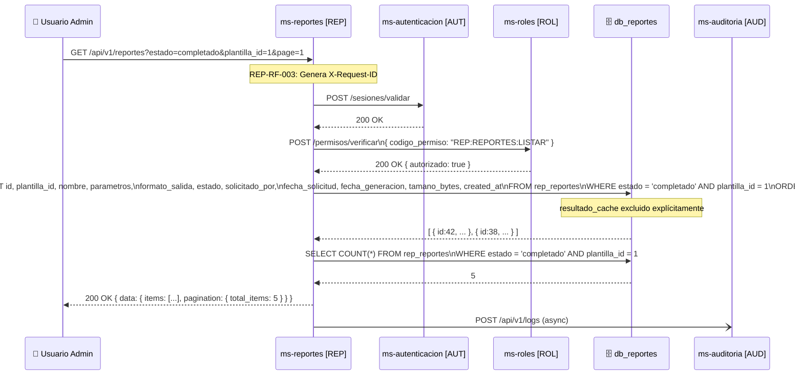

**Descripción:** Listado paginado del historial de reportes con filtros opcionales. El campo `resultado_cache` se excluye explícitamente de la consulta para optimizar el tamaño de la respuesta. Se retorna siempre HTTP 200, incluso si el listado está vacío.

---

### 5.8 `GET /api/v1/reportes/{id}` — Consultar Estado de Reporte

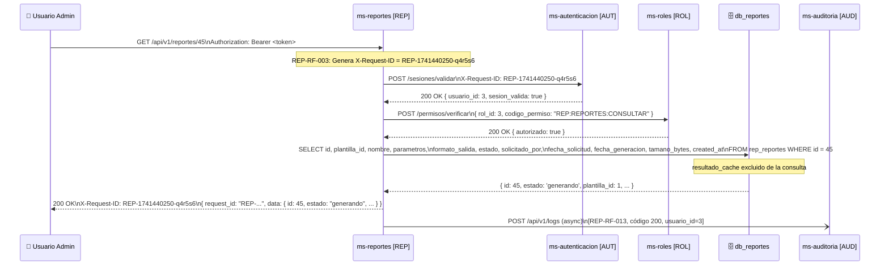

**Descripción:** Flujo estándar de consulta de estado. El `resultado_cache` se excluye explícitamente para optimizar el tamaño de respuesta; para obtener el contenido del reporte se debe usar el endpoint de descarga. Si el reporte no existe se retorna HTTP 404.

---

### 5.9 `GET /api/v1/reportes/{id}/descargar` — Descargar Reporte Generado

```mermaid
sequenceDiagram
    participant USER as 👤 Usuario Admin
    participant REP as ms-reportes [REP]
    participant AUT as ms-autenticacion [AUT]
    participant ROL as ms-roles [ROL]
    participant DB as 🗄️ db_reportes
    participant AUD as ms-auditoria [AUD]

    USER->>REP: GET /api/v1/reportes/42/descargar

    Note over REP: REP-RF-003: Genera X-Request-ID

    REP->>AUT: POST /sesiones/validar
    AUT-->>REP: 200 OK

    REP->>ROL: POST /permisos/verificar\n{ codigo_permiso: "REP:REPORTES:DESCARGAR" }
    ROL-->>REP: 200 OK { autorizado: true }

    REP->>DB: SELECT estado, resultado_cache, formato_salida, nombre\nFROM rep_reportes WHERE id = 42
    DB-->>REP: { estado: 'completado', resultado_cache: '...', formato_salida: 'JSON', nombre: '...' }

    REP->>REP: Verificar estado == 'completado'
    REP->>REP: Construir nombre de archivo sugerido\nbased on reporte.nombre

    REP-->>USER: 200 OK\nContent-Type: application/json\nContent-Disposition: attachment; filename="Stock-Critico-2026-03-03.json"\nX-Request-ID: REP-...\n[contenido del resultado_cache]

    REP-)AUD: POST /api/v1/logs (async)

    Note over REP: Si estado != 'completado' → 422
    Note over REP: Si resultado_cache es NULL o vacío → 500
```

**Descripción:** Este endpoint es el único que no retorna la estructura JSON estándar en el caso exitoso: retorna directamente el contenido del archivo con los headers HTTP apropiados para descarga. La verificación del estado `completado` es previa a la lectura del caché. Si el `resultado_cache` es nulo o corrupto (inconsistencia de datos), se retorna HTTP 500.

---

### 5.10 `POST /api/v1/reportes/{id}/invalidar-cache` — Invalidar Caché

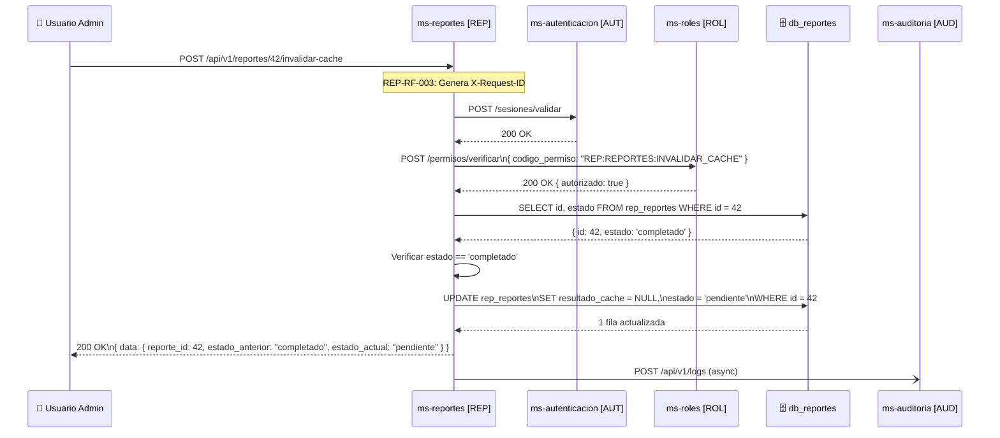

**Descripción:** Tras verificar que el reporte existe y está en estado `completado`, se limpia el `resultado_cache` y se cambia el estado a `pendiente`. La próxima solicitud con los mismos parámetros a `POST /api/v1/reportes` no encontrará caché y disparará una nueva generación con datos actualizados.

---

### 5.11 `POST /api/v1/programaciones` — Crear Programación

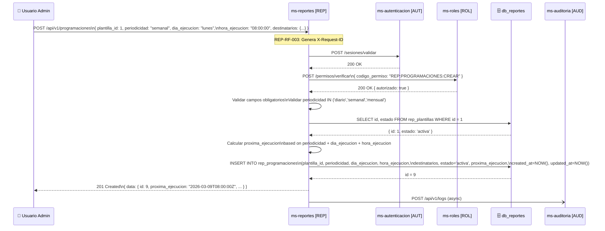

**Descripción:** Tras las validaciones, el sistema verifica que la plantilla referenciada exista y esté activa. Luego calcula la `proxima_ejecucion` combinando `periodicidad`, `dia_ejecucion` y `hora_ejecucion` a partir del momento actual, persiste la programación y la retorna. El scheduler del sistema detectará automáticamente esta nueva programación en su próxima evaluación.

---

### 5.12 `GET /api/v1/programaciones` — Listar Programaciones

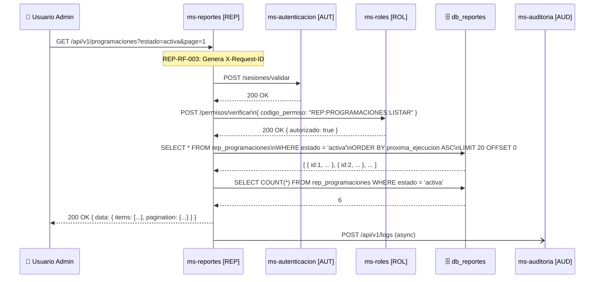

**Descripción:** Listado paginado con filtros opcionales. La respuesta incluye `proxima_ejecucion` y `ultima_ejecucion` para facilitar el monitoreo del calendario de generaciones. Se retorna siempre HTTP 200, incluso si la lista está vacía.

---

### 5.13 `GET /api/v1/programaciones/{id}` — Consultar Detalle de Programación

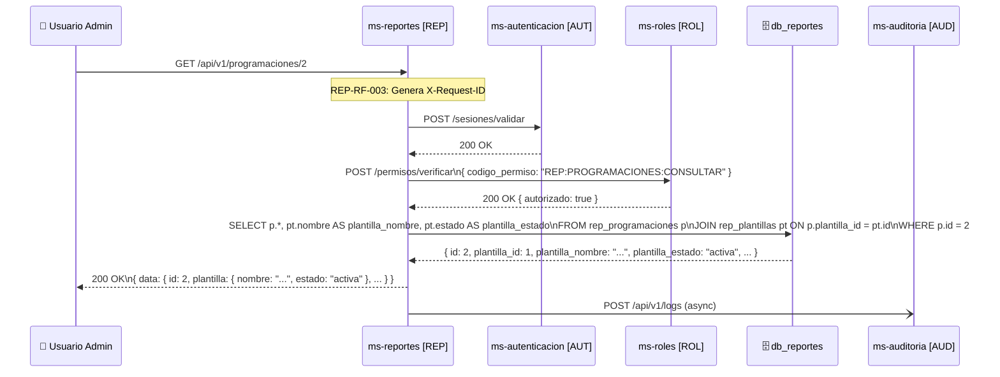

**Descripción:** La consulta realiza un JOIN con `rep_plantillas` para incluir el resumen de la plantilla asociada (nombre y estado) en la misma respuesta, evitando que el cliente necesite una segunda llamada. Si la programación no existe se retorna HTTP 404.

---

### 5.14 `PUT /api/v1/programaciones/{id}` — Actualizar Programación

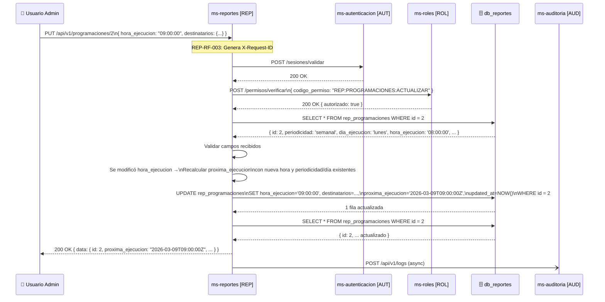

**Descripción:** Si la actualización incluye cambios en `periodicidad`, `dia_ejecucion` o `hora_ejecucion`, se recalcula automáticamente `proxima_ejecucion` combinando los valores nuevos con los existentes. Solo se actualizan los campos enviados en el body; los demás permanecen sin cambios.

---

### 5.15 `POST /api/v1/programaciones/{id}/desactivar` — Desactivar Programación

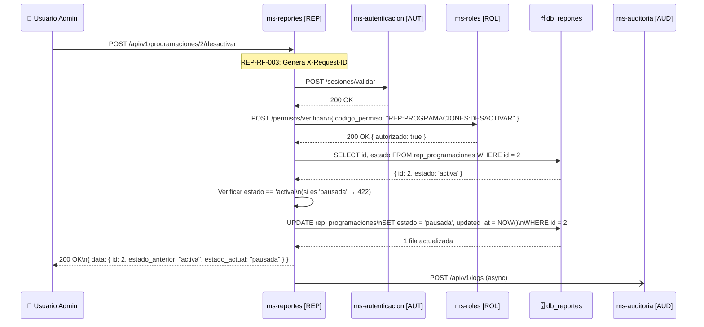

**Descripción:** Operación simple de cambio de estado. La verificación previa del estado actual es esencial para retornar HTTP 422 informativo si la programación ya está pausada, evitando confusión al cliente. La `proxima_ejecucion` no se modifica (queda como referencia histórica).

---

### 5.16 `POST /api/v1/programaciones/{id}/reactivar` — Reactivar Programación

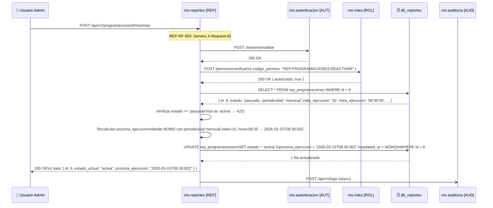

**Descripción:** Al reactivar, `proxima_ejecucion` se recalcula siempre desde la fecha/hora actual (no desde la fecha en que fue pausada), para evitar la ejecución inmediata de ciclos acumulados durante el período de pausa. El scheduler detectará esta programación en su próxima evaluación y la incluirá en el ciclo automático.

---

### 5.17 `POST /api/v1/programaciones/{id}/ejecutar` — Ejecutar Manualmente Programación

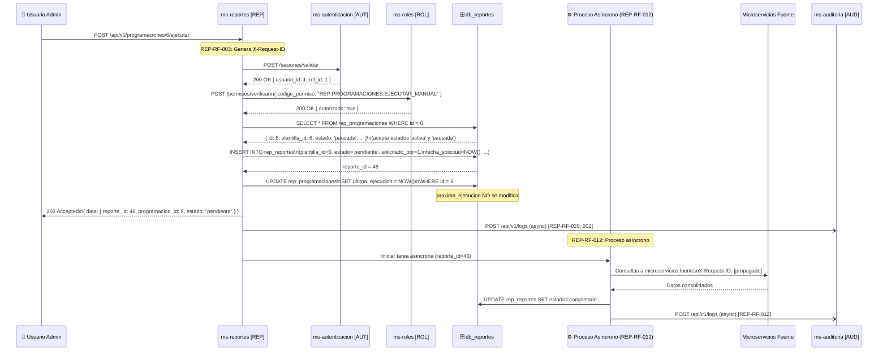

**Descripción:** La ejecución manual aplica tanto a programaciones activas como pausadas (no hay restricción de estado). La única diferencia con la ejecución automática es que `proxima_ejecucion` no se recalcula, preservando el calendario automático intacto. Se actualiza `ultima_ejecucion` para registrar que ocurrió una ejecución manual. El proceso de generación asíncrono (REP-RF-012) es idéntico al disparado por una solicitud normal.

---

*Fin del documento de especificación de API REST — ms-reportes [REP]*
