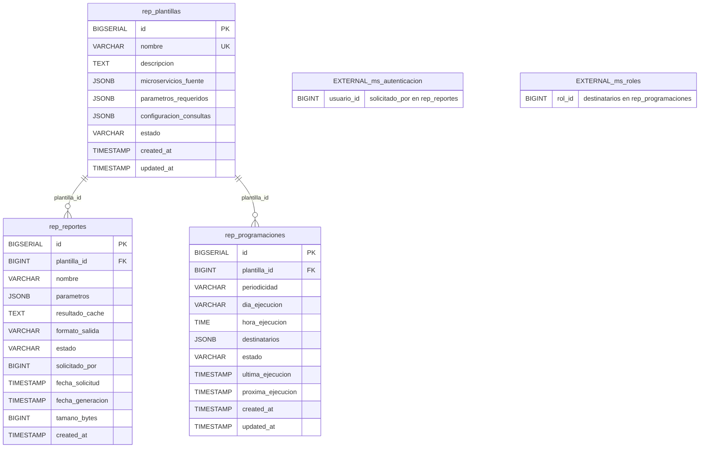

# Modelo de Datos — ms-reportes [REP]

> **Documento generado a partir de:** Análisis de Microservicio ms-reportes [REP]  
> **Fecha:** Marzo 2026  
> **Versión:** 1.0

---

## 1. Información General

| Campo | Detalle |
|---|---|
| **Nombre del microservicio** | ms-reportes |
| **Código** | REP |
| **Módulo** | Módulo 6 — Transversales |
| **Base de datos sugerida** | `db_reportes` |
| **Cantidad de tablas** | 3 |
| **Stack** | FastAPI + Python + PostgreSQL |

**Resumen del dominio de datos:**  
El microservicio `ms-reportes` gestiona la generación consolidada de reportes institucionales a partir de datos obtenidos de otros microservicios. El modelo almacena las plantillas que definen cómo y de dónde se obtienen los datos, los reportes generados con su resultado en caché, y las programaciones automáticas que disparan la generación periódica de reportes. No produce datos de negocio propios; su valor reside en la orquestación, consolidación y presentación de información existente en otros servicios.

---

## 2. Diagrama E-R



**Descripción narrativa del modelo:**

El modelo de datos de `ms-reportes` está compuesto por **3 entidades**:

- **`rep_plantillas`** es la entidad principal y raíz del modelo. Define los tipos de reporte disponibles: qué microservicios se consultan, qué parámetros se requieren y cómo se construyen las consultas. Es la entidad de catálogo sobre la que se apoyan las otras dos.

- **`rep_reportes`** es la entidad de mayor volumen. Registra cada instancia de reporte generado (o en proceso de generación), incluyendo el resultado en caché y los metadatos de la ejecución. Depende de `rep_plantillas` mediante FK interna.

- **`rep_programaciones`** es la entidad de configuración de automatización. Define la periodicidad y los destinatarios para la ejecución automática de reportes. También depende de `rep_plantillas` mediante FK interna.

**Referencias externas (sin FK real en base de datos):**
- `rep_reportes.solicitado_por` → ID de usuario en **ms-autenticacion**
- `rep_programaciones.destinatarios` → IDs de usuarios y/o roles en **ms-autenticacion** / **ms-roles** (almacenados como JSONB)

---

## 3. Diccionario de Datos

---

### Tabla: `rep_plantillas`

**Propósito:** Catálogo de plantillas de reporte disponibles en el sistema. Define el tipo de reporte, las fuentes de datos y la configuración de consultas necesarias para su generación.

**Referencias externas:** Ninguna. Esta tabla no tiene referencias directas a otros microservicios; los microservicios fuente se almacenan descriptivamente en el campo JSONB `microservicios_fuente`.

| Columna | Tipo | Restricciones | Descripción |
|---|---|---|---|
| `id` | `BIGSERIAL` | PK, NOT NULL | Identificador único autogenerado de la plantilla |
| `nombre` | `VARCHAR(150)` | NOT NULL, UNIQUE | Nombre único e identificador descriptivo de la plantilla |
| `descripcion` | `TEXT` | NOT NULL | Descripción detallada del tipo de reporte que genera esta plantilla |
| `microservicios_fuente` | `JSONB` | NOT NULL | Lista de códigos de microservicios de los cuales se obtienen datos (ej: `["ms-calificaciones", "ms-inventario"]`) |
| `parametros_requeridos` | `JSONB` | NOT NULL | Definición de los parámetros que debe proporcionar quien solicite el reporte (nombre, tipo, obligatoriedad) |
| `configuracion_consultas` | `JSONB` | NOT NULL | Configuración técnica de las consultas a realizar contra los microservicios fuente |
| `estado` | `VARCHAR(20)` | NOT NULL, DEFAULT `'activa'`, CHECK (`estado IN ('activa', 'inactiva')`) | Estado de la plantilla; solo las plantillas activas pueden ser usadas para generar reportes |
| `created_at` | `TIMESTAMP` | NOT NULL, DEFAULT `NOW()` | Fecha y hora de creación del registro |
| `updated_at` | `TIMESTAMP` | NOT NULL, DEFAULT `NOW()` | Fecha y hora de la última actualización del registro |

---

### Tabla: `rep_reportes`

**Propósito:** Registra cada instancia de reporte solicitado y generado por el sistema, incluyendo los parámetros usados, el resultado en caché y el estado del proceso de generación.

**Referencias externas:**
- `solicitado_por` → ID del usuario en **ms-autenticacion** (no hay FK real; se almacena únicamente el ID)

| Columna | Tipo | Restricciones | Descripción |
|---|---|---|---|
| `id` | `BIGSERIAL` | PK, NOT NULL | Identificador único autogenerado del reporte |
| `plantilla_id` | `BIGINT` | FK → `rep_plantillas(id)`, NOT NULL | Referencia a la plantilla utilizada para generar este reporte |
| `nombre` | `VARCHAR(255)` | NOT NULL | Nombre descriptivo del reporte generado |
| `parametros` | `JSONB` | NOT NULL | Parámetros con los que se solicitó la generación del reporte |
| `resultado_cache` | `TEXT` | NULL | Resultado serializado del reporte almacenado en caché; NULL mientras el reporte está pendiente o en generación |
| `formato_salida` | `VARCHAR(10)` | NOT NULL, CHECK (`formato_salida IN ('CSV', 'JSON')`) | Formato de exportación del resultado: CSV o JSON |
| `estado` | `VARCHAR(20)` | NOT NULL, DEFAULT `'pendiente'`, CHECK (`estado IN ('pendiente', 'generando', 'completado', 'error')`) | Estado del ciclo de vida del reporte |
| `solicitado_por` | `BIGINT` | NOT NULL | **Ref. externa:** ID del usuario que solicitó el reporte (ms-autenticacion) |
| `fecha_solicitud` | `TIMESTAMP` | NOT NULL, DEFAULT `NOW()` | Fecha y hora en que se realizó la solicitud de generación |
| `fecha_generacion` | `TIMESTAMP` | NULL | Fecha y hora en que se completó (o falló) la generación del reporte |
| `tamano_bytes` | `BIGINT` | NULL, CHECK (`tamano_bytes >= 0`) | Tamaño en bytes del resultado generado; NULL hasta que el reporte esté completado |
| `created_at` | `TIMESTAMP` | NOT NULL, DEFAULT `NOW()` | Fecha y hora de creación del registro |

---

### Tabla: `rep_programaciones`

**Propósito:** Almacena la configuración de ejecución automática periódica de reportes. Permite definir periodicidad, horario, destinatarios y controlar el ciclo de ejecución programada.

**Referencias externas:**
- `destinatarios` → IDs de usuarios y/o roles en **ms-autenticacion** y **ms-roles** (almacenados como array JSONB; no hay FK real)

| Columna | Tipo | Restricciones | Descripción |
|---|---|---|---|
| `id` | `BIGSERIAL` | PK, NOT NULL | Identificador único autogenerado de la programación |
| `plantilla_id` | `BIGINT` | FK → `rep_plantillas(id)`, NOT NULL | Referencia a la plantilla cuyo reporte se generará automáticamente |
| `periodicidad` | `VARCHAR(20)` | NOT NULL, CHECK (`periodicidad IN ('diario', 'semanal', 'mensual')`) | Frecuencia de ejecución automática |
| `dia_ejecucion` | `VARCHAR(20)` | NULL | Día de ejecución según la periodicidad: nombre del día de la semana (semanal) o número del día del mes (mensual); NULL para periodicidad diaria |
| `hora_ejecucion` | `TIME` | NOT NULL | Hora del día a la que se ejecuta el reporte programado |
| `destinatarios` | `JSONB` | NOT NULL | Lista de destinatarios que deben recibir el reporte (IDs de usuarios y/o roles de ms-autenticacion y ms-roles) |
| `estado` | `VARCHAR(20)` | NOT NULL, DEFAULT `'activa'`, CHECK (`estado IN ('activa', 'pausada')`) | Estado de la programación; solo las programaciones activas se ejecutan automáticamente |
| `ultima_ejecucion` | `TIMESTAMP` | NULL | Fecha y hora de la última ejecución realizada; NULL si nunca se ha ejecutado |
| `proxima_ejecucion` | `TIMESTAMP` | NULL | Fecha y hora calculada para la próxima ejecución automática |
| `created_at` | `TIMESTAMP` | NOT NULL, DEFAULT `NOW()` | Fecha y hora de creación del registro |
| `updated_at` | `TIMESTAMP` | NOT NULL, DEFAULT `NOW()` | Fecha y hora de la última actualización del registro |

---

## 4. Relaciones y Claves Foráneas

### Relaciones Internas

| FK | Tabla origen | Columna | Tabla destino | Tipo | Nota |
|---|---|---|---|---|---|
| `fk_rep_reportes_plantilla` | `rep_reportes` | `plantilla_id` | `rep_plantillas(id)` | N:1 | Un reporte pertenece a una plantilla; una plantilla puede originar muchos reportes |
| `fk_rep_programaciones_plantilla` | `rep_programaciones` | `plantilla_id` | `rep_plantillas(id)` | N:1 | Una programación está asociada a una plantilla; una plantilla puede tener múltiples programaciones |

### Referencias Externas

| Ref. | Tabla origen | Columna | Microservicio destino | Entidad destino | Nota |
|---|---|---|---|---|---|
| Ref. externa | `rep_reportes` | `solicitado_por` | `ms-autenticacion` | Usuario | Almacena el ID del usuario solicitante; sin FK real en base de datos |
| Ref. externa | `rep_programaciones` | `destinatarios` | `ms-autenticacion` / `ms-roles` | Usuario / Rol | IDs almacenados como array JSONB; sin FK real en base de datos |

---

## 5. Índices Sugeridos

| Índice | Tabla | Columnas | Tipo | Justificación |
|---|---|---|---|---|
| `idx_rep_plantillas_estado` | `rep_plantillas` | `estado` | B-tree | Filtro frecuente al listar plantillas activas disponibles para generación |
| `idx_rep_plantillas_nombre` | `rep_plantillas` | `nombre` | B-tree | Búsqueda por nombre único de plantilla; complementa la restricción UNIQUE |
| `idx_rep_reportes_plantilla_id` | `rep_reportes` | `plantilla_id` | B-tree | JOIN con `rep_plantillas`; consulta de reportes por plantilla |
| `idx_rep_reportes_estado` | `rep_reportes` | `estado` | B-tree | Filtro por estado del reporte (ej: listar pendientes, completados, en error) |
| `idx_rep_reportes_solicitado_por` | `rep_reportes` | `solicitado_por` | B-tree | Consulta de reportes generados por un usuario específico |
| `idx_rep_reportes_fecha_solicitud` | `rep_reportes` | `fecha_solicitud` | B-tree | Ordenamiento y filtrado por fecha de solicitud |
| `idx_rep_reportes_cache` | `rep_reportes` | `plantilla_id, parametros` | GIN (en `parametros`) + B-tree | Detección de cache hit: buscar reportes con misma plantilla y parámetros (RE-02) |
| `idx_rep_programaciones_plantilla_id` | `rep_programaciones` | `plantilla_id` | B-tree | JOIN con `rep_plantillas`; consulta de programaciones por plantilla |
| `idx_rep_programaciones_estado` | `rep_programaciones` | `estado` | B-tree | Filtro para obtener solo programaciones activas a ejecutar |
| `idx_rep_programaciones_proxima_ejecucion` | `rep_programaciones` | `proxima_ejecucion` | B-tree | Consulta del scheduler para detectar programaciones pendientes de ejecutar |
| `idx_rep_reportes_parametros_gin` | `rep_reportes` | `parametros` | GIN | Búsqueda por contenido dentro del JSONB de parámetros para validación de caché |

---

## 6. Script DDL

```sql
-- ============================================================
-- BASE DE DATOS: db_reportes
-- Microservicio: ms-reportes [REP]
-- Módulo: Transversales
-- ============================================================

CREATE DATABASE db_reportes
    WITH ENCODING = 'UTF8'
    LC_COLLATE = 'es_CO.UTF-8'
    LC_CTYPE   = 'es_CO.UTF-8';

\c db_reportes;

-- ============================================================
-- TABLA: rep_plantillas
-- Entidad raíz. Catálogo de plantillas de reporte configurables.
-- ============================================================

CREATE TABLE rep_plantillas (
    id                      BIGSERIAL       PRIMARY KEY,
    nombre                  VARCHAR(150)    NOT NULL,
    descripcion             TEXT            NOT NULL,
    -- microservicios_fuente: array JSON con códigos de los microservicios fuente
    -- Ej: ["ms-calificaciones", "ms-inventario", "ms-presupuesto"]
    microservicios_fuente   JSONB           NOT NULL,
    -- parametros_requeridos: definición estructurada de los parámetros que
    -- debe proporcionar quien solicite el reporte
    parametros_requeridos   JSONB           NOT NULL,
    -- configuracion_consultas: configuración técnica de los endpoints y
    -- transformaciones a aplicar en cada microservicio fuente
    configuracion_consultas JSONB           NOT NULL,
    estado                  VARCHAR(20)     NOT NULL DEFAULT 'activa'
                                CONSTRAINT chk_rep_plantillas_estado
                                CHECK (estado IN ('activa', 'inactiva')),
    created_at              TIMESTAMP       NOT NULL DEFAULT NOW(),
    updated_at              TIMESTAMP       NOT NULL DEFAULT NOW(),
    CONSTRAINT uq_rep_plantillas_nombre UNIQUE (nombre)
);

COMMENT ON TABLE rep_plantillas IS 'Catálogo de plantillas de reporte. Define tipo, fuentes de datos y configuración de consultas.';
COMMENT ON COLUMN rep_plantillas.microservicios_fuente IS 'Array JSONB con códigos de microservicios consultados al generar el reporte.';
COMMENT ON COLUMN rep_plantillas.parametros_requeridos IS 'Esquema de parámetros que debe proveer el solicitante del reporte.';
COMMENT ON COLUMN rep_plantillas.configuracion_consultas IS 'Configuración técnica de consultas a microservicios fuente (endpoints, mapeo de campos, transformaciones).';

-- ============================================================
-- TABLA: rep_reportes
-- Instancias de reportes generados o en proceso de generación.
-- ============================================================

CREATE TABLE rep_reportes (
    id               BIGSERIAL       PRIMARY KEY,
    plantilla_id     BIGINT          NOT NULL,
    nombre           VARCHAR(255)    NOT NULL,
    parametros       JSONB           NOT NULL,
    -- resultado_cache: resultado serializado del reporte (CSV o JSON como texto).
    -- NULL mientras el reporte está pendiente o generando.
    resultado_cache  TEXT            NULL,
    formato_salida   VARCHAR(10)     NOT NULL
                         CONSTRAINT chk_rep_reportes_formato
                         CHECK (formato_salida IN ('CSV', 'JSON')),
    estado           VARCHAR(20)     NOT NULL DEFAULT 'pendiente'
                         CONSTRAINT chk_rep_reportes_estado
                         CHECK (estado IN ('pendiente', 'generando', 'completado', 'error')),
    -- REFERENCIA EXTERNA: solicitado_por apunta al ID de usuario en ms-autenticacion.
    -- No se crea FK porque la tabla de usuarios pertenece a otro microservicio.
    solicitado_por   BIGINT          NOT NULL,
    fecha_solicitud  TIMESTAMP       NOT NULL DEFAULT NOW(),
    -- fecha_generacion: se establece al completar o fallar la generación.
    fecha_generacion TIMESTAMP       NULL,
    tamano_bytes     BIGINT          NULL
                         CONSTRAINT chk_rep_reportes_tamano
                         CHECK (tamano_bytes IS NULL OR tamano_bytes >= 0),
    created_at       TIMESTAMP       NOT NULL DEFAULT NOW(),

    CONSTRAINT fk_rep_reportes_plantilla
        FOREIGN KEY (plantilla_id) REFERENCES rep_plantillas(id)
);

COMMENT ON TABLE rep_reportes IS 'Instancias de reportes solicitados. Incluye resultado en caché y seguimiento de estado.';
COMMENT ON COLUMN rep_reportes.solicitado_por IS 'REF. EXTERNA: ID del usuario en ms-autenticacion que solicitó el reporte.';
COMMENT ON COLUMN rep_reportes.resultado_cache IS 'Resultado serializado del reporte. Permite reutilización sin recalcular (RE-02).';
COMMENT ON COLUMN rep_reportes.parametros IS 'Parámetros exactos con los que se generó; usados para detección de caché.';

-- ============================================================
-- TABLA: rep_programaciones
-- Configuración de ejecución automática periódica de reportes.
-- ============================================================

CREATE TABLE rep_programaciones (
    id                 BIGSERIAL       PRIMARY KEY,
    plantilla_id       BIGINT          NOT NULL,
    periodicidad       VARCHAR(20)     NOT NULL
                           CONSTRAINT chk_rep_programaciones_periodicidad
                           CHECK (periodicidad IN ('diario', 'semanal', 'mensual')),
    -- dia_ejecucion: nombre del día (lunes-domingo) para semanal,
    -- número 1-28 para mensual, NULL para diario.
    dia_ejecucion      VARCHAR(20)     NULL,
    hora_ejecucion     TIME            NOT NULL,
    -- REFERENCIA EXTERNA: destinatarios contiene IDs de usuarios (ms-autenticacion)
    -- y/o roles (ms-roles) que deben recibir el reporte generado.
    -- Ej: {"usuarios": [1, 5, 12], "roles": [3]}
    destinatarios      JSONB           NOT NULL,
    estado             VARCHAR(20)     NOT NULL DEFAULT 'activa'
                           CONSTRAINT chk_rep_programaciones_estado
                           CHECK (estado IN ('activa', 'pausada')),
    ultima_ejecucion   TIMESTAMP       NULL,
    proxima_ejecucion  TIMESTAMP       NULL,
    created_at         TIMESTAMP       NOT NULL DEFAULT NOW(),
    updated_at         TIMESTAMP       NOT NULL DEFAULT NOW(),

    CONSTRAINT fk_rep_programaciones_plantilla
        FOREIGN KEY (plantilla_id) REFERENCES rep_plantillas(id)
);

COMMENT ON TABLE rep_programaciones IS 'Configuración de generación automática de reportes: periodicidad, horario y destinatarios.';
COMMENT ON COLUMN rep_programaciones.destinatarios IS 'REF. EXTERNA: IDs de usuarios (ms-autenticacion) y roles (ms-roles) receptores del reporte.';
COMMENT ON COLUMN rep_programaciones.proxima_ejecucion IS 'Calculado por el scheduler al completar cada ejecución o al modificar la programación.';

-- ============================================================
-- ÍNDICES
-- ============================================================

-- rep_plantillas
CREATE INDEX idx_rep_plantillas_estado
    ON rep_plantillas (estado);

CREATE INDEX idx_rep_plantillas_nombre
    ON rep_plantillas (nombre);

-- rep_reportes
CREATE INDEX idx_rep_reportes_plantilla_id
    ON rep_reportes (plantilla_id);

CREATE INDEX idx_rep_reportes_estado
    ON rep_reportes (estado);

CREATE INDEX idx_rep_reportes_solicitado_por
    ON rep_reportes (solicitado_por);

CREATE INDEX idx_rep_reportes_fecha_solicitud
    ON rep_reportes (fecha_solicitud DESC);

-- Índice GIN sobre parámetros para detección eficiente de caché (RE-02)
CREATE INDEX idx_rep_reportes_parametros_gin
    ON rep_reportes USING GIN (parametros);

-- Índice compuesto: plantilla + estado + parámetros para búsqueda de caché
CREATE INDEX idx_rep_reportes_cache_lookup
    ON rep_reportes (plantilla_id, estado)
    WHERE estado = 'completado';

-- rep_programaciones
CREATE INDEX idx_rep_programaciones_plantilla_id
    ON rep_programaciones (plantilla_id);

CREATE INDEX idx_rep_programaciones_estado
    ON rep_programaciones (estado);

CREATE INDEX idx_rep_programaciones_proxima_ejecucion
    ON rep_programaciones (proxima_ejecucion ASC)
    WHERE estado = 'activa';
```

---

## 7. Datos Semilla

```sql
-- ============================================================
-- DATOS SEMILLA — ms-reportes [REP]
-- ============================================================
-- NOTAS SOBRE REFERENCIAS EXTERNAS:
--   solicitado_por (rep_reportes): IDs ficticios de usuarios en ms-autenticacion
--     - usuario_id = 1  → Usuario: admin@universidad.edu (Administrador)
--     - usuario_id = 2  → Usuario: rector@universidad.edu (Rector)
--     - usuario_id = 3  → Usuario: dir.academico@universidad.edu (Director Académico)
--     - usuario_id = 4  → Usuario: tesoreria@universidad.edu (Tesorería)
--   destinatarios (rep_programaciones): IDs ficticios en ms-autenticacion/ms-roles
--     - rol_id = 1  → Rol: Administrador (ms-roles)
--     - rol_id = 2  → Rol: Rector (ms-roles)
--     - rol_id = 3  → Rol: Director Académico (ms-roles)
-- ============================================================

-- ------------------------------------------------------------
-- SEMILLA: rep_plantillas (8 registros)
-- Cubre: estado activa/inactiva, distintos microservicios fuente,
--        plantillas simples y multi-fuente.
-- ------------------------------------------------------------

INSERT INTO rep_plantillas (nombre, descripcion, microservicios_fuente, parametros_requeridos, configuracion_consultas, estado, created_at, updated_at)
VALUES
(
    'Rendimiento Académico por Programa',
    'Reporte de promedios de notas y tasa de aprobación agrupados por programa académico y período.',
    '["ms-calificaciones"]',
    '[{"nombre": "periodo_id", "tipo": "integer", "obligatorio": true}, {"nombre": "programa_id", "tipo": "integer", "obligatorio": false}]',
    '{"ms-calificaciones": {"endpoint": "/calificaciones/promedios", "metodo": "GET", "mapeo": {"periodo": "periodo_id", "programa": "programa_id"}}}',
    'activa',
    NOW() - INTERVAL '90 days', NOW() - INTERVAL '5 days'
),
(
    'Estado de Activos e Inventario',
    'Reporte del estado actual de activos fijos, depreciación acumulada y alertas de stock bajo.',
    '["ms-inventario"]',
    '[{"nombre": "area_id", "tipo": "integer", "obligatorio": false}, {"nombre": "incluir_depreciacion", "tipo": "boolean", "obligatorio": false, "default": true}]',
    '{"ms-inventario": {"endpoint": "/activos/estado", "metodo": "GET", "mapeo": {"area": "area_id", "depreciacion": "incluir_depreciacion"}}}',
    'activa',
    NOW() - INTERVAL '80 days', NOW() - INTERVAL '10 days'
),
(
    'Ejecución Presupuestal por Área',
    'Reporte de ejecución presupuestal comparando presupuesto asignado vs. ejecutado por área y período.',
    '["ms-presupuesto"]',
    '[{"nombre": "periodo_id", "tipo": "integer", "obligatorio": true}, {"nombre": "area_id", "tipo": "integer", "obligatorio": false}]',
    '{"ms-presupuesto": {"endpoint": "/presupuesto/ejecucion", "metodo": "GET", "mapeo": {"periodo": "periodo_id", "area": "area_id"}}}',
    'activa',
    NOW() - INTERVAL '85 days', NOW() - INTERVAL '3 days'
),
(
    'Consolidado Institucional',
    'Reporte ejecutivo consolidado que combina indicadores académicos, financieros y de recursos para la dirección institucional.',
    '["ms-calificaciones", "ms-inventario", "ms-presupuesto"]',
    '[{"nombre": "periodo_id", "tipo": "integer", "obligatorio": true}]',
    '{"ms-calificaciones": {"endpoint": "/calificaciones/resumen", "metodo": "GET"}, "ms-inventario": {"endpoint": "/activos/resumen", "metodo": "GET"}, "ms-presupuesto": {"endpoint": "/presupuesto/resumen", "metodo": "GET"}}',
    'activa',
    NOW() - INTERVAL '70 days', NOW() - INTERVAL '7 days'
),
(
    'Stock Crítico de Inventario',
    'Reporte de artículos en stock bajo el umbral mínimo definido, para gestión de reposición.',
    '["ms-inventario"]',
    '[{"nombre": "umbral_porcentaje", "tipo": "numeric", "obligatorio": false, "default": 20}]',
    '{"ms-inventario": {"endpoint": "/inventario/stock-bajo", "metodo": "GET", "mapeo": {"umbral": "umbral_porcentaje"}}}',
    'activa',
    NOW() - INTERVAL '60 days', NOW() - INTERVAL '60 days'
),
(
    'Promedios por Docente',
    'Reporte de promedios de calificaciones agrupados por docente y asignatura.',
    '["ms-calificaciones"]',
    '[{"nombre": "periodo_id", "tipo": "integer", "obligatorio": true}, {"nombre": "docente_id", "tipo": "integer", "obligatorio": false}]',
    '{"ms-calificaciones": {"endpoint": "/calificaciones/por-docente", "metodo": "GET", "mapeo": {"periodo": "periodo_id", "docente": "docente_id"}}}',
    'activa',
    NOW() - INTERVAL '45 days', NOW() - INTERVAL '45 days'
),
(
    'Disponibilidad Presupuestal',
    'Reporte de saldos presupuestales disponibles por rubro y área.',
    '["ms-presupuesto"]',
    '[{"nombre": "area_id", "tipo": "integer", "obligatorio": true}]',
    '{"ms-presupuesto": {"endpoint": "/presupuesto/disponibilidad", "metodo": "GET", "mapeo": {"area": "area_id"}}}',
    'inactiva',
    NOW() - INTERVAL '120 days', NOW() - INTERVAL '30 days'
),
(
    'Depreciación de Activos (Versión 1 - Obsoleta)',
    'Versión inicial del reporte de depreciación. Reemplazado por Estado de Activos e Inventario.',
    '["ms-inventario"]',
    '[{"nombre": "anio", "tipo": "integer", "obligatorio": true}]',
    '{"ms-inventario": {"endpoint": "/activos/depreciacion-v1", "metodo": "GET", "mapeo": {"anio": "anio"}}}',
    'inactiva',
    NOW() - INTERVAL '180 days', NOW() - INTERVAL '90 days'
);

-- ------------------------------------------------------------
-- SEMILLA: rep_reportes (10 registros)
-- Cubre: todos los estados (pendiente, generando, completado, error),
--        formatos CSV y JSON, con y sin resultado en caché,
--        distintos solicitantes, distintas plantillas.
-- ------------------------------------------------------------

INSERT INTO rep_reportes (plantilla_id, nombre, parametros, resultado_cache, formato_salida, estado, solicitado_por, fecha_solicitud, fecha_generacion, tamano_bytes, created_at)
VALUES
(
    -- Referencia interna: plantilla_id = 1 (Rendimiento Académico por Programa)
    -- Ref. externa: solicitado_por = 3 → dir.academico@universidad.edu (ms-autenticacion)
    1,
    'Rendimiento Académico - Período 2025-2 - Todos los Programas',
    '{"periodo_id": 202502}',
    'programa,promedio,tasa_aprobacion
Ingeniería de Sistemas,3.85,94.2
Administración de Empresas,3.72,91.5
Contaduría Pública,3.68,89.3',
    'CSV',
    'completado',
    3,
    NOW() - INTERVAL '15 days',
    NOW() - INTERVAL '15 days' + INTERVAL '45 seconds',
    1248,
    NOW() - INTERVAL '15 days'
),
(
    -- Referencia interna: plantilla_id = 3 (Ejecución Presupuestal)
    -- Ref. externa: solicitado_por = 4 → tesoreria@universidad.edu (ms-autenticacion)
    3,
    'Ejecución Presupuestal - Período 2025-2 - Todas las Áreas',
    '{"periodo_id": 202502}',
    '{"areas": [{"area": "Vicerrectoría Académica", "asignado": 500000000, "ejecutado": 423000000, "porcentaje": 84.6}, {"area": "Bienestar Universitario", "asignado": 120000000, "ejecutado": 98500000, "porcentaje": 82.1}]}',
    'JSON',
    'completado',
    4,
    NOW() - INTERVAL '10 days',
    NOW() - INTERVAL '10 days' + INTERVAL '1 minute 12 seconds',
    3540,
    NOW() - INTERVAL '10 days'
),
(
    -- Referencia interna: plantilla_id = 4 (Consolidado Institucional)
    -- Ref. externa: solicitado_por = 2 → rector@universidad.edu (ms-autenticacion)
    4,
    'Consolidado Institucional - Período 2025-2',
    '{"periodo_id": 202502}',
    NULL,
    'JSON',
    'generando',
    2,
    NOW() - INTERVAL '2 hours',
    NULL,
    NULL,
    NOW() - INTERVAL '2 hours'
),
(
    -- Referencia interna: plantilla_id = 2 (Estado de Activos)
    -- Ref. externa: solicitado_por = 1 → admin@universidad.edu (ms-autenticacion)
    2,
    'Estado de Activos - Área Tecnología - Con Depreciación',
    '{"area_id": 5, "incluir_depreciacion": true}',
    NULL,
    'CSV',
    'pendiente',
    1,
    NOW() - INTERVAL '30 minutes',
    NULL,
    NULL,
    NOW() - INTERVAL '30 minutes'
),
(
    -- Referencia interna: plantilla_id = 1 (Rendimiento Académico)
    -- Ref. externa: solicitado_por = 3 → dir.academico@universidad.edu (ms-autenticacion)
    1,
    'Rendimiento Académico - Período 2025-1 - Ingeniería',
    '{"periodo_id": 202501, "programa_id": 10}',
    'programa,promedio,tasa_aprobacion
Ingeniería de Sistemas,3.91,95.8',
    'CSV',
    'completado',
    3,
    NOW() - INTERVAL '60 days',
    NOW() - INTERVAL '60 days' + INTERVAL '32 seconds',
    412,
    NOW() - INTERVAL '60 days'
),
(
    -- Referencia interna: plantilla_id = 4 (Consolidado Institucional)
    -- Ref. externa: solicitado_por = 2 → rector@universidad.edu (ms-autenticacion)
    -- Caso: error en generación (ms-presupuesto no disponible)
    4,
    'Consolidado Institucional - Período 2025-1',
    '{"periodo_id": 202501}',
    NULL,
    'JSON',
    'error',
    2,
    NOW() - INTERVAL '45 days',
    NOW() - INTERVAL '45 days' + INTERVAL '5 seconds',
    NULL,
    NOW() - INTERVAL '45 days'
),
(
    -- Referencia interna: plantilla_id = 5 (Stock Crítico)
    -- Ref. externa: solicitado_por = 1 → admin@universidad.edu (ms-autenticacion)
    5,
    'Inventario en Stock Crítico - Umbral 15%',
    '{"umbral_porcentaje": 15}',
    '{"items_criticos": [{"codigo": "LAP-045", "nombre": "Laptop HP EliteBook", "stock_actual": 2, "stock_minimo": 15}, {"codigo": "PRY-012", "nombre": "Proyector Epson 3800", "stock_actual": 1, "stock_minimo": 8}]}',
    'JSON',
    'completado',
    1,
    NOW() - INTERVAL '5 days',
    NOW() - INTERVAL '5 days' + INTERVAL '18 seconds',
    892,
    NOW() - INTERVAL '5 days'
),
(
    -- Referencia interna: plantilla_id = 3 (Ejecución Presupuestal)
    -- Ref. externa: solicitado_por = 4 → tesoreria@universidad.edu (ms-autenticacion)
    -- Caso: mismo reporte que el primero de presupuesto pero en CSV (distinto formato)
    3,
    'Ejecución Presupuestal - Período 2025-2 - Área Bienestar',
    '{"periodo_id": 202502, "area_id": 8}',
    'area,asignado,ejecutado,porcentaje_ejecucion
Bienestar Universitario,120000000,98500000,82.08',
    'CSV',
    'completado',
    4,
    NOW() - INTERVAL '8 days',
    NOW() - INTERVAL '8 days' + INTERVAL '28 seconds',
    215,
    NOW() - INTERVAL '8 days'
),
(
    -- Referencia interna: plantilla_id = 6 (Promedios por Docente)
    -- Ref. externa: solicitado_por = 3 → dir.academico@universidad.edu (ms-autenticacion)
    6,
    'Promedios por Docente - Período 2025-2',
    '{"periodo_id": 202502}',
    NULL,
    'JSON',
    'pendiente',
    3,
    NOW() - INTERVAL '10 minutes',
    NULL,
    NULL,
    NOW() - INTERVAL '10 minutes'
),
(
    -- Referencia interna: plantilla_id = 2 (Estado de Activos)
    -- Ref. externa: solicitado_por = 1 → admin@universidad.edu (ms-autenticacion)
    -- Caso: reporte completado sin filtro de área (global)
    2,
    'Estado Global de Activos - Sin Depreciación',
    '{"incluir_depreciacion": false}',
    'codigo,nombre,area,estado,valor
ACT-001,Servidor Dell PowerEdge,Sistemas,activo,45000000
ACT-002,Switch Cisco Catalyst,Redes,activo,8500000
ACT-003,UPS APC Smart 3kVA,Sistemas,mantenimiento,3200000',
    'CSV',
    'completado',
    1,
    NOW() - INTERVAL '20 days',
    NOW() - INTERVAL '20 days' + INTERVAL '55 seconds',
    2187,
    NOW() - INTERVAL '20 days'
);

-- ------------------------------------------------------------
-- SEMILLA: rep_programaciones (8 registros)
-- Cubre: todas las periodicidades (diario, semanal, mensual),
--        ambos estados (activa, pausada), con y sin ejecución previa.
-- ------------------------------------------------------------

INSERT INTO rep_programaciones (plantilla_id, periodicidad, dia_ejecucion, hora_ejecucion, destinatarios, estado, ultima_ejecucion, proxima_ejecucion, created_at, updated_at)
VALUES
(
    -- Referencia interna: plantilla_id = 5 (Stock Crítico)
    -- Ref. externa: destinatarios → rol_id = 1 (Administrador) en ms-roles
    5,
    'diario',
    NULL,
    '07:00:00',
    '{"roles": [1], "usuarios": []}',
    'activa',
    NOW() - INTERVAL '1 day',
    NOW() + INTERVAL '17 hours',
    NOW() - INTERVAL '30 days', NOW() - INTERVAL '1 day'
),
(
    -- Referencia interna: plantilla_id = 1 (Rendimiento Académico)
    -- Ref. externa: destinatarios → rol_id = 3 (Director Académico) y usuario_id = 2 (rector) en ms-autenticacion/ms-roles
    1,
    'semanal',
    'lunes',
    '08:00:00',
    '{"roles": [3], "usuarios": [2]}',
    'activa',
    NOW() - INTERVAL '7 days',
    NOW() + INTERVAL '4 days',
    NOW() - INTERVAL '60 days', NOW() - INTERVAL '7 days'
),
(
    -- Referencia interna: plantilla_id = 4 (Consolidado Institucional)
    -- Ref. externa: destinatarios → rol_id = 2 (Rector) en ms-roles
    4,
    'mensual',
    '1',
    '06:00:00',
    '{"roles": [2], "usuarios": [2]}',
    'activa',
    NOW() - INTERVAL '8 days',
    (DATE_TRUNC('month', NOW()) + INTERVAL '1 month')::TIMESTAMP + INTERVAL '6 hours',
    NOW() - INTERVAL '90 days', NOW() - INTERVAL '8 days'
),
(
    -- Referencia interna: plantilla_id = 3 (Ejecución Presupuestal)
    -- Ref. externa: destinatarios → rol_id = 1 (Administrador), usuario_id = 4 (tesorería) en ms-autenticacion/ms-roles
    3,
    'mensual',
    '5',
    '09:00:00',
    '{"roles": [1], "usuarios": [4]}',
    'activa',
    NOW() - INTERVAL '26 days',
    (DATE_TRUNC('month', NOW()) + INTERVAL '1 month' + INTERVAL '4 days')::TIMESTAMP + INTERVAL '9 hours',
    NOW() - INTERVAL '75 days', NOW() - INTERVAL '26 days'
),
(
    -- Referencia interna: plantilla_id = 2 (Estado de Activos)
    -- Ref. externa: destinatarios → rol_id = 1 (Administrador) en ms-roles
    2,
    'semanal',
    'viernes',
    '17:00:00',
    '{"roles": [1], "usuarios": [1]}',
    'activa',
    NOW() - INTERVAL '3 days',
    NOW() + INTERVAL '4 days',
    NOW() - INTERVAL '50 days', NOW() - INTERVAL '3 days'
),
(
    -- Referencia interna: plantilla_id = 6 (Promedios por Docente)
    -- Ref. externa: destinatarios → rol_id = 3 (Director Académico) en ms-roles
    -- Estado: pausada (en revisión de configuración)
    6,
    'mensual',
    '15',
    '08:30:00',
    '{"roles": [3], "usuarios": [3]}',
    'pausada',
    NOW() - INTERVAL '24 days',
    NULL,
    NOW() - INTERVAL '40 days', NOW() - INTERVAL '2 days'
),
(
    -- Referencia interna: plantilla_id = 1 (Rendimiento Académico)
    -- Ref. externa: destinatarios → rol_id = 3 (Director Académico) en ms-roles
    -- Estado: activa, nunca ejecutada (recién creada)
    1,
    'semanal',
    'miercoles',
    '12:00:00',
    '{"roles": [3], "usuarios": []}',
    'activa',
    NULL,
    NOW() + INTERVAL '3 days',
    NOW() - INTERVAL '1 day', NOW() - INTERVAL '1 day'
),
(
    -- Referencia interna: plantilla_id = 4 (Consolidado Institucional)
    -- Ref. externa: destinatarios → rol_id = 1 y 2 (Administrador, Rector) en ms-roles
    -- Estado: pausada (falla recurrente al consolidar; pendiente de revisión)
    4,
    'semanal',
    'domingo',
    '23:00:00',
    '{"roles": [1, 2], "usuarios": []}',
    'pausada',
    NOW() - INTERVAL '14 days',
    NULL,
    NOW() - INTERVAL '60 days', NOW() - INTERVAL '5 days'
);
```

---

*Fin del documento de modelo de datos — ms-reportes [REP]*
